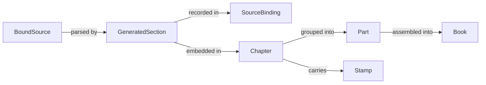
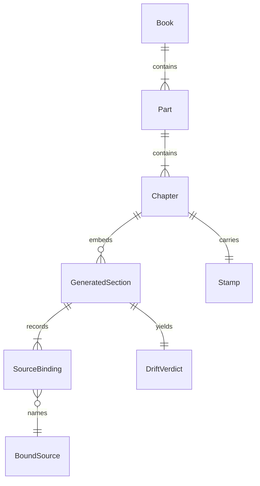
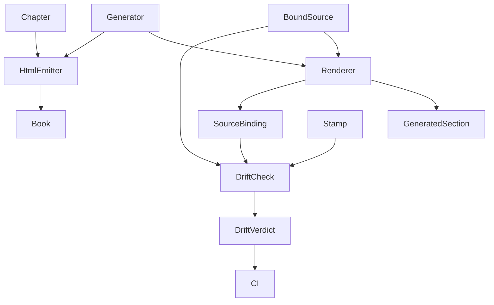
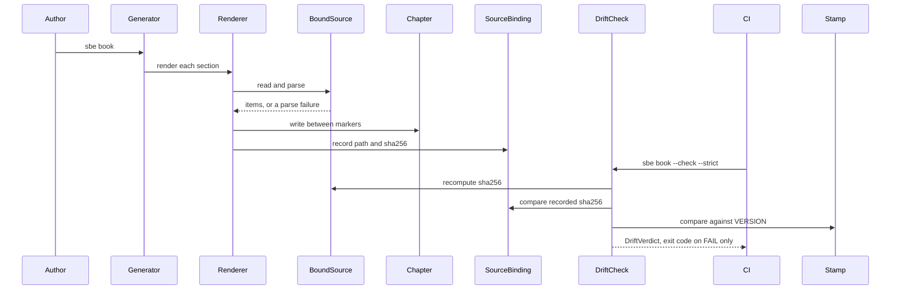

# 06. Diagrams

Every node below names an entity declared in `05-data-model.md` or a component
declared in the Components section of this file.

## Context

## Entity relationship

## Components

These are runtime components, not entities, and are declared here rather than
in the data model on purpose.

- **Author**: the human editing a Chapter and running the Generator. Declared
  here because the sequence below names them, and a diagram node that traces to
  nothing declared is exactly what the traceability check exists to catch.
- **Generator**: `src/brothersbe/book.py` in render mode, invoked as `sbe book`.
- **DriftCheck**: the same module in verify mode, invoked as `sbe book --check`.
- **Renderer**: one function per generated section (commands, roles, checks,
  laws, limits), each declaring the BoundSource files it reads.
- **HtmlEmitter**: the single-file offline HTML writer.
- **CI**: `.github/workflows/brothersbe-gates.yml`, which runs DriftCheck under
  `--strict`.

## The generate and verify sequence

