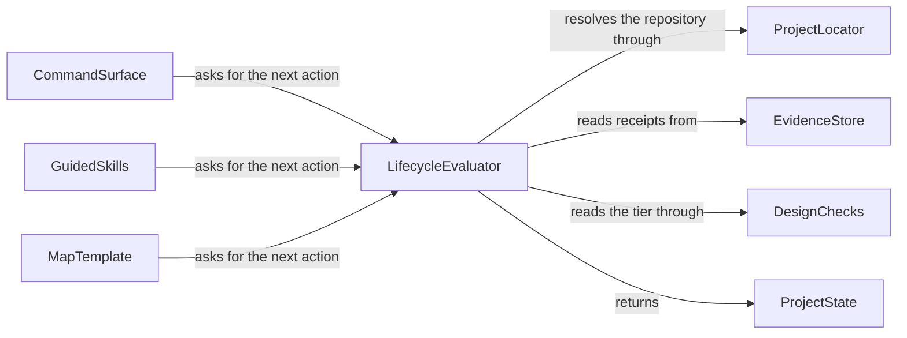
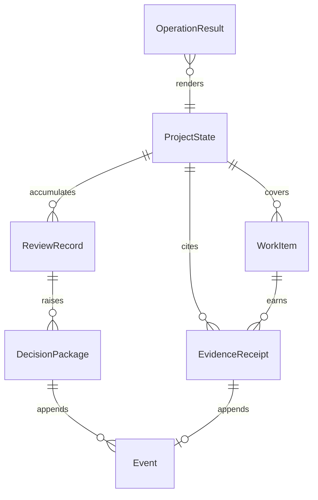
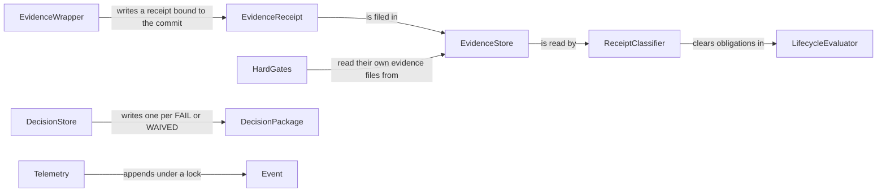
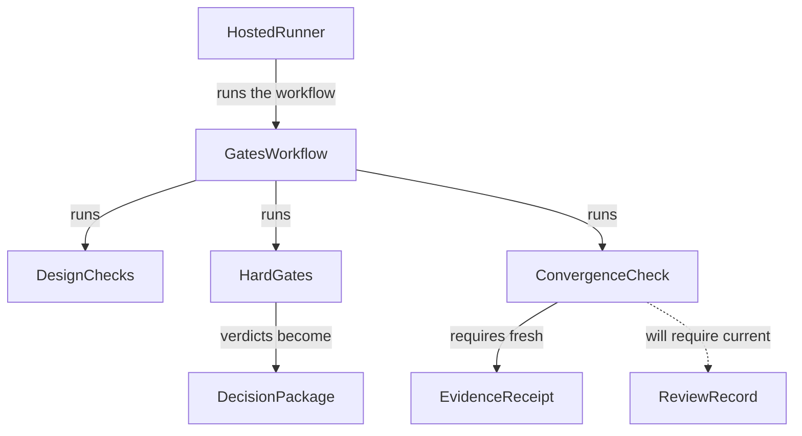
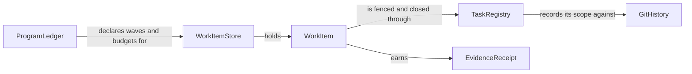

# 06. Diagrams

Every node below is declared somewhere else in this dossier: as a component in
the tables of 04-technology-map.md, or as an entity in 05-data-model.md. Nothing
here introduces a name the rest of the dossier does not carry, which is the point
of writing diagrams as code rather than drawing them.

## System context: who asks, and what answers

The four surfaces a user can touch, and the one evaluator they must all agree
with. Today the guided skills and the map template each work the answer out for
themselves, which is the disagreement Loop 3 removes.

## Entity relationships

The same names as 05-data-model.md, deliberately. A node here that the data model
never defined would mean the two artifacts had drifted apart.

## The evidence path, and the door in it

This is confirmed defect one of the plan review, drawn. ReceiptClassifier reads
the recorded command line as a string, so a command that ran no check at all can
satisfy an obligation. Loop 2 makes EvidenceWrapper record the check kind and
makes ReceiptClassifier read that field instead.

## The gate battery, and what it rests on

The container view of the merge gate. The dashed relationship is the one that
does not exist yet: ConvergenceCheck cannot require a current review, because
ReviewRecord has nowhere durable to live until Loop 3 builds it.

## Where the program's own records live

The ledger side: what the program tracks about itself, as opposed to what the
product tracks about a user's change.

## Reading these

The evaluator sits at the centre of the first diagram on purpose. Every arrow
that points at it is a surface asking a question, and every arrow leaving it is
an answer. The whole of Loop 3 is the work of making those arrows real, because
today three of the four surfaces answer the question themselves instead of
asking.
