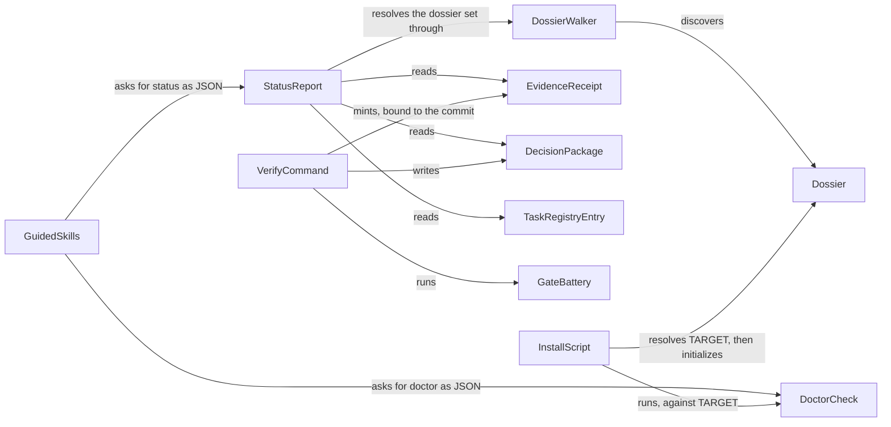
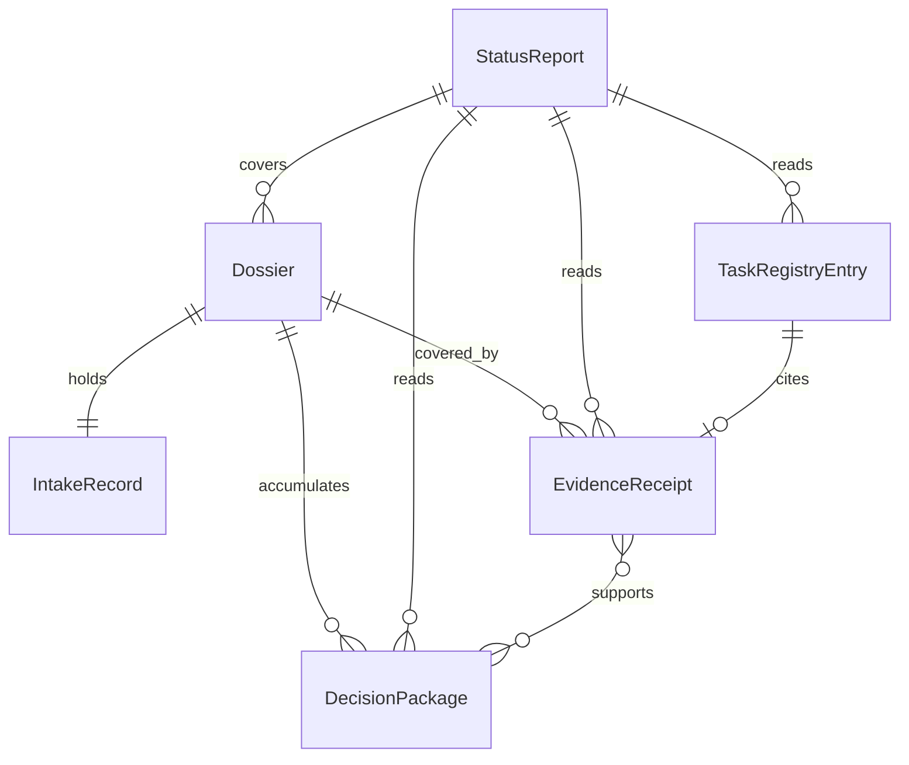
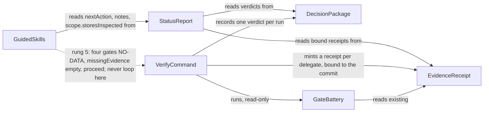
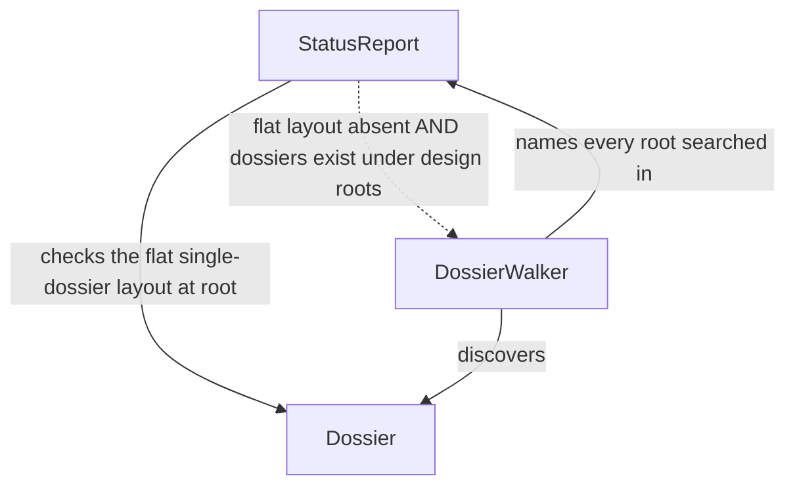
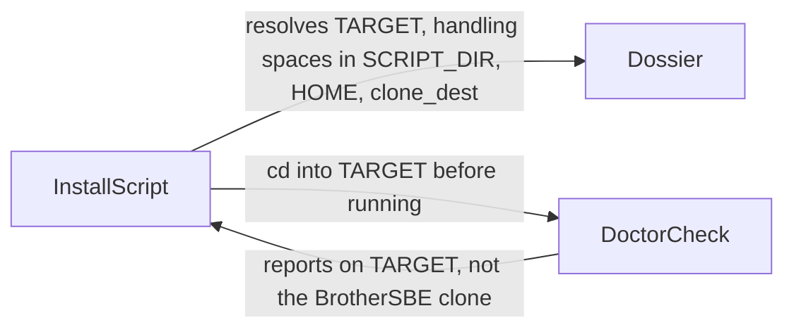

# 06. Diagrams

Every node below is either an entity declared in `05-data-model.md` or a
component declared under Components just below. Nothing here introduces a
name the rest of this dossier does not carry.

## Components

Runtime pieces a diagram is allowed to name that are not data-model entities,
each traced to the code that implements it and the decision in `03-adr.md`
that touches it.

- VerifyCommand: `_cmd_verify` in `src/brothersbe/cli.py:343`, the command
  Decision 2 (CR-08) teaches to mint receipts.
- GateBattery: `tools/sbe_gate.py`, the four hard gates VerifyCommand
  delegates to; its "writes: nothing" promise (`:1496`) is unchanged by
  Decision 2.
- EvidenceModule: `src/brothersbe/evidence.py`, the wrapper VerifyCommand
  routes each delegate through under Decision 2, and the reader StatusReport
  already uses.
- DossierWalker: `_design_roots` and `_team_changes` in
  `src/brothersbe/status.py:552-596`, the mechanism Decision 1 (CR-06)
  extends single-project discovery through.
- GuidedSkills: `skills/next`, `skills/verify`, `skills/status`,
  `skills/start`, the surfaces Decision 3 (CR-07 and CR-10) teaches to
  consume StatusReport's own JSON instead of rendered prose.
- DoctorCheck: `_cmd_doctor` in `src/brothersbe/cli.py:499-520`, the health
  check GuidedSkills also consumes as `sbe doctor --json`, and the check
  Decision 4 (CR-03) requires `install.sh`'s `run_doctor` to run against the
  target rather than its own checkout.
- InstallScript: `install.sh`, the script Decision 4 (CR-03) fixes so its
  own doctor step grades what it just installed.

## System context: who asks the engine, and what changes to make it honest

Today GuidedSkills mostly does not ask StatusReport at all; it interprets
rendered prose. This is the state after all four decisions land.

## Entity relationships

The same names as `05-data-model.md`, deliberately: a node here the data
model never defined would mean the two artifacts drifted apart.

## The fixed loop: CR-07, CR-08 and CR-10 in one diagram

The loop `01-purpose.md` names for CR-07: a skill reads StatusReport, which
reads EvidenceReceipt; VerifyCommand mints EvidenceReceipt; GateBattery
never writes anything, so it cannot be the thing that closes a NO-DATA
loop, and rung 5 of `skills/next` stops routing a legitimate NO-DATA back
into VerifyCommand.

## CR-06: discovery, flat first, walker as the additive fallback

## CR-03: install proof grades the target, not the clone

## Reading these

GuidedSkills sits at the edge of the first diagram on purpose: every arrow
it sends is a question, and after Decision 3 every one of those questions
lands on StatusReport or DoctorCheck rather than being answered by a skill
re-deriving the answer from text it rendered itself. The dashed arrow in the
fixed-loop diagram is the one CR-07 removes: today it is solid (the skill
text always recommends VerifyCommand on anything not green), and after
Decision 3 it fires only when the ladder has not already reached the
NO-DATA branch.
