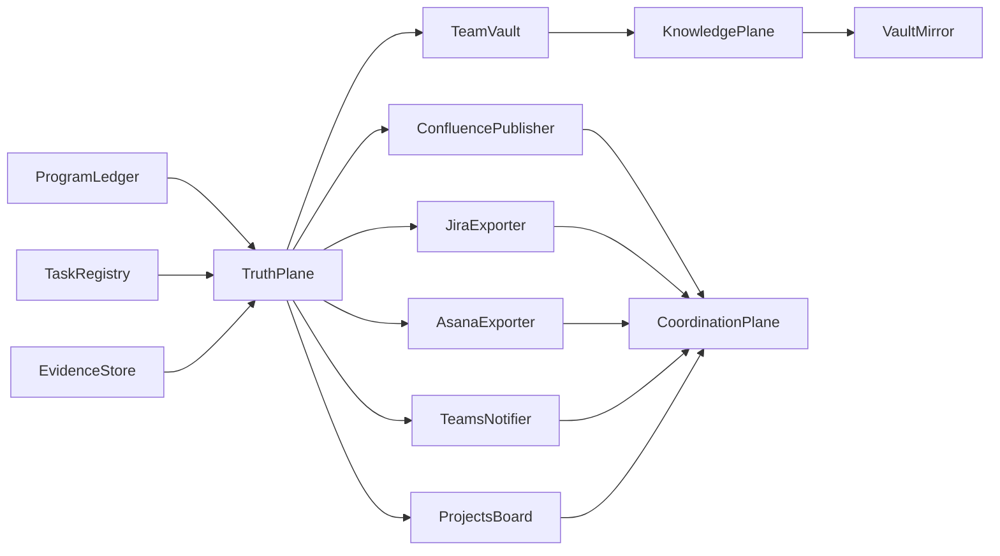
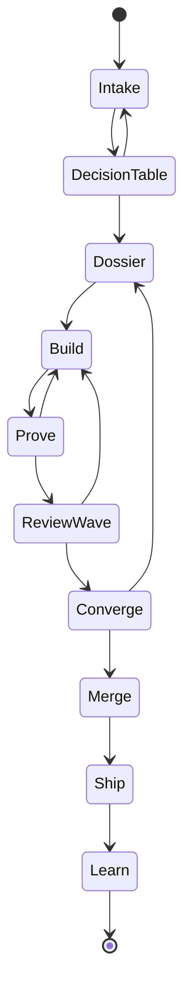
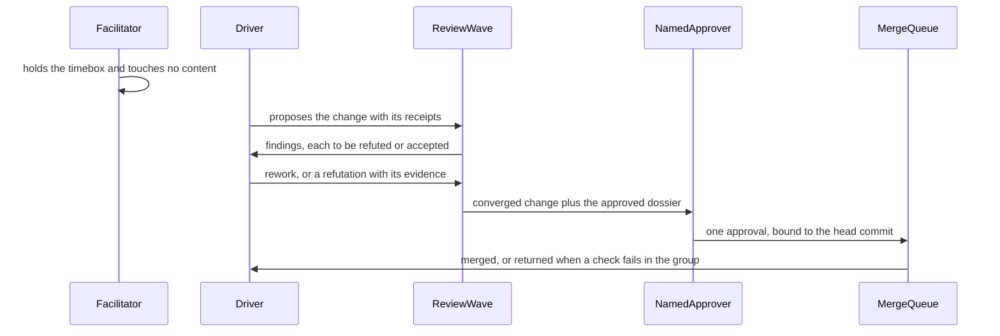
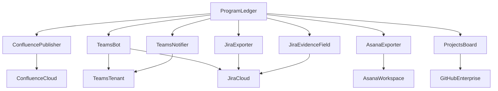

# 06. Diagrams

Four views. Every node is either an entity declared in 05-data-model.md, a
component declared in 04-technology-map.md, or a lifecycle state declared in
05-data-model.md, so nothing here names a thing the dossier does not define.

## The three planes

Truth flows outward and never inward. Read every arrow as "feeds", and note that
no arrow returns from the coordination plane.

The absent arrow is the design. There is no edge from CoordinationPlane back into
TruthPlane, and 05-data-model.md records the same fact as a column of noes.
Inbound change reaches the truth plane only as a pull request, which is a human
action reviewed under the platform's own controls, not a data path.

## The rhythm, end to end

The nine steps of 02-process.md as the states an item passes through. The
backward edges are the exception paths, not decoration: they are what happens
when a receipt is absent, when a finding survives refutation, or when a change
has drifted from the design that was approved.

DecisionTable returns to Intake when the room cannot decide, which is a real
outcome and not a failure: the item goes back with the open question named and
owned, rather than escalating to an open-invite meeting that decides nothing.
Prove returns to Build on NO-DATA. Converge returns to Dossier when the code and
the approved design have genuinely diverged, because the fix for drift is a
superseding design decision, not a quieter check.

## The review wave, as a swimlane

Who does what, in order, and who never writes. The facilitator's self-directed
message is the point of the diagram rather than an artifact of it: the role
appears in the sequence and touches nothing in it.

Two properties of this diagram are enforced by the platform rather than by
etiquette. The review wave never writes, so every arrow leaving it carries a
proposal and not a change. And the approval binds to the head commit, so a push
after approval dismisses it
(https://docs.github.com/en/repositories/configuring-branches-and-merges-in-your-repository/managing-protected-branches/about-protected-branches).

## The three integration stages

Stage 1 needs no engine code at all. Stage 2 adds thin one-way exporters. Stage 3
adds the only component that requires a real bot registration and a tenant
governance step.

The first three edges are stage 1: a Confluence page publish with read
restrictions applied, a Microsoft Teams notification through the Workflows app
webhook, and a URL-typed custom field on Jira issues created with a single call
(https://support.atlassian.com/jira/kb/jira-software-rest-api-essential-parameters-for-custom-field-creation/).

The middle block is stage 2: three exporters reading the same append-only event
stream, each independently failable, none of them holding a credential that can
write to the repository.

The last block is stage 3, and the edge from TeamsBot to JiraCloud is the reason
it is a separate stage. A button that does something needs a bot using Adaptive
Card Universal Actions; the Workflows webhook cannot render one
(https://learn.microsoft.com/en-us/microsoftteams/platform/webhooks-and-connectors/how-to/add-incoming-webhook).
What the button drives is an ordinary Jira issue transition, because Jira enforces
the approval gate itself inside its own workflow and there is no separate
approvals API to build against.

## Components declared for these diagrams

The plane groupings above are conceptual rather than deployed, so they are
declared here rather than in the technology map's component tables.

- TruthPlane: git, the ledger, the registry and the evidence store, taken together
- KnowledgePlane: the team vault and the mirrors published from it
- CoordinationPlane: the vendor surfaces, taken together
