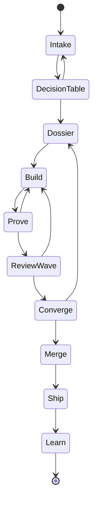
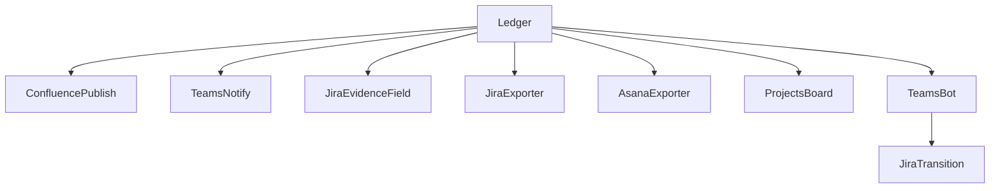

# The team playbook

How a team runs BrotherSBE without giving up either the evidence law or the
tooling the organization already pays for.

This is the human-facing companion to the dossier at
`design/team-operating-model/`. The dossier records the decisions and the
reasoning; this page tells you what to actually do on a Tuesday. Where a claim
about a vendor's behavior is load-bearing, the source URL is inline. Where
something does not exist yet, it says so rather than describing it in the present
tense.

One sentence before anything else, because everything below follows from it: git
stays the single source of truth, and every board, wiki and chat surface is fed
from it one way. The ledger broadcasts. It never obeys.

## Roles

Six roles. A small team collapses several onto one person, which is fine. What is
not fine is leaving a role unnamed and assuming it is covered.

**Driver.** The one writer. Human or Claude session, one at a time per file, for
the life of a claim in the task registry. This is the only role that touches
content. Everyone else proposes.

**Facilitator.** Keeps rhythm, timeboxes, work-in-progress limits, and the
conditions under which people will say "I do not understand this". Touches no
content, ever. Not a tiebreaker, not a reviewer, not a technical authority for the
session. The role is lifted straight from mob programming, where the facilitator's
job is explicitly not technical: keep time, manage rotation, enforce breaks,
prompt reflection, and watch for kindness under stress
(https://cucumber.io/blog/bdd/five-roles-in-a-healthy-mob/). Rotate it. A
facilitator who starts solving the problem has stopped facilitating, and the
session loses the only person whose job was to notice that it had gone off the
rails.

**Named Approver.** Exactly one accountable human per change, named in the dossier
before implementation starts. Not a team, not a channel, not "engineering". The
pattern is Squarespace's, and their reason for it is the clearest statement of
decision rights in the whole evidence base: "by naming the approvers, we are clear
about where the decision lies: if the approvers don't say yes, we won't start
implementing" (https://engineering.squarespace.com/blog/2019/the-power-of-yes-if).
Uber arrived at the same mechanism independently while scaling from tens to low
thousands of engineers.

Approvers may say "yes, if". A conditional approval records the condition and
unblocks the driver immediately, instead of forcing a second synchronous review
round. The condition is tracked; it is not a suggestion.

**Review wave.** Seven read-only reviewer agents plus whichever human reviewer the
change class demands. Reviewers never write. Every finding is either refuted with
evidence or accepted and fixed. A finding that is neither is an open item with an
owner, not a closed one.

**Scribe.** Mechanical. Session records and telemetry are hook-written. No human
transcribes anything. If a session ends with no record, that reads as NO-DATA on
the health screen, not as a clean session.

**Incident mode.** When production is on fire, the roles split the way Google SRE
splits them: an incident commander who holds state, a communications lead who
talks outward, a planning lead who handles logistics, and an operations group that
is the only party modifying the system (https://sre.google/sre-book/managing-incidents/).
That last clause is the single-writer law under a different name, and it is why
incident mode is a variation of the normal rhythm rather than a suspension of it.

## The rhythm

Nine steps. The same nine a solo driver already runs; what changes at team scale
is that some steps gain a second person, and every step gains a broadcast.

**1. Intake.** Work arrives from a board or from the guided start command. Five
objective questions size it into a tier, mechanically. Tiers argue UP only: if you
believe the computed tier is too low, you raise it and record the raise with a
reason a reviewer can read. Lowering is not available. An answer the tool cannot
read is refused by name rather than guessed at, which is deliberate: guessing at an
intake answer is guessing at how much evidence the change owes.

**2. Decision table, T2 and above.** A small, scheduled, terminal meeting. Fixed
cast: driver, named approver, facilitator, one domain expert. Not open invite. The
decision is made in the room and recorded as the decision record. This is
Basecamp's betting table shape (small fixed membership, fixed cadence, decision is
final, no backlog to revisit, rarely over two hours,
https://basecamp.com/shapeup/2.2-chapter-08), and it exists to avoid the failure
mode of a review that everyone attends and nothing decides. Atlassian's own
research points the same way: high-performing teams use meetings to decide, not to
report status (https://www.atlassian.com/blog/confluence/unlocking-the-secrets-to-outstanding-teamwork-in-2025).

If the room cannot decide, the item goes back to intake with the open question
named and owned. There is no larger meeting to escalate to.

**3. Dossier.** Sized by tier. The approver is named in it. This is where the
design is argued, and it is checkable: an artifact that is missing, empty, or
about a different system fails the design check and names itself.

**4. Build.** Pull, do not push. See the allocation section below.

**5. Prove.** Receipts are earned by running commands. A command that did not run
leaves NO-DATA, NO-DATA is read honestly, and NO-DATA is never a pass. A
hand-typed receipt is a defect and not a shortcut.

**6. Review and converge.** The wave runs, findings are resolved, and then the
change is reconciled against the approved dossier. Drift is a failure, not a note.
The fix for genuine drift is a superseding design decision, not a quieter check.

**7. Merge.** Under the four mechanisms in the merge section below.

**8. Ship.** Trunk-based, behind flags, on a release train, through the merge
queue, with the artifact attested.

**9. Learn.** A lesson becomes law only through a reviewed pull request into the
learned file. The vault records the story; the reviewed file records the rule.
Nothing else spreads between installs.

## Screens, and where every number comes from

Four screens. Every number on every screen names its mechanical source, prints its
definition, and prints the date it was checked. A figure without those three is a
defect, not a rounding error.

**Program board.** GitHub Projects v2, fields: stage, owner, approver, budget,
evidence link. Fed from the work items in the ledger. Projects v2 gives table,
board and roadmap views over the same items, and its built-in workflows handle
trivial status setting only; anything resembling a rollup, an SLA timer or a stale
item nudge is built in Actions against the Projects v2 GraphQL API
(https://docs.github.com/en/issues/planning-and-tracking-with-projects/learning-about-projects/about-projects).
Do not plan around the built-in automation doing more than it does.

**Health screen.** The generated status page, published read-only into Confluence
using the content restrictions API: set the `update` restriction to the publishing
identity and leave `read` open, so humans can view a generated page and cannot
hand-edit it (https://developer.atlassian.com/cloud/confluence/rest/v1/api-group-content-restrictions/).
The same data is an Obsidian Bases view over vault properties for the team's own
use.

**Compliance screen.** Rule suite results: pass, fail, and bypass with the actor
named. This is not a stylistic preference. GitHub's general organization audit log
carries no dedicated ruleset-bypass event, so a compliance view built on the audit
log reports a false zero. Bypass auditing lives in the rule suites API, whose
records carry actor, repository, ref, before and after SHAs, pushed-at time, and a
result of pass, fail or bypass (https://docs.github.com/en/rest/orgs/rule-suites).
Pull it on a schedule into something durable, because the UI's retention window is
not an archive.

Related operational habit: ship every new ruleset in Evaluate mode first. Evaluate
is a dry run that logs violations without blocking, so you can watch what would
have been blocked for a sprint before flipping to Active
(https://docs.github.com/en/repositories/configuring-branches-and-merges-in-your-repository/managing-rulesets/creating-rulesets-for-a-repository).
It is a canary for policy changes themselves.

**Delivery screen.** DORA-style metrics with the definition and the checked date
printed beside every number, and no tier labels. The tier labels are the trap.
Google Cloud's own page states that DORA's 2022 cluster analysis found only three
clusters, High, Medium and Low, which means no more Elite performers
(https://cloud.google.com/blog/products/devops-sre/using-the-four-keys-to-measure-your-devops-performance).
Secondary blogs still print the four-tier table with precise change-failure-rate
bands, and two of them do not even agree with each other on the numbers. Print
shapes and dates, not tiers.

Treat all four screens as information radiators in the original sense: one shared
surface everyone sees at a glance, not four private dashboards
(https://agilealliance.org/glossary/information-radiators/). And treat every
metric as a prompt for a retrospective conversation rather than an input to a
performance review. Both DORA's own guidance and the SPACE paper are explicit that
productivity "cannot be measured by a single metric or dimension"
(https://www.microsoft.com/en-us/research/publication/the-space-of-developer-productivity-theres-more-to-it-than-you-think/).

## The handover package

A handover is two parts, never one. This is the rule teams break most often and
the one whose breach is most expensive.

**Part one: the written artifact.** Four sections. DONE, with the evidence that
proves it. IN FLIGHT, with the exact stopping point. NOT STARTED. OPEN QUESTIONS.
Every open item carries a named owner and a deadline. A bare status with neither is
not an open item; it is a worry. The industrial shift-handover standard and
Google's incident document practice converge on exactly this, the latter with
explicit exit criteria and a running TODO list carrying bug numbers
(https://sre.google/sre-book/incident-document/).

**Part two: the explicit acknowledgment.** A live exchange that ends in the
receiver confirming ownership. Google SRE's form is the canonical one: the outgoing
commander says "You're now the incident commander, okay?" and does not disconnect
until the incoming commander confirms (https://sre.google/sre-book/managing-incidents/).

**The rule that makes it real: until the acknowledgment lands, the outgoing owner
still owns the work.** Ownership does not transfer by writing a document and
walking away. Concretely, the outgoing driver keeps the claim open in the task
registry until acknowledgment, so the mechanical state and the human state agree.

The reason both halves are mandatory is stated most plainly by the industrial
standard: the log captures the facts, the meeting adds nuance and intent. Written
only loses context. Verbal only loses the record. The same shape closes every
session, not only a shift change, and the template lives in the team vault.

## Allocation: pull, with limits, and swarming

Nobody hands out tickets.

A ready queue is derived from the plan. When a driver's work in progress drops
below the limit, they pull the next item they can work. That is the entire
assignment mechanism. Push assignment, where a lead hands out tickets, is what
produces silos and unevenly loaded people
(https://dev.to/hiclab/push-vs-pull-in-task-assignment-lfg).

Work-in-progress limits are what turn a board into a pull system. A board without
an enforced limit is a visualization, not a Kanban system, and the practical
starting formula is team size plus one
(https://businessmap.io/kanban-resources/getting-started/what-is-wip).

When a column hits its limit, the team converges on clearing the blockage before
anyone pulls fresh work. That is the swarm, and the point is that the limit
triggers it, not a manager. One honest caveat: the term "swarming" is vendor
vocabulary rather than canonical Kanban. The official Kanban Guide describes work
in progress control and unblocking blocked work without ever using the word. The
mechanism is verified; the label is common but not canonical.

Claims through the task registry are the allocation mechanism at the file level:
one writer per file, ever. Two drivers who both want the same file is not a merge
problem to be solved later, it is a claim conflict refused at write time.

## Merge controls: four mechanisms, and one that is new

An auditor will look for four things. Use exactly those four, and do not invent a
parallel compliance vocabulary that nobody has seen before.

1. **Ownership routing (CODEOWNERS).** The right people are automatically requested
   for review on the paths they own. Be precise about what this does and does not
   give you: multiple owners on one line means OR, not AND. `*.js @a @b @c` is
   satisfied by any one of the three. Matching is last-match-wins, exactly like
   gitignore. A listed owner only counts if they have write access, and a named
   entity that lacks it is silently not treated as an owner rather than raising an
   error (https://docs.github.com/en/repositories/managing-your-repositorys-settings-and-features/customizing-your-repository/about-code-owners).
2. **No self-approval on the most recent push.** The literal technical enforcement
   of segregation of duties: require that the most recent reviewable push is
   approved by someone other than the person who pushed it
   (https://docs.github.com/en/repositories/configuring-branches-and-merges-in-your-repository/managing-protected-branches/about-protected-branches).
3. **Stale-review dismissal.** Approvals are dismissed when commits are pushed that
   affect the diff, so an approval granted on version one cannot silently carry
   over to a materially different version four.
4. **The control file protects itself.** CODEOWNERS owns itself, or is owned by
   repository admins, so changing who holds approval authority is itself a
   reviewed change.

Those four map one to one onto what a SOX-style review asks for: the person who
develops a change cannot be the person who deploys it, and every approval and
deployment is logged and retained
(https://www.harness.io/harness-devops-academy/sox-compliance-for-software-delivery-explained).
The same source names the compensating control regulators increasingly accept: the
deploying "person" can be the automated pipeline, provided the pipeline enforces
peer review and automated checks before it will move code.

There is a fifth mechanism, and it is the one that fills the real gap. CODEOWNERS
has no syntax for "require N of these people". The required reviewer ruleset rule
does: it attaches per-path minimum approval counts to specific teams, using
gitignore-style patterns with negation, and went generally available in February
2026 (https://github.blog/changelog/2026-02-17-required-reviewer-rule-is-now-generally-available/).
Layer them. CODEOWNERS decides who gets asked; the ruleset rule enforces how many
have to say yes. Neither alone gives you both, and claiming CODEOWNERS gives you a
count is the most common way this gets misrepresented to an auditor.

## Release trains and attestation

Trunk-based development with feature flags, a merge queue on the default branch,
and a fixed-cadence release train.

Flags decouple deployment from exposure. GitHub's own account of running this on
itself describes shipping every potentially risky change behind a flag and then
enabling it for everyone or a percentage of actors, with the ability to disable in
seconds rather than rolling back a deployment that takes minutes
(https://github.blog/engineering/infrastructure/ship-code-faster-safer-feature-flags/).
The named rollout ladder is worth copying wholesale: dark ship first (code path
enabled with no user-visible change), then staff, then a percentage, then general
availability. Three independent kill points, each a flag flip rather than a
redeploy.

The merge queue changes the merge button to "Merge when ready" and builds a merge
group: a temporary branch containing the target branch plus every pull request
ahead of yours plus yours, so each change is tested against the combined state it
will actually produce. Two operational facts to plan for: workflows must add the
`merge_group` trigger or status checks simply will not run for queued pull
requests, and third-party CI must watch pushes to the queue's readonly branches
(https://docs.github.com/en/repositories/configuring-branches-and-merges-in-your-repository/configuring-pull-request-merges/managing-a-merge-queue).
The queue also replaces "require branches to be up to date", since it always tests
against current main.

A release train is a fixed cutoff: whatever has merged by the cutoff ships
together, and work that misses it rides the next train rather than blocking this
one. That decouples "when did I finish" from "when does it ship" and bounds blast
radius by batching. Be aware that the release-train framing in our research is
single-sourced industry explainer material, though it is consistent with the
first-party Meta and GitHub accounts of the underlying mechanics.

Release artifacts are attested. Artifact attestations produce a signed in-toto
attestation binding an exact artifact digest to a SLSA build-provenance predicate,
with GitHub running the Sigstore signing infrastructure itself, and verification
through `gh attestation verify`. The platform states this reaches SLSA Build Level
3, with the differentiator from Level 2 being that signing happens on dedicated
hardware separate from the build machine
(https://github.blog/enterprise-software/devsecops/enhance-build-security-and-reach-slsa-level-3-with-github-artifact-attestations/).
An unverifiable artifact blocks the release, not the merge.

One thing we could not confirm and you should check against your own billing: the
plan boundary for environment required-reviewers and wait timers on private
repositories. Secondary sources say Enterprise Cloud is needed; no directly opened,
dated vendor page confirmed it. Verify before designing a gate around it.

## Integrations: three stages

**Stage 1, zero engine code, designed and buildable today.** A Confluence page
publish of the generated status with read restrictions applied. Microsoft Teams
notifications through the Workflows app webhook, notify only. A URL-typed
"Evidence" custom field on Jira issues, created with a single call to the field API
(https://support.atlassian.com/jira/kb/jira-software-rest-api-essential-parameters-for-custom-field-creation/).
Issue keys ride in pull request titles, which is enough for the development panel
to populate.

**Stage 2, thin one-way exporters, designed, not built.** Three small tools reading
the append-only event stream and writing outward: to Jira (bulk issue create, or
the Development Information API, which Atlassian ships specifically for tools
behind a firewall pushing outbound with no inbound ports opened,
https://developer.atlassian.com/cloud/jira/software/integrate-jsw-cloud-with-onpremises-tools/),
to Asana (create task, then update to the approval subtype, because setting
approval status alone does not convert a task,
https://forum.asana.com/t/mark-task-as-approval-via-api/798803), and to Projects
v2. Each is a ledger row: BR-0520, BR-0521, BR-0522. None exists yet.

**Stage 3, actionable approvals, designed, not built.** A Teams bot using Adaptive
Card Universal Actions, driving an ordinary Jira issue transition. This is a
separate stage because of a hard vendor boundary, not because of sequencing
preference: an incoming webhook cannot render a working button, and the
Workflows-based replacement states outright that button rendering is not supported
(https://learn.microsoft.com/en-us/microsoftteams/platform/webhooks-and-connectors/how-to/add-incoming-webhook).
Only a real bot with `Action.Execute` can do it
(https://learn.microsoft.com/en-us/microsoftteams/platform/task-modules-and-cards/cards/universal-actions-for-adaptive-cards/overview).
The approval gate itself stays a Jira workflow approval step; there is no separate
approvals API to build, because Jira makes the transition unavailable until
approvals resolve.

Tenant app governance is a named rollout step with an owner, not an afterthought.
A fully working bot can be silently inert for a subset of users because app
permission policy blocks it, and policy changes take hours to propagate
(https://learn.microsoft.com/en-us/microsoftteams/teams-app-permission-policies).

**The deadline you cannot ignore.** Office 365 connectors within Microsoft Teams
are being retired, with the final rollout window to disable them stated as
2026-05-18 to 2026-05-22
(https://learn.microsoft.com/en-us/microsoftteams/platform/webhooks-and-connectors/what-are-webhooks-and-connectors).
Build on the Workflows trigger from the first line of code.

## The vault

The knowledge plane. Code lives in git, truth lives in the ledger, and the vault
holds working memory: project shape, open items, failures that bit before,
decisions with their stories, and handovers.

**The async law.** There is no live co-editing. The vendor's own collaboration page
says it does not yet support collaborative live editing on the same file
(https://obsidian.md/help/sync/collaborate). Design around eventual sync. One
writer per note. Never let the vault be the only home for anything.

**Sharing.** A git-synced vault with a union merge driver on markdown and the
local config directory ignored. Union merge turns "two people appended different
bullets to the same log" into a non-event, at a real cost: when two people edit the
same sentence, it silently keeps both versions instead of asking
(https://forum.obsidian.md/t/team-colaboration/69608). That trade is right for
additive notes and wrong for notes people rewrite, which is why fence discipline,
not merge tooling, is the actual control. The snippet and the rest of the pattern
live in `memory-template/TEAM-VAULT.md`.

**Schema.** Five frontmatter properties on every note: type, project, status,
owner, date. Enforced by templates. Freeform metadata is refused because
inconsistent property names and types are the single most common reason team
dashboards silently miss rows. Bases gives no-code views; Dataview gives the
scripted rollups. Filter every shared Base, because an unfiltered one returns an
entry for every file in the vault (https://docs.obsidian.md/plugins/guides/bases-view).

**Honest limits, stated before adoption rather than after.** No single sign-on, no
SCIM, no audit log, no per-folder or per-file permissions, no native comments.
Access control is vault scope and nothing finer: one vault per team, and material
needing finer control lives elsewhere. Performance degrades on large vaults
according to community reports rather than vendor benchmarks. And the largest
documented internal use we could find is the vendor's own seven-person team; no
hundred-person case study exists in either direction, so claims about large-scale
behavior, including ours, are inference.

The conclusion: a regulated organization keeps Confluence or its equivalent as the
governed publish layer and treats the vault as the team's working memory. Publish
outward; never edit the mirror.

## What we will not do

Short list. Each item is a decision, not an omission, and each one is the thing
somebody will eventually propose.

- **No inbound automation that mutates the repository.** Not a webhook, not a bot,
  not a board automation, not a "just this one field" exception. Inbound change is
  a pull request. This is the whole design; everything else is a consequence of it.
- **No auto-merge from any board.** Moving a card is not merging. Closing a ticket
  is not shipping. Merging is merging.
- **No legacy Microsoft Teams connector.** It is retired in the May 2026 window.
  Anything built on it is already dead.
- **No webhook holding write access to truth.** An integration credential that can
  write to the repository is the same thing as inbound automation, wearing a
  different hat.
- **No approval that is not one named person.** "The team approved it" is not an
  approval, and an auditor will say so.
- **No number on a screen without its definition and checked date.** Including
  DORA tier labels, which stopped matching the research's own clustering after
  2022.
- **No prose standing in for a control.** If a rule is not enforced by something
  that can fail, it is a preference. Write it as a check or admit it is advice.
- **No receipt that a command did not earn.** Absent evidence is NO-DATA, and
  NO-DATA is never a pass.
