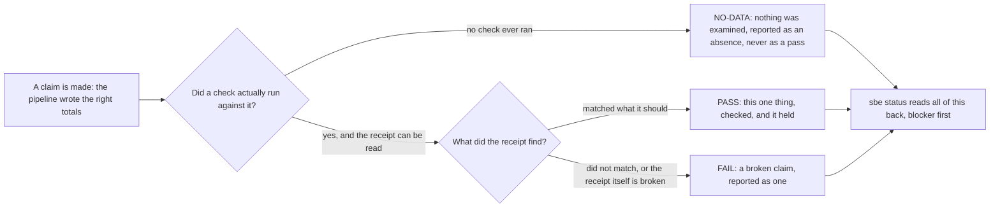

# Why this exists

## The number nobody had checked

The worked example behind this book is a small nightly pipeline. Every night
it reads a handful of orders, adds them up by region, and writes the totals
to a file. Nothing about it is exotic: three orders in, two regions out, one
file written. It is small on purpose, so a reader can hold the whole thing in
one look.

Run it and it prints three lines. The last one says: wrote 3 rows to
daily_totals. Open the file it just wrote and count what is actually there:
two entries, one for EU and one for US. Not three.

Nobody built this pipeline to lie. The printed line and the file on disk both
come from the same run, written by the same process, seconds apart. But they
do not agree, and until someone opens the file and counts, there is no way to
know that from the terminal alone. A team that trusts the printed line has
trusted a claim it never checked. A team that opens the file every morning
has a job nobody signed up for.

That gap, between what a program says it did and what it actually left
behind, is not a one off defect in one small pipeline. It is the same gap
behind a migration an engineer says "ran clean," a deploy a dashboard marks
green, a report a business analyst signs off because nobody flagged it. Most
of the time the claim happens to be right. The problem is that "most of the
time" is not something anyone can act on when the one time it is wrong is the
one that reaches a customer, a partner, or an auditor.

This book does not resolve that mismatch in this chapter. It comes back to
it, and to this exact pipeline, once the tooling to check it has been shown.
This chapter only names the gap.

## The one law

Everything in this product comes back to one rule, stated plainly: absent
evidence is NO-DATA, and NO-DATA is never PASS.

Read that slowly, because the two halves matter separately. If a check never
ran, the honest answer is "nobody checked this yet," not "assume it is fine
because nothing complained." If a check did run and something looked wrong,
that is a FAIL, reported as one, never softened into a caveat buried in a
paragraph. A PASS means one specific thing: a specific check ran, against a
specific piece of evidence, and came back clean. Nothing else is allowed to
look like a PASS, not a missing receipt, not a receipt nobody can read, and
not a waiver someone granted to move past a finding rather than resolve it.

This matters to a business analyst or a project manager as much as it matters
to an engineer, maybe more, because every plan, timeline, and handover in
this book eventually rests on a claim like "the pipeline ran" or "the totals
are right." If the tool reporting that claim refuses to let an absence read
as a pass, then a status page read without opening a terminal is telling the
truth as far as it goes, and saying plainly where it stops.

## What BrotherSBE refuses to do

Refusal is the product, more than any single feature is. Concretely, this
tool:

- Will not print PASS over evidence it never examined.
- Will not treat a missing receipt as a clean bill. Missing is its own
  category, reported by name, every time.
- Will not accept a second check that is just the first one copied with a
  comment added on the end. That reads as one derivation dressed up as two,
  and it says so.
- Will not let a waiver, a decision to move past a finding without fixing
  it, read as though the finding were resolved. A waiver prints as WAIVED,
  never as PASS, and the run says a waiver happened.
- Will not report a code scan as clean when every finding in it was waived
  rather than fixed.

None of this makes work happen faster. It makes the honest answer available
at exactly the point someone is tempted to skip asking for it.

## INTERNAL-EVAL, said plainly

This book will not claim BrotherSBE is proven at scale, because it is not.
Every maturity claim this product makes about itself carries the same label:
INTERNAL-EVAL. That means it has been run and checked inside this project,
against fixtures this project wrote and controls, not battle tested across
many teams or many kinds of estate yet. Where this book shows a command's
real output, that output is real, produced by actually running the command.
Where it describes a feature that does not exist in the shipped tool yet, it
says so beside the sentence that names it, every time that sentence appears,
not once at the front and never again.

## Claim versus evidence

## Where the rest of this book goes from here

Part I stays out of the terminal. The next chapter tours what a business
analyst or project manager reads without running a command, and the chapter
after that shows a real status report and what its sections mean. Part II
goes back to the pipeline itself and follows the mismatch this chapter opened
with, "wrote 3 rows" against two rows actually written on disk, through a
real check built to catch exactly that kind of gap. This chapter is where the
gap gets named. The rest of the book shows, in order, how it gets closed.
