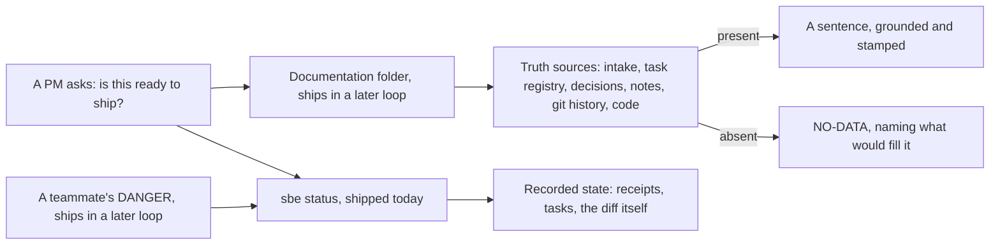

# What you get without a terminal

## The question behind this chapter

A business analyst or a project manager does not usually run a command.
They read what a teammate pastes into a channel, or what a generated file
hands them. This chapter tours that surface: a Documentation folder built to
answer the questions a BA or PM actually asks, and a way for the team to
leave notes and warnings inside the same record the gates read.

Read this chapter as a map of where this program is going, not a manual for
what is on disk today. Every capability it describes that is not yet in the
shipped command line carries the words "ships in a later loop" beside the
sentence that names it, because this book will not describe a feature as
available before it is.

## The Documentation folder (ships in a later loop)

The single clearest promise made to a BA or PM in this whole program is a
per-project Documentation folder, ten files, each one answering a question
that does not require reading a diff to answer. It does not exist in the
shipped command line yet. It ships in a later loop of this program (Loop 3),
and until it lands, the closest thing to it that already works is the guides
and worked example this book itself is built from.

When it lands, each file is grounded in a truth source the tool already
reads for other work: intake, the task registry, decision packages, the
notes store, git history, the code tree itself. Nothing in it is invented. A
section whose truth source is absent renders as NO-DATA, naming what would
fill it, the exact rule chapter one already named.

| File | The question a PM actually asks | What it answers, ships in a later loop |
|---|---|---|
| **01-business-analysis.md** | Why are we doing this, and for whom? | Purpose, stakeholders, constraints, the tier and why it was set |
| **02-task-summary.md** | What is the state of every piece of this? | Every task with its status, owner, scope, and verification command |
| **03-wbs.md** | How does the work actually break down? | A hierarchical work breakdown derived from task ids and owned scopes |
| **04-delivery.md** | When does this land, and what is on the critical path? | A Mermaid Gantt built from registry dates, the computed critical path, and slack per task |
| **05-process.md** | How does the thing actually work, step by step? | Process diagrams with one paragraph of explanation under each step |
| **06-data-model.md** | What does the data look like, and who owns each field? | An entity diagram covering the data's conceptual, logical, and physical shape, in that order |
| **07-dependencies.md** | What breaks if we touch this? | Task to task and code to code dependencies, one line of why each matters |
| **08-code-guide.md** | Where would someone even start reading the code? | A per-module explanation at the depth the project has declared |
| **09-whitepaper.md** | Can I hand this to someone outside the team and have them understand it? | What this project is, how it works, what the gates guarantee and refuse, and its limits |
| **10-HANDOVER.md** | If everyone who built this left tomorrow, could we still run it? | State, health commands, mistakes made and their cost, open defects, remaining scope |

Every file in that folder carries a stamp naming the commit and the source
files it was built from, so a reader can check the folder's own claims the
same way this book asks a reader to check its.

## Notes and DANGER: the team's voice inside the gates (ships in a later loop)

A Documentation folder answers questions the tool already has evidence for.
It does not carry a teammate's judgment, and judgment is where a second
engineer, a BA, or a PM often has the most to add. Notes are the planned
answer to that gap. They do not exist in the shipped command line yet; they
ship in a later loop of this program (Loop 4).

When they land, a note is a short, versioned entry attached to one artifact:
a task, a decision, a file. Each carries who wrote it, when, and one of three
severities:

- **NOTE**: a comment for the record, nothing more.
- **INSIGHT**: something worth knowing before deciding, short of a warning.
- **DANGER**: a warning that blocks. An unresolved DANGER is meant to stop a
  merge the same way a broken claim does, and it is planned to name exactly
  who it mentions, so the right person sees it before anything proceeds.

The plan for where this surfaces matters as much as the note itself: inside
**sbe status**, in a NOTES section, so a DANGER a BA raised is read in the
same place, and treated with the same weight, as a check an engineer's
tooling found on its own. No server and no account are planned for this. The
team is meant to collaborate through the repository it already shares.

## Diagram: a PM's question, traced to its source

## What is real today, and what is ahead

**sbe status**, shown in the next chapter, is shipped and real: it reads
recorded state and prints a blocker first summary a BA or PM can read
directly, without a terminal of their own, whenever a teammate pastes it.
The Documentation folder and the notes and DANGER voice described in this
chapter are not shipped yet. They are the next two loops of this program,
named here so the difference between what this tool does today and what it
is built to do next is never left to guesswork.
