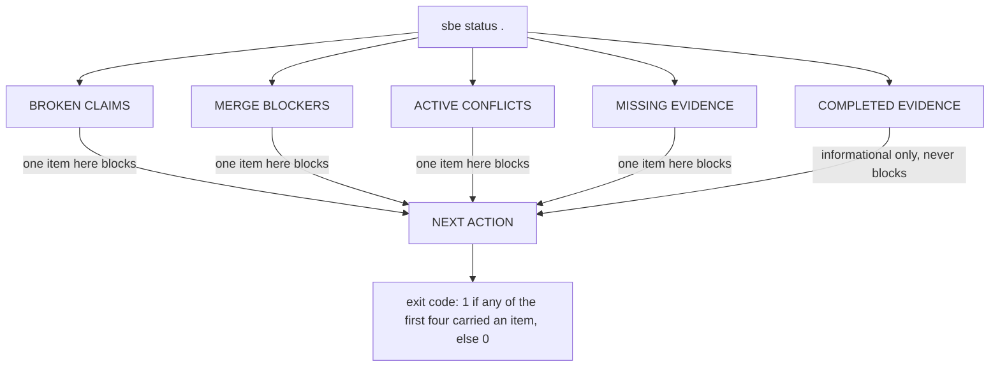

# Reading the truth

## What sbe status is, and what it deliberately is not

**sbe status** answers one question: where does a change stand, right now.
It does not compute a new verdict of its own. It reads state that other
commands already recorded, evidence receipts, the task registry, an intake
file, a disposition, the diff itself, and reports what it finds, blocker
first. If the underlying checks were never run, status says so. It will not
run them itself, because a summary tool that quietly becomes a second gate
runner is a summary tool nobody can trust to only summarize.

That design choice is why a business analyst or project manager can read
this command's output and trust it as far as it goes: it is not opinion,
and it is not a fresh judgment made on the spot. It is a plain readback of
what has already been recorded, with the honest gaps left visible instead of
smoothed over.

## The six things it always prints

Every run prints the same five sections, in the same order, plus one closing
line:

1. **BROKEN CLAIMS**: a piece of recorded evidence that does not hold up,
   a receipt that cannot be read, or a check that failed. Blocks.
2. **MERGE BLOCKERS**: whatever this repository's own rules name as blocking
   right now. Blocks.
3. **ACTIVE CONFLICTS**: two open pieces of work claiming the same scope at
   the same time. Blocks.
4. **MISSING EVIDENCE**: a check this change's tier requires, that nobody
   has run yet. Blocks.
5. **COMPLETED EVIDENCE**: what was checked, and came back clean. This
   section never blocks. It is read only, the record of what already
   passed.
6. **NEXT ACTION**: one line, computed from the first section above that
   carries an item, or a line saying nothing blocking was found.

Sections one through four decide the exit code. Section five never does,
by design: a long list of completed evidence says something was checked, it
does not excuse anything that was not.

Inside each section, watch for one distinction. A line that opens with
"NO-DATA" means nothing was there to inspect at all, no receipts, no
registry, nothing recorded. A line that opens with "clean" means something
was inspected, and it came back with nothing to report. Those are not the
same claim, and the scope text after either word says exactly what was, or
was not, looked at.

## A real run, on this repository

The block below is not typed from memory. It is the literal output of
running the command shown, against this repository, re-executed by the
book's own build check every time this page is verified.

```bash
bin/sbe status .
```

```
sbe status: /Users/khalil.maaouni/Documents/BrotherSBE

BROKEN CLAIMS:
  NO-DATA. scope: no evidence store found at /Users/khalil.maaouni/Documents/BrotherSBE/.sbe/evidence; disposition absent

MERGE BLOCKERS:
  clean. scope: dossier final-release-program intake /Users/khalil.maaouni/Documents/BrotherSBE/design/final-release-program/00-intake.json (tier T3); dossier lifecycle-blockers intake /Users/khalil.maaouni/Documents/BrotherSBE/design/lifecycle-blockers/00-intake.json (tier T2); dossier team-operating-model intake /Users/khalil.maaouni/Documents/BrotherSBE/design/team-operating-model/00-intake.json (tier T1); no task registry found at /Users/khalil.maaouni/Documents/BrotherSBE/.sbe/tasks.json; git diff 98882257950c..HEAD over 14 changed file(s)

ACTIVE CONFLICTS:
  NO-DATA. scope: no task registry found at /Users/khalil.maaouni/Documents/BrotherSBE/.sbe/tasks.json

MISSING EVIDENCE:
  - dossier final-release-program: no evidence receipt declares a design completeness check run, and declared tier T3 owes one
  - dossier final-release-program: no evidence receipt declares a hard gate run, and declared tier T3 owes one
  - dossier final-release-program: no evidence receipt declares a scored surface run, and declared tier T3 owes one
  - dossier lifecycle-blockers: no evidence receipt declares a design completeness check run, and declared tier T2 owes one
  - dossier lifecycle-blockers: no evidence receipt declares a hard gate run, and declared tier T2 owes one
  - dossier lifecycle-blockers: no evidence receipt declares a scored surface run, and declared tier T2 owes one
  - dossier team-operating-model: no evidence receipt declares a design completeness check run, and declared tier T1 owes one
  - dossier team-operating-model: no evidence receipt declares a hard gate run, and declared tier T1 owes one
  - dossier team-operating-model: no evidence receipt declares a scored surface run, and declared tier T1 owes one

COMPLETED EVIDENCE:
  NO-DATA. scope: no evidence store found at /Users/khalil.maaouni/Documents/BrotherSBE/.sbe/evidence

NEXT ACTION: run `bin/sbe design --strict <dossier>` through `sbe evidence run --kind design` to record it (MISSING EVIDENCE) scope: intake absent; disposition absent; evidence store absent; task registry absent; dossiers discovered: final-release-program, lifecycle-blockers, team-operating-model; diff git diff 98882257950c..HEAD over 14 changed file(s)

sbe status: exit 1. at least one of BROKEN CLAIMS, MERGE BLOCKERS, ACTIVE CONFLICTS or MISSING EVIDENCE carries an item above.
```

One line in that output is live by design: `git diff <sha>..HEAD over N
changed file(s)` names the commit your repository is actually at, so the sha
and the count on your machine will differ from the ones printed here, and
they move again after every commit. The book's own replay check knows this:
it treats exactly that substring as declared volatile and compares every
other byte of the block literally, because freezing a live reading onto a
printed page would be the kind of quiet lie this product exists to catch.

## Reading this specific report

Every section above reads NO-DATA except MERGE BLOCKERS, which reads
"clean." That difference is the whole report in miniature. No section found
a broken claim, an open conflict, or missing evidence for the simple reason
that nothing has been recorded here to examine: no evidence store, no task
registry, no intake file. MERGE BLOCKERS alone had something to look at, the
actual git diff, and found nothing in it that this repository's rules treat
as blocking.

Exit 0 here does not mean this change was verified and found sound. Read the
closing line again: it names exactly that gap. It means nothing recorded
anywhere was found broken, which is a different and smaller claim than
"everything was checked." A reader who treats a clean, NO-DATA heavy report
as proof of quality has made the exact mistake this whole book exists to
stop.

## When to escalate

The rule is mechanical, not a judgment call: escalate whenever BROKEN
CLAIMS, MERGE BLOCKERS, ACTIVE CONFLICTS, or MISSING EVIDENCE carries even
one item. Each of those is an exit 1 by construction, and each item names a
concrete file, claim, or scope conflict, not a vague concern. That is
precisely what makes it something to hand to a person rather than resolve by
re-reading the report harder: the tool has already done the reading, and
what is left is a decision only a human can make.

COMPLETED EVIDENCE never needs escalation on its own. It is the section that
tells you what is already settled.

One case deserves a second look even at exit 0: a report that is NO-DATA
almost everywhere, the way this repository's is right now. That is not a
blocker by the tool's own rule, but it is worth asking, out loud, whether
this repository is expected to have an evidence store and a task registry by
this point in its work, and if so, why it does not yet.

## Diagram: how the sections resolve into one action


