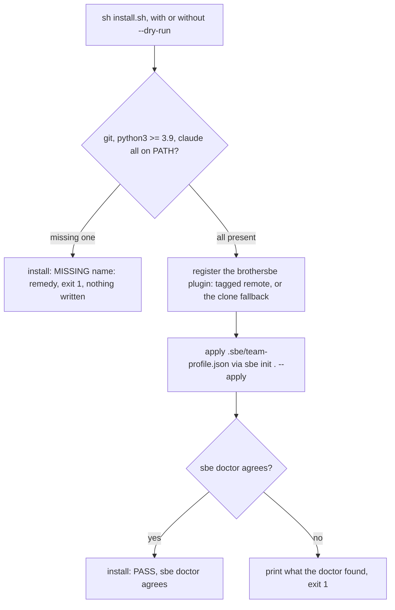

# Install day

<!-- replay: chapter requires claude -->

## What one script promises

Part I stayed out of the terminal on purpose. From here on, the book expects
one open, because everything downstream, the loop, the receipts, the task
registry, assumes the tool is actually on the machine. `install.sh` is how it
gets there: one script, at the repository root, that checks the machine,
registers the Claude Code plugin, applies the team's committed profile through
`sbe init`, and closes with `sbe doctor`'s own verdict rather than a claim the
installer invented about itself.

That last part is not a style choice. An installer that prints its own
"installed successfully" line is grading its own homework. This one hands the
last word to a separate command, `sbe doctor`, that reads the actual state of
the machine and says what it finds. If the two disagree, the doctor wins, and
the script says so instead of overriding it.

## The dry run, for real

`--dry-run` writes nothing. It walks every step the real run would take and
prints `would:` in front of each one, so a person can see exactly what is
about to happen before anything happens. The block below is not typed from
memory; it is this repository's own `install.sh`, run from this repository's
own root, and the book's build check re-executes it every time this page is
verified.

That last fact forces a flag into the command, and the reason is worth reading
before the output. `install.sh` installs into the project you run it from, and
it REFUSES when that project turns out to be the BrotherSBE clone itself,
because installing into the tool instead of into your work is a failure that
prints a success message. This page is generated from inside that very clone,
so the honest way to show the normal output here is to tell the script this is
a deliberate self-test. You will not pass this flag. You will run
`sh install.sh` in your own project, or `sh install.sh --target /path/to/it`.

```bash
sh install.sh --dry-run --developer-self-test
```

```
install: resolved target: /Users/khalil.maaouni/Documents/BrotherSBE
would: check git is on PATH
would: check python3 is on PATH and is version 3.9 or newer
would: check claude is on PATH (the Claude Code CLI)
would: install the brothersbe plugin: claude plugin marketplace add https://github.com/khalilmaaouni/BrotherSBE.git then claude plugin install brothersbe@brothersbe, if tag v1.0.0-rc.13 is published on https://github.com/khalilmaaouni/BrotherSBE.git; otherwise take the clone fallback (git clone https://github.com/khalilmaaouni/BrotherSBE.git /Users/khalil.maaouni/.claude/skills/brothersbe, or update it if it is already there, then claude plugin marketplace add /Users/khalil.maaouni/.claude/skills/brothersbe, then claude plugin install brothersbe@brothersbe)
would: apply the team profile with python3 bin/sbe init /Users/khalil.maaouni/Documents/BrotherSBE --apply, reading .sbe/team-profile.json (from /Users/khalil.maaouni/Documents/BrotherSBE when it carries one, otherwise this installation's own copy at /Users/khalil.maaouni/Documents/BrotherSBE) for dossierRoot, vaultPathPattern, ci, codeGuideDepth, and schemaVersion; any field outside that set is rejected by name in the report below, never silently ignored
would: run bin/sbe doctor and confirm it agrees before printing the PASS line
install: dry run, nothing written.
```

The first line is the whole point of the fix. The script names the directory it
resolved BEFORE it does anything, so a person who is about to install into the
wrong place can see it in the one place they are already looking.

Four steps, named before any of them run: prerequisites, the plugin, the team
profile, the doctor's own check. Nothing about this run touched the disk;
`--dry-run` is read-only by construction (`command -v` for every prerequisite
check, and every writing branch in the script guarded by the same `DRY_RUN`
flag), which is why this book can paste its real output without leaving the
repository any different than it found it.

## What the real run actually does

Run `sh install.sh` without the flag and each `would:` line above becomes an
action. In order:

1. **Prerequisites.** `git`, `python3` at 3.9 or newer, and `claude` (the
   Claude Code CLI) are each checked with `command -v`. A missing one stops
   the script immediately, before anything else runs; see the refusal below
   for exactly what that looks like.
2. **The plugin.** The script reads this repository's own version out of
   `.claude-plugin/plugin.json` and checks whether that tag is published on
   the `origin` remote. If it is, it registers the marketplace straight from
   the remote URL. If it is not yet published, it takes the clone fallback:
   clone (or update) a copy at `~/.claude/skills/brothersbe`, and register the
   marketplace from that local clone instead. Either branch ends the same way,
   `claude plugin install brothersbe@brothersbe`.
3. **The team profile.** `python3 bin/sbe init . --apply` writes this
   repository's local footprint, config, dossier directory, a receipt, using
   the answers already committed in `.sbe/team-profile.json` rather than
   asking a person to make five choices by hand. Every teammate who runs this
   script against the same clone ends up with the same install, because
   nobody typed the answers themselves.
4. **The doctor's verdict.** The script's own last word is never its own:
   it runs `bin/sbe doctor` and only prints `install: PASS, sbe doctor
   agrees` if that separate command agreed. If it did not, the script prints
   what the doctor said and exits 1; it does not paraphrase the failure into
   something friendlier.

This book will not paste the transcript of that real run here. It would
register a live plugin marketplace entry and rewrite this machine's Claude
Code configuration, which is not something a book page should do on a
reader's behalf without them asking for it. Everything above is read straight
out of `install.sh` itself, and steps 1 through 4 are exactly, and only, what
the dry run named a moment ago.

## The refusal, and why it is the point

A script that guesses past a missing tool is worse than one that stops. Every
prerequisite goes through one helper:

```sh
need() {
    name="$1"
    remedy="$2"
    if ! command -v "$name" >/dev/null 2>&1; then
        echo "install: MISSING $name: $remedy"
        exit 1
    fi
}
```

That is `install.sh`, lines 37 to 44, quoted whole because there is nothing
hidden in it: check the one thing (`command -v`), and if it fails, name the
tool and the exact remedy, then stop. Nothing after `check_prereqs` in the
script runs until every `need` call has passed, so a missing prerequisite is
caught before the script has written a single byte to disk, not partway
through, and not as a symptom three steps later that has to be traced back.

`SBE_INSTALL_REQUIRE` adds one synthetic prerequisite ahead of the real ones,
which is how this exact refusal path gets exercised without uninstalling a
real tool from a real machine. The block below is that refusal, produced by
running the script with an environment variable that names a tool no machine
has:

```bash
PATH=/usr/bin:/bin SBE_INSTALL_REQUIRE=definitely-absent-tool sh install.sh --dry-run --developer-self-test
```

```
install: resolved target: /Users/khalil.maaouni/Documents/BrotherSBE
would: check definitely-absent-tool is on PATH (SBE_INSTALL_REQUIRE, a synthetic requirement added for testing the refusal path only)
install: MISSING definitely-absent-tool: install definitely-absent-tool and re-run install.sh
```

Note the order. The target is resolved and named first, then the prerequisites
are checked. That ordering is deliberate: being told which directory is about to
be written is more urgent than being told which tool is missing, because the
wrong directory is the failure you cannot see afterwards.

Read the second line again: it names the missing thing and the exact command
that fixes it, `install definitely-absent-tool and re-run install.sh`. That is
the whole refusal. It is not a stack trace, and it is not a generic "setup
failed." A reader who has never seen this script before can act on that one
line without opening it. Refusing early, and refusing by name, is not a
rough edge this script has yet to polish; the `need` helper at lines 37 to 44
exists specifically so that every prerequisite fails the same honest way,
instead of each one failing differently three steps downstream once something
that depended on it silently did not work.

## The whole shape of install day



## Where this leaves a fresh machine

Once `install: PASS, sbe doctor agrees` prints, a teammate has exactly what
every other teammate who ran this same script has: the plugin registered, the
local `.sbe` footprint written from the same committed profile, and a doctor
that already agrees the install is sound. Nothing about this step required a
person to answer a single question, and nothing about it is INTERNAL-EVAL
folklore passed machine to machine; every claim above is either this script's
own text, quoted, or its own output, replayed. The next chapter picks up from
here and runs the first real loop: intake, a tier, and a gate that refuses,
on purpose, before any code gets written.
