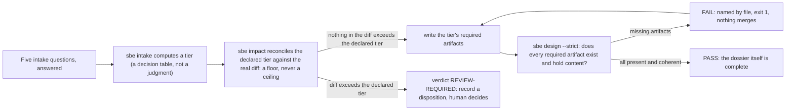

# The first loop

## Where a change starts

Chapter one named a gap: the pipeline said it wrote 3 rows, and the file it
wrote held 2. This chapter does not close that gap yet; it starts the loop
that eventually will, and the loop does not start with code. It starts with
five questions.

Say an engineer is about to touch `docs/book/estate/pipeline.py`, the same
file behind that mismatch: not to fix the row count yet, just to change how it
reads its source. That is a change to a file interface other things depend
on, and before it gets written, the tool wants to know how big a change this
actually is.

## Intake: five questions, one tier

`sbe intake` asks the five questions and computes a tier from the answers.
Nothing about the tier is negotiable in the moment; it is a decision table,
not a judgment call, so two engineers answering the same five questions the
same way land on the same tier every time.

```bash
rm -rf /tmp/sbe-book-ch05-dossier && mkdir -p /tmp/sbe-book-ch05-dossier
printf 'y\nn\ny\nn\nsome\n' | bin/sbe intake /tmp/sbe-book-ch05-dossier
```

```
Does this change a data model, an API contract, or a file interface others depend on? (y/n) Does it cross a service, system, or team boundary? (y/n) Is it reversible in under an hour? (y/n) Does it touch money, partner data, personal data, or production state? (y/n) How many downstream consumers break if it is wrong? (none/some/many) tier T2 (artifacts required: 01, 02, 03, 05, 06, 07) written to /tmp/sbe-book-ch05-dossier/00-intake.json
To override this tier, edit that file and set all three fields: "tier" (the tier you are moving to), "override" (the same tier, declaring the move), and "override_reason" (at least 3 words and 12 characters). A move with any of the three missing or disagreeing FAILs the design check as an edit rather than an override.
```

Five answers: yes, it changes a file interface; no, it does not cross a
boundary; yes, it is reversible in under an hour; no, nothing sensitive; some
downstream consumers break if it is wrong. Feed those into
`tools/sbe_intake.py`'s own rule (`compute_tier`, `tools/sbe_intake.py`
lines 86 to 100) and the highest matching rule wins: touching a contract is
enough on its own to land T2, regardless of how the other four answers read.
T2 owes six artifacts, named in the line above: `01-purpose.md`,
`02-process.md`, `03-adr.md`, `05-data-model.md`, `06-diagrams.md`,
`07-verification.md`.

Declaring a tier is not evidence of anything yet. It is a claim about how much
evidence this change owes, written to `00-intake.json`, nothing more.

## sbe impact: a floor, never a ceiling

Before a single artifact gets written, `sbe impact` checks the declared tier
against what the diff actually shows, using the same detectors and the same
`compute_tier` rule the intake step used, so the two can never silently
disagree about what a T2 even means. Run against this repository's own
current diff, with the T2 intake just written:

```bash
bin/sbe impact . --intake /tmp/sbe-book-ch05-dossier/00-intake.json
```

```
git diff 47422a88df57..HEAD over 2 changed file(s)
  UNMEASURED CHECKSUMS.sha256: no detector covers .sha256 files; this tool did not read it and is not reporting it as clean
  UNMEASURED consumers: how many downstream things break if this is wrong cannot be read from a diff. Assumed 'none', which can only lower the proposal, never raise it.

proposed tier T0 (a floor, not a ceiling), declared tier T2
verdict: PASS
```

Read `proposed tier T0` carefully next to `declared tier T2`: the diff itself
does not contain anything the detectors recognize as contract-shaped,
sensitive, or a crossed boundary, so on the evidence in front of it, this tool
would only ever propose T0. It does not lower the declared T2 to match. The
module's own docstring says why in one line worth repeating:
"this tool may say a change is bigger than the human claimed. It may never
say a change is smaller" (`src/brothersbe/impact.py`, lines 26 to 29). A
proposed tier under the declared one is not a disagreement to resolve; it is
exactly what "floor, not ceiling" is supposed to look like, and the verdict
reads `PASS` because nothing here contradicts what was declared.

If the diff had touched something the detectors do recognize, a migration
file, a payment path, an OpenAPI contract, and the declared tier had not
accounted for it, the verdict would read `REVIEW-REQUIRED` instead, and the
tool would refuse to move forward silently in either direction: not lowering
a human's tier, and not raising one behind their back either, only naming the
disagreement and asking for a recorded decision.

## The first gate, and it FAILs

Here is where the loop stops being paperwork. The intake declared T2. T2 owes
six artifacts. None of them exist yet, because the engineer has not written
the brief, only answered five questions about it. Run the design check
against that same dossier, strict, the way protected CI would run it:

```bash
bin/sbe design /tmp/sbe-book-ch05-dossier --strict
```

```
BROTHERSBE DESIGN CHECKS  (advisory unless --strict; NO-DATA is never a pass; WAIVED is not a pass either)
  scope      -        read 1 dossier under /tmp/sbe-book-ch05-dossier (.); 0 of 0 director(y/ies) directly under /tmp/sbe-book-ch05-dossier contributed no dossier
  dossier: . (under /tmp/sbe-book-ch05-dossier)
  artifacts  FAIL     tier T2 requires 01, 02, 03, 05, 06, 07; missing: 01-purpose.md, 02-process.md, 03-adr.md, 05-data-model.md, 06-diagrams.md, 07-verification.md; examined . under /tmp/sbe-book-ch05-dossier [severity: gate]
  adr        NO-DATA  no 03-adr.md in this dossier; examined . under /tmp/sbe-book-ch05-dossier [severity: gate]
  datamodel  NO-DATA  no 05-data-model.md in this dossier; examined . under /tmp/sbe-book-ch05-dossier [severity: gate]
  diagrams   NO-DATA  no 06-diagrams.md in this dossier; examined . under /tmp/sbe-book-ch05-dossier [severity: gate]
  placeholder NO-DATA  no dossier artifacts here, so nothing to check for unfilled template sections; examined . under /tmp/sbe-book-ch05-dossier [severity: gate]
STRICT: 1 design check(s) failed; exiting nonzero to block the merge.
```

Exit code 1. The `artifacts` line is the one that matters, and it is printed
from `tools/sbe_design.py` line 706, inside `check_artifacts`
(`tools/sbe_design.py`, starting at line 543): `tier T2 requires 01, 02, 03,
05, 06, 07; missing:` followed by every file name this dossier does not have
yet. The other four checks read `NO-DATA`, not `FAIL`, and that distinction
matters exactly as much here as it did in chapter three: `adr`, `datamodel`
and `diagrams` have nothing to examine, because the file each one reads does
not exist, so each says so by name instead of guessing at a verdict from
nothing.

This is not the tool being difficult. Answering five questions about a change
and writing the change itself are two different acts, and this gate is the
thing standing between them. Nothing here says the engineer's plan is bad;
nothing here has even been read yet. It says, mechanically, that a T2 change
owes six specific files and none of them are on disk, and it will keep saying
that, every time this command runs, until they are. That refusal is not a
delay this project apologizes for. It is the entire reason `00-intake.json`
alone was never allowed to count as a dossier: a tier is a claim about how
much evidence a change owes, and a claim is not the evidence itself.

## The loop, end to end



The loop this chapter opened does not end at a `FAIL`. It ends when the six
files this T2 owes actually exist, say something real, and the same command
returns `PASS` instead. The next chapter does not write those six files
either; it goes further downstream, to the receipts a T2 change eventually
has to produce once the dossier is done, and to what those receipts do, and
do not, prove.
