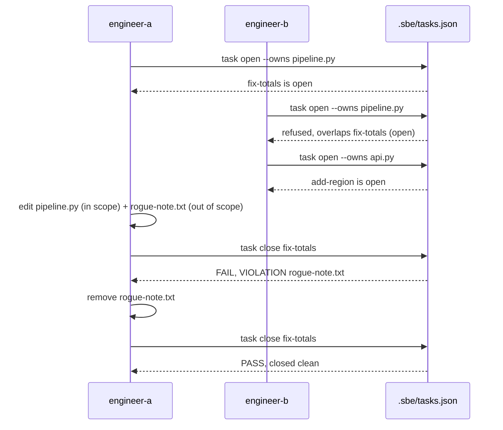

# The task registry

## The gap a hook cannot close

A pre-write hook can watch the keyboard. It cannot watch the shell. That is
not a bug in this project's fence hook, it is a stated limit of it: a
PreToolUse hook fails open and cannot govern a raw shell command, because
shell cannot be parsed reliably, so a writer who edits through `bash` walks
straight past the only control standing in front of the keyboard. The task
registry is the answer that does not try to parse the shell at all. `sbe task
open` records what a writer declared it owns, before it writes anything, and
`sbe task close` reads the actual git diff and refuses to close a task whose
tree changed outside that declaration. The shell is never parsed. The diff is
simply read, after the fact, which is the one thing nothing can dodge.

This chapter runs that registry against a throwaway copy of the estate, not
this repository's own working copy: this book's own repository is mid-loop
right now, with real uncommitted work sitting in it from earlier chapters, and
a live ownership demo run against that noise would be swamped by files
nobody here declared anything about. A seeded, single-commit copy of
`pipeline.py` and `api.py` gives two engineers a clean tree to actually
disagree over, and every command below is the real `sbe` binary from this
repository, pointed at it with `--cwd`.

## Seeding a clean copy of the estate

```bash
ROOT="$(pwd)"
rm -rf /tmp/sbe-book-ch07-repo && mkdir -p /tmp/sbe-book-ch07-repo
cd /tmp/sbe-book-ch07-repo
git init -q
git config user.email "estate@example.invalid"
git config user.name "Estate Seed"
cp "$ROOT/docs/book/estate/pipeline.py" .
cp "$ROOT/docs/book/estate/api.py" .
git add pipeline.py api.py
export GIT_AUTHOR_NAME="Estate Seed" GIT_AUTHOR_EMAIL="estate@example.invalid"
export GIT_COMMITTER_NAME="Estate Seed" GIT_COMMITTER_EMAIL="estate@example.invalid"
export GIT_AUTHOR_DATE="2026-07-01T00:00:00" GIT_COMMITTER_DATE="2026-07-01T00:00:00"
git commit -q -m "seed the fence demo with a copy of the estate"
BASE="$(git rev-parse HEAD)"
echo "base commit $BASE"
```

```
base commit 0b137953313d7ddb7dbcba21a247a35b7387c630
```

One commit, two files, a fixed author date so this same commit hashes the
same way every time this page is rebuilt. `--base` to `sbe task open` has to
be a full 40-character commit sha, never a branch name, because a branch
means something different tomorrow and a postcondition read against a moving
target compares against nothing.

## One fence: engineer-a opens, engineer-b collides

Engineer-a is about to touch `pipeline.py`. It declares that, and only that,
before writing a line:

```bash
python3 "$ROOT/bin/sbe" task open --id fix-totals --agent engineer-a --role writer --base "$BASE" --verify "python3 pipeline.py --date 2026-07-01" --owns pipeline.py --cwd .
```

```
sbe task open: fix-totals is open. engineer-a (writer) owns 1 path(s): pipeline.py. Base 0b137953313d. Close runs the diff postcondition against exactly this declaration.
```

Engineer-b, working the same estate at the same time, reaches for the same
file:

```bash
python3 "$ROOT/bin/sbe" task open --id add-region --agent engineer-b --role writer --base "$BASE" --verify "python3 api.py 2026-07-01" --owns pipeline.py --cwd . 2>&1
```

```
sbe task open: refused. Owned path 'pipeline.py' overlaps 'pipeline.py', owned by open task 'fix-totals' (agent engineer-a). One writer per file; queue behind it or narrow the claim.
```

That refusal happens at `open`, before engineer-b's task exists in the
registry at all, checked in `cmd_open` against every other currently open
task's owned paths (`src/brothersbe/tasks.py`, lines 298 to 307). One writer
per file is the whole rule, stated exactly that plainly in the refusal
itself. Engineer-b narrows the claim to the file it actually needs:

```bash
python3 "$ROOT/bin/sbe" task open --id add-region --agent engineer-b --role writer --base "$BASE" --verify "python3 api.py 2026-07-01" --owns api.py --cwd .
```

```
sbe task open: add-region is open. engineer-b (writer) owns 1 path(s): api.py. Base 0b137953313d. Close runs the diff postcondition against exactly this declaration.
```

```bash
python3 "$ROOT/bin/sbe" task check --cwd .
```

```
sbe task check: no owned-path overlap among 2 open task(s). This scans the registry; it says nothing about writers who never registered.
```

`sbe task check` re-runs the same overlap scan across the whole registry, on
demand, which is how a collision written into the file by hand would be
caught too, not only one introduced through `open`. The line it closes on is
worth reading twice: this scans the registry. A writer who never runs `sbe
task open` in the first place is invisible to it, and only the advisory,
fail-open hook stands in front of that writer. The registry is the
after-the-fact half of a two-layer model, not a replacement for the hook.

## A write outside scope, caught at close

Engineer-a does the actual work: a real edit inside `pipeline.py`, exactly
where it said it would write, and then, by mistake, a second file it never
declared:

```bash
sed -i.bak "s/one output table/one output table (row count fixed 2026-07-29)/" pipeline.py && rm pipeline.py.bak
echo "oops, wrong file" > rogue-note.txt
python3 "$ROOT/bin/sbe" task close fix-totals --cwd .
```

```
  IN-SCOPE   pipeline.py
  VIOLATION  rogue-note.txt
sbe task close fix-totals: FAIL. 1 changed path(s) outside the declaration, listed above by name. The shell was never parsed; the diff was read. The task stays open. Close with --force --who --why to record a disposition, never to make this clean.
```

`postcondition` (`src/brothersbe/tasks.py`, starting at line 236) reads
`changed_paths`, the union of the committed diff against `--base` and
`git status --porcelain -uall` in the task's own tree, and sorts every
changed path into two buckets: inside the declared ownership, or not. One
path fell outside: `rogue-note.txt`, a file `fix-totals` never claimed. The
task stays open. Nothing here forced a clean close, and `--force` is
available but pointedly does not make this PASS; it records who overrode it
and why, and the close is marked `FORCED`, never clean, in the registry
itself.

The honest fix is the same one a person would actually take: undo the stray
write, then close again.

```bash
rm rogue-note.txt
python3 "$ROOT/bin/sbe" task close fix-totals --cwd .
```

```
  IN-SCOPE   pipeline.py
sbe task close fix-totals: PASS. 1 changed path(s), all inside the declaration. Closed clean.
```

One changed path, `pipeline.py`, exactly the file this task declared. Nothing
about that first `FAIL` was a false alarm to work around; it was the
postcondition doing precisely what it exists to do, catching a change the
tree actually made that the declaration never covered, the same defect a
parsed-shell hook cannot reach. `sbe task list` and one more `sbe task check`
confirm what is left:

```bash
python3 "$ROOT/bin/sbe" task list --cwd .
```

```
add-region           engineer-b writer   base 0b137953313d  owns: api.py
1 open task(s). Expiry is informational: nothing here deletes on a clock.
```

```bash
python3 "$ROOT/bin/sbe" task check --cwd .
```

```
sbe task check: no owned-path overlap among 1 open task(s). This scans the registry; it says nothing about writers who never registered.
```

`fix-totals` is closed, so `list` no longer shows it; `add-region` is still
open, still owns exactly `api.py`, and the registry still carries no
collision.

## The fence, drawn once



## What this registry does not do

Everything above happened inside a registry that both engineers actually
used. Nothing here stops an actor who never runs `sbe task open` at all; the
overlap check and the reviewer-separation refusal (a reviewer task may not
own the evidence store it would go on to review) both operate strictly
inside the registry, and a writer editing through a shell that never
registers is invisible to both, seen only by the advisory hook in front of
it. Concurrent writes to the registry file itself are last-write-wins, not
locked, because the rewrite is atomic and this project chose no daemon over a
lock nobody asked for. And `expiry` deletes nothing on a clock; a stale open
task is a line a human reads in `sbe task list`, forever, until somebody
closes it. None of that is hidden in this tool's output: read the closing
line of `sbe task check` again, it says exactly what the scan does not cover,
every time it runs. The next chapter goes further downstream still, to the
gate a change meets once its dossier and its receipts are both in hand, and
to what it takes to make that gate change its mind.
