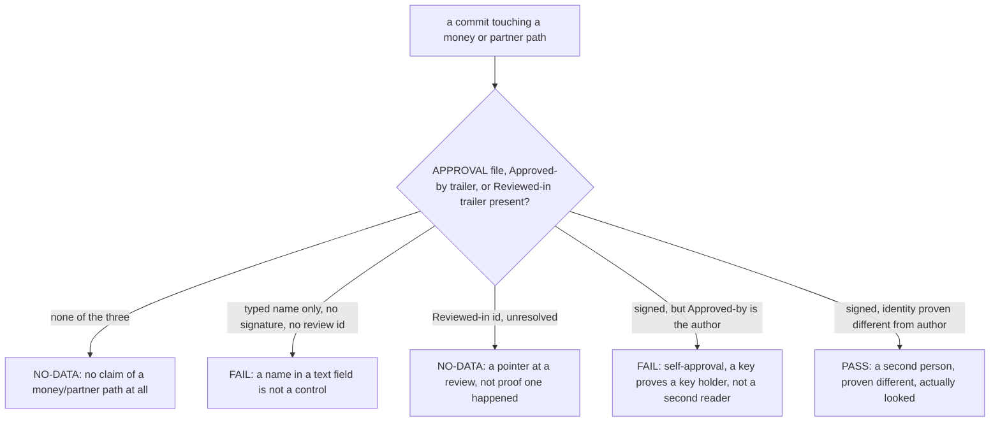

# Gates and decisions

## The fourth question, now with a real gate behind it

Chapter five's intake asked five questions and stopped at a tier. The
fourth one reads: "Does it touch money, partner data, personal data, or
production state?" Answer yes to that one, or answer no to "is it
reversible in under an hour," and `compute_tier` (`tools/sbe_intake.py`,
lines 97 to 98) returns the highest tier this project has, T3, before it
even looks at the other three answers. A T3 change owes seven artifacts.
None of them is what actually stops a money-path change from merging.

The dossier gates from chapter five check whether a claim was written down.
A second, separate family checks something a written paragraph cannot
prove: whether a specific human, provably not the author, actually looked.
`sbe gate approval` is that check. It reads no dossier at all; its inputs
are an `APPROVAL` file (`tools/sbe_gate.py` line 96, `APPROVAL_FILE`) and
the current commit's own trailers, read straight from git
(`gate_approval`, `tools/sbe_gate.py`, starting at line 918). This chapter
runs it for real, on a change shaped exactly like the one that fourth
question is asking about.

## Seeding the change

Same reason as chapter seven: this book's own repository is mid-loop right
now, so the demo runs against a seeded, single-commit copy of `api.py`
instead of the live tree.

```bash
ROOT="$(pwd)"
rm -rf /tmp/sbe-book-ch08-repo && mkdir -p /tmp/sbe-book-ch08-repo
cd /tmp/sbe-book-ch08-repo
git init -q
git config user.email "estate@example.invalid"
git config user.name "Estate Seed"
cp "$ROOT/docs/book/estate/api.py" .
git add api.py
export GIT_AUTHOR_NAME="Estate Seed" GIT_AUTHOR_EMAIL="estate@example.invalid"
export GIT_COMMITTER_NAME="Estate Seed" GIT_COMMITTER_EMAIL="estate@example.invalid"
export GIT_AUTHOR_DATE="2026-07-01T00:00:00" GIT_COMMITTER_DATE="2026-07-01T00:00:00"
git commit -q -m "seed the approval demo with a copy of the estate api"
BASE="$(git rev-parse HEAD)"
echo "base commit $BASE"
```

```
base commit 68667c89c2017183ad1a01c16e3898cf94199924
```

## The change, and the claim written beside it

The engineer's actual change adds a partner's cut of each region's total to
the API's response:

```python
    for row in rows:
        row["partner_payout_eur"] = round(row["total_eur"] * 0.10, 2)
    return 200, {"date": date, "rows": rows}, "ok"
```

That is a money and partner-data change by any reading of intake question
four, so it owes an `APPROVAL` file. The engineer writes one, then commits
both files with an ordinary message, no trailer:

```bash
python3 - <<'PATCH'
path = "api.py"
text = open(path).read()
old = '    return 200, {"date": date, "rows": rows}, "ok"'
new = ('    for row in rows:\n'
       '        row["partner_payout_eur"] = round(row["total_eur"] * 0.10, 2)\n'
       '    return 200, {"date": date, "rows": rows}, "ok"')
assert old in text
open(path, "w").write(text.replace(old, new, 1))
PATCH
printf 'Approved by Dana Reviewer\n' > APPROVAL
git add api.py APPROVAL
export GIT_AUTHOR_NAME="Engineer A" GIT_AUTHOR_EMAIL="engineer-a@example.invalid"
export GIT_COMMITTER_NAME="Engineer A" GIT_COMMITTER_EMAIL="engineer-a@example.invalid"
export GIT_AUTHOR_DATE="2026-07-02T00:00:00" GIT_COMMITTER_DATE="2026-07-02T00:00:00"
git commit -q -m "add partner payout share to the totals API"
echo "committed $(git rev-parse HEAD)"
```

```
committed fe8c04d73714c06d6daf209dae473bc476139e97
```

Read the `APPROVAL` file's own content again: `Approved by Dana Reviewer`.
Somebody believed a sentence with a name in it was the approval. It is the
single most common shape of a broken money-path claim this project has
seen, which is exactly why this gate exists.

## The gate, and its refusal

```bash
python3 "$ROOT/bin/sbe" gate approval .
```

```
BROTHERSBE HARD GATES  (advisory unless --strict; NO-DATA is never a pass; WAIVED is not a pass either)
  approval  FAIL     APPROVAL (of 1 APPROVAL file(s) read) declares 'Approved by Dana Reviewer', but approval is a typed name with no signature or review id; a name in a text field is not a control (add a signed Approved-by trailer or a Reviewed-in review id) [severity: gate]
```

Read that line whole, because nothing about it is vague. It names the file
it read, quotes the claim it refused, verbatim, and states the rule in one
clause: a name in a text field is not a control. That sentence is
`tools/sbe_gate.py` line 1266, printed exactly, over the exact content this
`APPROVAL` file carried. The gate never asked whether Dana Reviewer is a
real person, whether the payout math is right, or whether the change is a
good idea. It asked one narrower question: is there evidence, bound to this
commit, that a second person looked. There was not.

This same function also refuses a signed commit whose Approved-by name
matches its own author, self-approval by a different route
(`tools/sbe_gate.py`, the guard starting at line 57 and applied at the
signed-commit branches from line 990 onward): a key holder proves a key
holder signed, never that a second party read the change. Nothing in this
scene reaches that branch, because nothing here is signed yet, but it is
the same law from a different angle: approval means a second person, proven
different from the first, not a stronger-looking version of the first
person's own claim.

## What flips FAIL to NO-DATA, and what it still is not

The keyless path this project actually offers is a `Reviewed-in` trailer:
a pointer at a review that happened somewhere this gate cannot reach.
Amend the commit to carry one:

```bash
export GIT_AUTHOR_NAME="Engineer A" GIT_AUTHOR_EMAIL="engineer-a@example.invalid"
export GIT_COMMITTER_NAME="Engineer A" GIT_COMMITTER_EMAIL="engineer-a@example.invalid"
export GIT_AUTHOR_DATE="2026-07-02T00:00:00" GIT_COMMITTER_DATE="2026-07-02T00:00:00"
git commit -q --amend -m "add partner payout share to the totals API

Reviewed-in: PR-4821"
echo "amended $(git rev-parse HEAD)"
```

```
amended 9a2576ae1e352fbca0eed8f49586e39bf0f92563
```

```bash
python3 "$ROOT/bin/sbe" gate approval .
```

```
BROTHERSBE HARD GATES  (advisory unless --strict; NO-DATA is never a pass; WAIVED is not a pass either)
  approval  NO-DATA  commit records Reviewed-in: PR-4821. This gate read a trailer out of a commit message and does not resolve the id against any review platform, so it points a human at a review rather than proving one happened. That is a pointer, not a control: resolve the id in CI (a job that queries your review platform) or sign the commit, and this becomes a verdict [severity: gate]
```

That is real movement, FAIL to NO-DATA, and it is worth being precise about
what moved. `PR-4821` is no longer a typed claim sitting in a file this
gate never opened for its verdict; it is a trailer bound to this exact
commit. What did not move: NO-DATA is not a pass, stated in the report's
own header every time this gate runs. This gate cannot follow the id
anywhere, so it reports a pointer honestly rather than a verdict it cannot
back.

Reaching an actual PASS needs a signed commit, an `Approved-by` trailer
naming an identity, and that identity proven different from the commit's
author, by a signature this host can verify against a trusted key
(`tools/sbe_gate.py`, the branches from line 1204 onward). This book will
not fabricate that here, for the same reason the project's own honesty
suite will not: signing a commit for the demo would prove something about
this machine's keyring, not about the gate, and the module says so of
itself, word for word, next to its own worked fixture: "this gate reaches
PASS only on a commit whose signature THIS HOST verified, and no fixture
can produce one" (`tools/sbe_gate.py`, lines 1382 to 1384). A CI job
resolving the `Reviewed-in` id against a real review platform is the other
route to a verdict, and it is exactly what "resolve the id in CI" in the
refusal above is pointing at.

## What is not here yet

The refusal line above is the entire explanation this loop ships: one
sentence, naming the file, the claim, and the rule. A browsable,
regenerable decision package per gate FAIL, with the deciding code quoted
by file and line, the check's own logic as a diagram, and a review
checklist an engineer walks before deciding, `sbe explain` and the packages
under `design/<project>/decisions/`, ships in a later loop. So does `sbe
lineage`, which would let a reader walk from this `APPROVAL` file forward
to every commit, note, and decision that ever touched it. Neither command
exists in this release; nothing above pretends otherwise.

## The approval gate's shape



The next chapter steps back from one gate on one commit to the shape of the
whole loop around it: what the five stages actually are, when a loop has
genuinely converged, and the honest version of when it has not.
