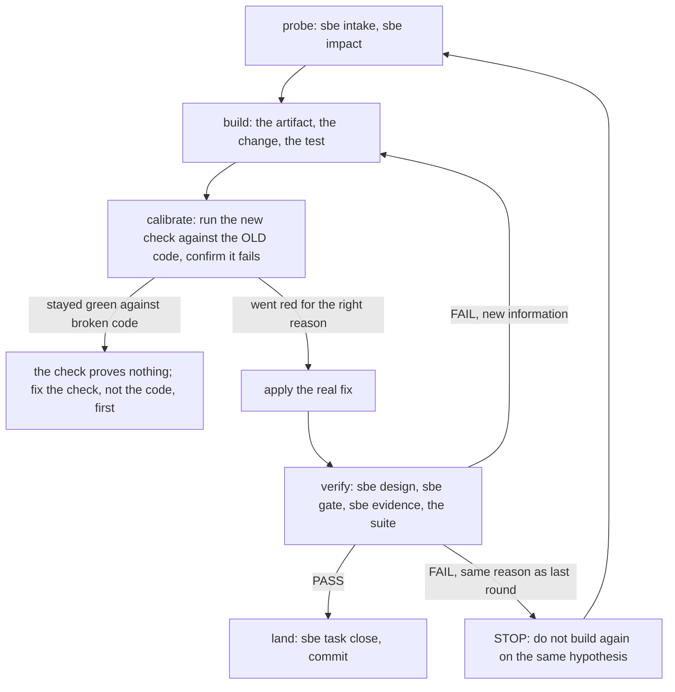

# Loops that converge

## Five stages, not five new commands

Every chapter since four has actually been walking one shape, five times
over, without ever naming it. Probe: find out how big the change is, before
writing any of it (`sbe intake`, `sbe impact`, chapter five). Build: write
the artifacts the tier owes, and the change itself (chapter five's dossier,
chapter eight's code). Calibrate: before trusting a new check to tell you
the truth, prove it can say no. Verify: the gates and the receipts read
back what actually happened (`sbe design`, `sbe gate`, `sbe evidence`,
chapters five, six, eight). Land: declare what you own, close against the
real diff, and commit (`sbe task`, chapter seven).

Calibrate is the one this book has shown only from the outside. This
project's own bypass suite states the practice plainly: "a fixture nobody
has seen fail proves nothing. Every fixture ... was calibrated the same
way: break the control it targets in the tool, confirm the fixture goes
red, restore the tool, confirm it goes green" (`docs/BYPASS-COVERAGE.md`,
"How the fixtures were calibrated"). That is not a rule for this project's
own test suite alone. It is what makes any new check, anywhere, worth
trusting: a regression test that has never been watched failing is a test
nobody has proven tests anything.

This chapter runs the whole shape once, on a real defect this book has
been carrying since chapter one.

## Probe: five questions, again, on a different change

The change this time is smaller and quieter than chapter five's or eight's:
fix the log line, not the schema. Reversible in seconds, touches nothing
sensitive, changes no contract, crosses no boundary. What still lands it
above T0: something downstream, a monitoring script, greps this exact
line, so a wrong answer here breaks something, even if only one something.

```bash
rm -rf /tmp/sbe-book-ch09-dossier && mkdir -p /tmp/sbe-book-ch09-dossier
printf 'n\nn\ny\nn\nsome\n' | bin/sbe intake /tmp/sbe-book-ch09-dossier
```

```
Does this change a data model, an API contract, or a file interface others depend on? (y/n) Does it cross a service, system, or team boundary? (y/n) Is it reversible in under an hour? (y/n) Does it touch money, partner data, personal data, or production state? (y/n) How many downstream consumers break if it is wrong? (none/some/many) tier T1 (artifacts required: 01) written to /tmp/sbe-book-ch09-dossier/00-intake.json
To override this tier, edit that file and set all three fields: "tier" (the tier you are moving to), "override" (the same tier, declaring the move), and "override_reason" (at least 3 words and 12 characters). A move with any of the three missing or disagreeing FAILs the design check as an edit rather than an override.
```

T1, not T2 or T3 this time. `REQUIRED` (`tools/sbe_intake.py` line 106)
owes T1 exactly one artifact, `01-purpose.md`. A floor sized to the change
is the whole point of a decision table over a judgment call: this loop
does not owe six artifacts because nobody felt like writing one.

## Build: the one artifact this tier owes

```bash
cat > /tmp/sbe-book-ch09-dossier/01-purpose.md <<'EOF'
# Purpose

## What this changes

`pipeline.py` prints `wrote N rows to daily_totals` after every run. The count
it prints is one higher than the number of rows actually written to
`daily_totals.json`: the message counts a phantom header row that the JSON
output never had. This change removes the phantom count so the printed
number matches the file on disk.

## Why now

A monitoring script greps this exact line to confirm the nightly run wrote
something. It has never caught the mismatch, because the message has never
been zero, only wrong by one. The fix is small; the confusion it has been
quietly seeding is not.

## Stakeholders

Whoever reads the nightly log line, and whoever next debugs a row-count
question against this pipeline without knowing the log has been lying by
exactly one since the file was first written.
EOF
bin/sbe design /tmp/sbe-book-ch09-dossier --strict
```

```
BROTHERSBE DESIGN CHECKS  (advisory unless --strict; NO-DATA is never a pass; WAIVED is not a pass either)
  scope      -        read 1 dossier under /tmp/sbe-book-ch09-dossier (.); 0 of 0 director(y/ies) directly under /tmp/sbe-book-ch09-dossier contributed no dossier
  dossier: . (under /tmp/sbe-book-ch09-dossier)
  artifacts  PASS     tier T1: every required artifact present, carrying content, and naming subject matter the rest of this dossier also names; except 01-purpose.md, which this dossier has nothing else to be coherent with, so that was not checked; examined . under /tmp/sbe-book-ch09-dossier [severity: gate]
  adr        NO-DATA  no 03-adr.md in this dossier; examined . under /tmp/sbe-book-ch09-dossier [severity: gate]
  datamodel  NO-DATA  no 05-data-model.md in this dossier; examined . under /tmp/sbe-book-ch09-dossier [severity: gate]
  diagrams   NO-DATA  no 06-diagrams.md in this dossier; examined . under /tmp/sbe-book-ch09-dossier [severity: gate]
  placeholder PASS     1 artifact(s) present, none still carrying an unfilled-template marker; examined . under /tmp/sbe-book-ch09-dossier [severity: gate]
```

The dossier side of build is done. The code side needs a seeded copy of
the estate, the same reason as every scratch demo in this book: the real
tree is mid-loop.

```bash
ROOT="$(pwd)"
rm -rf /tmp/sbe-book-ch09-repo && mkdir -p /tmp/sbe-book-ch09-repo
cd /tmp/sbe-book-ch09-repo
git init -q
git config user.email "estate@example.invalid"
git config user.name "Estate Seed"
cp "$ROOT/docs/book/estate/pipeline.py" .
cp "$ROOT/docs/book/estate/api.py" .
cp "$ROOT/docs/book/estate/test_estate.py" .
git add pipeline.py api.py test_estate.py
export GIT_AUTHOR_NAME="Estate Seed" GIT_AUTHOR_EMAIL="estate@example.invalid"
export GIT_COMMITTER_NAME="Estate Seed" GIT_COMMITTER_EMAIL="estate@example.invalid"
export GIT_AUTHOR_DATE="2026-07-01T00:00:00" GIT_COMMITTER_DATE="2026-07-01T00:00:00"
git commit -q -m "seed the second-loop demo with a copy of the estate"
BASE="$(git rev-parse HEAD)"
echo "base commit $BASE"
```

```
base commit 287266c07f9d903cdee2774f171d693084f78fee
```

Chapter seven's own scratch commit, against this very file, claimed in a
comment that the row count was "fixed 2026-07-29." Read that claim again
for what it actually was: a docstring edit, `one output table` renamed to
`one output table (row count fixed 2026-07-29)`, next to a `wrote %d rows`
line that never changed. A comment saying something is fixed is exactly
the kind of claim this whole book teaches a reader not to trust unchecked.
It was not fixed. This is where it actually gets fixed, and the fix ships
with a test, not a comment.

```bash
python3 - <<'PATCH'
path = "test_estate.py"
text = open(path).read()
old = '''    def test_the_api_refuses_before_the_pipeline_ran(self):
        out = subprocess.run([sys.executable, os.path.join(HERE, "api.py"),
                              "2026-07-01"], capture_output=True, text=True)
        self.assertEqual(out.returncode, 1)
        self.assertIn("run pipeline.py first", out.stdout)


if __name__ == "__main__":'''
new = '''    def test_the_api_refuses_before_the_pipeline_ran(self):
        out = subprocess.run([sys.executable, os.path.join(HERE, "api.py"),
                              "2026-07-01"], capture_output=True, text=True)
        self.assertEqual(out.returncode, 1)
        self.assertIn("run pipeline.py first", out.stdout)

    def test_the_wrote_line_matches_the_rows_actually_on_disk(self):
        out = self._pipeline("2026-07-01")
        with open(os.path.join(HERE, "daily_totals.json")) as fh:
            rows_on_disk = len(json.load(fh))
        printed = int(out.stdout.strip().splitlines()[-1].split()[1])
        self.assertEqual(printed, rows_on_disk,
                          "the pipeline claimed %d row(s) but wrote %d" % (printed, rows_on_disk))


if __name__ == "__main__":'''
assert old in text
open(path, "w").write(text.replace(old, new, 1))
PATCH
```

That new test reads the number the pipeline printed and the number of rows
actually in the file, and asserts they agree. Nothing about it hardcodes
"2": it checks the invariant chapter one actually cares about, not one
run's magic number.

## Calibrate: prove the test can say no before it says yes

```bash
python3 test_estate.py TestEstate.test_the_wrote_line_matches_the_rows_actually_on_disk 2>&1 | sed -E 's/[0-9]+\.[0-9]+s/<N.NNNs>/'
```

```
test_the_wrote_line_matches_the_rows_actually_on_disk (__main__.TestEstate) ... FAIL

======================================================================
FAIL: test_the_wrote_line_matches_the_rows_actually_on_disk (__main__.TestEstate)
----------------------------------------------------------------------
Traceback (most recent call last):
  File "/private/tmp/sbe-book-ch09-repo/test_estate.py", line 52, in test_the_wrote_line_matches_the_rows_actually_on_disk
    self.assertEqual(printed, rows_on_disk,
AssertionError: 3 != 2 : the pipeline claimed 3 row(s) but wrote 2

----------------------------------------------------------------------
Ran 1 test in <N.NNNs>

FAILED (failures=1)
```

Read the assertion message: `3 != 2 : the pipeline claimed 3 row(s) but
wrote 2`. That is chapter one's own gap, caught by a test that has never
once been trusted with a PASS yet. A test that goes green on its first run
against unfixed code has proven nothing about the code; it has only proven
it can return 0. This one just proved it can return 1, against the exact
defect it exists to catch, which is the only thing that makes its later
green worth anything.

## Verify: the fix, and every check that reads it back

```bash
python3 - <<'PATCH'
path = "pipeline.py"
text = open(path).read()
old = '    sys.stdout.write("wrote %d rows to daily_totals\\n" % (len(rows) + 1))'
new = '    sys.stdout.write("wrote %d rows to daily_totals\\n" % len(rows))'
assert old in text
open(path, "w").write(text.replace(old, new, 1))
PATCH
rm -f daily_totals.json orders.csv
python3 pipeline.py --date 2026-07-01
```

```
read 3 orders from orders.csv
aggregated 2 region(s) for 2026-07-01
wrote 2 rows to daily_totals
```

```bash
rm -f daily_totals.json orders.csv
python3 test_estate.py 2>&1 | sed -E 's/[0-9]+\.[0-9]+s/<N.NNNs>/'
```

```
test_a_date_with_no_orders_writes_no_rows (__main__.TestEstate) ... ok
test_the_api_refuses_before_the_pipeline_ran (__main__.TestEstate) ... ok
test_the_api_serves_what_the_pipeline_wrote (__main__.TestEstate) ... ok
test_the_pipeline_totals_by_region (__main__.TestEstate) ... ok
test_the_wrote_line_matches_the_rows_actually_on_disk (__main__.TestEstate) ... ok

----------------------------------------------------------------------
Ran 5 tests in <N.NNNs>

OK
```

Five tests now, the original four plus the one this loop added, all green.
The dossier already showed PASS above. One more piece of verify: a receipt
that this exact run happened, not a claim that it did.

```bash
BASE="$(git rev-parse HEAD)"
python3 "$ROOT/bin/sbe" task open --id fix-row-count-message --agent engineer-a --role writer --base "$BASE" --verify "python3 test_estate.py" --owns pipeline.py --owns test_estate.py --cwd .
```

```
sbe task open: fix-row-count-message is open. engineer-a (writer) owns 2 path(s): pipeline.py, test_estate.py. Base 287266c07f9d. Close runs the diff postcondition against exactly this declaration.
```

```bash
python3 "$ROOT/bin/sbe" evidence run --out /tmp/sbe-book-ch09-receipts/fix-receipt.json --covers pipeline.py --covers test_estate.py --cwd . -- python3 test_estate.py 2>/dev/null | sed -E 's/[0-9]+\.[0-9]+s/<N.NNNs>/'
```

```

sbe evidence run: receipt written to /tmp/sbe-book-ch09-receipts/fix-receipt.json. Trust LOCAL-ADVISORY (no SBE_CI_RUN_ID was set when this ran, so nothing outside the machine that wrote it attests to it). Command exited 0 in <N.NNNs>, over 2 covered file(s) from explicit --covers. stdout and stderr are recorded as digests only. argv held 0 secret-shaped token(s) and was recorded verbatim.
```

## Land: close the fence, commit the fix

```bash
rm -f daily_totals.json orders.csv
python3 "$ROOT/bin/sbe" task close fix-row-count-message --cwd .
```

```
  IN-SCOPE   pipeline.py
  IN-SCOPE   test_estate.py
sbe task close fix-row-count-message: PASS. 2 changed path(s), all inside the declaration. Closed clean.
```

```bash
export GIT_AUTHOR_NAME="Engineer A" GIT_AUTHOR_EMAIL="engineer-a@example.invalid"
export GIT_COMMITTER_NAME="Engineer A" GIT_COMMITTER_EMAIL="engineer-a@example.invalid"
export GIT_AUTHOR_DATE="2026-07-03T00:00:00" GIT_COMMITTER_DATE="2026-07-03T00:00:00"
git add pipeline.py test_estate.py
git commit -q -m "stop the wrote-rows line from overcounting by one"
echo "landed $(git rev-parse HEAD)"
```

```
landed 015ed64e23fbdf49d785f7f5285c95dfcc02f506
```

One probe, one build, one calibrate, one verify, one land. This loop
converged on the first pass, because the hypothesis (a phantom `+1`) was
right and the test that proved it was calibrated before it was trusted.
Not every loop is this clean, and the honest version of what happens when
it is not deserves its own space.

## When eight rounds is not diligence

Nothing in this project counts how many times a loop has run. `sbe task
list` shows a stale open task forever, not a warning at round five
(chapter seven); `sbe status` reports what is recorded, not how long it
took to get there (chapter three). That is a deliberate absence, not an
oversight, and it means the stopping rule for a loop that will not
converge is a human discipline, not a mechanical one. Nothing here will
stop a person, or an agent, from running verify an eighth time.

Here is the shape of that failure, stated plainly rather than dressed up:
eight rounds against the same `sbe gate` or `sbe
design --strict` command, same FAIL, same file named in the refusal, and
no change to the hypothesis between rounds. That is not eight attempts. It
is one wrong guess about the cause, asked eight times, because every gate
in this book gives a mechanical, immediate, unambiguous verdict, so there
is no fog to hide an unchanged hypothesis behind. Compare that against the
loop above: one calibrated red, one fix, one green. The difference was
never effort. It was whether the person running the loop changed what they
believed was wrong between rounds two and three, or just ran the same
command again hoping the answer would move on its own.

The rule this book will actually state: after a verify comes back with the
same refusal twice in a row for the same reason, stop building and go back
to probe. Read the refusal's own words again, the way chapter eight read
the approval gate's line word for word, and check whether the hypothesis
behind the last edit was even capable of fixing that sentence. If it was
not, a third identical round will not either. Revert to the last state
that verified clean, and either change the hypothesis or hand the decision
to somebody who can, the same way chapter eight's gate hands an unresolved
approval to a human rather than guessing past it.

## The loop, with the stopping rule drawn in



The next chapter turns from one loop to the record every loop leaves
behind: the vault, what a fresh session reads before it touches anything,
and why the team writes back to it instead of trusting memory.
