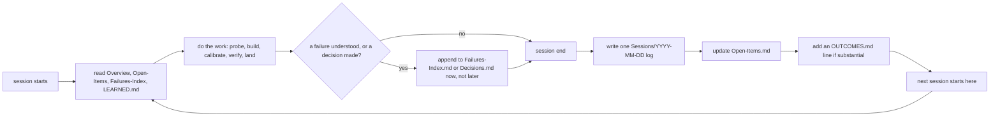

# The vault and memory

<!-- replay: chapter requires vault -->

## One environment variable, and what is honest about it being unset

Every session this tool touches ends, and the next one starts knowing
nothing unless something wrote it down first. `BROTHERSBE_VAULT` names
where that writing happens: one folder, on disk, that this project never
reaches for over a network, because it makes none. `sbe doctor` checks it
like every other environment fact, honestly, in a scratch identity so this
page names no real person's git configuration:

```bash
ROOT="$(pwd)"
rm -rf /tmp/sbe-book-ch10-repo && mkdir -p /tmp/sbe-book-ch10-repo
cd /tmp/sbe-book-ch10-repo
git init -q
git config user.email "estate@example.invalid"
git config user.name "Estate Seed"
env -u BROTHERSBE_VAULT BROTHERSBE_PRIVATE_NAMES_FILE=/tmp/sbe-book-ch10-repo/no-such-file python3 "$ROOT/bin/sbe" doctor
```

```
python           PASS     3.9.6 (floor is 3.9)
tools            PASS     all present in /Users/khalil.maaouni/Documents/BrotherSBE/tools
plugin-manifest  PASS     manifest 1.0.0-rc.3, VERSION 1.0.0-rc.3
git              PASS     working directory is inside a git tree
identity         PASS     git config reports name "Estate Seed" and email "estate@example.invalid"
vault            NO-DATA  BROTHERSBE_VAULT is unset, so telemetry, session logs and resume briefs have nowhere durable to go
private-names    NO-DATA  no private-name list, so the publish leak check scans nothing

sbe 1.0.0-rc.3, evidence schema 1.0. 7 check(s): 5 PASS, 0 FAIL, 2 NO-DATA.
```

Read `vault` the same way this book has read every other NO-DATA line since
chapter one: it does not mean the vault is broken, it means the question
has not been answered yet. Nothing here invents a folder or writes to the
default path quietly. The env var is unset, so `doctor` says so, and names
exactly what has nowhere durable to go because of it.

## Capture is off by default, and staying off is provable, not just claimed

Before pointing the variable anywhere, it is worth seeing what an
unpointed, entirely absent vault actually reports about itself. This is
the underlying tool, not the `sbe` facade: nothing under `COMMANDS` in
`src/brothersbe/cli.py` wraps it yet, so it is invoked the way this
project's own README invokes it, `python3 tools/sbe_telemetry.py`.

```bash
BROTHERSBE_VAULT=/tmp/sbe-book-ch10-repo/no-such-vault python3 "$ROOT/tools/sbe_telemetry.py" data-show
```

```
BROTHERSBE STORED DATA (vault /tmp/sbe-book-ch10-repo/no-such-vault)
  policy: corrections capture is off: BROTHERSBE_TELEMETRY_CORRECTIONS is not set, and every category is off by default
  policy: metrics capture is off: BROTHERSBE_TELEMETRY_METRICS is not set, and every category is off by default
  policy: transcript capture is off: BROTHERSBE_TELEMETRY_TRANSCRIPT is not set, and every category is off by default
  [metrics] /tmp/sbe-book-ch10-repo/no-such-vault/99-System/telemetry/outcomes.jsonl: absent, so nothing is stored at this path
  [metrics] /tmp/sbe-book-ch10-repo/no-such-vault/99-System/telemetry/ratings.jsonl: absent, so nothing is stored at this path
  [metrics] /tmp/sbe-book-ch10-repo/no-such-vault/99-System/telemetry/reviews.jsonl: absent, so nothing is stored at this path
  [corrections] /tmp/sbe-book-ch10-repo/no-such-vault/99-System/telemetry/corrections.jsonl: absent, so nothing is stored at this path
  [housekeeping] /tmp/sbe-book-ch10-repo/no-such-vault/99-System/telemetry/installed-skill-version-brothersbe: absent, so nothing is stored at this path
read 0 file(s), 5 path(s) absent, 0 that could not be measured, under /tmp/sbe-book-ch10-repo/no-such-vault/99-System/telemetry.
This lists this vault only. A backup, a mirror or a sync client may hold copies of any of it, and nothing here can see those.
```

Three categories, each named with the exact switch that would turn it on:
`metrics` (a per-session line of counts, no message text), `transcript`
(what feeds a resume brief), `corrections` (short, secret-redacted excerpts
of an operator's own messages). Every one reads off by default, and every
absent file is named and reported absent rather than silently skipped.
An organization that wants this decided for everyone, not per teammate,
sets `BROTHERSBE_TELEMETRY_DISABLE=1` or a `capture = off` line in
`/etc/brothersbe/telemetry-policy.conf`; either forces every category off
and no local switch can turn one back on (`SECURITY.md`, "The organization
override"). That is a policy control on a cooperating machine, stated as
exactly that and no stronger, not an enforcement wall against someone
running a patched copy of the script.

## Pointing the variable at durable storage

`memory-template/` in this repository is the starting shape of a vault,
copied once and filled in over time. Point `BROTHERSBE_VAULT` at a copy of
it and `doctor` reads a different answer:

```bash
cp -R "$ROOT/memory-template" /tmp/sbe-book-ch10-repo/vault
BROTHERSBE_VAULT=/tmp/sbe-book-ch10-repo/vault BROTHERSBE_PRIVATE_NAMES_FILE=/tmp/sbe-book-ch10-repo/no-such-file python3 "$ROOT/bin/sbe" doctor
```

```
python           PASS     3.9.6 (floor is 3.9)
tools            PASS     all present in /Users/khalil.maaouni/Documents/BrotherSBE/tools
plugin-manifest  PASS     manifest 1.0.0-rc.3, VERSION 1.0.0-rc.3
git              PASS     working directory is inside a git tree
identity         PASS     git config reports name "Estate Seed" and email "estate@example.invalid"
vault            PASS     /tmp/sbe-book-ch10-repo/vault
private-names    NO-DATA  no private-name list, so the publish leak check scans nothing

sbe 1.0.0-rc.3, evidence schema 1.0. 7 check(s): 6 PASS, 0 FAIL, 1 NO-DATA.
```

`vault` reads PASS, naming the path it found, nothing more. `doctor` does
not check that the vault has ever been written to; it checks that
something durable exists to write to. What is actually inside it is a
question for a different command.

```bash
find /tmp/sbe-book-ch10-repo/vault -type f -not -name '.DS_Store' | sort
```

```
/tmp/sbe-book-ch10-repo/vault/.gitignore
/tmp/sbe-book-ch10-repo/vault/10-Projects/_TEMPLATE/Decisions.md
/tmp/sbe-book-ch10-repo/vault/10-Projects/_TEMPLATE/Failures-Index.md
/tmp/sbe-book-ch10-repo/vault/10-Projects/_TEMPLATE/OUTCOMES.md
/tmp/sbe-book-ch10-repo/vault/10-Projects/_TEMPLATE/Open-Items.md
/tmp/sbe-book-ch10-repo/vault/10-Projects/_TEMPLATE/Overview.md
/tmp/sbe-book-ch10-repo/vault/10-Projects/_TEMPLATE/Sessions/YYYY-MM-DD-example.md
/tmp/sbe-book-ch10-repo/vault/50-Reference/operator-model.md
/tmp/sbe-book-ch10-repo/vault/LEARNED.md
/tmp/sbe-book-ch10-repo/vault/README.md
/tmp/sbe-book-ch10-repo/vault/TEAM-VAULT.md
```

## What each file is actually for

`memory-template/README.md` names the intent of every path in that tree;
this is not this book inventing a convention, it is that file, read:

- **`Overview.md`**: what the project is, its stack, and its invariants,
  the things a change must never break.
- **`Open-Items.md`**: what is still open, one line each, owner and next
  concrete step, closed the moment it closes.
- **`Failures-Index.md`**: "READ THIS BEFORE WORKING AN AREA," one line
  per failure class that has cost real time, the area, what went wrong,
  and the check or habit that now catches it. Appended the moment a
  failure is understood, not reconstructed later from memory.
- **`Decisions.md`**: dated, newest first, the choice and the reason it
  beat the alternative, so a later session does not re-litigate a question
  someone already answered.
- **`OUTCOMES.md`**: one line per substantial run, read by this project's
  own speed feed, date first so a placeholder row is never mistaken for a
  real one.
- **`Sessions/YYYY-MM-DD-<slug>.md`**: one human-written log per work
  session, objective, what landed with the command that verified it, gate
  verdicts, and what is still open or only sampled.
- **`LEARNED.md`**: the one file meant to travel between installs. A
  lesson earns a place in it only through a reviewed pull request, three
  lines each, lesson, rule, and the cost that justifies the rule.

`99-System/telemetry/`, the folder the earlier `data-show` run listed as
entirely absent, does not appear in this fresh copy at all: it is
machine-local, gitignored by the vault's own shipped `.gitignore`, and
created on demand by the tools that write to it, never by copying the
template.

## Why the team writes back, and what a fresh session actually reads first

Nothing above is read automatically by magic. The discipline is stated
plainly in the same file: at session start, read the project's
`Overview.md`, `Open-Items.md`, `Failures-Index.md`, and the vault's root
`LEARNED.md`; during the run, append to `Failures-Index.md` the moment a
failure is understood and to `Decisions.md` the moment a choice is made;
at session end, write one dated session log, update `Open-Items.md`, and
add an `OUTCOMES.md` line if the run was substantial
(`memory-template/README.md`, "The read-at-start / write-at-end loop"). A
session that skips the write-back is not a smaller failure than a broken
gate; it is the next session starting from nothing, repeating whatever the
last one already paid to learn.

Part of that loop is already mechanical, not left to habit. This
project's own hooks fire from the harness, not from the model being asked
nicely: "the harness fires these, not the model, which is the point: the
'save before you die' rule cannot be executed by the actor that is dying"
(`README.md` line 157). `SessionStart` injects the active-laws digest
before a session touches anything. `PreCompact` snapshots the whole
worktree to a private git ref before a context window runs out, and, only
when the `transcript` category is switched on, writes a forward-looking
resume brief; with it off, the default, no brief is written at all, and
the hook names the switch that would have written one rather than leaving
an empty file to be mistaken for a quiet session (`README.md` line 182).
So what a fresh session can actually read to resume is exactly this, no
more: the human-written vault, whenever a teammate wrote to it, plus a
resume brief only where `transcript` capture was deliberately turned on.
Where neither happened, a fresh session correctly reads nothing, and says
so, the same NO-DATA law this whole book has been applying since chapter
one, applied here to memory itself.

## One cycle, several sessions



The next chapter puts the whole cast in one scene at once: two engineers,
an agent, a business analyst, and a reviewer, all touching one change, and
the single-writer law that is the reason none of them can quietly step on
another's work.
