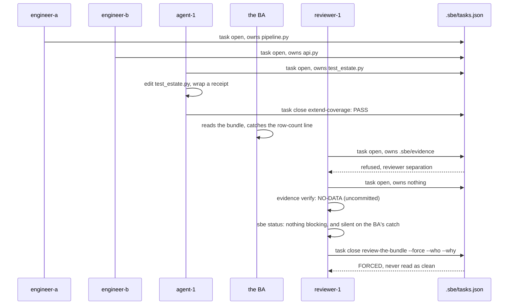

# Coordinating humans and agents

## The whole cast, one change

Every chapter since seven has shown one or two actors touching one file at
a time. This chapter puts the full cast on one change at once: two
engineers, an agent, a business analyst, and a reviewer, the same
registry and the same gates every earlier chapter used, none of them
given a special rule because of what kind of actor they are.

```bash
ROOT="$(pwd)"
rm -rf /tmp/sbe-book-ch11-repo && mkdir -p /tmp/sbe-book-ch11-repo
cd /tmp/sbe-book-ch11-repo
git init -q
git config user.email "estate@example.invalid"
git config user.name "Estate Seed"
cp "$ROOT/docs/book/estate/pipeline.py" .
cp "$ROOT/docs/book/estate/api.py" .
cp "$ROOT/docs/book/estate/test_estate.py" .
git add pipeline.py api.py test_estate.py
export GIT_AUTHOR_NAME="Estate Seed" GIT_AUTHOR_EMAIL="estate@example.invalid"
export GIT_COMMITTER_NAME="Estate Seed" GIT_COMMITTER_EMAIL="estate@example.invalid"
export GIT_AUTHOR_DATE="2026-07-01T00:00:00" GIT_COMMITTER_DATE="2026-07-01T00:00:00"
git commit -q -m "seed the coordination demo with a copy of the estate"
BASE="$(git rev-parse HEAD)"
echo "base commit $BASE"
```

```
base commit 92abac75170ea032bc5884b643eb626de533c315
```

## Three writers, three files, one registry

Engineer-a takes `pipeline.py`, engineer-b takes `api.py`, and an agent,
`agent-1`, is assigned the same kind of task a person would be: extend the
estate's own test coverage. The registry treats all three identically; it
records an agent string and a role, never anything that says one of these
writers is a model and the other two are people.

```bash
BASE="$(git rev-parse HEAD)"
python3 "$ROOT/bin/sbe" task open --id fix-pipeline --agent engineer-a --role writer --base "$BASE" --verify "python3 pipeline.py --date 2026-07-01" --owns pipeline.py --cwd .
python3 "$ROOT/bin/sbe" task open --id add-region --agent engineer-b --role writer --base "$BASE" --verify "python3 api.py 2026-07-01" --owns api.py --cwd .
python3 "$ROOT/bin/sbe" task open --id extend-coverage --agent agent-1 --role writer --base "$BASE" --verify "python3 test_estate.py" --owns test_estate.py --cwd .
```

```bash
python3 "$ROOT/bin/sbe" task list --cwd .
```

```
fix-pipeline         engineer-a writer   base 92abac75170e  owns: pipeline.py
add-region           engineer-b writer   base 92abac75170e  owns: api.py
extend-coverage      agent-1    writer   base 92abac75170e  owns: test_estate.py
3 open task(s). Expiry is informational: nothing here deletes on a clock.
```

## What the agent does, and what verifies it

`agent-1` adds a real assertion the existing suite was missing, that the
second region's total is what the pipeline actually computed, not only the
first:

```bash
python3 - <<'PATCH'
path = "test_estate.py"
text = open(path).read()
old = '''        self.assertEqual([r["region"] for r in rows], ["EU", "US"])
        self.assertEqual(rows[0]["total_eur"], 209.5)'''
new = '''        self.assertEqual([r["region"] for r in rows], ["EU", "US"])
        self.assertEqual(rows[0]["total_eur"], 209.5)
        self.assertEqual(rows[1]["total_eur"], 240.0)'''
assert old in text
open(path, "w").write(text.replace(old, new, 1))
PATCH
```

Correct code is not the same as verified work. `agent-1`'s own claim that
its edit is good is exactly the kind of unwitnessed claim this whole book
exists to refuse, so it wraps its change in a receipt the same way chapter
six did, before anyone reviews anything:

```bash
python3 "$ROOT/bin/sbe" evidence run --out /tmp/sbe-book-ch11-receipts/agent-1-receipt.json --covers test_estate.py --cwd . -- python3 test_estate.py 2>/dev/null | sed -E 's/[0-9]+\.[0-9]+s/<N.NNNs>/'
```

```

sbe evidence run: receipt written to /tmp/sbe-book-ch11-receipts/agent-1-receipt.json. Trust LOCAL-ADVISORY (no SBE_CI_RUN_ID was set when this ran, so nothing outside the machine that wrote it attests to it). Command exited 0 in <N.NNNs>, over 1 covered file(s) from explicit --covers. Declared check kind(s): none, so this receipt clears no design, gate or score obligation. stdout and stderr are recorded as digests only. argv held 0 secret-shaped token(s) and was recorded verbatim.
```

```bash
rm -f daily_totals.json orders.csv
python3 "$ROOT/bin/sbe" task close extend-coverage --cwd .
```

```
  IN-SCOPE   test_estate.py
sbe task close extend-coverage: PASS. 1 changed path(s), all inside the declaration. Closed clean.
```

`agent-1`'s own verify command regenerated `daily_totals.json` and
`orders.csv` as a side effect of running the estate's tests, and both were
untracked, undeclared paths at the first close attempt. Nothing here
softened that: the fence does not know or care that the intent was good,
only that a changed path was not owned. Removing the byproducts of its own
verify run, then closing again, is what made the close clean, exactly the
same rule engineer-a hit on a rogue file in chapter seven.

## The BA reads the bundle

A business analyst reviewing this change is not reading code line by line;
they are reading what the change actually does, and this pipeline still
does the one thing chapter one opened on:

```bash
python3 pipeline.py --date 2026-07-01
```

```
read 3 orders from orders.csv
aggregated 2 region(s) for 2026-07-01
wrote 3 rows to daily_totals
```

```bash
python3 -c "import json; print(len(json.load(open('daily_totals.json'))))"
```

```
2
```

Three claimed, two on disk, in this seeded copy, same as chapter one's
opening page, because nothing in this particular bundle touched
`pipeline.py`'s message. The BA's comment is exactly this: the printed
line still overstates the file it just wrote, and nobody in this change
has said anything about it.

A machine-tracked, blocking note attached to that exact claim, `sbe note
add --severity DANGER`, showing up automatically inside `sbe status`,
ships in a later loop. It does not exist in this release; nothing below
pretends it does. What exists today is what the rest of this chapter
actually runs.

## A human gate on the agent's work

Before anyone merges this bundle, a reviewer opens a task to look at it.
The registry separates roles even here: a reviewer may never own the
evidence store it is about to review, on purpose, so a reviewer cannot
quietly rewrite the receipts it is meant to check.

```bash
BASE="$(git rev-parse HEAD)"
python3 "$ROOT/bin/sbe" task open --id review-the-bundle --agent reviewer-1 --role reviewer --base "$BASE" --verify "python3 test_estate.py" --owns .sbe/evidence --cwd . 2>&1
```

```
sbe task open: refused. A reviewer task may not own '.sbe/evidence': it overlaps the evidence store .sbe/evidence it would review. A reviewer who writes the receipts it reviews is the defect reviewer separation exists to stop. This separates roles inside the registry only; it cannot stop an actor who never registers.
```

The reviewer opens correctly instead, owning nothing, there only to read:

```bash
python3 "$ROOT/bin/sbe" task open --id review-the-bundle --agent reviewer-1 --role reviewer --base "$BASE" --verify "python3 test_estate.py" --cwd .
```

```
sbe task open: review-the-bundle is open. reviewer-1 (reviewer) owns 0 path(s): (none). Base 92abac75170e. Close runs the diff postcondition against exactly this declaration.
```

It checks `agent-1`'s receipt is real, not a claim:

```bash
python3 "$ROOT/bin/sbe" evidence verify /tmp/sbe-book-ch11-receipts/agent-1-receipt.json --cwd . 2>&1
```

```
NO-DATA  /tmp/sbe-book-ch11-receipts/agent-1-receipt.json
  inspected: receipt file /tmp/sbe-book-ch11-receipts/agent-1-receipt.json; schemaVersion; 18 required field(s); the declared check kind(s); the runId seal over 24 run fact(s); the current git HEAD in /private/tmp/sbe-book-ch11-repo; 1 covered file(s)
  trust:     LOCAL-ADVISORY (no SBE_CI_RUN_ID was set when this ran, so nothing outside the machine that wrote it attests to it)
  the working tree was dirty or unreadable when this ran (2 uncommitted path(s)), so the receipt covers a state that was never committed and nobody else can reproduce. That is advisory, and advisory is NO-DATA here rather than a pass
```

NO-DATA, not PASS, and not because the agent's test failed. `agent-1`'s
edit was closed cleanly in the task registry, but never git-committed, so
the tree this receipt covers is not the tree anyone else could reproduce
yet. That gap between "the registry says closed" and "the tree is
committed" is real, and it is exactly why `evidence verify` is its own
step, not an assumption a reviewer is allowed to make.

Then the reviewer reads the same readback chapter three introduced:

```bash
python3 "$ROOT/bin/sbe" status .
```

```
sbe status: /private/tmp/sbe-book-ch11-repo

BROKEN CLAIMS:
  NO-DATA. scope: no evidence store found at /private/tmp/sbe-book-ch11-repo/.sbe/evidence; disposition absent

MERGE BLOCKERS:
  clean. scope: intake absent (tier unknown); 3 open task(s) among 4 total, read from /private/tmp/sbe-book-ch11-repo/.sbe/tasks.json; git diff 92abac75170e..HEAD over 0 changed file(s)

ACTIVE CONFLICTS:
  clean. scope: 3 open task(s) among 4 total, read from /private/tmp/sbe-book-ch11-repo/.sbe/tasks.json

MISSING EVIDENCE:
  NO-DATA. scope: declared tier unknown from no intake file

COMPLETED EVIDENCE:
  NO-DATA. scope: no evidence store found at /private/tmp/sbe-book-ch11-repo/.sbe/evidence

NEXT ACTION: nothing blocking here that this tool can see. scope: intake absent; disposition absent; evidence store absent; task registry /private/tmp/sbe-book-ch11-repo/.sbe/tasks.json; diff git diff 92abac75170e..HEAD over 0 changed file(s)

sbe status: exit 0. none of BROKEN CLAIMS, MERGE BLOCKERS, ACTIVE CONFLICTS or MISSING EVIDENCE carries an item. That is not the same claim as everything being inspected: read the NO-DATA lines above for what was not.
```

Read this next to what the BA already said out loud. Exit 0. Nothing
blocking. And nowhere in these six sections is the row-count line
mentioned, not because it is fine, but because nothing here wrapped it in
anything this tool reads. `COMPLETED EVIDENCE` does not even know
`agent-1`'s work happened, because the receipt was written to `/tmp`, not
to this repository's own evidence store. `sbe status` reports what was
recorded, in the places it knows to look. It is not a second opinion on
the change, and it was never built to be one.

## The reviewer's decision, recorded

The reviewer has read enough to have an opinion this tool cannot compute
for them: ship the working part, hold the rest for the row-count fix.
Closing this reviewer task cleanly is not available, because everyone
else's uncommitted work still shows up in the same tree the registry
compares against; the honest move is to close it with a reason, on the
record, not to force a clean close that never happened:

```bash
python3 "$ROOT/bin/sbe" task close review-the-bundle --cwd . --force --who reviewer-1 --why "agent-1 receipt verified, row-count message still off by one, tracked by hand until sbe note ships"
```

```
  VIOLATION  test_estate.py
  VIOLATION  daily_totals.json
  VIOLATION  orders.csv
sbe task close review-the-bundle: FORCED by reviewer-1 (agent-1 receipt verified, row-count message still off by one, tracked by hand until sbe note ships). The record carries the disposition and the violation list; this close is never read as clean.
sbe task close: decision package written: /private/tmp/sbe-book-ch11-repo/.sbe/decisions/001-forced-close-fail/DECISION.md
```

`FORCED`, never `PASS`, printed in the record forever. That is the whole
point of `--force` needing `--who` and `--why`: a human decision that
happened outside the tool's own math is not allowed to disappear into a
silent close. Today, the BA's catch survives only because a person wrote
it into that `--why` string by hand. The gap between that and a
first-class, machine-checked `DANGER` note that blocks on its own is
exactly the gap the next loop's notes feature closes.

## Why none of this needed to know who, or what, was typing



Every actor in that diagram went through the same door: declare what you
own before you touch it, and close against what the diff actually shows,
not what you meant to change. The registry never asked whether the writer
behind `agent-1` was a person or a model, because the fence it enforces,
one writer per file, checked against the real tree, does not change
meaning depending on who is holding the pen. That is what makes it safe
to let an agent hold a fence at all: not a special set of looser rules for
when the writer is a model, but the exact same rule, verified the exact
same way, every time.

Part III turns this same shape into a cookbook: one page per task shape,
new pipeline, schema change, incident, migration, adopting a repository
that has never seen this tool, each with the exact commands this book has
already run for real, and each ending with the one honest line every
recipe owes: what the gates will refuse here.
