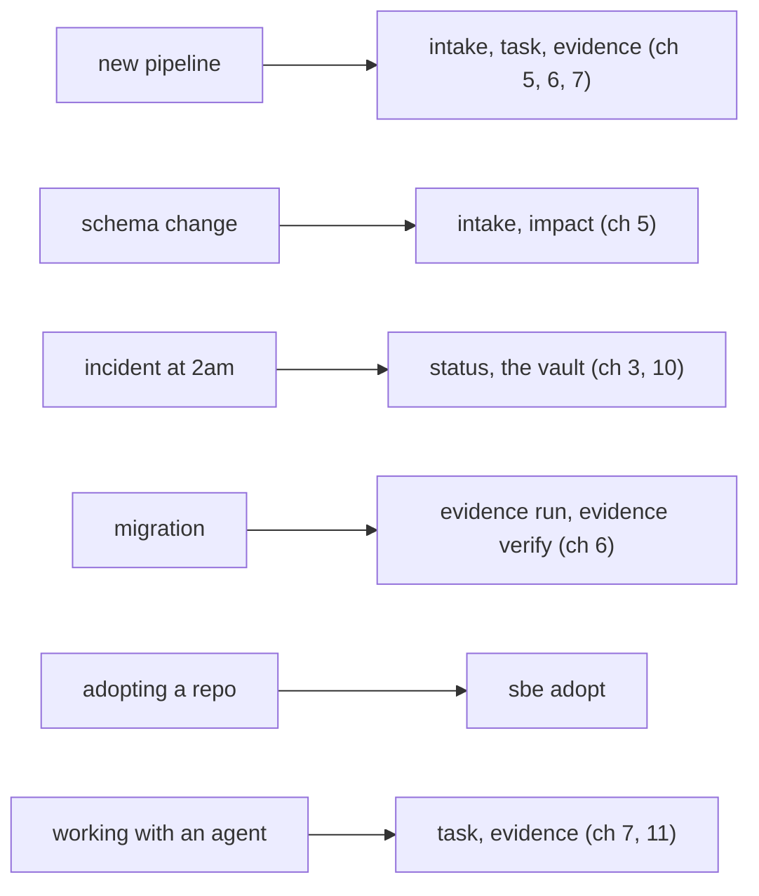

# The cookbook

## One page per shape of work

Chapter eleven closed on a promise: one page per task shape, the exact
commands this book has already run for real, each one ending with the same
honest line. This chapter keeps that promise. Six shapes, six recipes: a
new pipeline, a schema change, an incident, a migration, adopting a repo
this tool has never touched, and working next to an agent. Nothing below
teaches a command for the first time; every recipe leans on a chapter this
book already walked in full, and names it, rather than re-explaining it.



Every recipe below seeds a scratch copy of the worked estate first, the same
reason chapters seven through eleven all gave: this book's own repository is
mid-loop right now, with real uncommitted work sitting in it, so a live
demo against that noise would prove nothing. Each block is the real `sbe`
binary from this repository, pointed at a throwaway `/tmp` copy with
`--cwd`, and every pasted block is re-executed by the book's own build check
every time this page is verified.

## Recipe: a new pipeline on an existing estate

The estate already has one pipeline. Adding a second, independent one is
the smallest shape this cookbook has: no contract changes, nothing
sensitive, reversible in seconds if it is wrong.

```bash
ROOT="$(pwd)"
rm -rf /tmp/sbe-book-ch12-newpipe && mkdir -p /tmp/sbe-book-ch12-newpipe
cd /tmp/sbe-book-ch12-newpipe
git init -q
git config user.email "estate@example.invalid"
git config user.name "Estate Seed"
cp "$ROOT/docs/book/estate/pipeline.py" .
cp "$ROOT/docs/book/estate/api.py" .
cp "$ROOT/docs/book/estate/test_estate.py" .
git add pipeline.py api.py test_estate.py
export GIT_AUTHOR_NAME="Estate Seed" GIT_AUTHOR_EMAIL="estate@example.invalid"
export GIT_COMMITTER_NAME="Estate Seed" GIT_COMMITTER_EMAIL="estate@example.invalid"
export GIT_AUTHOR_DATE="2026-07-01T00:00:00" GIT_COMMITTER_DATE="2026-07-01T00:00:00"
git commit -q -m "seed the new-pipeline recipe with a copy of the estate"
BASE="$(git rev-parse HEAD)"
echo "base commit $BASE"
```

```
base commit 3d01b2948a362a1d66c32f3c044511973c9a6047
```

Five questions, answered the way this change actually reads (chapter five):
no contract, no boundary, reversible, nothing sensitive, no known consumers
yet. That lands T0, and T0 owes no artifacts, none, which is the decision
table doing exactly what it is for: a small change should not have to write
a brief nobody will read.

```bash
rm -rf /tmp/sbe-book-ch12-dossier && mkdir -p /tmp/sbe-book-ch12-dossier
printf 'n\nn\ny\nn\nnone\n' | python3 "$ROOT/bin/sbe" intake /tmp/sbe-book-ch12-dossier
```

```
Does this change a data model, an API contract, or a file interface others depend on? (y/n) Does it cross a service, system, or team boundary? (y/n) Is it reversible in under an hour? (y/n) Does it touch money, partner data, personal data, or production state? (y/n) How many downstream consumers break if it is wrong? (none/some/many) tier T0 (artifacts required: none) written to /tmp/sbe-book-ch12-dossier/00-intake.json
To override this tier, edit that file and set all three fields: "tier" (the tier you are moving to), "override" (the same tier, declaring the move), and "override_reason" (at least 3 words and 12 characters). A move with any of the three missing or disagreeing FAILs the design check as an edit rather than an override.
```

Fence the write before it happens, the same law chapter seven ran on
`pipeline.py`, now on the new file's own name:

```bash
BASE="$(git rev-parse HEAD)"
python3 "$ROOT/bin/sbe" task open --id weekly-rollup --agent engineer-a --role writer --base "$BASE" --verify "python3 weekly_pipeline.py" --owns weekly_pipeline.py --cwd .
```

```
sbe task open: weekly-rollup is open. engineer-a (writer) owns 1 path(s): weekly_pipeline.py. Base 3d01b2948a36. Close runs the diff postcondition against exactly this declaration.
```

Write the file, reusing the daily pipeline's own output as its source, and
run both in order:

```bash
cat > weekly_pipeline.py <<'EOF'
"""A second, independent pipeline in the same estate: sums the same source
across the whole week instead of one day. Reads daily_totals.json, which
pipeline.py already knows how to produce; writes nothing pipeline.py reads."""
import io
import json
import os
import sys

HERE = os.path.dirname(os.path.abspath(__file__))
DAILY = os.path.join(HERE, "daily_totals.json")
OUT = os.path.join(HERE, "weekly_totals.json")


def run():
    if not os.path.exists(DAILY):
        sys.stdout.write("no daily_totals.json yet; run pipeline.py first\n")
        return 1
    with io.open(DAILY, encoding="utf-8") as fh:
        rows = json.load(fh)
    totals = {}
    for row in rows:
        totals[row["region"]] = totals.get(row["region"], 0.0) + row["total_eur"]
    weekly = [{"region": r, "total_eur": round(t, 2)} for r, t in sorted(totals.items())]
    with io.open(OUT, "w", encoding="utf-8") as fh:
        json.dump(weekly, fh, indent=2, sort_keys=True)
    sys.stdout.write("rolled up %d region(s) into weekly_totals\n" % len(weekly))
    return 0


if __name__ == "__main__":
    sys.exit(run())
EOF
python3 pipeline.py --date 2026-07-01
python3 weekly_pipeline.py
```

```
read 3 orders from orders.csv
aggregated 2 region(s) for 2026-07-01
wrote 3 rows to daily_totals
rolled up 2 region(s) into weekly_totals
```

Wrap the new file's own run in a receipt (chapter six), then close the fence
against exactly what changed:

```bash
python3 "$ROOT/bin/sbe" evidence run --out /tmp/sbe-book-ch12-receipts/weekly-receipt.json --covers weekly_pipeline.py --cwd . -- python3 weekly_pipeline.py 2>/dev/null | sed -E 's/[0-9]+\.[0-9]+s/<N.NNNs>/'
```

```
rolled up 2 region(s) into weekly_totals

sbe evidence run: receipt written to /tmp/sbe-book-ch12-receipts/weekly-receipt.json. Trust LOCAL-ADVISORY (no SBE_CI_RUN_ID was set when this ran, so nothing outside the machine that wrote it attests to it). Command exited 0 in <N.NNNs>, over 1 covered file(s) from explicit --covers. stdout and stderr are recorded as digests only. argv held 0 secret-shaped token(s) and was recorded verbatim.
```

```bash
rm -f daily_totals.json orders.csv weekly_totals.json
python3 "$ROOT/bin/sbe" task close weekly-rollup --cwd .
```

```
  IN-SCOPE   weekly_pipeline.py
sbe task close weekly-rollup: PASS. 1 changed path(s), all inside the declaration. Closed clean.
```

*What the gates will refuse here:* nothing about T0 turns the fence off. A
`task close` whose diff touched anything outside `weekly_pipeline.py`, one
stray file, one regenerated artifact left uncleaned, gets the exact
`rogue-note.txt` treatment chapter seven ran: FAIL, named by path, task
stays open. A small tier buys a small dossier. It never buys a looser fence.

## Recipe: a schema change that raises the tier

An engineer believes this is small: one column, one migration file. The
five questions get answered that way, T1. The diff disagrees.

```bash
rm -rf /tmp/sbe-book-ch12-schema && mkdir -p /tmp/sbe-book-ch12-schema
cd /tmp/sbe-book-ch12-schema
git init -q
git config user.email "estate@example.invalid"
git config user.name "Estate Seed"
cp "$ROOT/docs/book/estate/pipeline.py" .
cp "$ROOT/docs/book/estate/api.py" .
git add pipeline.py api.py
export GIT_AUTHOR_NAME="Estate Seed" GIT_AUTHOR_EMAIL="estate@example.invalid"
export GIT_COMMITTER_NAME="Estate Seed" GIT_COMMITTER_EMAIL="estate@example.invalid"
export GIT_AUTHOR_DATE="2026-07-01T00:00:00" GIT_COMMITTER_DATE="2026-07-01T00:00:00"
git commit -q -m "seed the schema-change recipe with a copy of the estate"
BASE="$(git rev-parse HEAD)"
echo "base commit $BASE"
```

```
base commit 7d342a561b694c3e1b15585f0f9b1b10988c4dd8
```

```bash
rm -rf /tmp/sbe-book-ch12-schema-dossier && mkdir -p /tmp/sbe-book-ch12-schema-dossier
printf 'n\nn\ny\nn\nsome\n' | python3 "$ROOT/bin/sbe" intake /tmp/sbe-book-ch12-schema-dossier
```

```
Does this change a data model, an API contract, or a file interface others depend on? (y/n) Does it cross a service, system, or team boundary? (y/n) Is it reversible in under an hour? (y/n) Does it touch money, partner data, personal data, or production state? (y/n) How many downstream consumers break if it is wrong? (none/some/many) tier T1 (artifacts required: 01) written to /tmp/sbe-book-ch12-schema-dossier/00-intake.json
To override this tier, edit that file and set all three fields: "tier" (the tier you are moving to), "override" (the same tier, declaring the move), and "override_reason" (at least 3 words and 12 characters). A move with any of the three missing or disagreeing FAILs the design check as an edit rather than an override.
```

The actual change is a migration file, committed the way it would be in a
real PR:

```bash
mkdir -p migrations
printf 'ALTER TABLE orders ADD COLUMN partner_id TEXT;\n' > migrations/0002_add_partner_id.sql
git add migrations/0002_add_partner_id.sql
export GIT_AUTHOR_NAME="Engineer A" GIT_AUTHOR_EMAIL="engineer-a@example.invalid"
export GIT_COMMITTER_NAME="Engineer A" GIT_COMMITTER_EMAIL="engineer-a@example.invalid"
export GIT_AUTHOR_DATE="2026-07-02T00:00:00" GIT_COMMITTER_DATE="2026-07-02T00:00:00"
git commit -q -m "add partner_id column to orders"
echo "committed $(git rev-parse HEAD)"
```

```
committed 6a3f00232fe47366675d021d7c1fa8bfb6be1d80
```

`sbe impact` (chapter five) reads the diff itself, not the five answers a
second time, and reconciles it against the declared T1:

```bash
python3 "$ROOT/bin/sbe" impact . --base "$BASE" --intake /tmp/sbe-book-ch12-schema-dossier/00-intake.json
```

```
git diff 7d342a561b69..HEAD over 1 changed file(s)
  DETECTED  db-migration           migrations/0002_add_partner_id.sql (a schema change other code and queries depend on)
  DETECTED  sql-ddl                migrations/0002_add_partner_id.sql (data definition language, which changes a shared shape)
  DETECTED  partner-path           migrations/0002_add_partner_id.sql (a partner-facing surface)
  UNMEASURED consumers: how many downstream things break if this is wrong cannot be read from a diff. Assumed 'none', which can only lower the proposal, never raise it.

proposed tier T3 (a floor, not a ceiling), declared tier T1
  DISAGREEMENT db-migration           migrations/0002_add_partner_id.sql [disposition: missing]
  DISAGREEMENT sql-ddl                migrations/0002_add_partner_id.sql [disposition: missing]
  DISAGREEMENT partner-path           migrations/0002_add_partner_id.sql [disposition: missing]
verdict: REVIEW-REQUIRED
The diff shows more than the intake declared. This tool will not lower a human tier and will not raise one behind your back either: record a disposition naming the detector, the decision, the reason, who decided, and the head commit it was decided against.

sbe impact: decision package written, because this run raised a tier or read a disposition: /tmp/sbe-book-ch12-schema-dossier/decisions/001-tier-review-required/DECISION.md
```

Three detectors fired on one file, not one: a migration, raw DDL, and a
path shaped like a partner surface, and the third one alone is enough to
force T3, not T2 (`compute_tier`, chapter eight's own reading of the same
function: `touches_sensitive` outranks everything else). The honest move
is not to write a disposition that argues these three hits away; it is to
admit the first tier was wrong and answer again, truthfully this time:

```bash
rm -rf /tmp/sbe-book-ch12-schema-dossier && mkdir -p /tmp/sbe-book-ch12-schema-dossier
printf 'y\nn\ny\ny\nsome\n' | python3 "$ROOT/bin/sbe" intake /tmp/sbe-book-ch12-schema-dossier
```

```
Does this change a data model, an API contract, or a file interface others depend on? (y/n) Does it cross a service, system, or team boundary? (y/n) Is it reversible in under an hour? (y/n) Does it touch money, partner data, personal data, or production state? (y/n) How many downstream consumers break if it is wrong? (none/some/many) tier T3 (artifacts required: 01, 02, 03, 04, 05, 06, 07) written to /tmp/sbe-book-ch12-schema-dossier/00-intake.json
To override this tier, edit that file and set all three fields: "tier" (the tier you are moving to), "override" (the same tier, declaring the move), and "override_reason" (at least 3 words and 12 characters). A move with any of the three missing or disagreeing FAILs the design check as an edit rather than an override.
```

```bash
python3 "$ROOT/bin/sbe" impact . --base "$BASE" --intake /tmp/sbe-book-ch12-schema-dossier/00-intake.json
```

```
git diff 7d342a561b69..HEAD over 1 changed file(s)
  DETECTED  db-migration           migrations/0002_add_partner_id.sql (a schema change other code and queries depend on)
  DETECTED  sql-ddl                migrations/0002_add_partner_id.sql (data definition language, which changes a shared shape)
  DETECTED  partner-path           migrations/0002_add_partner_id.sql (a partner-facing surface)
  UNMEASURED consumers: how many downstream things break if this is wrong cannot be read from a diff. Assumed 'none', which can only lower the proposal, never raise it.

proposed tier T3 (a floor, not a ceiling), declared tier T3
verdict: PASS
```

Same diff, same three detections, and now `PASS`, because the declared
tier finally covers what the diff actually shows.

*What the gates will refuse here:* `sbe design --strict` against this T3
dossier fails exactly the way chapter five's T2 example failed, by name,
01 through 07 missing, until they exist. And a disposition file that waves
the `db-migration`, `sql-ddl`, or `partner-path` hit away without naming
who decided, why, and the head commit it was decided against does not make
`REVIEW-REQUIRED` disappear; recording a disposition that says less than
that is not disposing of the disagreement, it is hiding it in a format
this tool happens to accept.

## Recipe: an incident at 2am

A page comes in. The engineer who answers it did not write the change
that broke, has never seen this repository's history, and has ten minutes
before the next alert. Two things exist to hand them the truth without
asking them to trust anyone's memory: `sbe status`, and whatever the last
person who touched this actually wrote down.

```bash
rm -rf /tmp/sbe-book-ch12-incident && mkdir -p /tmp/sbe-book-ch12-incident
cd /tmp/sbe-book-ch12-incident
git init -q
git config user.email "estate@example.invalid"
git config user.name "Estate Seed"
cp "$ROOT/docs/book/estate/pipeline.py" .
cp "$ROOT/docs/book/estate/api.py" .
cp "$ROOT/docs/book/estate/test_estate.py" .
git add pipeline.py api.py test_estate.py
export GIT_AUTHOR_NAME="Estate Seed" GIT_AUTHOR_EMAIL="estate@example.invalid"
export GIT_COMMITTER_NAME="Estate Seed" GIT_COMMITTER_EMAIL="estate@example.invalid"
export GIT_AUTHOR_DATE="2026-07-01T00:00:00" GIT_COMMITTER_DATE="2026-07-01T00:00:00"
git commit -q -m "seed the incident recipe with a copy of the estate"
echo "base commit $(git rev-parse HEAD)"
```

```
base commit e5712adfb4a792137aaa45921b00cc261ebb4982
```

This is what the evening before actually looked like: a clean run, wrapped
in a receipt (chapter six), the way this project asks every change to be
proven, not just claimed.

```bash
python3 pipeline.py --date 2026-07-01
mkdir -p .sbe/evidence
python3 "$ROOT/bin/sbe" evidence run --out .sbe/evidence/pipeline-receipt.json --covers pipeline.py --cwd . -- python3 pipeline.py --date 2026-07-01 2>/dev/null | sed -E 's/[0-9]+\.[0-9]+s/<N.NNNs>/'
```

```
read 3 orders from orders.csv
aggregated 2 region(s) for 2026-07-01
wrote 3 rows to daily_totals
read 3 orders from orders.csv
aggregated 2 region(s) for 2026-07-01
wrote 3 rows to daily_totals

sbe evidence run: receipt written to .sbe/evidence/pipeline-receipt.json. Trust LOCAL-ADVISORY (no SBE_CI_RUN_ID was set when this ran, so nothing outside the machine that wrote it attests to it). Command exited 0 in <N.NNNs>, over 1 covered file(s) from explicit --covers. stdout and stderr are recorded as digests only. argv held 0 secret-shaped token(s) and was recorded verbatim.
```

Then, one more small edit landed after that receipt was written, and
nobody re-ran anything before logging off:

```bash
sed -i.bak "s/read %d orders from %s/read %d order(s) from %s/" pipeline.py && rm pipeline.py.bak
```

The 2am responder does not know any of that yet. They run the one command
this whole book has taught them to trust for a blocker-first read (chapter
three):

```bash
python3 "$ROOT/bin/sbe" status .
```

```
sbe status: /private/tmp/sbe-book-ch12-incident

BROKEN CLAIMS:
  - receipt .sbe/evidence/pipeline-receipt.json fails verify: covered file pipeline.py now hashes to 288842ae3117, not the b2602ebf2092 the receipt recorded: the code changed after the evidence was made

MERGE BLOCKERS:
  clean. scope: intake absent (tier unknown); no task registry found at /private/tmp/sbe-book-ch12-incident/.sbe/tasks.json; git diff e5712adfb4a7..HEAD over 0 changed file(s)

ACTIVE CONFLICTS:
  NO-DATA. scope: no task registry found at /private/tmp/sbe-book-ch12-incident/.sbe/tasks.json

MISSING EVIDENCE:
  NO-DATA. scope: declared tier unknown from no intake file

COMPLETED EVIDENCE:
  clean. scope: 1 receipt(s) found under /private/tmp/sbe-book-ch12-incident/.sbe/evidence

NEXT ACTION: the receipt no longer proves anything; re-run the command through `sbe evidence run` to produce a fresh one (BROKEN CLAIMS) scope: intake absent; disposition absent; evidence store /private/tmp/sbe-book-ch12-incident/.sbe/evidence; task registry absent; diff git diff e5712adfb4a7..HEAD over 0 changed file(s)

sbe status: exit 1. at least one of BROKEN CLAIMS, MERGE BLOCKERS, ACTIVE CONFLICTS or MISSING EVIDENCE carries an item above.
```

That is the WHAT: one broken claim, named by file, by the exact two
hashes that disagree, and one next action. It is not the WHY. For that,
the responder reads the same file chapter ten described a fresh session
reading first, the vault's own session log, the nearest thing this loop
ships to a handover file:

```bash
mkdir -p /tmp/sbe-book-ch12-vault/10-Projects/estate/Sessions
cat > /tmp/sbe-book-ch12-vault/10-Projects/estate/Sessions/2026-07-28-pipeline-wording.md <<'EOF'
# 2026-07-28 pipeline-wording

Objective: reword the orders-read log line in pipeline.py for clarity.

Done:
- ran the suite clean, wrote a receipt at .sbe/evidence/pipeline-receipt.json
- then made one more small wording edit to pipeline.py after that run

Gates:
- evidence: PASS at the time the receipt was written, BEFORE the last edit

Remaining / unverified:
- did not re-run the suite or sbe evidence run after the last wording edit
- did not commit; logged off before either happened

Next session starts with:
- re-run python3 test_estate.py and sbe evidence run against pipeline.py
  before trusting the receipt that is already sitting in .sbe/evidence
EOF
cat /tmp/sbe-book-ch12-vault/10-Projects/estate/Sessions/2026-07-28-pipeline-wording.md
```

```
# 2026-07-28 pipeline-wording

Objective: reword the orders-read log line in pipeline.py for clarity.

Done:
- ran the suite clean, wrote a receipt at .sbe/evidence/pipeline-receipt.json
- then made one more small wording edit to pipeline.py after that run

Gates:
- evidence: PASS at the time the receipt was written, BEFORE the last edit

Remaining / unverified:
- did not re-run the suite or sbe evidence run after the last wording edit
- did not commit; logged off before either happened

Next session starts with:
- re-run python3 test_estate.py and sbe evidence run against pipeline.py
  before trusting the receipt that is already sitting in .sbe/evidence
```

Read the two together and the incident stops being a mystery: `status`
says exactly which claim broke and why, in one sentence a machine
computed; the session log says what the last person was doing when they
stopped, in their own words, written down at the moment they logged off,
not reconstructed afterward from memory. Neither one alone is the whole
picture. A machine-tracked, blocking note that ties the two together
automatically, the kind chapter eleven already named, ships in a later
loop; tonight, reading both by hand is the whole tool this responder has.

*What the gates will refuse here:* `sbe status` keeps reporting this exact
receipt as a BROKEN CLAIM, and keeps exiting 1, until `pipeline.py` is
either reverted to the state the receipt actually covered or re-proven
with a fresh `sbe evidence run`. A sentence in a session log explaining
what happened is not evidence of anything either way; only a new receipt
is, and nothing here will accept the first as a substitute for the second.

## Recipe: a migration with a rehearsal receipt

A migration a reader cannot rehearse is a migration they are testing on
production. `sbe evidence run` does not care what the wrapped command is
for, which is exactly what makes it usable here: rehearse in a mode that
touches nothing, seal that rehearsal in a receipt, then run for real and
seal that too.

```bash
rm -rf /tmp/sbe-book-ch12-migration && mkdir -p /tmp/sbe-book-ch12-migration
cd /tmp/sbe-book-ch12-migration
git init -q
git config user.email "estate@example.invalid"
git config user.name "Estate Seed"
cp "$ROOT/docs/book/estate/pipeline.py" .
cp "$ROOT/docs/book/estate/api.py" .
git add pipeline.py api.py
export GIT_AUTHOR_NAME="Estate Seed" GIT_AUTHOR_EMAIL="estate@example.invalid"
export GIT_COMMITTER_NAME="Estate Seed" GIT_COMMITTER_EMAIL="estate@example.invalid"
export GIT_AUTHOR_DATE="2026-07-01T00:00:00" GIT_COMMITTER_DATE="2026-07-01T00:00:00"
git commit -q -m "seed the migration recipe with a copy of the estate"
echo "base commit $(git rev-parse HEAD)"
```

```
base commit a0a8c6fb8ea9a21c59a26ec593fa0093256c6dc5
```

The migration itself, small on purpose: add one column to `orders.csv`,
with its own rehearsal mode built in rather than bolted on after the fact.

```bash
python3 pipeline.py --date 2026-07-01 >/dev/null
cat > backfill_partner_id.py <<'EOF'
"""Backfill a partner_id column onto orders.csv. --rehearse changes nothing
on disk and prints what it would do; without it, the file is rewritten."""
import csv
import io
import os
import sys

HERE = os.path.dirname(os.path.abspath(__file__))
SRC = os.path.join(HERE, "orders.csv")


def run(rehearse):
    with io.open(SRC, encoding="utf-8", newline="") as fh:
        rows = list(csv.DictReader(fh))
    already = rows and "partner_id" in rows[0]
    if already:
        sys.stdout.write("already migrated: partner_id present on %d row(s)\n" % len(rows))
        return 0
    if rehearse:
        sys.stdout.write("REHEARSAL: would add partner_id to %d row(s), nothing written\n"
                         % len(rows))
        return 0
    for row in rows:
        row["partner_id"] = ""
    fieldnames = list(rows[0].keys())
    with io.open(SRC, "w", encoding="utf-8", newline="") as fh:
        writer = csv.DictWriter(fh, fieldnames=fieldnames)
        writer.writeheader()
        writer.writerows(rows)
    sys.stdout.write("migrated: added partner_id to %d row(s)\n" % len(rows))
    return 0


if __name__ == "__main__":
    sys.exit(run("--rehearse" in sys.argv))
EOF
python3 "$ROOT/bin/sbe" evidence run --out /tmp/sbe-book-ch12-receipts/rehearsal-receipt.json --covers backfill_partner_id.py --cwd . -- python3 backfill_partner_id.py --rehearse 2>/dev/null | sed -E 's/[0-9]+\.[0-9]+s/<N.NNNs>/'
```

```
REHEARSAL: would add partner_id to 3 row(s), nothing written

sbe evidence run: receipt written to /tmp/sbe-book-ch12-receipts/rehearsal-receipt.json. Trust LOCAL-ADVISORY (no SBE_CI_RUN_ID was set when this ran, so nothing outside the machine that wrote it attests to it). Command exited 0 in <N.NNNs>, over 1 covered file(s) from explicit --covers. stdout and stderr are recorded as digests only. argv held 0 secret-shaped token(s) and was recorded verbatim.
```

Verify the rehearsal receipt before trusting the rehearsal itself
(chapter six's own law, applied here):

```bash
python3 "$ROOT/bin/sbe" evidence verify /tmp/sbe-book-ch12-receipts/rehearsal-receipt.json --cwd .
```

```
NO-DATA  /tmp/sbe-book-ch12-receipts/rehearsal-receipt.json
  inspected: receipt file /tmp/sbe-book-ch12-receipts/rehearsal-receipt.json; schemaVersion; 17 required field(s); the runId seal over 22 run fact(s); the current git HEAD in /private/tmp/sbe-book-ch12-migration; 1 covered file(s)
  trust:     LOCAL-ADVISORY (no SBE_CI_RUN_ID was set when this ran, so nothing outside the machine that wrote it attests to it)
  the working tree was dirty or unreadable when this ran (3 uncommitted path(s)), so the receipt covers a state that was never committed and nobody else can reproduce. That is advisory, and advisory is NO-DATA here rather than a pass
```

`orders.csv` has no `partner_id` column yet, exactly as the rehearsal
claimed it would not touch it. Only now, with the rehearsal proven inert
and its receipt read honestly for what it is, does the real run happen:

```bash
head -1 orders.csv
python3 "$ROOT/bin/sbe" evidence run --out /tmp/sbe-book-ch12-receipts/applied-receipt.json --covers backfill_partner_id.py --covers orders.csv --cwd . -- python3 backfill_partner_id.py 2>/dev/null | sed -E 's/[0-9]+\.[0-9]+s/<N.NNNs>/'
head -1 orders.csv
```

```
order_id,date,region,amount_eur
migrated: added partner_id to 3 row(s)

sbe evidence run: receipt written to /tmp/sbe-book-ch12-receipts/applied-receipt.json. Trust LOCAL-ADVISORY (no SBE_CI_RUN_ID was set when this ran, so nothing outside the machine that wrote it attests to it). Command exited 0 in <N.NNNs>, over 2 covered file(s) from explicit --covers. stdout and stderr are recorded as digests only. argv held 0 secret-shaped token(s) and was recorded verbatim.
order_id,date,region,amount_eur,partner_id
```

The header line before and after says the whole story: unchanged after
the rehearsal, `partner_id` appended after the real run, and a receipt
sealed over each state, not a comment claiming either one happened.

*What the gates will refuse here:* neither receipt clears `LOCAL-ADVISORY`
into `PROTECTED-CI`, and `evidence verify` will not read either one as a
`PASS`, while the tree that produced it holds uncommitted paths. A
migration receipt this book can paste from a live repository is honestly
capped there, the same ceiling chapter eleven's agent receipt hit; only a
clean tree under real CI, with a minted run id, reaches higher, and no
amount of rehearsal changes that.

## Recipe: adopting a repo that has never seen this tool

Nothing here assumes the target repository ever ran `sbe init`. `sbe
adopt` reads what is already on disk and proposes, it does not assume,
and dry run is the default whether the flag is typed or not.

```bash
rm -rf /tmp/sbe-book-ch12-adopt && mkdir -p /tmp/sbe-book-ch12-adopt/api
cd /tmp/sbe-book-ch12-adopt
git init -q
git config user.email "estate@example.invalid"
git config user.name "Estate Seed"
cp "$ROOT/docs/book/estate/pipeline.py" api/service.py
printf 'def handler(event):\n    return {"status": 200}\n' > api/app.py
git add -A
export GIT_AUTHOR_NAME="Estate Seed" GIT_AUTHOR_EMAIL="estate@example.invalid"
export GIT_COMMITTER_NAME="Estate Seed" GIT_COMMITTER_EMAIL="estate@example.invalid"
export GIT_AUTHOR_DATE="2026-07-01T00:00:00" GIT_COMMITTER_DATE="2026-07-01T00:00:00"
git commit -q -m "seed a repo that has never seen this tool"
echo "seeded"
```

```
seeded
```

```bash
python3 "$ROOT/bin/sbe" adopt . --dry-run 2>&1 | grep -Ev '^\+|^-|^@@'
```

```
sbe adopt: /private/tmp/sbe-book-ch12-adopt
  languages: Python(2)
  migrations: False, dbt models: False, api contracts: False, ci workflows: False
  PROPOSED  .brothersbe/policy.json (new file)
  PROPOSED  .github/CODEOWNERS (new file)
  PROTECTION branch-protection            UNVERIFIABLE-HERE
  PROTECTION required-status-checks       UNVERIFIABLE-HERE
  PROTECTION codeowners-review-required   UNVERIFIABLE-HERE
  LOCAL      git-repository               PRESENT
  LOCAL      codeowners-file              ABSENT
  LOCAL      product-ci-workflow          ABSENT
  LOCAL      consumer-ci-workflow         ABSENT
  NOT-PROPOSED evidenceSchemas            no such path under this root: src/brothersbe/evidence.py, src/brothersbe/__init__.py
  NOT-PROPOSED hooks                      no such path under this root: hooks/
  NOT-PROPOSED manifest                   no such path under this root: .claude-plugin/plugin.json
  NOT-PROPOSED releaseFiles               no such path under this root: VERSION, CHANGELOG.md, CHECKSUMS.sha256
  NOT-PROPOSED workflows                  no such path under this root: .github/workflows/, .github/actions/

sbe adopt: dry run, nothing written. Rerun with --apply to write, or --apply --force to overwrite a file that already exists and differs.
```

The `PROPOSED` lines above each carried a full unified diff in the real
output; this page pipes it through `grep -Ev` to keep the summary
readable, the same kind of honest trim chapter six ran on a receipt's own
duration. Read what actually inspected the tree: two Python files
detected, no migrations, no API contracts, no CI, so the only proposals
are a starter policy file and a `CODEOWNERS` stub, both marked `new file`,
neither one written yet. The `NOT-PROPOSED` lines are the same honesty
running in the other direction: each names a protection category whose
paths do not exist in this tree, with the exact paths that were checked,
because a protection rule over a path that does not exist protects nothing
while looking like it does. Reading the dry run first, before ever typing
`--apply`, is the whole point of the flag existing, and of it defaulting
on: a proposal a person can read in full costs nothing to get wrong.

Only once that proposal has actually been read does `--apply` write it:

```bash
python3 "$ROOT/bin/sbe" adopt . --apply 2>&1 | grep -Ev '^\+|^-|^@@'
```

```
sbe adopt: /private/tmp/sbe-book-ch12-adopt
  languages: Python(2)
  migrations: False, dbt models: False, api contracts: False, ci workflows: False
  WROTE     .brothersbe/policy.json
  WROTE     .github/CODEOWNERS
  PROTECTION branch-protection            UNVERIFIABLE-HERE
  PROTECTION required-status-checks       UNVERIFIABLE-HERE
  PROTECTION codeowners-review-required   UNVERIFIABLE-HERE
  LOCAL      git-repository               PRESENT
  LOCAL      codeowners-file              PRESENT
  LOCAL      product-ci-workflow          ABSENT
  LOCAL      consumer-ci-workflow         ABSENT
  NOT-PROPOSED evidenceSchemas            no such path under this root: src/brothersbe/evidence.py, src/brothersbe/__init__.py
  NOT-PROPOSED hooks                      no such path under this root: hooks/
  NOT-PROPOSED manifest                   no such path under this root: .claude-plugin/plugin.json
  NOT-PROPOSED releaseFiles               no such path under this root: VERSION, CHANGELOG.md, CHECKSUMS.sha256
  NOT-PROPOSED workflows                  no such path under this root: .github/workflows/, .github/actions/
```

`codeowners-file` moves from `ABSENT` to `PRESENT`, a local fact this
machine can actually check by reading a file. The three `PROTECTION` lines
do not move, and nothing here pretends they could: turning this repository
into a real `sbe init` install, with `.sbe`, a dossier root, and a doctor
that agrees, is chapter four's own territory, not this recipe's.

*What the gates will refuse here:* `branch-protection`,
`required-status-checks`, and `codeowners-review-required` report
`UNVERIFIABLE-HERE` before `--apply` and after it, every single time, no
matter how many files this command writes. A script running on a laptop
cannot read a GitHub repository's own branch protection settings, so it
says exactly that instead of guessing PASS from the presence of a
`CODEOWNERS` file it just wrote itself. Only the repository's own settings
page can turn those three lines into something this tool would read as
real.

## Recipe: working alongside an agent

The registry does not know or care whether the writer behind a task is a
person or a model (chapter eleven). What it enforces is the same either
way: declare the scope before writing, and close against what the diff
actually shows, never against what anyone, human or agent, says happened.

```bash
rm -rf /tmp/sbe-book-ch12-agent && mkdir -p /tmp/sbe-book-ch12-agent
cd /tmp/sbe-book-ch12-agent
git init -q
git config user.email "estate@example.invalid"
git config user.name "Estate Seed"
cp "$ROOT/docs/book/estate/pipeline.py" .
cp "$ROOT/docs/book/estate/api.py" .
cp "$ROOT/docs/book/estate/test_estate.py" .
git add pipeline.py api.py test_estate.py
export GIT_AUTHOR_NAME="Estate Seed" GIT_AUTHOR_EMAIL="estate@example.invalid"
export GIT_COMMITTER_NAME="Estate Seed" GIT_COMMITTER_EMAIL="estate@example.invalid"
export GIT_AUTHOR_DATE="2026-07-01T00:00:00" GIT_COMMITTER_DATE="2026-07-01T00:00:00"
git commit -q -m "seed the agent recipe with a copy of the estate"
BASE="$(git rev-parse HEAD)"
echo "base commit $BASE"
```

```
base commit 51e57470454fee8c55e43069f42aafd143aeb722
```

Fence the agent to the one file it is meant to touch, before it writes a
line, exactly the same call chapter seven's engineers made:

```bash
python3 "$ROOT/bin/sbe" task open --id add-eu-discount --agent agent-2 --role writer --base "$BASE" --verify "python3 test_estate.py" --owns api.py --cwd .
```

```
sbe task open: add-eu-discount is open. agent-2 (writer) owns 1 path(s): api.py. Base 51e57470454f. Close runs the diff postcondition against exactly this declaration.
```

The agent edits `api.py`, then writes its own report, unwitnessed and
unverified, the way a claim like this always starts:

```bash
python3 - <<'PATCH'
path = "api.py"
text = open(path).read()
old = '        return 404, {"error": "no totals computed yet; run pipeline.py first"}, "absent"'
new = '        return 404, {"error": "no totals computed yet; run the pipeline first"}, "absent"'
assert old in text
open(path, "w").write(text.replace(old, new, 1))
PATCH
echo "agent-2 report: reworded the missing-data error for clarity, all 4 tests pass, ready to merge" > AGENT-REPORT.txt
cat AGENT-REPORT.txt
```

```
agent-2 report: reworded the missing-data error for clarity, all 4 tests pass, ready to merge
```

Nothing above ran a single test. The report says four tests pass; the
next command is the done-check, not the report, run the same way chapter
six wraps any command in a receipt regardless of what it expects to find:

```bash
rm -rf .sbe/evidence daily_totals.json orders.csv && mkdir -p .sbe/evidence
python3 "$ROOT/bin/sbe" evidence run --out .sbe/evidence/agent-2-receipt.json --covers api.py --cwd . -- python3 test_estate.py 2>&1 | tail -14 | sed -E 's/[0-9]+\.[0-9]+s/<N.NNNs>/'
```

```
======================================================================
FAIL: test_the_api_refuses_before_the_pipeline_ran (__main__.TestEstate)
----------------------------------------------------------------------
Traceback (most recent call last):
  File "/private/tmp/sbe-book-ch12-agent/test_estate.py", line 45, in test_the_api_refuses_before_the_pipeline_ran
    self.assertIn("run pipeline.py first", out.stdout)
AssertionError: 'run pipeline.py first' not found in '404 {"error": "no totals computed yet; run the pipeline first"}\n'

----------------------------------------------------------------------
Ran 4 tests in <N.NNNs>

FAILED (failures=1)

sbe evidence run: receipt written to .sbe/evidence/agent-2-receipt.json. Trust LOCAL-ADVISORY (no SBE_CI_RUN_ID was set when this ran, so nothing outside the machine that wrote it attests to it). Command exited 1 in <N.NNNs>, over 1 covered file(s) from explicit --covers. stdout and stderr are recorded as digests only. argv held 0 secret-shaped token(s) and was recorded verbatim.
```

The wording change moved the exact string a test asserted on. Exit 1,
sealed into a receipt just as honestly as a passing one would have been;
`sbe evidence run` does not grade the work, it records what actually
happened, and what actually happened contradicts the report by name.
Closing the fence surfaces a second, unrelated problem on top of the
first:

```bash
rm -f daily_totals.json orders.csv
python3 "$ROOT/bin/sbe" task close add-eu-discount --cwd .
```

```
  IN-SCOPE   api.py
  VIOLATION  .sbe/evidence/agent-2-receipt.json
  VIOLATION  AGENT-REPORT.txt
sbe task close add-eu-discount: FAIL. 2 changed path(s) outside the declaration, listed above by name. The shell was never parsed; the diff was read. The task stays open. Close with --force --who --why to record a disposition, never to make this clean.
```

Two failures, two different mechanisms, and neither reads the report at
all: `evidence run` caught a real test failure the agent's own words
denied; `task close` caught two files, the receipt and the report itself,
that were never declared before they were written. Fixing the scope
would not fix the test, and fixing the test would not fix the scope.
Both had to be read, separately, because both tools check different
things and neither one takes the other's word for it either.

*What the gates will refuse here:* `sbe task close` FAILs the instant a
diff carries one undeclared path, whether that path is a rogue edit or
the agent's own evidence and its own report about itself. `sbe evidence
run` seals whatever a command actually did, success or failure, and never
reads `AGENT-REPORT.txt` to decide which. No claim sitting next to a
receipt, typed by a person or generated by a model, has ever changed what
either gate does with a nonzero exit code.
