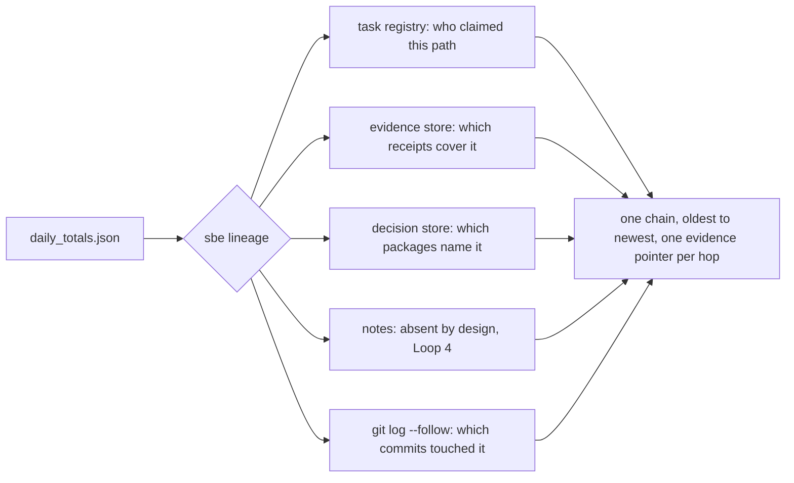
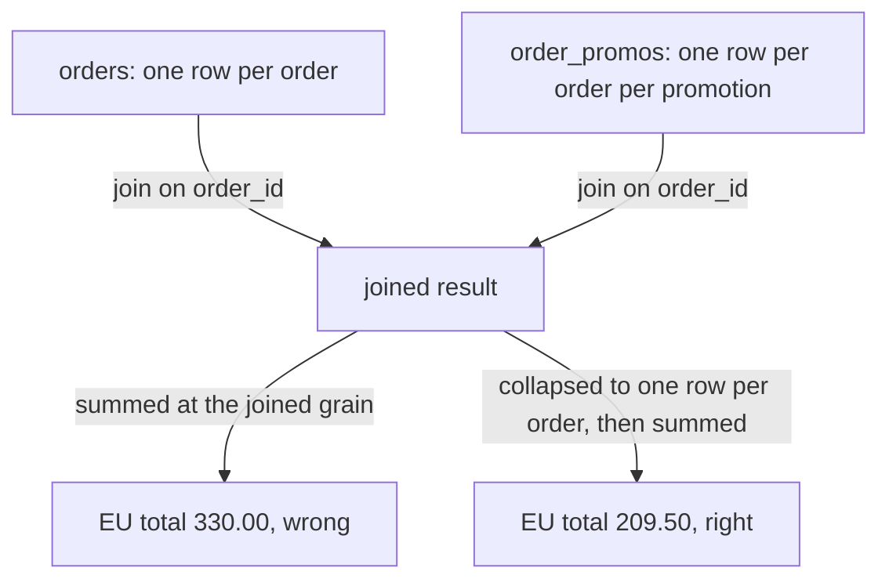
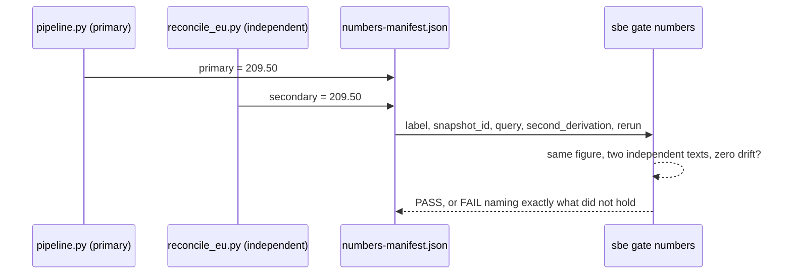

# The data engineer's deep dive
<!-- replay: chapter requires posix -->

## The number finance does not believe

Chapter one's pipeline is small on purpose: three orders, two regions, one
output file. This chapter puts a data engineer in front of that same
pipeline on a worse morning. Finance has pulled up `daily_totals.json` for
2026-07-01 and does not believe the EU number. Not because it looks wrong on
its face, 209.50 euros is a perfectly ordinary figure, but because nobody can
point at anything that proves it, and a number nobody can defend is a number
finance will eventually stop trusting even when it happens to be right.

A data engineer's whole job, underneath the SQL, is answering three
questions about a figure like this one: where did it come from, does a
second, independent path land on the same answer, and what happens to it
over time. This chapter answers all three, for real, in a throwaway copy
under `/tmp` so nothing here touches this repository's own working tree.

## Reproducing the number, first

Before arguing about the number, reproduce it. A fresh copy of the estate, a
real commit so there is something for a lineage chain to walk later, and the
pipeline run exactly as chapter one ran it.

```bash
ROOT="$(pwd)"
rm -rf /tmp/sbe-book-ch14 && mkdir -p /tmp/sbe-book-ch14/estate
cp docs/book/estate/pipeline.py docs/book/estate/orders.csv /tmp/sbe-book-ch14/estate/
cd /tmp/sbe-book-ch14/estate
git init -q
git config user.email "estate@example.invalid"
git config user.name "Estate Seed"
export GIT_AUTHOR_NAME="Estate Seed" GIT_AUTHOR_EMAIL="estate@example.invalid"
export GIT_COMMITTER_NAME="Estate Seed" GIT_COMMITTER_EMAIL="estate@example.invalid"
export GIT_AUTHOR_DATE="2026-07-01T00:00:00Z" GIT_COMMITTER_DATE="2026-07-01T00:00:00Z"
git add pipeline.py orders.csv
git commit -q -m "seed chapter 14 estate: pipeline and source orders"
python3 pipeline.py --date 2026-07-01
python3 -c "print(open('daily_totals.json').read())"
```

```
read 3 orders from orders.csv
aggregated 2 region(s) for 2026-07-01
wrote 3 rows to daily_totals
[
  {
    "date": "2026-07-01",
    "region": "EU",
    "total_eur": 209.5
  },
  {
    "date": "2026-07-01",
    "region": "US",
    "total_eur": 240.0
  }
]
```

209.50 euros for the EU row, reproduced. That settles what the number is. It
settles nothing about whether it is right.

## Walking the lineage before there is anything to point to

`sbe lineage` answers "where did this come from" by walking one artifact
through every store this product keeps: the task registry (who claimed the
file), the evidence store (which runs cover it), the decision store (which
gate failures or waivers name it), notes, and git history
(`src/brothersbe/decisions.py`, `lineage`, starting at line 1956). Commit
the generated file so git has something to say, then walk it.

```bash
export GIT_AUTHOR_DATE="2026-07-01T00:05:00Z" GIT_COMMITTER_DATE="2026-07-01T00:05:00Z"
git add daily_totals.json
git commit -q -m "commit the 2026-07-01 run of daily_totals"
python3 "$ROOT/bin/sbe" lineage daily_totals.json
```

```
sbe lineage: daily_totals.json, oldest to newest, one line per hop
2026-07-01T00:05:00Z  commit         commit fe8d0736ac25 by Estate Seed touched daily_totals.json [evidence: fe8d0736ac25569bd05ff8a593b97f3f4d533705]
(no timestamp)     NO-DATA        NO-DATA: no task registry exists at .sbe/tasks.json, so which binding claimed daily_totals.json was never recorded. `sbe task open --owns daily_totals.json` is what writes that record. [evidence: /private/tmp/sbe-book-ch14/estate/.sbe/tasks.json]
(no timestamp)     NO-DATA        NO-DATA: no evidence store exists at .sbe/evidence, so no receipt names daily_totals.json. `bin/sbe evidence run -- <command>` writes one per run. [evidence: /private/tmp/sbe-book-ch14/estate/.sbe/evidence]
(no timestamp)     NO-DATA        NO-DATA: no decision store exists at /private/tmp/sbe-book-ch14/estate/.sbe/decisions, so no decision package names daily_totals.json. A gate FAIL, a WAIVED check, a tier decision or a forced close is what writes one. [evidence: /private/tmp/sbe-book-ch14/estate/.sbe/decisions]
(no timestamp)     notes-NO-DATA  NO-DATA: the notes store .sbe/notes/daily-totals-json/ is absent in this loop by design (notes.py ships in Loop 4), so no note on daily_totals.json was read. That store is what would fill this hop. [evidence: /private/tmp/sbe-book-ch14/estate/.sbe/notes/daily-totals-json]
5 store(s) were consulted for this chain: 1 read and 4 absent. An absent store is a NO-DATA hop above, never a shorter chain.
```

One real hop: a commit, with a sha a reader can go look at. Four honest
absences. That is the whole finding a data engineer needs from this first
walk: the number has a birth certificate (the commit) and nothing else, no
receipt proving anyone re-derived it, no decision on record about it. The
chain is not broken. It is short, and it says so.



## Grain, and the join that quietly doubles a number

Before reconciling anything, a data engineer has to say what one row of a
table means. That is grain: "one row per order" is a grain. "One row per
order per promotion applied to it" is a different grain, and joining the two
without noticing is how a correct number becomes a wrong one with no line of
arithmetic ever being false.

Here is that failure, small enough to read in one look. Three orders. A
promotions table where order A-1001 picked up two promotion codes and
A-1002 picked up one. Join them by `order_id`, the easy way, and sum the
money on the joined result.

```bash
python3 - <<'PY'
orders = [
    {"order_id": "A-1001", "region": "EU", "amount_eur": 120.50},
    {"order_id": "A-1002", "region": "EU", "amount_eur": 89.00},
    {"order_id": "A-1003", "region": "US", "amount_eur": 240.00},
]
order_promos = [
    {"order_id": "A-1001", "promo_code": "SUMMER10"},
    {"order_id": "A-1001", "promo_code": "NEWSLETTER"},
    {"order_id": "A-1002", "promo_code": "SUMMER10"},
]


def naive_join(orders, promos):
    out = []
    for o in orders:
        matches = [p for p in promos if p["order_id"] == o["order_id"]]
        if matches:
            for m in matches:
                out.append(dict(o, promo_code=m["promo_code"]))
        else:
            out.append(o)
    return out


def region_total(rows):
    totals = {}
    for r in rows:
        totals[r["region"]] = totals.get(r["region"], 0.0) + r["amount_eur"]
    return {k: round(v, 2) for k, v in sorted(totals.items())}


def order_grain_total(rows):
    one_row_per_order = {}
    for r in rows:
        one_row_per_order[r["order_id"]] = r
    return region_total(list(one_row_per_order.values()))


joined = naive_join(orders, order_promos)
print("rows after the naive join:", len(joined))
print("EU total, summed at the joined grain:", region_total(joined)["EU"])
print("EU total, aggregated back to order grain first:", order_grain_total(joined)["EU"])
PY
```

```
rows after the naive join: 4
EU total, summed at the joined grain: 330.0
EU total, aggregated back to order grain first: 209.5
```

Nothing here lied. Every row of the join is a true row: order A-1001 really
did carry two promotion codes. The join's grain is order times promotion, and
summing money at that grain counts A-1001's 120.50 euros twice, once per
promotion, because the join fanned one order out into two rows before the sum
ever ran. That is fan-out: a join whose row count grew past what a reader
expected, sitting upstream of an aggregation that never noticed. Collapse
back to one row per order before summing money, and the number matches what
chapter one's pipeline already said: 209.50. The fix is not a smarter sum. It
is knowing the grain of the table being summed, at every step, not only at
the start.

`agents/data-reviewer.md` names this as its second pass, in one sentence
worth keeping close: "An aggregation sitting downstream of a potentially
multiplying join is Critical until proven otherwise, because it silently
doubles money" (`agents/data-reviewer.md`, lines 18 to 20).



## Systems of record, before reconciling anything

A system of record is the one place that gets to say what actually happened.
Here, `orders.csv` is the system of record for orders: written once, by the
process that took the order. Finance's own spreadsheet is a copy, and a copy
that disagrees with the system of record is not a second opinion carrying
equal weight, it is a finding about the copy. When two numbers disagree, the
question is never "which one do we average," it is "which one is the system
of record, and how did the other one drift." Skip that question and
reconciliation becomes theater: two numbers made to match by editing
whichever one is more convenient.

## Reconciliation, run for real

A figure that could reach a decision needs a second, genuinely independent
derivation, not the same query renamed. Independent means a different code
path: different parsing, a different loop, so a bug shared by both would be
the only way they agree by accident. Here is that second derivation for the
EU total, deliberately not reusing `pipeline.py`'s own `run()`:

```bash
cat > reconcile_eu.py <<'PY'
"""Independent re-derivation of one region's total for one date. Deliberately
not reusing pipeline.py's run(): a different parse (no csv module), a
different loop, so a bug shared by both code paths is the only way this
would agree with pipeline.py by accident."""
import sys


def region_total(date, region):
    total = 0.0
    with open("orders.csv", encoding="utf-8") as fh:
        next(fh)
        for line in fh:
            order_id, order_date, order_region, amount = line.strip().split(",")
            if order_date == date and order_region == region:
                total += float(amount)
    return round(total, 2)


if __name__ == "__main__":
    date, region = sys.argv[1], sys.argv[2]
    print("%.2f" % region_total(date, region))
PY
python3 reconcile_eu.py 2026-07-01 EU
```

```
209.50
```

Same answer, reached without touching `csv.DictReader` or `pipeline.py`'s own
loop. Now put both derivations behind receipts, the way chapter six
introduced: `sbe evidence run` actually executes the command, so a duration
and an exit code sit behind each number, not a typed claim about one.

```bash
mkdir -p .sbe/evidence
python3 "$ROOT/bin/sbe" evidence run --out .sbe/evidence/pipeline-run.json --covers pipeline.py --covers orders.csv --covers daily_totals.json --cwd . -- python3 pipeline.py --date 2026-07-01 2>/dev/null | sed -E 's/[0-9]+\.[0-9]+s/<N.NNNs>/'
python3 "$ROOT/bin/sbe" evidence run --out .sbe/evidence/reconcile-run.json --covers reconcile_eu.py --covers orders.csv --cwd . -- python3 reconcile_eu.py 2026-07-01 EU 2>/dev/null | sed -E 's/[0-9]+\.[0-9]+s/<N.NNNs>/'
```

```
read 3 orders from orders.csv
aggregated 2 region(s) for 2026-07-01
wrote 3 rows to daily_totals

sbe evidence run: FREE FORM run: no registered check, so this receipt is advisory and satisfies no required policy check
sbe evidence run: receipt written to .sbe/evidence/pipeline-run.json. Trust LOCAL-ADVISORY (this receipt was minted for a free-form command rather than a check registered in .sbe/checks.yml, so nothing outside the caller says which check it is. Free-form evidence is advisory whatever else is true of it). Command exited 0 in <N.NNNs>, over 3 covered file(s) from explicit --covers. Declared check kind(s): none, so this receipt clears no design, gate or score obligation. stdout and stderr are recorded as digests only. argv held 0 secret-shaped token(s) and was recorded verbatim.
209.50

sbe evidence run: FREE FORM run: no registered check, so this receipt is advisory and satisfies no required policy check
sbe evidence run: receipt written to .sbe/evidence/reconcile-run.json. Trust LOCAL-ADVISORY (this receipt was minted for a free-form command rather than a check registered in .sbe/checks.yml, so nothing outside the caller says which check it is. Free-form evidence is advisory whatever else is true of it). Command exited 0 in <N.NNNs>, over 2 covered file(s) from explicit --covers. Declared check kind(s): none, so this receipt clears no design, gate or score obligation. stdout and stderr are recorded as digests only. argv held 0 secret-shaped token(s) and was recorded verbatim.
```

Two receipts, two exit codes of 0, both LOCAL-ADVISORY for the plain reason
this sandbox's tree is being written to as this chapter runs. Now bind both
derivations to one figure, using the shape `sbe gate numbers` reads: a label,
a pinned snapshot, a query, a second derivation whose text actually differs,
and a rerun recording both values (`tools/sbe_gate.py`, `gate_numbers`,
starting at line 658). This manifest is a declaration, not a sealed receipt;
what the gate defends against is a placeholder or a copy-pasted "second"
query, not fabrication by a determined author, and it says so honestly
rather than overclaiming.

```bash
mkdir -p reports
cat > reports/numbers-manifest.json <<JSON
{
  "figures": [
    {
      "label": "EU total, orders.csv, 2026-07-01",
      "snapshot_id": "$(git rev-parse HEAD)",
      "query": "pipeline.py: csv.DictReader, sum(amount_eur) where date==2026-07-01 and region==EU",
      "second_derivation": "reconcile_eu.py: manual line split, no csv module, same filter",
      "rerun": {"ran": true, "primary": 209.50, "secondary": 209.50}
    }
  ]
}
JSON
python3 "$ROOT/bin/sbe" gate numbers .
```

```
BROTHERSBE HARD GATES  (advisory unless --strict; NO-DATA is never a pass; WAIVED is not a pass either)
  numbers   PASS     1 figure(s) each pinned to a snapshot, with a second derivation whose text differs beyond case, whitespace and comments, re-run to zero drift; read 1 numbers-manifest.json under . (reports/numbers-manifest.json); 1 of 2 director(y/ies) directly under . contributed no numbers-manifest.json (.sbe) [severity: gate]

sbe gate: 0 decision package(s) written: no FAIL and no WAIVED line was printed above. A package records a decision somebody has to carry, and a PASS or a NO-DATA is not one.
```

PASS, for a specific, narrow reason: one figure, pinned to a commit, two
texts that are not the same query wearing different names, zero drift
between what they computed. That is what "reconciled" mechanically means in
this product. It does not mean somebody eyeballed two spreadsheets and they
looked close.



## The lineage chain, closed a little

Walk the same chain again, now that one receipt actually covers this file.

```bash
python3 "$ROOT/bin/sbe" lineage daily_totals.json | sed -E 's/^[0-9]{4}-[0-9]{2}-[0-9]{2}T[0-9]{2}:[0-9]{2}:[0-9]{2}Z(  receipt)/<run-time>\1/'
```

```
sbe lineage: daily_totals.json, oldest to newest, one line per hop
2026-07-01T00:05:00Z  commit         commit fe8d0736ac25 by Estate Seed touched daily_totals.json [evidence: fe8d0736ac25569bd05ff8a593b97f3f4d533705]
<run-time>  receipt        receipt .sbe/evidence/pipeline-run.json covers daily_totals.json: verify says NO-DATA over the run `python3 pipeline.py --date 2026-07-01`, exit code 0 [evidence: /private/tmp/sbe-book-ch14/estate/.sbe/evidence/pipeline-run.json]
(no timestamp)     NO-DATA        NO-DATA: no task registry exists at .sbe/tasks.json, so which binding claimed daily_totals.json was never recorded. `sbe task open --owns daily_totals.json` is what writes that record. [evidence: /private/tmp/sbe-book-ch14/estate/.sbe/tasks.json]
(no timestamp)     NO-DATA        NO-DATA: no decision store exists at /private/tmp/sbe-book-ch14/estate/.sbe/decisions, so no decision package names daily_totals.json. A gate FAIL, a WAIVED check, a tier decision or a forced close is what writes one. [evidence: /private/tmp/sbe-book-ch14/estate/.sbe/decisions]
(no timestamp)     notes-NO-DATA  NO-DATA: the notes store .sbe/notes/daily-totals-json/ is absent in this loop by design (notes.py ships in Loop 4), so no note on daily_totals.json was read. That store is what would fill this hop. [evidence: /private/tmp/sbe-book-ch14/estate/.sbe/notes/daily-totals-json]
5 store(s) were consulted for this chain: 2 read and 3 absent. An absent store is a NO-DATA hop above, never a shorter chain.
```

Two details worth reading closely. First, a receipt now names this file,
exactly as the earlier walk said a real evidence run would produce. Second,
that receipt's own verdict reads NO-DATA, not PASS, because `reconcile_eu.py`
was sitting in this tree, freshly written and not yet committed, when the
receipt was generated, so `sbe evidence verify` correctly refuses to call
this tree clean. That is the same honesty chapter six's own repository
demonstrated about itself: a receipt made mid-loop, over a dirty tree, is
LOCAL-ADVISORY, and it says so instead of pretending otherwise.

## Historization: an ADR, not a guess

Grain answers "what is one row." Historization answers "what happens to a
row when the thing it describes changes." Say a customer's region on file
changes after an order was already placed. Overwrite the region in place,
and every historical report joining through that customer quietly starts
describing a past order as if it always belonged to the new region. That is
not a bug in the join; it is a decision nobody wrote down. The answer here is
the same one every other chapter has used: an ADR, with rejected
alternatives and a named condition that would flip it.

```markdown
# ADR: historization for the customer dimension

## Criteria
query simplicity, storage cost, point in time accuracy

## Rejected alternatives
- Overwrite in place: cheapest to store, but a report re-run next month
  describes a past order using the customer's current region, not the one
  true when the order was placed. History changes retroactively.
- Snapshot the whole dimension nightly: gives point in time accuracy, but
  stores the entire table again every night even on days nothing changed.

## Decision
Track effective dating on the dimension (a slowly changing dimension, type
2): a new row on every change, an effective_from and effective_to per row,
every fact joined to the row that was effective on the fact's own date.

## Consequences
Every join to this dimension needs an as of date, not only a key. A join
that forgets the as of date will still run and will still return a row,
silently the wrong one.

## What would flip this
The dimension only ever needing to be read at strictly current state, with
no report ever required to reproduce a past date.
```

## Freshness is a check that runs, not a feeling

"The data is fresh" is a claim. `sbe gate ran` asks for the receipt: a named
check, an exit code, and a duration measured by actually running it
(`tools/sbe_gate.py`, `gate_ran`, starting at line 1286). Build the receipt
from a real freshness check instead of typing plausible numbers into it.

```bash
cat > freshness_check.py <<'PY'
"""A freshness check: does daily_totals.json cover the date it claims to?
Real logic, not a placeholder: read the file, compare its date column
against the date this run says it is checking, exit 1 if the file is
silent about that date."""
import json
import sys


def check(as_of):
    with open("daily_totals.json", encoding="utf-8") as fh:
        rows = json.load(fh)
    return 0 if any(r["date"] == as_of for r in rows) else 1


if __name__ == "__main__":
    sys.exit(check(sys.argv[1]))
PY
python3 - <<'PY'
import json
import subprocess
import time

start = time.time()
code = subprocess.call(["python3", "freshness_check.py", "2026-07-01"])
duration_ms = round((time.time() - start) * 1000, 3)
receipt = {"checks": [{"name": "freshness", "exit_code": code, "duration_ms": duration_ms}]}
with open("reports/ran-receipt.json", "w", encoding="utf-8") as fh:
    json.dump(receipt, fh, indent=2, sort_keys=True)
print("freshness check exited %d; ran-receipt.json written" % code)
PY
python3 "$ROOT/bin/sbe" gate ran .
```

```
freshness check exited 0; ran-receipt.json written
BROTHERSBE HARD GATES  (advisory unless --strict; NO-DATA is never a pass; WAIVED is not a pass either)
  ran       PASS     1 recorded check(s), each with a zero exit and a nonzero duration; read 1 ran-receipt.json under . (reports/ran-receipt.json); 1 of 2 director(y/ies) directly under . contributed no ran-receipt.json (.sbe) [severity: gate]

sbe gate: 0 decision package(s) written: no FAIL and no WAIVED line was printed above. A package records a decision somebody has to carry, and a PASS or a NO-DATA is not one.
```

The duration in that receipt was measured by timing the actual subprocess
call, never typed in. `sbe gate ran`'s own PASS sentence stops at "a zero
exit and a nonzero duration" and never repeats the number, on purpose: the
figure a reader might be tempted to eyeball is exactly the one this line
declines to restate.

## Storage, decided by a table that does not exist yet

This product ships decision tables the same way it ships everything else:
one at a time, reviewed. Ask it to decide a storage question today.

```bash
python3 "$ROOT/bin/sbe" decide storage
```

```
sbe_decide: no table named 'storage' in /Users/khalil.maaouni/Documents/BrotherSBE/tools/../tables/architecture.json. Tables that ship: shape. Decision families with no table yet are human review, not a tool failure.
```

That refusal is the honest answer, not a missing feature hiding behind an
error: a decision family with no table yet is human review, not a tool
failure. The tool ships one table today, the architecture shape table used
in chapter thirteen. A storage choice, columnar against row-oriented,
partition scheme, how long raw events live before being summarized away, is
exactly this kind of decision: worth a table eventually, an ADR until then,
the same way the historization choice above was written.

## The warehouse layer, honestly out of reach here

Real data engineering runs against a warehouse this book cannot open: a
Snowflake account, a Databricks workspace, a dbt project with credentials
this machine does not hold. Naming that plainly beats pretending otherwise.

```text
NOT EXECUTED HERE: this book runs nothing against a live warehouse.
snowsql -a <account> -u <user> -d ANALYTICS -s PUBLIC -f models/daily_totals.sql
```

```text
NOT EXECUTED HERE: this book runs nothing against a live warehouse.
databricks bundle run daily_totals_job --target prod
```

```text
NOT EXECUTED HERE: this book runs nothing against a live warehouse.
dbt build --select daily_totals --target prod
```

What a real `dbt build` leaves behind is a `manifest.json`: a map of every
model, its resource type, and what it depends on. Here is a small stand in
of that same shape, built locally, and validated the one way this book can
validate anything without a warehouse: as JSON that actually parses.

```bash
cat > manifest.json <<'JSON'
{
  "metadata": {"dbt_schema_version": "https://schemas.getdbt.com/dbt/manifest/v12.json", "generated_at": "2026-07-01T00:00:00Z"},
  "nodes": {
    "model.estate.daily_totals": {
      "resource_type": "model",
      "name": "daily_totals",
      "depends_on": {"nodes": ["source.estate.orders"]}
    },
    "source.estate.orders": {
      "resource_type": "source",
      "name": "orders",
      "depends_on": {"nodes": []}
    }
  }
}
JSON
python3 -m json.tool manifest.json
```

```
{
    "metadata": {
        "dbt_schema_version": "https://schemas.getdbt.com/dbt/manifest/v12.json",
        "generated_at": "2026-07-01T00:00:00Z"
    },
    "nodes": {
        "model.estate.daily_totals": {
            "resource_type": "model",
            "name": "daily_totals",
            "depends_on": {
                "nodes": [
                    "source.estate.orders"
                ]
            }
        },
        "source.estate.orders": {
            "resource_type": "source",
            "name": "orders",
            "depends_on": {
                "nodes": []
            }
        }
    }
}
```

`python3 -m json.tool` re-parsed the file and reprinted it, so this really is
valid JSON, and `daily_totals` really does declare `orders` as its one
dependency. That is the entire claim this stand-in makes, nothing about what
a real dbt run against a real warehouse would compile, execute, or cost. The
full data volume, with its own runnable warehouse estate, is a future book,
not this chapter.

## The data reviewer, named

The agent this project names for exactly this work is `data-reviewer`:
read-only, triggered by a data model, a SQL transformation, a
dbt model, a pipeline, or a reported figure changing (`agents/data-reviewer.md`,
lines 1 to 3). It reads before it judges, and never writes a file. Its passes,
in order: grain, fan-out, keys and integrity, system of record,
reconciliation, temporal correctness, money semantics, freshness and quality,
cost and performance. This chapter walked five by hand: grain and fan-out
with the join above, system of record in the scenario, reconciliation with
the two evidence runs, freshness with the ran-receipt. Its reconciliation
pass states the bar this chapter tried to clear: "State which kind of
independence you actually found: structural, semantic, or externally
validated" (`agents/data-reviewer.md`, lines 26 to 30). Two texts differing
only by a renamed alias are not independent, whatever a mechanical gate
believes; catching that distinction is the reviewer's job, not the gate's.

> Expert note: incremental models and late-arriving facts. A model that only
> ever reads yesterday's new rows will silently miss an order that arrives
> three days late with an old order date on it. Decide, in writing, whether
> a late row updates the day it actually belongs to or the day it arrived,
> before the incremental logic ships, not after finance asks why last
> Tuesday's total changed today.

> Expert note: backfill discipline, held by the migration gate. Backfilling
> months of history is a migration wearing a data engineer's clothes, and
> `sbe gate migration` asks for exactly what a schema migration asks for: a
> forward and a reverse run, both against a restored copy, a rehearsal run
> id recorded as a real string, and row counts that were actually recorded
> and actually match (`tools/sbe_gate.py`, lines 22 to 27). A backfill with
> no rehearsed reverse is a bet the whole history is right the first time.

> Expert note: cost as a reviewed criterion. A full table scan where a
> partition filter belonged, or a model rebuilt in full where an incremental
> refresh would do, is not a correctness bug, and it is real money every
> single day it ships. The reviewer's own ninth pass tracks it on purpose,
> separately from correctness, so a cost regression never gets waved through
> as the price of a number being right (`agents/data-reviewer.md`, lines 41
> to 43).

## What a data engineer types, and what they never type again

The morning shape: reproduce the disputed number before arguing about it,
walk the lineage before assuming nobody checked, demand a second,
independent derivation before calling anything reconciled, and read a
gate's verdict instead of a chat message about it. Never typed again, once
this is in place: a hand-typed row count in a manifest nobody ran, or a
duration guessed at to make a receipt look complete. The gates read numbers,
not confidence, and a figure this chapter could not independently check
stays labeled exactly that, never quietly rounded up to certain.
