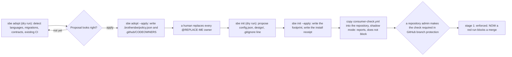
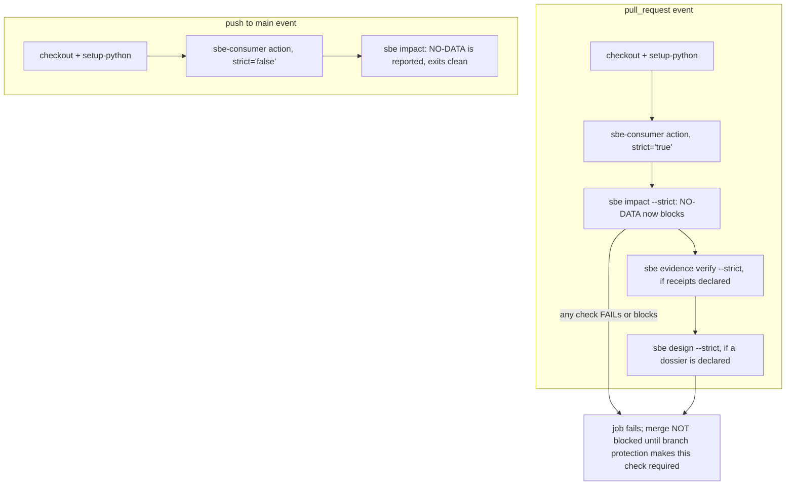

# The platform lead's deep dive

## Forty repositories, one footprint

You are not shipping a feature today. You are deciding whether forty
repositories, owned by people who have never met, should pick up the same
evidence discipline the earlier chapters walked one engineer through. That
is a job about proposals, receipts, and refusals: what this tool offers a
repository it has never seen, what it writes only when told to, and what it
refuses to guess just because a filesystem is in front of it.

Everything below is real, run against a throwaway copy of a repository,
seeded the same deliberate way earlier chapters do, so this page names no
client's codebase and no person's real git identity.

```bash
rm -rf /tmp/sbe-book-ch15-repo && mkdir -p /tmp/sbe-book-ch15-repo
git -C /tmp/sbe-book-ch15-repo init -q
git -C /tmp/sbe-book-ch15-repo config user.email "estate@example.invalid"
git -C /tmp/sbe-book-ch15-repo config user.name "Estate Seed"
cp docs/book/estate/pipeline.py docs/book/estate/api.py docs/book/estate/test_estate.py /tmp/sbe-book-ch15-repo/
git -C /tmp/sbe-book-ch15-repo add pipeline.py api.py test_estate.py
GIT_AUTHOR_NAME="Estate Seed" GIT_AUTHOR_EMAIL="estate@example.invalid" GIT_AUTHOR_DATE="2026-07-01T00:00:00" GIT_COMMITTER_NAME="Estate Seed" GIT_COMMITTER_EMAIL="estate@example.invalid" GIT_COMMITTER_DATE="2026-07-01T00:00:00" git -C /tmp/sbe-book-ch15-repo commit -q -m "seed a client repository the platform lead is onboarding"
echo "seeded $(git -C /tmp/sbe-book-ch15-repo rev-parse --short=12 HEAD)"
```

```
seeded c00f6a220b7c
```

Three Python files, one commit, a fixed author date so the commit hashes
the same way every time this page is rebuilt. That is the entire "client
repository" for this chapter.

## Adopt: a report, never a change

`sbe adopt` is read-only. It looks at a tree, guesses its stack (languages,
migrations, existing CI), and proposes two files: a starter policy and a
CODEOWNERS list (who GitHub should ask to review each path). Dry run is the
default; nothing is written without `--apply`. The full report includes a
complete diff of both proposed files, real but long, so a real `grep` keeps
only the summary lines here:

```bash
bin/sbe adopt /tmp/sbe-book-ch15-repo | grep -E "^(sbe adopt:|  languages|  migrations|  PROPOSED|  PROTECTION|  LOCAL|  NOT-PROPOSED)"
```

```
sbe adopt: /tmp/sbe-book-ch15-repo
  languages: Python(3)
  migrations: False, dbt models: False, api contracts: False, ci workflows: False
  PROPOSED  .brothersbe/policy.json (new file)
  PROPOSED  .github/CODEOWNERS (new file)
  PROTECTION branch-protection            UNVERIFIABLE-HERE
  PROTECTION required-status-checks       UNVERIFIABLE-HERE
  PROTECTION codeowners-review-required   UNVERIFIABLE-HERE
  LOCAL      git-repository               PRESENT
  LOCAL      codeowners-file              ABSENT
  LOCAL      product-ci-workflow          ABSENT
  LOCAL      consumer-ci-workflow         ABSENT
  NOT-PROPOSED evidenceSchemas            no such path under this root: src/brothersbe/evidence.py, src/brothersbe/__init__.py
  NOT-PROPOSED hooks                      no such path under this root: hooks/
  NOT-PROPOSED manifest                   no such path under this root: .claude-plugin/plugin.json
  NOT-PROPOSED releaseFiles               no such path under this root: VERSION, CHANGELOG.md, CHECKSUMS.sha256
  NOT-PROPOSED workflows                  no such path under this root: .github/workflows/, .github/actions/
sbe adopt: dry run, nothing written. Rerun with --apply to write, or --apply --force to overwrite a file that already exists and differs.
```

Read the three `PROTECTION` lines first. Whether GitHub's branch
protection actually requires this check, blocks a force push, or requires
review from a code owner are settings on GitHub's own servers, not on a
filesystem, and this tool holds no GitHub credentials and asks for none.
It never guesses PRESENT from a local clue such as a CODEOWNERS file
existing; it says `UNVERIFIABLE-HERE`, by name, every time
(`src/brothersbe/adopt.py`, the `protections` list at line 357, whose own
kill criterion says it plainly: "the report must never claim a protection
is PRESENT when the GitHub API was never asked").

The `NOT-PROPOSED` lines matter too: this tiny repository has no
`.github/workflows/` and no `VERSION` file, so nothing invents a CODEOWNERS
rule over a path that does not exist. A rule protecting a ghost path
protects nothing while looking like it does, and every category this scan
could not find a real path for is named, not silently dropped.

> Expert note: fleet rollout order. `docs/ROLLOUT.md` sequences adoption
> risk-first, not feature-first. Stage 0 copies the CI workflow in "shadow
> mode": it reports on every pull request and blocks nothing, because every
> gate here has so far been proven against this project's own fixtures, not
> against forty strangers' codebases. Only after a real sprint or two of
> trustworthy shadow output does stage 1 make the check required, a GitHub
> branch-protection click a human makes, never something this tool flips on
> its own. `sbe adopt` is stage 2, optional, runnable before, during, or
> after stage 1. The order exists so a repository's first experience of
> this tool is a report, not a blocked pull request nobody was warned about.

## Diagram: the adoption pipeline



## Init: the footprint that follows the proposal

`sbe adopt` proposes a policy; `sbe init` writes the tool's own local
footprint, the config file and the dossier folder (`design/`) that the
design checks read. Same discipline: dry run first, nothing written until
`--apply`.

```bash
bin/sbe init /tmp/sbe-book-ch15-repo
```

```
sbe init: /tmp/sbe-book-ch15-repo
  PROPOSED  .brothersbe/config.json (new file)
  PROPOSED  design/.gitkeep (new file)
  PROPOSED  .gitignore (new file)

sbe init: dry run, nothing written. Rerun with --apply to write.
```

```bash
bin/sbe init /tmp/sbe-book-ch15-repo --apply
```

```
  WROTE .brothersbe/config.json
  WROTE design/.gitkeep
  WROTE .gitignore
  WROTE .brothersbe/install-receipt.json

sbe init: installed. Uninstall with:
  rm -f .brothersbe/config.json
  rm -f design/.gitkeep
  rm -f .brothersbe/install-receipt.json
```

Run `--apply` a second time over an unchanged tree and it writes nothing,
because every proposal is deterministic content with no timestamp baked in:
two runs against the same tree propose byte-identical files
(`src/brothersbe/initcmd.py`, module docstring). A rerun that changes
nothing on a clean tree is the whole idempotence promise, proven, not just
claimed.

One written file is not deterministic on purpose: the install receipt, the
one artifact allowed to carry a timestamp, because it records a fact about
this run, not a proposal. Read it by asking the tool to show it, never by
paraphrase:

```bash
python3 -m json.tool /tmp/sbe-book-ch15-repo/.brothersbe/install-receipt.json | sed -E 's/"installedAt": "[^"]*"/"installedAt": "<installed-at>"/'
```

```
{
    "installedAt": "<installed-at>",
    "installedInto": "/tmp/sbe-book-ch15-repo",
    "schemaVersion": "1.0",
    "tool": "sbe init",
    "toolVersion": "1.0.0-rc.7",
    "uninstallInstructions": [
        "rm -f .brothersbe/config.json",
        "rm -f design/.gitkeep",
        "rm -f .brothersbe/install-receipt.json"
    ],
    "writtenPaths": [
        ".brothersbe/config.json",
        "design/.gitkeep",
        ".brothersbe/install-receipt.json"
    ]
}
```

(The real timestamp is masked above, the same way earlier chapters mask a
real duration: genuine, and never the same string twice.) Two things worth
noticing. `.gitignore` is not in `writtenPaths`: this command appended one
line to a file it does not own, and an uninstall instruction to delete
`.gitignore` outright would take every other line a real project keeps
there with it. And the receipt names itself: `uninstallInstructions`
includes removing the receipt, because a receipt that omitted its own
existence would not be an exact record of what changed.

## Is the tool itself trustworthy?

Before rolling any of this out, a platform lead has a question that has
nothing to do with the client repository: is this copy of BrotherSBE the
one actually published, or did something change underneath it?
`scripts/verify-install.sh` checks the files themselves, byte for byte,
against a manifest of SHA256 hashes `scripts/checksums.sh` generates at
release time. Neither reaches a network; both are read-only.

To keep this page reproducible on any machine, the demonstration below runs
both real, unmodified scripts against a small scratch copy rather than this
whole repository, whose file count changes with every commit anyone makes
to it. In real operation these two scripts check a full installed clone,
exactly as `docs/for-engineers/01-install-and-first-run.md` shows against
this project's own installation.

```bash
rm -rf /tmp/sbe-book-ch15-release && mkdir -p /tmp/sbe-book-ch15-release/scripts
cp scripts/checksums.sh scripts/verify-install.sh /tmp/sbe-book-ch15-release/scripts/
cp docs/book/estate/pipeline.py docs/book/estate/api.py /tmp/sbe-book-ch15-release/
chmod +x /tmp/sbe-book-ch15-release/scripts/*.sh
( cd /tmp/sbe-book-ch15-release && scripts/checksums.sh CHECKSUMS.sha256 )
( cd /tmp/sbe-book-ch15-release && scripts/verify-install.sh ) 2>&1
```

```

verify-install: checked against /tmp/sbe-book-ch15-release/CHECKSUMS.sha256
verify-install: 4 file(s) match, 0 mismatched, 0 missing, 0 extra (present on disk, absent from the manifest), 0 non-regular (a symlink or pipe the manifest cannot hash)
verify-install: the excluded paths (*/__pycache__/*, .superpowers/, docs/superpowers/, .claude/ and .brothermode/ (harness-written local state, and NOTE that a linked git worktree under .claude/worktrees/ puts whole source trees inside an excluded path, which is why the excluded-source count below can be large and is reported rather than assumed harmless), .brothersbe/install-receipt.json (the local install record, gitignored because it names this machine's absolute path), the built book and the book estate's two generated data files (all three are build outputs regenerated on every run, never fixtures), docs/book/.replay-*.sh (scratch the excerpt replay harness writes beside a chapter while re-executing its blocks and removes when it finishes), and files named .DS_Store, *.pyc, STATE.md, ~$*, *.docx; .git/ not enumerated) currently hold 0 entr(y/ies) of any type, 0 of them source code and 0 of them non-regular (a symlink or pipe this check cannot hash).
verify-install: PASSED. Every file the manifest names matches on disk,
verify-install: and no file exists on disk that the manifest does not name,
verify-install: outside the excluded paths enumerated above (their current
verify-install: file count is printed on every run, and source code among
verify-install: them fails this check).
verify-install: a manifest records CONTENT, not file mode: a data file that arrived with the execute bit set still matches its hash here, so this says the bytes are the published bytes and says nothing about permissions.
verify-install: this does not prove the manifest itself is authentic; it proves your files match whatever manifest you pointed this at. Get the manifest from the release you trust (the tag's git history, or a release asset), not from the same untrusted channel as the code.
```

`PASSED` checks two directions, not one: every file the manifest names
matches on disk, and no file exists on disk the manifest never named. That
second direction is the one a naive check skips, and skipping it is
exactly the shape of a planted file sitting quietly beside a real
installation. Watch what one changed byte does to the verdict:

```bash
printf '\n# a byte changed after the manifest was cut\n' >> /tmp/sbe-book-ch15-release/pipeline.py
( cd /tmp/sbe-book-ch15-release && scripts/verify-install.sh ) 2>&1
```

```
MISMATCH:  pipeline.py

verify-install: checked against /tmp/sbe-book-ch15-release/CHECKSUMS.sha256
verify-install: 3 file(s) match, 1 mismatched, 0 missing, 0 extra (present on disk, absent from the manifest), 0 non-regular (a symlink or pipe the manifest cannot hash)
verify-install: the excluded paths (*/__pycache__/*, .superpowers/, docs/superpowers/, .claude/ and .brothermode/ (harness-written local state, and NOTE that a linked git worktree under .claude/worktrees/ puts whole source trees inside an excluded path, which is why the excluded-source count below can be large and is reported rather than assumed harmless), .brothersbe/install-receipt.json (the local install record, gitignored because it names this machine's absolute path), the built book and the book estate's two generated data files (all three are build outputs regenerated on every run, never fixtures), docs/book/.replay-*.sh (scratch the excerpt replay harness writes beside a chapter while re-executing its blocks and removes when it finishes), and files named .DS_Store, *.pyc, STATE.md, ~$*, *.docx; .git/ not enumerated) currently hold 0 entr(y/ies) of any type, 0 of them source code and 0 of them non-regular (a symlink or pipe this check cannot hash).
verify-install: FAILED. Do not trust this installed copy until you understand why the files above differ from the published manifest.
```

One appended comment line and the verdict flips to `FAILED`, named by
file. This does not prove nobody could ever fake a manifest to match a
tampered file; it proves the ordinary case is caught: a file quietly
edited after the manifest that describes it was already cut.

The environment question is `sbe doctor`'s job, run here in a scratch
identity so this page names no real person's git configuration:

```bash
ROOT="$(pwd)"
( cd /tmp/sbe-book-ch15-repo && env -u BROTHERSBE_VAULT BROTHERSBE_PRIVATE_NAMES_FILE=/tmp/sbe-book-ch15-repo/no-such-file python3 "$ROOT/bin/sbe" doctor )
```

```
python           PASS     3.9.6 (floor is 3.9)
tools            PASS     all present in /Users/khalil.maaouni/Documents/BrotherSBE/tools
plugin-manifest  PASS     manifest 1.0.0-rc.7, VERSION 1.0.0-rc.7
git              PASS     working directory is inside a git tree
identity         PASS     git config reports name "Estate Seed" and email "estate@example.invalid"
vault            NO-DATA  BROTHERSBE_VAULT is unset, so telemetry, session logs and resume briefs have nowhere durable to go
private-names    NO-DATA  no private-name list, so the publish leak check scans nothing

sbe 1.0.0-rc.7, evidence schema 1.0. 7 check(s): 5 PASS, 0 FAIL, 2 NO-DATA.
```

`vault` and `private-names` read `NO-DATA`, not `FAIL`. Neither is broken;
this run deliberately unset the vault path and pointed the private-name
list at a file that does not exist, and `doctor` says exactly that by
name, never folding an unanswered question into a passing result.

## Wiring a consumer repository's CI

`sbe adopt` and `sbe init` prepare a repository. What runs on every pull
request is a short, real file this project ships and a client repository
copies in whole: `.github/workflows/consumer-check.yml`. Quoting it
exactly:

```bash
cat .github/workflows/consumer-check.yml
```

```
# What a CLIENT repository copies or calls after installing BrotherSBE. This
# is the consumer path, not the product path: it runs ONLY sbe impact, sbe
# evidence verify (when receipts exist), sbe status (once wave 8 ships it,
# guarded until then), and the design checks in strict mode when a dossier is
# declared, all via the composite action at .github/actions/sbe-consumer. It
# never runs tools/test_sbe*.py or evals/run_evals.py: those prove
# BrotherSBE's own tools are correct against BrotherSBE's own repository, and
# a client repository has neither.
#
# HONEST LIMIT, same one docs/KNOWN-LIMITS.md states for the product workflow
# (L16, "The CI workflow guards nothing until you copy it"): this workflow can
# fail its job, but nothing here makes passing it a requirement to merge.
# That is a branch protection setting on the repository that copied this
# file in, and copying the file does not turn the setting on. `sbe adopt`
# reports the same limit under `protections` as UNVERIFIABLE-HERE.
#
# Hardening matches brothersbe-gates.yml: actions pinned to full commit SHAs
# (verified against the live repositories with `git ls-remote` on
# 2026-07-27, the trailing comment names the tag), permissions read-only.
name: BrotherSBE consumer checks
permissions:
  contents: read
on:
  pull_request:
  push:
    branches: [main]
jobs:
  consumer-checks:
    runs-on: ubuntu-latest
    steps:
      - uses: actions/checkout@11d5960a326750d5838078e36cf38b85af677262 # v4
        with:
          fetch-depth: 0
      - uses: actions/setup-python@a26af69be951a213d495a4c3e4e4022e16d87065 # v5
        with:
          python-version: '3.x'
      # sbe-path: '.' assumes BrotherSBE's own bin/sbe is checked out at the
      # repository root, which is true here because this workflow is running
      # inside BrotherSBE's own repository as its own reference example. A
      # client repository that vendors BrotherSBE elsewhere (a submodule, a
      # sparse checkout, a plugin path) points sbe-path there instead.
      # Strict only where a proposed change exists to grade. On a pull request
      # the diff is the change, and under --strict the impact step blocks a
      # NO-DATA only when it holds something nobody declared: detector hits
      # proposing a tier above T0 with no intake to reconcile them against, or
      # a diff it could not read at all. A NO-DATA whose derived answers are
      # all at their lowest values (a docs or data only diff no detector
      # covers) exits 0 even under --strict, because this project's law is
      # that NO-DATA never decides an exit code. Before 1.0.0-rc.1 it exited 1
      # there, and every docs-only pull request through this workflow went
      # red. A push to main has no proposal: its self-diff is empty, and
      # grading that emptiness under --strict manufactures a failure out of
      # absence, which the same law forbids. The first real run of this
      # workflow failed exactly that way.
      - uses: ./.github/actions/sbe-consumer
        with:
          sbe-path: '.'
          strict: ${{ github.event_name == 'pull_request' && 'true' || 'false' }}
          # This repository now declares its own intake, so it is graded the way
          # a client repository is rather than exempt from its own rule. Without
          # it, any pull request touching a CI pipeline file proposes a tier
          # above T0, finds nothing to reconcile that proposal against, and
          # blocks under --strict with a NO-DATA that names a real gap: nobody
          # declared what this change is. The proposed tier is a floor, so a
          # declared T3 covers every proposal a detector can raise here.
          intake: design/final-release-program/00-intake.json
          dossier: design/final-release-program
```

Read the last line first: `strict` is `'true'` on a pull request and
`'false'` on a push to main. That switch is the answer to "what does
NO-DATA do to an exit code," read straight from the composite action this
workflow calls:

```bash
grep -n -A3 "^  strict:" .github/actions/sbe-consumer/action.yml
```

```
56:  strict:
57-    description: >-
58-      'true' passes --strict to sbe impact and sbe evidence verify. For
59-      evidence verify that makes NO-DATA block too. For impact it blocks a
```

"Making NO-DATA block too" is two lines of code, not folklore:
`return EXIT_CONTROL_FAILED if data["verdict"] == "NO-DATA" and args.strict
else EXIT_OK` (`src/brothersbe/cli.py`, `_cmd_impact`, lines 451 to 454). On
a pull request, an unanswered question blocks the merge. On a push to main,
where there is no proposed change to grade, the same unanswered question
exits clean, because grading an empty diff under strict rules manufactures
a failure out of nothing, and the workflow's own comment says a real run of
this exact page once failed exactly that way before the fix landed.

## Diagram: the gate placement map



> Expert note: pinning versus tracking. Every action this workflow calls is
> pinned to a full commit SHA, tag named only in a trailing comment. The
> same choice belongs one level up: does an adopting organization's own
> copy track this project's `main`, or pin to a release tag such as
> `v1.0.0-rc.2`? `docs/ROLLOUT.md` documents upgrade and rollback assuming a
> pin (`git checkout v<new-version>`, then `scripts/verify-install.sh` must
> print `PASSED` again before trusting it); tracking `main` trades that
> verification step for convenience and inherits whatever lands there,
> untested against your estate, the same day it lands here.

## Refusals with a lesson: policy and exceptions

Two more surfaces exist in `sbe`'s own help text: `policy`, to validate a
policy file against a schema, and `exceptions`, to list exceptions with
their owners and expiry. Run either one today, for real:

```bash
bin/sbe policy 2>&1
```

```
sbe policy: NOT BUILT. The policy schema does not exist yet.
This lands in wave 3 of the plugin conversion. It is listed here rather than hidden so nobody has to guess whether it exists, and it exits 3 rather than printing an empty result, because a command that succeeds at nothing is the failure this project exists to stop.
```

```bash
bin/sbe exceptions 2>&1
```

```
sbe exceptions: NOT BUILT. Exceptions are still free-form exemption files with no owner, approver or expiry to list.
This lands in wave 4 of the plugin conversion. It is listed here rather than hidden so nobody has to guess whether it exists, and it exits 3 rather than printing an empty result, because a command that succeeds at nothing is the failure this project exists to stop.
```

Both exit 3. Neither is a bug to feel bad about. The alternative a lot of
tools choose is worse: print an empty list and let a reader believe "no
exceptions" means "nothing was granted" instead of "nothing here can even
be asked yet." The rule for a command that has not shipped is to say so by
name, name the wave it lands in, and refuse loudly rather than succeed at
nothing.

Read the `exceptions` refusal again: it already names the gap. Today, an
exemption is a free-form reason string in a file called `.sbe-exempt`
(chapter eight showed one waiving a hard gate), and that file carries no
owner, no approver, no expiry date anything reads. `docs/BYPASS-COVERAGE.md`
states this plainly as an open row: "there is no expiry field, no owner
field and no approver field," and "an exemption whose own reason says it
expired two years ago still waives its checks." That is a limit this
project's own coverage table names about itself.

This is the standard to hold any vendor's exception mechanism to,
including this one once wave 4 ships. A real exception needs five things,
not one free-form sentence:

- **Owner**: who asked for the exception, by name.
- **Approver**: someone other than the owner, because approving your own
  exception is not review.
- **Expiry**: a date after which it stops working on its own, not a date a
  human has to remember to enforce by hand.
- **Scope**: exactly what is exempted, named precisely enough that it
  cannot quietly cover more than what was approved.
- **Compensating control**: what stands in for the check while it is off,
  so "we are not checking this" is never the whole sentence.

Score any exception file, from any vendor, against those five fields. A
`reason: this is temporary` string with no expiry is not an exception; it
is a permanent bypass wearing an exception's name.

## Diagram: the escalation swimlane

```mermaid
sequenceDiagram
  participant Eng as engineer
  participant Lead as platform lead
  participant Owner as exception owner
  participant App as approver
  Eng->>Lead: this gate blocks a real deadline; we need an exception
  Lead->>Eng: sbe exceptions: NOT BUILT (wave 4). Today: .sbe-exempt, a reason string only
  Lead->>Owner: name the five fields anyway, by hand, before this ships as policy
  Owner->>App: owner, approver, expiry, scope, compensating control, all named
  App-->>Owner: approved, dated, scoped, with a control in place
  Owner-->>Lead: exemption recorded, reason names all five fields
  Lead-->>Eng: gate waived, WAIVED not PASS, reason visible in every run
```

## Infrastructure as validatable JSON

A platform lead's proposals are not always source code. Terraform (a tool
describing cloud infrastructure as text) accepts JSON as an alternative
syntax, extension `.tf.json`. Write one, for real, and check it parses:

```bash
mkdir -p /tmp/sbe-book-ch15-infra
cat > /tmp/sbe-book-ch15-infra/evidence-bucket.tf.json <<'EOF'
{
  "resource": {
    "aws_s3_bucket": {
      "evidence_receipts": {
        "bucket": "example-org-sbe-evidence-receipts",
        "force_destroy": false
      }
    },
    "aws_s3_bucket_versioning": {
      "evidence_receipts": {
        "bucket": "${aws_s3_bucket.evidence_receipts.id}",
        "versioning_configuration": {
          "status": "Enabled"
        }
      }
    },
    "aws_s3_bucket_public_access_block": {
      "evidence_receipts": {
        "bucket": "${aws_s3_bucket.evidence_receipts.id}",
        "block_public_acls": true,
        "block_public_policy": true,
        "ignore_public_acls": true,
        "restrict_public_buckets": true
      }
    }
  }
}
EOF
python3 -m json.tool /tmp/sbe-book-ch15-infra/evidence-bucket.tf.json
```

```
{
    "resource": {
        "aws_s3_bucket": {
            "evidence_receipts": {
                "bucket": "example-org-sbe-evidence-receipts",
                "force_destroy": false
            }
        },
        "aws_s3_bucket_versioning": {
            "evidence_receipts": {
                "bucket": "${aws_s3_bucket.evidence_receipts.id}",
                "versioning_configuration": {
                    "status": "Enabled"
                }
            }
        },
        "aws_s3_bucket_public_access_block": {
            "evidence_receipts": {
                "bucket": "${aws_s3_bucket.evidence_receipts.id}",
                "block_public_acls": true,
                "block_public_policy": true,
                "ignore_public_acls": true,
                "restrict_public_buckets": true
            }
        }
    }
}
```

`python3 -m json.tool` (a Python standard library module) only proves this
file is syntactically valid JSON. It does not prove the bucket exists, the
policy is correct, or Terraform accepts every field name. That narrow,
honest claim is exactly this project's habit: a mechanical check earns
exactly what it checked, never more. Same for a Kubernetes manifest (a
JSON or YAML file describing a workload for a container-orchestration
cluster), also written as plain JSON:

```bash
cat > /tmp/sbe-book-ch15-infra/gate-runner.k8s.json <<'EOF'
{
  "apiVersion": "batch/v1",
  "kind": "CronJob",
  "metadata": {
    "name": "sbe-consumer-gate-nightly",
    "namespace": "platform-ci"
  },
  "spec": {
    "schedule": "0 3 * * *",
    "jobTemplate": {
      "spec": {
        "template": {
          "spec": {
            "restartPolicy": "Never",
            "containers": [
              {
                "name": "sbe-verify",
                "image": "example-org/sbe-runner:pinned-sha",
                "command": ["bin/sbe", "verify", "."]
              }
            ]
          }
        }
      }
    }
  }
}
EOF
python3 -m json.tool /tmp/sbe-book-ch15-infra/gate-runner.k8s.json
```

```
{
    "apiVersion": "batch/v1",
    "kind": "CronJob",
    "metadata": {
        "name": "sbe-consumer-gate-nightly",
        "namespace": "platform-ci"
    },
    "spec": {
        "schedule": "0 3 * * *",
        "jobTemplate": {
            "spec": {
                "template": {
                    "spec": {
                        "restartPolicy": "Never",
                        "containers": [
                            {
                                "name": "sbe-verify",
                                "image": "example-org/sbe-runner:pinned-sha",
                                "command": [
                                    "bin/sbe",
                                    "verify",
                                    "."
                                ]
                            }
                        ]
                    }
                }
            }
        }
    }
}
```

Neither file was applied to a real cloud account or cluster while writing
this page. That is a different action, one this book cannot run:

```text
NOT EXECUTED HERE:
$ terraform apply -var-file=prod.tfvars evidence-bucket.tf.json
$ kubectl apply -f gate-runner.k8s.json --namespace platform-ci
```

Validating the JSON tells you the file will parse. Applying it tells you
whether your cloud account accepts it, whether the bucket name is already
taken globally, whether the namespace exists. Different questions; this
book only claims to have answered the first for real.

## Upgrade and rollback, quoted rather than re-run

`scripts/test-upgrade-rollback.sh` rehearses installing a previous release
tag, upgrading to the current commit, then rolling back, verifying with
`scripts/verify-install.sh` at every step. Running that rehearsal here
would mean checking out real tags inside this book's own repository
mid-chapter, not a risk worth taking for a demonstration. Here is what this
project's own release notes already say, verbatim, quoted rather than
re-run:

```text
From docs/ROLLOUT.md, "Upgrade and rollback":

"Two tags exist: v1.0.0-rc.1 (commit dacee900, cut and published
2026-07-31, predating the guided skills) and v1.0.0-rc.2 (cut 2026-08-01
at the release that carries the guided skills, the beginner explainer,
and the help map; it publishes with that release). The script finds the
newest ancestor tag and exercises the real upgrade and rollback path, not
the NO-DATA case."

From scripts/test-upgrade-rollback.sh, the script's own success line:

"test-upgrade-rollback: PASSED. $PREV_TAG -> HEAD -> $PREV_TAG, each step
archived into a fresh directory and verified with scripts/verify-install.sh,
nothing written outside the one temporary directory this script created
and removed on exit."
```

Read the second quote as source code, not a captured run: the exact
template the script prints on success, `$PREV_TAG` substituted at run time.
The honest caveat sits in the script's own header too: before this
repository had cut any tag, running this same script printed `NO-DATA`
instead, named the reason (no previous release to upgrade from), and
exited 0 without ever claiming an upgrade was tested. Both branches are
real code today; only one was true before the first tag existed.

For an adopting organization, the procedure is three commands, and
`docs/ROLLOUT.md` states the check that must pass after each one:

Pin to a tag that is actually published, not to one you remember. A tag can
exist on the maintainer's machine and never have been pushed, and a clone
pinned to an unpublished tag fails on the first command. Ask the remote which
tags it has, then substitute the one you saw:

```text
NOT EXECUTED HERE (these act on a real clone's git history, not this sandbox):
git ls-remote --tags <repository-url>
git clone --branch <tag> --depth 1 <repository-url> ~/.claude/skills/brothersbe
cd ~/.claude/skills/brothersbe && scripts/verify-install.sh   # must print PASSED
git fetch --tags && git checkout v<new-version>
scripts/verify-install.sh                                      # must print PASSED
git checkout v<previous-version>
scripts/verify-install.sh                                      # must print PASSED
```

`verify-install.sh` printing `PASSED` after every step is the control
here, not a document promising the upgrade is safe. A rollback that
skipped this step is a guess about what is actually on disk, and this book
has argued against exactly that kind of guess since chapter one.

> Expert note: the one-writer law at organization scale. Chapter seven's
> task registry enforces one writer per file inside a single repository:
> two engineers cannot both claim `pipeline.py`, and `sbe task open`
> refuses the second claim outright. Nothing here extends that registry
> across repositories, and it should not pretend to: forty repositories are
> forty separate git histories, forty separate registries, no shared lock
> between them. What scales is the discipline, not the registry itself. A
> platform lead rolling this out to forty teams is asking every one of them
> to keep the same promise chapter seven's engineers kept by hand: one
> person owns a change, everyone else queues behind it, and a closed task's
> clean claim is checked by reading the diff, never by asking the writer to
> remember. Forty repositories need forty copies of that discipline, not
> one registry stretched thin across all of them.

## What this chapter did not claim

Nothing here ran against a real GitHub repository, cloud account, or
Kubernetes cluster. `sbe adopt`'s protection checks stay
`UNVERIFIABLE-HERE` for exactly the same reason on any of the forty
repositories a platform lead actually touches: reading a branch protection
setting takes a token and admin rights this tool does not hold and does
not ask for. `policy` and `exceptions` do not exist yet, and the five-field
exception shape this chapter taught is a standard to build toward, not a
description of anything shipped today. A platform lead's job is knowing
which of those two sentences applies to any given line of output, and never
letting a report's confident tone stand in for a question nobody actually
answered. The next chapter turns from one platform to the people running
it: three engineers and a set of running agents, shipping a quarter of
changes without trampling each other's work.
