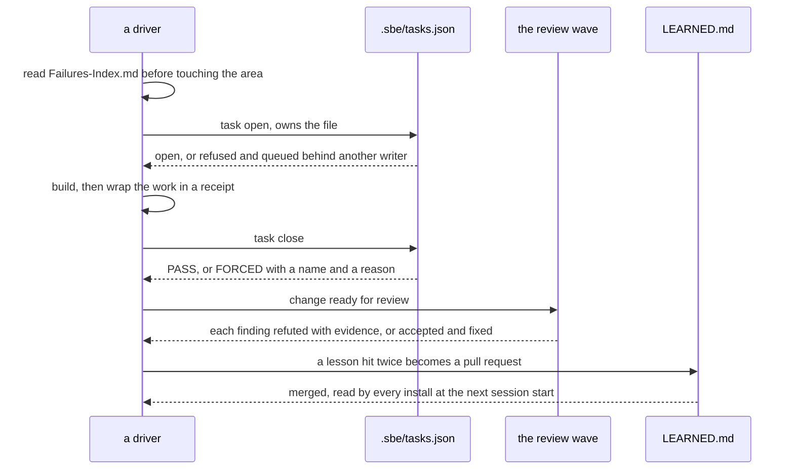
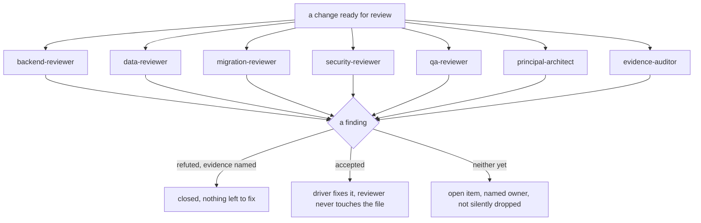
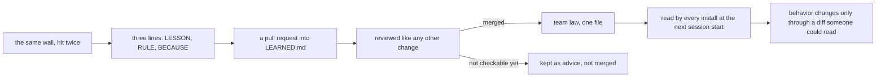

# Working as one team

## What chapter eleven already showed

Chapter eleven put the whole cast on one change and made one point: the
registry never asks whether the writer behind a claim is a person or a
model, because one writer per file, checked against the real tree, means
the same thing either way. This chapter does not reopen that point. It is
the practicum: a three-person team plus a Claude session or two, running a
quarter's worth of changes without trampling each other, told through the
scenes that actually happen on a Tuesday, and the mechanics that make each
one survive contact with a second person.

## The morning ritual

Before anyone opens a task, they read. Chapter ten named the file:
`Failures-Index.md`, the one page in the vault whose whole job is "read
this before working an area." It is not a to-do list and it is not a
retrospective; it is the list of mistakes this project already paid for,
kept where the next person touching the same code sees it before they pay
for it again. A driver who skips this step is not breaking a rule the tool
enforces. Nothing here gates on it. It is the one habit in this chapter
that no command checks, which is exactly why it is named first: everything
after this point is mechanical because a human already did the part a
machine cannot.

## Claiming work

The registry answers one question honestly: who owns this file right now.
Everything below runs against a throwaway copy of the estate, the same
pattern chapters seven and eleven already used, so this book's own
mid-loop repository never gets confused for the demo.

```bash
ROOT="$(pwd)"
rm -rf /tmp/sbe-book-ch16-repo && mkdir -p /tmp/sbe-book-ch16-repo
cd /tmp/sbe-book-ch16-repo
git init -q
git config user.email "estate@example.invalid"
git config user.name "Estate Seed"
cp "$ROOT/docs/book/estate/pipeline.py" .
cp "$ROOT/docs/book/estate/api.py" .
cp "$ROOT/docs/book/estate/test_estate.py" .
git add pipeline.py api.py test_estate.py
export GIT_AUTHOR_NAME="Estate Seed" GIT_AUTHOR_EMAIL="estate@example.invalid"
export GIT_COMMITTER_NAME="Estate Seed" GIT_COMMITTER_EMAIL="estate@example.invalid"
export GIT_AUTHOR_DATE="2026-07-01T00:00:00" GIT_COMMITTER_DATE="2026-07-01T00:00:00"
git commit -q -m "seed the team demo with a copy of the estate"
BASE="$(git rev-parse HEAD)"
echo "base commit $BASE"
```

```
base commit fd21ccb65a97a274c602f95669f32f44423f4b1d
```

One engineer, call her engineer-a, has a fix queued for the daily totals
job. She claims the one file it touches before she writes a line:

```bash
python3 "$ROOT/bin/sbe" task open --id fix-totals --agent engineer-a --role writer --base "$BASE" --verify "python3 pipeline.py --date 2026-07-01" --owns pipeline.py --cwd .
```

```
sbe task open: fix-totals is open. engineer-a (writer) owns 1 path(s): pipeline.py. Base fd21ccb65a97. Close runs the diff postcondition against exactly this declaration.
```

Nothing has been written yet. What exists now is a claim: this file, this
base commit, this command that will prove the work when it is done. That
claim is the whole mechanism, and it is about to be tested by the one
scene every team eventually runs into.

## What happens when two people want the same file the same afternoon

Engineer-b needs to patch the exact same function that same afternoon, for
an unrelated reason. She reaches for the same file:

```bash
python3 "$ROOT/bin/sbe" task open --id patch-totals --agent engineer-b --role writer --base "$BASE" --verify "python3 pipeline.py --date 2026-07-01" --owns pipeline.py --cwd . 2>&1
```

```
sbe task open: refused. Owned path 'pipeline.py' overlaps 'pipeline.py', owned by open task 'fix-totals' (agent engineer-a). One writer per file; queue behind it or narrow the claim.
```

Exit code 2. Read the refusal for what it does not say: it does not ask
who has the better reason, and it does not ask which change is more
urgent. Two people wanting the same file is not a merge problem to solve
later with a diff tool; it is a claim conflict, refused at write time,
before either edit exists to conflict. The answer this tool gives is never
"work it out between yourselves in parallel." It is queue behind the
existing claim, or narrow yours so it no longer overlaps. Parallel writes
to one file are not a faster path around this refusal; they are the exact
failure the refusal exists to prevent, because a tree two people are
editing at once is a tree neither of their diffs can be checked against
honestly.

Engineer-a finishes first. Her actual change is a one-line note next to
the function she reviewed, small on purpose so the point stays about the
registry and not about the diff:

```bash
python3 - <<'PATCH'
path = "pipeline.py"
text = open(path).read()
old = "def run(date):\n    ensure_source()"
new = "def run(date):\n    # reviewed alongside the partner export change; no behavior touched here\n    ensure_source()"
assert old in text
open(path, "w").write(text.replace(old, new, 1))
PATCH
python3 "$ROOT/bin/sbe" task close fix-totals --cwd .
```

```
  IN-SCOPE   pipeline.py
sbe task close fix-totals: PASS. 1 changed path(s), all inside the declaration. Closed clean.
```

The moment `fix-totals` closes, the path is free, and the queue clears
itself, mechanically, with no message sent and no meeting held:

```bash
BASE2="$(git rev-parse HEAD)"
python3 "$ROOT/bin/sbe" task open --id patch-totals --agent engineer-b --role writer --base "$BASE2" --verify "python3 pipeline.py --date 2026-07-01" --owns pipeline.py --cwd .
```

```
sbe task open: patch-totals is open. engineer-b (writer) owns 1 path(s): pipeline.py. Base fd21ccb65a97. Close runs the diff postcondition against exactly this declaration.
```

```bash
python3 "$ROOT/bin/sbe" task list --cwd .
```

```
patch-totals         engineer-b writer   base fd21ccb65a97  owns: pipeline.py
1 open task(s). Expiry is informational: nothing here deletes on a clock.
```

`patch-totals` is now the only open task, base rebound to the commit
engineer-a's close actually produced, not the stale one she started from.
Nobody edited a shared document to hand this file over. The second claim
simply became legal the instant the first one closed, and the registry
never had to know that "engineer-b was waiting" meant anything more than
"this path had no open owner."

> Expert note: running more than one Claude session against one tree. The
> registry does not care whether the writer typing `task open` is a person
> or a session, the same fact as always. What it does care about
> is that two sessions sharing one working directory can still stomp each
> other between the moment one reads a file and the moment it writes it,
> because the fence only ever checks a committed diff, not a live edit in
> progress. `--worktree` on `sbe task open` records an absolute path to
> that task's own worktree, precisely so a second session pointed at the
> shared tree is not the only option: `git worktree` gives each claim a
> physically separate checkout, so two sessions can build at the same time
> without either one's half-written file ever appearing in the other's
> view. The registry still enforces one writer per file at close time; the
> worktree is what keeps the minutes before that close from colliding too.

## The team's day, end to end



## The review wave

A change does not wait for one generalist to bless it. It goes to seven
read-only reviewers, named from `agents/` in this repository, each with
one job and no write access to anything:

```bash
( cd "$ROOT" && grep -n "^tools:" agents/*.md | sort )
```

```
agents/backend-reviewer.md:4:tools: [Read, Grep, Glob, Bash]
agents/data-reviewer.md:4:tools: [Read, Grep, Glob, Bash]
agents/evidence-auditor.md:4:tools: [Read, Grep, Glob, Bash]
agents/migration-reviewer.md:4:tools: [Read, Grep, Glob, Bash]
agents/principal-architect.md:4:tools: [Read, Grep, Glob, Bash]
agents/qa-reviewer.md:4:tools: [Read, Grep, Glob, Bash]
agents/security-reviewer.md:4:tools: [Read, Grep, Glob, Bash]
```

`Read, Grep, Glob, Bash`, on all seven, nowhere a `Write` or an `Edit`:

```bash
( cd "$ROOT" && grep -l "Write\|Edit" agents/*.md )
echo "no reviewer agent lists Write or Edit as a tool"
```

```
no reviewer agent lists Write or Edit as a tool
```

That is not a convention seven authors happened to agree on; it is the
same tool list checked seven times, which is what makes "reviewers never
write" a structural fact rather than a promise someone could quietly
break. What each one hunts:

`backend-reviewer` reads contract compatibility, idempotency, concurrency,
transaction boundaries and swallowed errors in a service or endpoint
change. `data-reviewer` reads grain, join fan-out, keys, system of record
and reconciliation in a data or warehouse change. `migration-reviewer`
reads lock duration, expand-and-contract sequencing, mixed-schema
compatibility and whether a rollback actually rehearsed. `security-reviewer`
reads authorization coverage, secrets, input validation and data
classification. `qa-reviewer` reads whether every acceptance criterion has
a test, whether the tests are positive-only, and whether a re-injected
defect would actually fail the suite. `principal-architect` reads the
stated alternatives, the flip condition, and how long the choice stays
reversible. `evidence-auditor` reads none of the code; it reads the
receipts everyone else's claims rest on, and its whole posture is
refusal to take them at face value: assume a piece of evidence is wrong
and try to prove it, because a finding nobody attacked is worth nothing
and a finding that survives an honest attempt to kill it is worth
something.

That refusal posture is what "how a refute verdict reads" means in
practice. A reviewer's finding is not a suggestion sitting in a queue
until someone feels like addressing it. It resolves exactly one of two
ways: refuted, with the evidence that kills it named inline, or accepted,
with a fix the driver makes, never the reviewer. A finding that is neither
yet is not closed by default; it is an open item with a named owner,
sitting in the open the same way an unclosed task sits open, because
silence is not the same thing as resolution.



## The learning law

A lesson one engineer learns the hard way is worth nothing to the next
engineer until it becomes something checkable, and it becomes checkable
exactly one way: a reviewed pull request into the one file every install
reads at session start.

```bash
( cd "$ROOT" && sed -n '1,20p' memory-template/LEARNED.md )
```

```
# LEARNED: team laws promoted by pull request

The one file that travels between installs. A lesson earns a place here only after
a reviewed PR merges it; every install reads it at session start. Keep each entry
three lines: the LESSON (what happened, one line), the rule (what to do now), and
the because clause (the cost that makes the rule worth its weight). Distilled law
only, never raw telemetry.

Format:

    LESSON: <what went wrong or what was learned, one line>
    RULE:   <the specific, checkable thing to do or not do>
    BECAUSE: <the concrete cost that justifies the rule>

Worked example (delete once you have your own):

    LESSON: a five-year total was filed that overstated the sum of its own yearly components.
    RULE:   every decision figure ships a numbers-manifest with a textually independent second derivation, re-run to zero drift against a pinned snapshot.
    BECAUSE: a wrong number looks exactly like a right one, and this one reached a filing before anyone re-derived it.

```

Three lines, nothing more. The vault keeps the story: what broke, who
found it, how long it took, the color a retrospective actually wants. This
file keeps none of that, on purpose. It keeps only the rule a reviewer can
check and a teammate could veto in the same pull request, because a rule
nobody had the chance to read cannot be a rule this team actually agreed
to. Nothing changes behavior on anyone's machine until a diff like that
one merges.

Here is a lesson this shape was built for, told generically because the
detail does not matter and the rule does. One team let every open task's
scratch output land in the same generically named folder, "staging,"
shared across every session on the box. Two sessions ran their verify
commands inside it the same hour; the second run's output overwrote the
first's uncommitted receipt minutes before a decision meeting, and the
work behind it had to be redone from memory. The registry's overlap check
never saw it, because nobody had declared that folder as an owned path;
it was a coincidence of a shared name, not a claim the tool could compare
against anything. The rule the team wrote down afterward:

```text
LESSON: two sessions both wrote scratch output into a folder named "staging," and the second run silently overwrote the first's uncommitted receipt before anyone read it.
RULE: every task's working area is named for its task id, never for its function; a shared generic name is not a location, it is a coin flip.
BECAUSE: the registry's overlap check only ever compares paths someone declared, and an undeclared shared folder can collide even when every declared claim is honest.
```

That is the stage-by-name rule, and it is worth noticing what actually
fixed it: not a smarter check, a naming habit that made the collision
impossible to have in the first place. The registry could not have caught
this one on its own, which is exactly why the lesson had to travel through
a reviewed file instead of staying folklore one team remembered and the
next one repeated.



> Expert note: the fence registry at 2am when something died. A session
> that opens a task and then dies, crashes, gets closed, loses its
> machine, leaves that claim open forever; `sbe task open`'s own help text
> says expiry is informational and nothing here deletes on a clock, and
> that is deliberate rather than an oversight. The alternative, a claim
> that silently expires, is worse: it lets a second writer start editing a
> file the first writer might still come back to. What actually happens at
> 2am is someone else needs that file, hits the exact refusal shown above,
> and has to make a human call the tool will not make for them: wait, ask
> around for whether the original owner is really gone, or close it with
> `--force --who --why`, which records a name and a reason and is never
> read back as clean. The registry does not resolve that judgment call. It just
> makes sure the call gets made on purpose, by a named person, instead of
> happening by accident when a stale claim silently expires.

## The handoff

`patch-totals` is still open at the end of this chapter's demo, which is
exactly the state a real handoff hands off. A complete handoff names four
things and none of them is a vibe: what is DONE, with the evidence that
proves it, not a claim that it works; what is IN FLIGHT, with the exact
stopping point, which here is `patch-totals`, engineer-b, base
`fd21ccb65a97`, nothing closed yet; what is NOT STARTED; and every OPEN
QUESTION, each with a named owner. A handoff missing any one of those four
sections is not a shorter handoff. It is a gap the next person inherits
without knowing it exists.

The written half is not the whole handoff. Ownership does not transfer by
saving a document and walking away; it transfers when the person picking
up the work says so, out loud or in writing, and until that acknowledgment
lands, the outgoing owner still owns it. The mechanical form of that rule
is the one this chapter has been running the whole time: the outgoing
driver keeps the claim open in the registry until the handoff is
acknowledged, so the tool's own state and the human state never disagree
about who is actually holding the file.

None of this required anyone in the room to be the same kind of actor. A
driver claims, a queue waits its turn, seven reviewers read without
writing, one file turns a repeated lesson into a rule the whole team runs,
and a handoff names what is true rather than what sounds finished. That is
the whole practicum: not new laws, the same ones from every earlier
chapter, run by more than one person at once without either the evidence
or the ownership ever going soft.
