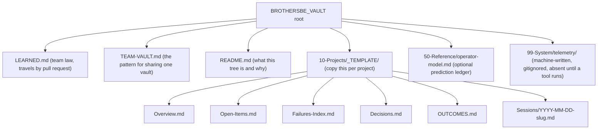
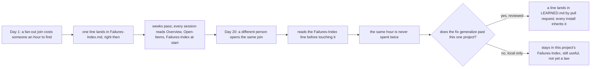

# The vault in Obsidian, for real

Chapter 10 named the environment variable and the shape of the tree. This
chapter is what filling that tree in looks like on an ordinary Tuesday, and
what it looks like a month later when the folders you barely touched start
paying you back.

The person this chapter is written for is not any one job title. It is
whoever ends up keeping a project alive across months rather than days: the
one who still remembers, in October, why a decision made in July went the
way it did, because they wrote it down in July and read it again since. That
role rotates. The vault is what makes the rotation survivable.

Obsidian is a note application that reads a folder of plain markdown files
as a linked notebook. Nothing about BrotherSBE requires Obsidian specifically;
every file it writes is plain text, readable in any editor. Obsidian is the
recommended reader because it turns the double-bracket links this vault
already uses into a graph you can click through, which a plain text editor
cannot do on its own.

## Opening the template

`memory-template/` in this repository is what you point Obsidian at, or copy
first and point Obsidian at the copy. Copy it somewhere real and look at what
is actually inside, the way you would the first time you opened this vault
as a project folder in the app:

```bash
ROOT="$(pwd)"
rm -rf /tmp/sbe-book-ch17 && mkdir -p /tmp/sbe-book-ch17
cp -R "$ROOT/memory-template" /tmp/sbe-book-ch17/vault
cd /tmp/sbe-book-ch17
find vault -type f -not -name '.DS_Store' | sort
```

```
vault/.gitignore
vault/10-Projects/_TEMPLATE/Decisions.md
vault/10-Projects/_TEMPLATE/Failures-Index.md
vault/10-Projects/_TEMPLATE/OUTCOMES.md
vault/10-Projects/_TEMPLATE/Open-Items.md
vault/10-Projects/_TEMPLATE/Overview.md
vault/10-Projects/_TEMPLATE/Sessions/YYYY-MM-DD-example.md
vault/50-Reference/operator-model.md
vault/LEARNED.md
vault/README.md
vault/TEAM-VAULT.md
```

Eleven files, and none of it a mystery: open any one of them and it says, in
its own text, what it is for and who reads it. The five files under
`10-Projects/_TEMPLATE/` are a handful of instructions each, plus one
placeholder row apiece, `YYYY-MM-DD` where a real date will eventually go.
The placeholder date does not match the pattern the tools look for, on
purpose, so a fresh copy reports NO-DATA everywhere rather than pretending
to have history it does not have. Here is the shape as a map, root to leaf:



## What each folder is actually for

Say the project is a customer-facing export endpoint, the same shape of work
chapter 13 walks end to end. Here is what each file earns its place by doing.

- **`Overview.md`** is the page a newcomer reads first, before touching
  anything: what the export endpoint is, which service it lives in, what
  invariant it must never break (here, that a partial export never reports
  as a complete one). A person joining the project on day one reads this
  file and nothing else before their first real question.
- **`Open-Items.md`** is the only to-do list that survives a restart. Not a
  chat thread, not a mental note, not a comment on a pull request that
  scrolls out of view: one line, owner, next concrete step, closed the
  moment it closes. If the machine this was typed on is gone tomorrow, this
  file is what tells the next person where things stood.
- **`Failures-Index.md`** is the pre-work ritual that prevents repeating a
  mistake. Say a prior session spent an hour chasing a join that silently
  fan-out duplicated rows before finding the missing key. One line goes in
  this file the moment that hour is understood, not reconstructed later from
  memory: the area, what went wrong, the check that now catches it. The next
  engineer to touch that join reads this file before writing a line of code,
  and the hour is never spent twice.
- **Session logs**, one file per work session under `Sessions/`, are the
  handover that lets a stranger continue tomorrow. Objective, what landed
  with the command that verified it, gate verdicts, what is still open or
  only sampled. A session that ends without one is not a smaller failure
  than a broken gate; it is the next session starting from nothing.
- **`LEARNED.md`** is team law. A lesson earns a line here only through a
  reviewed pull request, three lines each: the lesson, the rule, the cost
  that justifies the rule. Every install reads it at session start, so a
  law learned on one project reaches every other project the moment the PR
  merges, not by someone remembering to mention it in a meeting.

None of these five is optional and none of them substitutes for another.
`Open-Items.md` without `Failures-Index.md` tells you what is left to do but
not what already went wrong doing it. A session log without `Decisions.md`
tells you what happened but not which choices were deliberate and which
were accidents nobody meant to keep. The five together are the minimum
memory a project needs to hand itself to a stranger and have that stranger
actually succeed.

## Linking, and what the graph view actually buys

Obsidian links a note to another by wrapping its name in double square
brackets: writing `[[Failures-Index]]` inside a session log turns that
phrase into a clickable jump to the failures file for that project. Nothing
elaborate is required beyond typing the file's name inside the brackets; the
app resolves it, and renames the link automatically if you rename the file
through the app rather than in a separate editor.

The graph view is the visual map of every one of those links across the
vault, and what it actually buys you is narrow and specific: finding the
failure note you forgot you had written. Six months into a project, nobody
remembers every line in `Failures-Index.md` by heart. But a session log from
March that links to it, next to a decision note from April that links to
the same file, shows up in the graph as one small cluster around that file,
and clicking into it surfaces the exact line a search for the wrong keyword
would have missed. The graph is not a dashboard and it does not compute
anything; it is a reminder that a note exists, which is the only thing a
buried fact needs to stop being lost.

Naming discipline follows directly from how the link resolves: a link is a
file name, so two files named `Overview.md` in two different project folders
are not ambiguous to the filesystem, but they are ambiguous to a human
skimming the graph. The template's own convention, one project per folder
under `10-Projects/`, each with its own `Overview.md`, keeps the link text
short and consistent while the folder gives it the disambiguating context.

## The automatic layer: what the machine writes, for real

Chapter 10 already showed that every capture category, corrections, metrics,
transcript, is off by default, and stays off until an operator sets the
matching environment variable. That policy still holds here; this section is
about a different, smaller layer that is not gated by any of those three
switches at all: a housekeeping mark of which commit last checked in.

`tools/sbe_telemetry.py check-update` compares the installed copy's current
commit against what it last recorded, and if the two differ, it writes the
new one to a file named `installed-skill-version-brothersbe`
(`VERSION_MARK`, `tools/sbe_telemetry.py` line 1306) under the vault's
telemetry folder. On a first run against a vault that has never seen this
before, the write happens silently: no output at all, because there is
nothing to warn about yet, only a fact to record.

```bash
BROTHERSBE_VAULT=/tmp/sbe-book-ch17/vault python3 "$ROOT/tools/sbe_telemetry.py" check-update
```

```
```

Nothing printed, exit code 0. Read `data-show` against the same vault right
after, and the file that did not exist a moment ago is now there:

```bash
BROTHERSBE_VAULT=/tmp/sbe-book-ch17/vault python3 "$ROOT/tools/sbe_telemetry.py" data-show
```

```
BROTHERSBE STORED DATA (vault /tmp/sbe-book-ch17/vault)
  policy: corrections capture is off: BROTHERSBE_TELEMETRY_CORRECTIONS is not set, and every category is off by default
  policy: metrics capture is off: BROTHERSBE_TELEMETRY_METRICS is not set, and every category is off by default
  policy: transcript capture is off: BROTHERSBE_TELEMETRY_TRANSCRIPT is not set, and every category is off by default
  [metrics] /tmp/sbe-book-ch17/vault/99-System/telemetry/outcomes.jsonl: absent, so nothing is stored at this path
  [metrics] /tmp/sbe-book-ch17/vault/99-System/telemetry/ratings.jsonl: absent, so nothing is stored at this path
  [metrics] /tmp/sbe-book-ch17/vault/99-System/telemetry/reviews.jsonl: absent, so nothing is stored at this path
  [corrections] /tmp/sbe-book-ch17/vault/99-System/telemetry/corrections.jsonl: absent, so nothing is stored at this path
  [housekeeping] /tmp/sbe-book-ch17/vault/99-System/telemetry/installed-skill-version-brothersbe: 1 record(s), 41 bytes, mode 644 -- the git sha of the installed skill at the last check
read 1 file(s), 4 path(s) absent, 0 that could not be measured, under /tmp/sbe-book-ch17/vault/99-System/telemetry.
This lists this vault only. A backup, a mirror or a sync client may hold copies of any of it, and nothing here can see those.
```

Read the `[housekeeping]` line next to the three `policy:` lines above it.
The three capture categories are still off, and the four files they gate are
still absent, exactly as chapter 10 described. The housekeeping mark is not
one of those three; it holds nothing about what you typed or what happened
in a session, only a commit sha, so `check-update` can tell you once when
the law you are relying on changed under you and point you at the diff to
read. That is the entire automatic layer this book asks you to trust by
default: a version mark with no message content in it, and three switches,
all off, that a person has to choose to flip before anything else gets
written.

## What NOT to store

The vault's own team-vault note states this plainly, and it is worth
repeating in one place rather than trusting every reader to find it:
secrets never, not a token, not a key, not a password, not a customer
identifier, in a note, in frontmatter, or in a code block, temporarily or
otherwise. The vault has no access control of its own to fall back on, so
anything written into it is readable by everyone who holds a copy, forever,
including in git history after you think you deleted it.

Code lives in git, never in the vault. A decision's record lives in the
dossier the tiered loop produced; the vault's decision note links to it and
records the story around it, who was in the room, what almost won, the part
a decision record does not carry, but it never restates the record's
verdict as prose, because prose does not re-run and a receipt does. If a
project also publishes an org-facing summary somewhere else, a wiki, a
status page, treat that summary as a one-way mirror out of the vault, never
a second place to edit the same fact from. A mirror that people edit
directly stops being a mirror; it becomes a second home for a fact that was
only ever supposed to have one, and the two copies drift apart quietly,
each looking equally official. One fact, one home: if the same fact lives
in two places, one of them is already wrong and nobody knows which yet.

## A day in the vault

Morning: before touching the area, read `Overview.md`, `Open-Items.md`,
`Failures-Index.md`, and the vault's root `LEARNED.md`. This is not a
suggestion to skim if there is time; it is the one read that stands between
you and repeating a mistake someone already paid for.

During the day, at a milestone, a plan approved, a gate turning green, a
number confirmed: append to `Failures-Index.md` the moment a failure is
understood, and to `Decisions.md` the moment a choice is made that a later
session would otherwise re-litigate. Both writes happen now, in the moment,
because the detail that makes a failure note useful is exactly the detail
that evaporates by end of day.

At close: write one dated session log, update `Open-Items.md`, add an
`OUTCOMES.md` line if the run was substantial. Nothing above is read
automatically by magic; a session that skips this write-back is the next
session starting from nothing, no matter how good the work itself was.

What compounds is not any single file, it is the habit repeated daily
across a month. A `Failures-Index.md` with four entries reads like a list.
The same file with forty entries, written by three different people across
six weeks, is the closest thing this project has to an experienced teammate
who has seen every way this specific codebase breaks, and who never forgets
and never has to be re-asked.



> Expert note: multi-project vaults. One `BROTHERSBE_VAULT` root holds many
> projects, not one. Copy `10-Projects/_TEMPLATE/` once per project and give
> each copy its own name; the root's `LEARNED.md` and `50-Reference/` stay
> shared across all of them, because a lesson learned on one project is
> exactly the kind of thing the next project should not have to relearn.

> Expert note: pointing the vault at a shared drive. The instinct is to
> point `BROTHERSBE_VAULT` at a synced network folder so a team's tools all
> see the same files. The template's own `TEAM-VAULT.md` argues against
> that path deliberately: there is no live co-editing here, an edit appears
> once the other side has synced and not before, and two people editing the
> same sentence through a folder sync is a silent-overwrite risk with no
> warning. The pattern it recommends instead is git, with a union merge
> driver on markdown so two people appending different lines to the same
> log is a non-event rather than a conflict.

That same file also fixes a frontmatter schema every shared note is asked to
carry, five properties, no more by default and never fewer, so a dashboard
built over the vault can group notes without a teammate's freeform metadata
quietly breaking it. Read it directly out of the copy on disk:

```bash
sed -n '93,99p' vault/TEAM-VAULT.md
```

```
---
type: session
project: team-operating-model
status: open
owner: the-driver-handle
date: 2026-08-01
---
```

> Expert note: when to split a vault. `TEAM-VAULT.md` names its own limits
> plainly rather than hiding them: no single sign-on, no audit log, no
> per-folder permission, one vault is one access scope and nothing finer.
> Community reports it cites describe search and link autocomplete
> degrading somewhere between a thousand and forty thousand notes, worse on
> mobile. The fix the same note recommends is not a bigger vault; it is
> more of them, split by purpose, once a single vault's scope has grown
> past what one access boundary should reasonably cover.

The next chapter turns this same shape sideways: not one project's memory
over a month, but four personas on a ladder, from following the guided
commands to teaching the refusals, and the anti-patterns that show up at
every rung of it.
