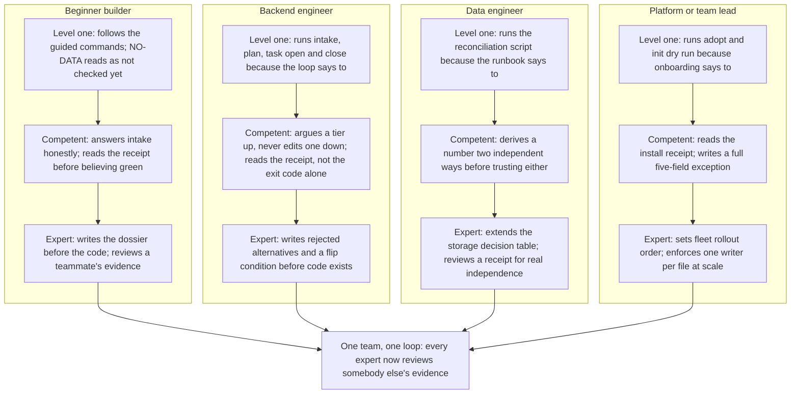

# From dummy to definitive expert

## The same ladder, four times

Every persona this book walked through, the beginner builder of Part One
and Part Two, the backend engineer of chapter thirteen, the data engineer
of chapter fourteen, the platform or team lead of chapter fifteen, climbs
the same three rungs. Level one follows the guided commands and treats
NO-DATA as "not checked yet," not as a verdict. Competent writes an honest
intake, reads a receipt before believing a green result, and argues a tier
up, never down. Expert designs the checks before the work exists, teaches
the refusals instead of working around them, extends the decision tables
this project ships, and reviews somebody else's evidence instead of only
producing their own.

That ladder is the same shape for all four personas because the tool
underneath it is the same tool. What changes is which command a rung
actually means.

## The ladder, drawn once



Read the diagram from the bottom up, not the top down. All four ladders end
at the same place: an expert, in any of these four roles, spends part of
their week reading evidence somebody else produced, not only producing
their own. That is what chapter sixteen's review wave asks of a team, and
it is also the simplest test of whether a given person has actually reached
the top rung, or is only fast at the bottom two.

## Beginner builder

Level one opens `sbe intake`, answers the five questions honestly because a
guide told them to, and reads a NO-DATA line without panicking: it means
nothing has been checked yet, not that something is wrong. Competent stops
needing the guide. They answer the five questions from what the change
actually does, not from what tier they would prefer, and before telling
anyone a test suite passed, they open the receipt `sbe evidence run` wrote
and read the exit code themselves. Expert writes the dossier's purpose and
verification rows before a line of code exists, can point at the exact
check that will read each one, and reads a teammate's dossier for whether
its artifacts agree with each other, the coherence check chapter five's
`design --strict` already runs on every dossier, human or not.

## Backend engineer

Level one runs the loop chapter thirteen walked start to finish: intake,
plan, `task open`, `task close`, because that is the order the tool
expects. Competent argues a tier up when the honest answer to the fourth
question is yes, the way chapter thirteen's export endpoint moved from T2
to T3, and never edits the tier field alone, because the design check
re-derives the tier from the answers every time and a lone edit reads as
exactly what it is. Expert writes an ADR's rejected alternatives and its
flip condition before the first line of the change lands, knows which of
the four hard gates a given change will meet before running it, and reads
someone else's receipt for whether its `covers` list actually names the
files the claim is about, not only whether the command exited zero.

> Expert note: the fastest way to tell a competent backend engineer from an
> expert one is not speed. It is what they do with a `NO-DATA` gate line.
> Competent reads it as "nothing to worry about here." Expert reads it as
> "this gate had nothing to check, which is either the honest truth about
> this change, or a sign the change is bigger than the dossier admits."

## Data engineer

Level one runs the reconciliation script a runbook hands them and reports
whatever number it prints. Competent derives the same number two
independent ways, the way chapter fourteen's `daily_totals` challenge did,
before trusting either one, and treats a freshness check as a command that
actually runs on a schedule, not a sentence in a document. Expert extends
the storage decision table itself when a new criterion the team keeps
arguing about is missing from it, reads a colleague's reconciliation
receipt closely enough to tell whether the two derivations genuinely used
different code paths or quietly shared one, and states plainly when a claim
about the warehouse layer is a `NOT EXECUTED HERE` block standing in for
something this machine cannot run, rather than letting a reader assume it
was tested.

## Platform or team lead

Level one runs `sbe adopt` and `sbe init --dry-run` against a repository
because an onboarding checklist says to. Competent reads the install
receipt before telling anyone a repository is onboarded, and writes an
exception with all five fields chapter fifteen names, an owner, an
approver, an expiry, a scope, and a compensating control, rather than a
sentence explaining why a rule does not apply this time. Expert decides
which of forty repositories adopts a change first and why, argues for
pinning a version over tracking one when the tradeoff calls for it, and
enforces the one-writer-per-file law at the scale of an organization, the
same rule chapter seven enforced on one repository, now read across all of
them at once.

## The anti-pattern gallery

Six failure shapes recur across every persona above. Each one has a tell
that names it and a fix this book already showed working.

**Green without a receipt.** The tell: someone reports "tests pass" and
nothing on disk says a command actually ran. The fix: `sbe evidence run`
wraps the real command and writes the receipt; a claim with no receipt
behind it is not evidence, it is a sentence.

**Tier shopping.** The tell: the five intake answers get chosen to land a
tier the author wants, not the tier the change actually earns, usually by
answering "no" to the sensitive-data question a beat too fast. The fix:
argue the tier up in the open, tier and override set to the same value with
a reason attached, the way chapter thirteen's export endpoint did. Arguing
down through the same fields is refused for the same reason, not a
different one.

**Prose as a control.** The tell: an `APPROVAL` file holding a typed name,
"Approved by Dana Reviewer," standing in for a second person actually
having looked. The fix: a signed commit with an `Approved-by` trailer
naming an identity the host can verify, or a `Reviewed-in` id a CI job
resolves against a real review platform. Chapter eight's gate refuses the
typed name by name, every time.

**The hand-typed receipt.** The tell: a JSON file with a plausible exit
code and a plausible duration, typed rather than produced by a run. The
fix: `sbe evidence verify` recomputes the seal over the receipt's own
fields; a file nobody's command produced does not match its own claimed
seal, and the mismatch is reported as tamper evidence, not a signature.

**The deleted failing test.** The tell: a test that used to catch a real
defect disappears from a diff, and the suite goes green because the thing
that would have failed is simply gone. The fix: nothing in this engine
reads a receipt closely enough to catch this by itself, a green receipt for
four tests looks identical to a green receipt for five tests with the
inconvenient one removed, so a shrinking test count in a diff is a human
review flag, and any deletion of a test belongs in the dossier's
verification section, named and justified, not folded silently into
"cleanup."

**The silent fallback.** The tell: a boundary call, a network request, a
file read, a subprocess, fails, and the code quietly returns a default
value instead of surfacing the failure. The fix: an explicit failure path
at every boundary call. A receipt only ever proves a command exited with a
given code; a command that swallows its own failure and exits zero anyway
makes that exit code stop meaning anything.

## Self-tests: make the law fire on purpose

Knowing a law's name is not the same as knowing what enforces it. Six laws
this book leaned on, each with the thing that enforces it named, and a way
to make it fire.

**1. A tier moves only through a matching override, never a lone edit.**
Enforced by `check_artifacts` in `tools/sbe_design.py`. Fire it on a fresh
intake:

```bash
rm -rf /tmp/sbe-book-ch18 && mkdir -p /tmp/sbe-book-ch18/dossier-a
printf 'n\nn\ny\nn\nnone\n' | bin/sbe intake /tmp/sbe-book-ch18/dossier-a
```

```
Does this change a data model, an API contract, or a file interface others depend on? (y/n) Does it cross a service, system, or team boundary? (y/n) Is it reversible in under an hour? (y/n) Does it touch money, partner data, personal data, or production state? (y/n) How many downstream consumers break if it is wrong? (none/some/many) tier T0 (artifacts required: none) written to /tmp/sbe-book-ch18/dossier-a/00-intake.json
To override this tier, edit that file and set all three fields: "tier" (the tier you are moving to), "override" (the same tier, declaring the move), and "override_reason" (at least 3 words and 12 characters). A move with any of the three missing or disagreeing FAILs the design check as an edit rather than an override.
```

Now edit `tier` alone, the way a shortcut tempts:

```bash
python3 - <<'EOF'
import json
p = "/tmp/sbe-book-ch18/dossier-a/00-intake.json"
d = json.load(open(p))
d["tier"] = "T2"
json.dump(d, open(p, "w"), indent=2, sort_keys=True)
EOF
bin/sbe design artifacts /tmp/sbe-book-ch18/dossier-a
```

```
BROTHERSBE DESIGN CHECKS  (advisory unless --strict; NO-DATA is never a pass; WAIVED is not a pass either)
  scope      -        read 1 dossier under /tmp/sbe-book-ch18/dossier-a (.); 0 of 0 director(y/ies) directly under /tmp/sbe-book-ch18/dossier-a contributed no dossier
  dossier: . (under /tmp/sbe-book-ch18/dossier-a)
  artifacts  FAIL     00-intake.json says tier T2 but its own answers compute T0, and its override field is null, so nothing in the file declares the move; no override_reason is recorded; an override sets BOTH fields and they must agree with each other, so this file needs override: 'T2' beside an override_reason of at least 3 words and 12 characters. A tier moved with either field missing is an edit, not an override (L15); examined . under /tmp/sbe-book-ch18/dossier-a [severity: gate]
```

The edit fired the exact refusal it should have. A tier field that moved on
its own, with no reason attached, is caught every time, not caught
sometimes.

**2. Absent evidence is NO-DATA, and NO-DATA is never a pass.** Enforced
everywhere a check reports a verdict at all: the vocabulary is PASS, FAIL,
NO-DATA, or WAIVED, never a plain true or false. Fire it against a
directory holding nothing:

```bash
mkdir -p /tmp/sbe-book-ch18/empty-repo
bin/sbe gate /tmp/sbe-book-ch18/empty-repo
```

```
BROTHERSBE HARD GATES  (advisory unless --strict; NO-DATA is never a pass; WAIVED is not a pass either)
  numbers   NO-DATA  no numbers-manifest found; if this change presents no decision figure that is correct, else add one; no numbers-manifest.json read under /tmp/sbe-book-ch18/empty-repo; 0 of 0 director(y/ies) directly under /tmp/sbe-book-ch18/empty-repo contributed no numbers-manifest.json [severity: gate]
  migration NO-DATA  no migration in this change, or no migration-receipt.json; no migration-receipt.json read under /tmp/sbe-book-ch18/empty-repo; 0 of 0 director(y/ies) directly under /tmp/sbe-book-ch18/empty-repo contributed no migration-receipt.json [severity: gate]
  approval  NO-DATA  no APPROVAL file and no Approved-by trailer; if this change touches no money or partner path that is correct; no APPROVAL read under /tmp/sbe-book-ch18/empty-repo; 0 of 0 director(y/ies) directly under /tmp/sbe-book-ch18/empty-repo contributed no APPROVAL [severity: gate]
  ran       NO-DATA  no ran-receipt.json; a SQL or pipeline change is not done until its check executed and left a receipt; no ran-receipt.json read under /tmp/sbe-book-ch18/empty-repo; 0 of 0 director(y/ies) directly under /tmp/sbe-book-ch18/empty-repo contributed no ran-receipt.json [severity: gate]

sbe gate: 0 decision package(s) written: no FAIL and no WAIVED line was printed above. A package records a decision somebody has to carry, and a PASS or a NO-DATA is not one.
```

Four honest absences, four NO-DATA lines, zero packages written. Nothing
here reads as a pass, because an empty directory never earned one.

**3. A receipt's seal catches a file no command produced.** Enforced by
`compute_seal` and `_check_seal` in `src/brothersbe/evidence.py`. Fire it
by tampering with a real receipt after the fact:

```bash
bin/sbe evidence run --out /tmp/sbe-book-ch18/receipt.json --covers README.md -- python3 -c "print('ok')" 2>/dev/null | sed -E 's/[0-9]+\.[0-9]+s/<N.NNNs>/'
```

```
ok

sbe evidence run: receipt written to /tmp/sbe-book-ch18/receipt.json. Trust LOCAL-ADVISORY (no SBE_CI_RUN_ID was set when this ran, so nothing outside the machine that wrote it attests to it). Command exited 0 in <N.NNNs>, over 1 covered file(s) from explicit --covers. stdout and stderr are recorded as digests only. argv held 0 secret-shaped token(s) and was recorded verbatim.
```

```bash
python3 -c "
import json
p = '/tmp/sbe-book-ch18/receipt.json'
d = json.load(open(p))
d['exitCode'] = 1
json.dump(d, open(p, 'w'), indent=2, sort_keys=True)
"
bin/sbe evidence verify /tmp/sbe-book-ch18/receipt.json 2>&1 | sed -E 's/[0-9a-f]{64}/<sha256>/g'
```

```
FAIL     /tmp/sbe-book-ch18/receipt.json
  inspected: receipt file /tmp/sbe-book-ch18/receipt.json; schemaVersion; 17 required field(s); the runId seal over 22 run fact(s); the current git HEAD in /Users/khalil.maaouni/Documents/BrotherSBE; 1 covered file(s)
  trust:     LOCAL-ADVISORY (no SBE_CI_RUN_ID was set when this ran, so nothing outside the machine that wrote it attests to it)
  runId <sha256> does not match the seal over this receipt's own run facts (<sha256>). Either the receipt was written by hand rather than generated by `sbe evidence run`, or a sealed field was edited after the run. This seal is tamper evidence, not a signature: it catches a plausible receipt nobody's command produced, and it does not stop somebody who read src/brothersbe/evidence.py
```

One field changed after the run, and the seal disagreed with the file
carrying it. That is the whole mechanism, fired on purpose, on a receipt
this run actually produced.

**4. The write-scope registry closes only the diff it declared.** Enforced
by `postcondition` in `src/brothersbe/tasks.py`. Fire it yourself the way
chapter seven did: open a task owning one path, touch a second file nobody
declared, and watch `sbe task close` list it as a `VIOLATION` and refuse to
close, clean only once the stray file is gone.

**5. `sbe impact` is a floor a diff can raise, never a ceiling it can
lower.** Enforced by the rule stated in `src/brothersbe/impact.py`'s own
docstring. Fire it yourself the way chapter five did: declare a tier below
what a contract-shaped change actually implies, and read `REVIEW-REQUIRED`
rather than a quiet downgrade, because this tool may say a change is bigger
than declared and may never say it is smaller.

**6. Approval means a second, provably different person, never a name
typed into a file.** Enforced by `gate_approval` in `tools/sbe_gate.py`.
Fire it yourself the way chapter eight did: write an `APPROVAL` file
holding nothing but a name, and read the FAIL that says, in its own words,
a name in a text field is not a control.

Three of these six were fired again for this chapter, from scratch, in
`/tmp/sbe-book-ch18`. The other three were fired for real in earlier
chapters and are exactly as repeatable; nothing about rerunning them here
would show anything the earlier pages did not already show.

## The one sentence this book keeps

Every chapter before this one built toward a single sentence, and every
persona's ladder ends at the same understanding of it, not a different one
each. Absent evidence is NO-DATA, and NO-DATA is never a pass. Not a
weaker pass, not a pass with an asterisk, not a pass once someone senior
enough says so. A dummy learns to read that sentence. A definitive expert
is the person who goes and builds the next check that makes it true
somewhere it was not true yet.
