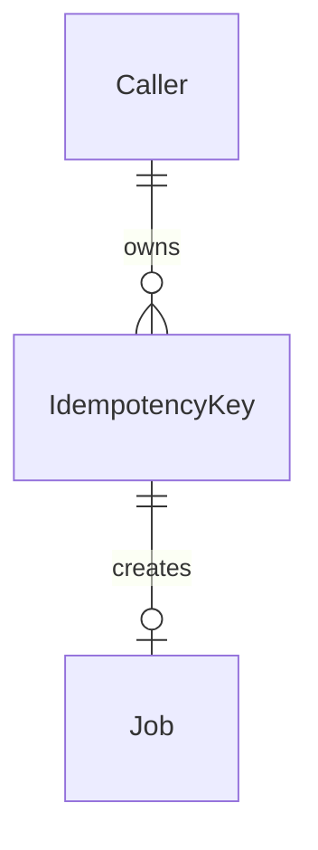
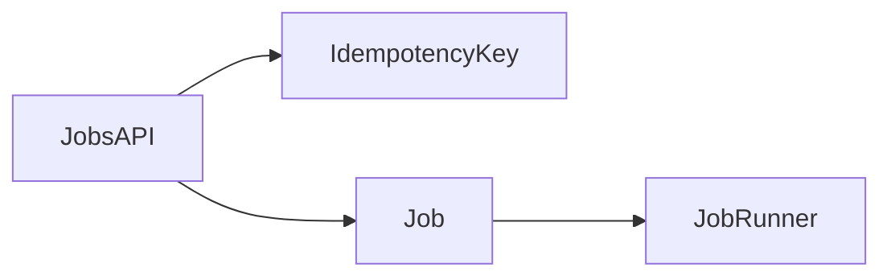

# 06. Diagrams

## Entity relationship

Caller, IdempotencyKey and Job are all defined as entities in 05-data-model.md.

## Components

These are runtime components, not entities, and they are declared here.

- JobsAPI: the service that handles POST /jobs and claims the key.
- JobRunner: the worker process that executes a created job.

