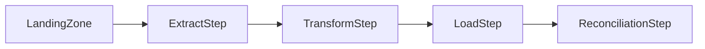
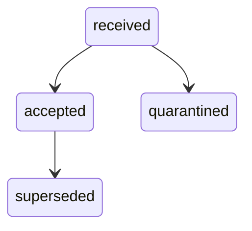
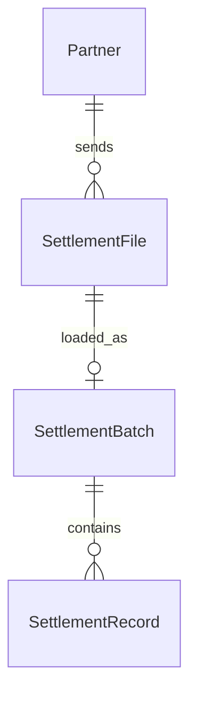

# 06. Diagrams

## Pipeline

The nodes below are declared as rows in 04-technology-map.md.

## Batch lifecycle

The states below are declared under the States heading in 05-data-model.md.

## Entity relationship

