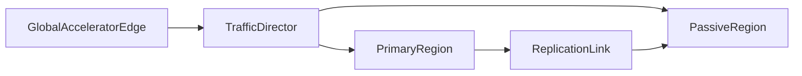
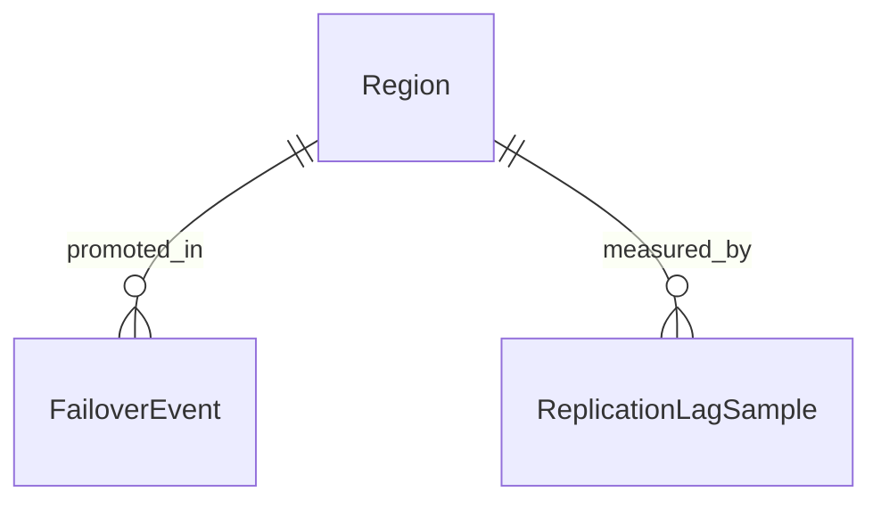

# 06. Diagrams

## Failover topology

```mermaid
flowchart LR
  TrafficDirector --> PrimaryRegion
  TrafficDirector --> PassiveRegion
  PrimaryRegion --> ReplicationLink
  ReplicationLink --> PassiveRegion
  GlobalAcceleratorEdge --> TrafficDirector
```

## Entity relationship

```mermaid
erDiagram
  Region ||--o{ FailoverEvent : promoted_in
  Region ||--o{ ReplicationLagSample : measured_by
```
