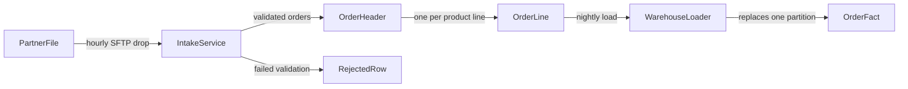
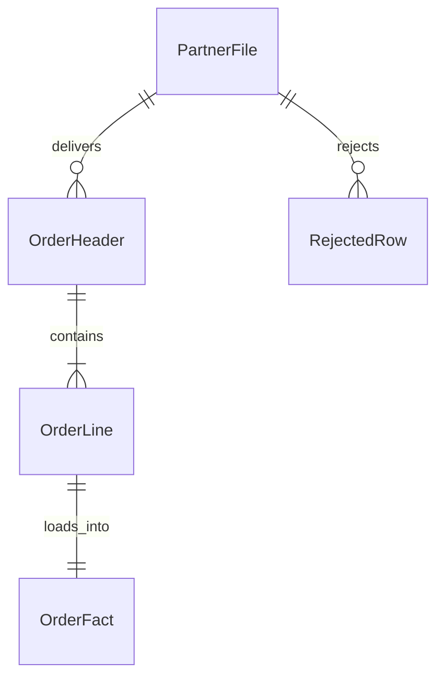
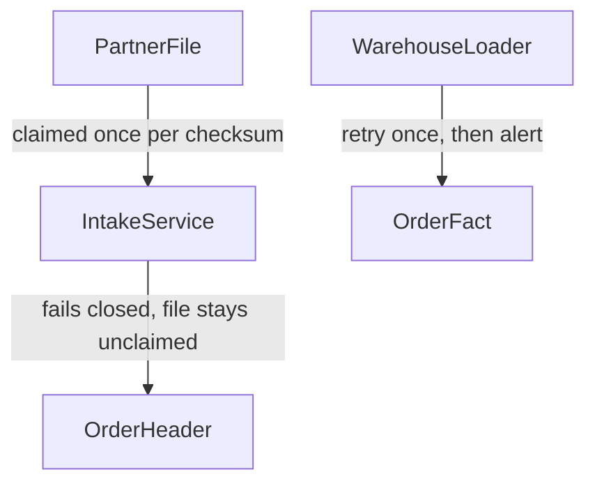

# A worked engagement: partner order intake, end to end

One system, designed in the order BrotherSBE runs: purpose, process, architecture,
data, expression, verification. Every command below was run, and every block of
output is what it printed. Copy the shape, not the content.

**The system.** A partner drops one CSV of orders per hour on SFTP. We claim the
file, validate it, store the orders, and load a reporting fact table nightly.
Today an analyst re-keys the rows by hand.

**What you need.** Python 3, git, and a clone of this skill. Set a variable so the
commands paste cleanly:

```bash
SBE="$HOME/.claude/skills/brothersbe"     # wherever you cloned BrotherSBE
mkdir -p design/order-intake && cd design/order-intake
git init -q .
```

The `git init` matters: phase 6 binds the approval to a commit trailer, and
`git add -A` in a directory no repository owns dies with "fatal: not a git
repository". In your own work the dossier usually lives inside the repository
the change ships in, and then you skip it.

The dossier lives in that directory: seven markdown files, one intake JSON, and
the receipts. Nothing else.

---

## Phase 0: intake decides how much design this gets

Five objective questions, one tier. The tier decides which artifacts are required,
which is the mechanism behind "brief always": a one line fix produces nothing at
all, this system produces the full set.

```bash
printf 'y\ny\ny\ny\nmany\n' | python3 "$SBE/tools/sbe_intake.py"
```

```
Does this change a data model, an API contract, or a file interface others depend on? (y/n) Does it cross a service, system, or team boundary? (y/n) Is it reversible in under an hour? (y/n) Does it touch money, partner data, personal data, or production state? (y/n) How many downstream consumers break if it is wrong? (none/some/many) tier T3 (artifacts required: 01, 02, 03, 04, 05, 06, 07) written to ./00-intake.json
To override this tier, edit that file and set all three fields: "tier" (the tier you are moving to), "override" (the same tier, declaring the move), and "override_reason" (at least 3 words and 12 characters). A move with any of the three missing or disagreeing FAILs the design check as an edit rather than an override.
```

The two closing lines are the override contract, printed on every run so the
one edit that moves a tier is taught where the tier is written.

Run it without the `printf` and it asks the five questions one at a time. The
answers here, and why:

| Question | Answer | Why |
|---|---|---|
| changes_contract | yes | The partner file header and the warehouse fact table are both contracts |
| crosses_boundary | yes | Partner, intake service, warehouse |
| reversible_under_hour | yes | A bad deploy reverts; a bad load is replaced by re-running the partition |
| touches_sensitive | yes | Partner data |
| consumers | many | Reporting, the ops reject queue, month end reconciliation |

First match wins, so `touches_sensitive` alone put this at T3 before the other
answers were read. The file it wrote:

```json
{
  "answers": {
    "changes_contract": true,
    "crosses_boundary": true,
    "reversible_under_hour": true,
    "touches_sensitive": true,
    "consumers": "many"
  },
  "tier": "T3",
  "override": null,
  "override_reason": null
}
```

Run the design check now, with nothing written yet, and it tells you the whole
shopping list:

```bash
python3 "$SBE/tools/sbe_design.py" artifacts .
```

```
BROTHERSBE DESIGN CHECKS  (advisory unless --strict; NO-DATA is never a pass; WAIVED is not a pass either)
  scope      -        read 1 dossier under . (.); 0 of 0 director(y/ies) directly under . contributed no dossier
  dossier: . (under .)
  artifacts  FAIL     tier T3 requires 01, 02, 03, 04, 05, 06, 07; missing: 01-purpose.md, 02-process.md, 03-adr.md, 04-technology-map.md, 05-data-model.md, 06-diagrams.md, 07-verification.md; examined . under . [severity: gate]
```

If the same task had been reversible, non-sensitive, contract-free and read by
nobody, `compute_tier` would have returned T0 and the required list would have
been empty. The tier is a decision table, not a mood: two engineers answering the
same five questions land on the same tier.

---

## Phase 1: purpose, before any design

`01-purpose.md`, written before a single box is drawn. The blast radius paragraph
is the one that sizes everything downstream.

```markdown
# 01. Purpose brief

## Problem
A partner sends us their orders as one CSV file per hour on SFTP. Nothing reads
the file automatically: an ops analyst opens it and re-keys the rows into the
order system, usually the next morning. Orders therefore sit unworked overnight,
and at month end our order count disagrees with the partner's own statement with
no way to say which rows differ.

## Users
Two ops analysts, who today re-key roughly 400 rows a day and skip the file
entirely when they are busy. One reporting analyst, who answers "how many orders
did this partner send us" from a spreadsheet built by hand each month because the
warehouse has no partner order table.

## Success criteria
- A file that lands is loaded, or rejected with a per-row reason, within 15 minutes.
- The monthly order count and order value in the warehouse reconcile to zero
  difference against the partner statement.
- A rejected row is visible to an analyst with its reason and its source file and
  line number, in the same run that rejected it.
- Re-sending the same file twice loads it once.

## Non-goals
This does not change how the partner produces the file, and does not ask them for
an API. It does not touch invoicing or payment. It is not real time: hourly is the
contract, and nothing downstream may assume better.

## What breaks if this is wrong
Duplicated orders inflate partner revenue in the warehouse and in anything built
on it. Dropped orders understate it and the partner chases us for goods we never
picked. Both failures are silent: a load that duplicates every row reports success
and looks exactly like a load that worked, and the only detector today is the
partner's month end statement, up to 30 days later.
```

The last section is why this is a T3 and why the numbers gate will be involved
later: the failure mode is a wrong number that looks right for 30 days.

---

## Phase 2: the process, before the architecture

An architecture is a machine for running a process, so the process is drawn first.
Every step names an actor, a trigger, and what happens when it fails. Every handoff
names both sides and the contract between them.

```markdown
# 02. Process map

## Actors
The partner's order system, which writes the file. The SFTP landing zone, which
holds it. The intake service, which validates and stores it. The order store. The
warehouse loader, which runs nightly. The ops analyst, who works rejects. The
reporting analyst, who queries the warehouse.

## Steps
| # | Step | Actor | Trigger | Exception path |
|---|---|---|---|---|
| 1 | Partner writes orders_YYYYMMDDHH.csv to the landing zone | Partner order system | Top of each hour | No file at the hour: nothing runs, and the missing hour is alerted after 90 minutes |
| 2 | File is claimed and checksummed | Intake service | New file appears in the landing zone | Checksum already seen: the file is archived as a duplicate and no rows load |
| 3 | Header is diffed against the pinned partner contract | Intake service | File claimed | Header differs: the whole file is rejected unloaded, and the diff names every changed column |
| 4 | Rows are validated and stored | Intake service | Header matches | A row fails validation: that row lands in the reject table with its reason, file name, and line number; the rest of the file still loads |
| 5 | Loaded file is archived with its checksum | Intake service | All rows processed | Archive write fails: the run fails closed and the file is re-claimed on the next pass |
| 6 | Warehouse fact table is loaded from the order store | Warehouse loader | Nightly at 02:00 | Load fails: yesterday's partition is left intact and the load retries once before alerting |
| 7 | Rejects are worked | Ops analyst | Reject count over zero | Analyst cannot resolve a row: it is returned to the partner by the account manager |

## Handoffs
| From | To | What is handed over | Contract |
|---|---|---|---|
| Partner order system | Landing zone | One CSV per hour, fixed header, UTF-8, complete file written under a temporary name and then renamed | The rename is the signal the file is complete. A file still being written is never claimed |
| Landing zone | Intake service | The claimed file plus its SHA-256 | A checksum already in the archive means the file loads zero rows |
| Intake service | Order store | Validated order headers and lines | Idempotent on partner_order_id: a repeat of the same id updates, never inserts a second row |
| Order store | Warehouse loader | Yesterday's orders by placed_at date | The loader reads a closed date only, so a late arriving row for that date is picked up by the next day's restatement, not lost |
| Intake service | Ops analyst | The reject table | Every reject carries a reason, a file name, and a line number, or it is a defect in the service, not a bad row |
```

Two design decisions are already forced by this table and neither is an
architecture choice: the partner renames on completion, so a half written file is
never claimed, and the checksum archive is what makes a resend safe. Both land in
the data model in phase 4.

---

## Phase 3: architecture, decided by a table

The shape question is scored, not argued. The table lives in
`tables/architecture.json` and ships with thresholds measured on one estate: they
are defaults until you re-measure them on yours, in a reviewed pull request.

```bash
printf '2\nstrong\nlow\nlow\n' | python3 "$SBE/tools/sbe_decide.py" "$SBE/tables/architecture.json" shape
```

```
deploying_teams (Independently deploying teams. Services below four teams usually cost more than they return.): consistency (Strong consistency across a service boundary is expensive and often accidental.): ops_maturity (On-call, tracing, and CI maturity. Without them a distributed estate is undebuggable.): failure_isolation (Does one component failing have to leave the others running?): 
Recommendation: modular monolith
Alternatives: monolith, services
Tie: modular monolith, monolith scored equal top marks; the recommendation is the table's declared order, not a measured difference (scores: modular monolith=4, services=0, event-driven=0, monolith=4)
Decided by:
  - deploying_teams=2 favours modular monolith, monolith
  - consistency=strong favours monolith, modular monolith
  - ops_maturity=low favours monolith, modular monolith
  - failure_isolation=low favours monolith, modular monolith
What would flip this: Cross four independently deploying teams, or need one module to fail without the others while ops maturity is high, and revisit this decision.
```

Four things come back every time: the recommendation, up to two alternatives, the
criteria that separated them, and what would flip it. A tied top score is a fifth,
when it happens: the Tie line above says the winner is the table's declared order
rather than a measured difference, and prints the raw tally so nobody has to take
that on faith. The flip condition belongs to the
RECOMMENDATION, not to the table: one string for the whole table meant a run that
recommended `services` off nine teams and high failure isolation was handed a flip
condition naming two conditions that were already true, which can never fire. Answer nothing and the
verdict is NO-DATA with the recommendation suppressed, because a recommendation
backed by zero evidence is a guess with a table around it.

A typo is not silently treated as an omission:

```bash
printf '2\nstrongly\nlow\nlow\n' | python3 "$SBE/tools/sbe_decide.py" "$SBE/tables/architecture.json" shape
```

```
deploying_teams (Independently deploying teams. Services below four teams usually cost more than they return.): consistency (Strong consistency across a service boundary is expensive and often accidental.): ops_maturity (On-call, tracing, and CI maturity. Without them a distributed estate is undebuggable.): failure_isolation (Does one component failing have to leave the others running?): 
Recommendation: modular monolith
Alternatives: monolith, services
Tie: modular monolith, monolith scored equal top marks; the recommendation is the table's declared order, not a measured difference (scores: modular monolith=3, services=0, event-driven=0, monolith=3)
Decided by:
  - deploying_teams=2 favours modular monolith, monolith
  - ops_maturity=low favours monolith, modular monolith
  - failure_isolation=low favours monolith, modular monolith
What would flip this: Cross four independently deploying teams, or need one module to fail without the others while ops maturity is high, and revisit this decision.
Unrecognized values (check for typos):
  - consistency=strongly is not a recognized value
```

Three criteria decided that one instead of four, and the output says which one it
could not read.

That output is the body of the ADR. `03-adr.md`:

````markdown
# 03. Architecture decision record

## Context
The partner file has to be claimed, validated, stored, and then loaded to the
warehouse on a different schedule. Two teams deploy here: the integrations team
owns the intake path, the data team owns the warehouse load. The question is
whether that is one deployable, two, or a set of services on a bus.

## Criteria
Scored by tools/sbe_decide.py against tables/architecture.json, shape table.
Values observed on this estate: deploying_teams = 2, consistency = strong, an
order and its lines must commit together or not at all; ops_maturity = low, no
on-call rotation for a broker and no distributed tracing; failure_isolation = low,
the nightly warehouse load may stop without stopping intake, and vice versa, but
neither has to keep serving while the other is down.

Table output, verbatim:

```
Recommendation: modular monolith
Alternatives: monolith, services
Decided by:
  - deploying_teams=2 favours modular monolith, monolith
  - consistency=strong favours monolith, modular monolith
  - ops_maturity=low favours monolith, modular monolith
  - failure_isolation=low favours monolith, modular monolith
What would flip this: Cross four independently deploying teams, or need one module to fail without the others while ops maturity is high, and revisit this decision.
```

## Options considered

### Rejected: separate services with a message broker between intake and the load
Scored joint second on the table and loses on ops_maturity. A broker adds a
component with no on-call owner, and the failure it protects against, one side
being down while the other serves, is not a failure this system has: the load is
nightly and the intake is hourly, so both tolerate a stopped neighbour for hours.

### Rejected: a single monolith with no module boundary
Tied with the recommendation on every criterion, which is exactly why it is a
trap: the tie is broken by what the table does not score. Two teams deploy here,
and without an enforced module boundary the warehouse load reaches into intake
tables directly. That coupling is invisible until the first schema change breaks
a job nobody knew was reading it.

## Decision
One deployable, two modules with an enforced boundary: intake owns the order
store and exposes a read contract; the warehouse loader consumes that contract
and owns the fact table. One database, one transaction for an order and its
lines. The module boundary is enforced in CI by an import check, not by
convention.

## Consequences
An order and its lines commit atomically, which is what the strong consistency
criterion bought. Deploys are coupled: the data team ships when the integrations
team ships, which is acceptable at a weekly cadence and would not be at a daily
one. Scaling is vertical for now. The module boundary has to be enforced by a
check or it decays, so the import check is part of this change, not a follow-up.

## What would flip this
A third and fourth independently deploying team on this path, or a requirement
that intake keep accepting files while the warehouse load is broken in a way that
shares a process. Either one and the shape is re-scored against the same table.
The deploy coupling is the leading indicator: when the data team is blocked on an
intake deploy more than twice in a quarter, re-run the table.
````

The check on this file counts the decidably rejected alternatives (each marked
in its own text or heading, or listed beside an identified chosen option) and
looks for the five
required sections. Drop the flip condition and it fails, because an ADR with no
flip condition is a tombstone: nobody knows when to reopen it.

`04-technology-map.md` is the other half of the architecture phase. Per component:
technology, owner, failure mode, recovery path. Then the source systems with their
availability and failover, then the recovery objectives and the drill that proves
them.

```markdown
# 04. Technology map

| Component | Technology | Owner | Failure mode | Recovery path |
|---|---|---|---|---|
| Landing zone | Managed SFTP with object storage behind it | Platform team | Partner cannot write, or writes a partial file | Partial files are never claimed because the partner renames on completion; a failed write means the hour is missing and alerts after 90 minutes |
| Intake service | Python service, one deployable, two modules | Integrations team | Validation crash mid file | The file is not archived, so it is re-claimed and re-processed; loads are idempotent on partner_order_id |
| Order store | PostgreSQL | Integrations team | Database unavailable | Intake fails closed, the file stays unclaimed, the next pass picks it up |
| Warehouse loader | Scheduled job reading the order store read contract | Data team | Load fails partway | The target date partition is replaced whole, never appended to, so a failed load leaves yesterday intact |
| Reporting warehouse | Column store | Data team | Stale partition | The loader is re-run for the date; the reconciliation query is the detector |

## Source systems
| System | What it masters | Interface | Availability expectation | Failover |
|---|---|---|---|---|
| Partner order system | The orders themselves | Hourly CSV on SFTP | Best effort, no SLA from the partner | A missed hour is picked up by the next file; the partner resends on request and the checksum archive makes a resend safe |
| Order store | Our record of partner orders | SQL read contract | Business hours plus the nightly window | Read replica for the loader; the loader retries once and alerts |

## Recovery posture
Recovery time objective of four hours for the intake path and one business day
for the warehouse fact table. Recovery point objective of one file, that is one
hour of orders, because the landing zone archive holds every file and a replay
from the archive rebuilds the order store. Proven by a quarterly drill: restore
the order store to a copy, replay the last 24 files from the archive, and compare
row counts and order value against the live store. The drill writes the receipt
the migration gate reads.
```

---

## Phase 4: the data model, conceptual then logical then physical

The gate between logical and physical is mechanical: every entity names a system
of record, every relationship carries a cardinality. `05-data-model.md`:

```markdown
# 05. Data model

## Conceptual: entities and meanings
- PartnerFile: one hourly CSV exactly as delivered, identified by file name and SHA-256 checksum; system of record: the landing zone archive.
- OrderHeader: one order as the partner sent it, identified by their partner_order_id; system of record: the intake service.
- OrderLine: one product line on an order, with quantity and unit price as sent; system of record: the intake service.
- RejectedRow: one source line that failed validation, with its reason, file name, and line number; system of record: the intake service.
- OrderFact: one warehouse row per order line, at order line grain, restated by load date; system of record: the reporting warehouse, derived from the intake service.

## Relationships
- PartnerFile to OrderHeader: one-to-many, optional. A file may carry no valid orders; every order came from exactly one file.
- OrderHeader to OrderLine: one-to-many, mandatory. Every order has at least one line; every line belongs to exactly one order.
- PartnerFile to RejectedRow: one-to-many, optional. A clean file rejects nothing.
- OrderLine to OrderFact: one-to-one, mandatory. The warehouse fact is at order line grain, which is the grain that keeps quantity times price additive.

## Attribute roles
| Attribute | Entity | Role |
|---|---|---|
| file_sha256 | PartnerFile | identifier |
| received_at | PartnerFile | temporal |
| partner_order_id | OrderHeader | identifier |
| order_placed_at | OrderHeader | temporal |
| order_status | OrderHeader | status |
| file_sha256 | OrderHeader | foreign key |
| order_line_no | OrderLine | identifier |
| quantity | OrderLine | measure |
| unit_price | OrderLine | measure |
| reject_reason | RejectedRow | descriptor |
| source_line_no | RejectedRow | identifier |
| load_date | OrderFact | temporal |

## Historization
OrderHeader keeps every status the partner sends as its own timestamped row, so a
cancellation does not overwrite the placement. PartnerFile is immutable once
archived, which is what makes a replay reproduce the same result. OrderFact is
restated per load date rather than updated in place, so a re-run replaces a whole
partition and never doubles it.

## Source systems and failover
| Entity | Source | Refresh contract | If the source is unavailable |
|---|---|---|---|
| PartnerFile | Partner SFTP drop | Hourly | The hour is missing, alerted after 90 minutes, and backfilled by resend |
| OrderHeader | Intake service | Within 15 minutes of the file landing | Files queue in the landing zone; nothing is lost, freshness degrades |
| OrderLine | Intake service | Same as OrderHeader | Same as OrderHeader |
| RejectedRow | Intake service | Same run that rejected the row | Same as OrderHeader |
| OrderFact | Nightly load from the order store | Daily by 03:00 | Yesterday's partition stays intact; the load retries once, then alerts |

## The three lenses, in order
1. Engineer. Can this load reliably, idempotently, at volume, and recover? The
   checksum archive makes a resent file a no-op. The upsert key is
   partner_order_id, so a re-processed file updates rather than duplicates, and the
   skip count is logged rather than swallowed. A replay from the archive rebuilds
   the store from zero. Volume is 400 rows an hour, which is nothing; the property
   that matters is idempotency, not throughput.
2. Analyst. Can the real questions be answered without heroic joins, and is every
   grain unambiguous? The question is order count and order value per partner per
   month. OrderFact is at order line grain and says so, so a count of orders is a
   distinct count of partner_order_id and never a row count. Order value is
   quantity times unit_price summed at line grain, which is additive at that grain
   and would not be if the fact were at header grain with a total column.
3. Scientist. Is history preserved, is leakage prevented, are features derivable?
   Status history is kept as rows rather than overwritten, so a model trained on
   "was this order cancelled" can use the state as of a date instead of the state
   today, which is the leak. The archive keeps the raw file, so a feature nobody
   thought of yet is still derivable from source.

## Physical, after the logical model is approved
OrderHeader and OrderLine are PostgreSQL tables, order_placed_at as timestamptz,
a unique index on partner_order_id carrying the upsert, and a foreign key from
OrderLine to OrderHeader. OrderFact is partitioned by load_date in the warehouse,
so a restatement drops and rewrites one partition. The migration adds OrderFact
and its partition for the current month; the reverse drops that partition and the
table, which restores the row count exactly because nothing else writes there.
```

The lenses are not a review ritual, they change the model. The analyst lens is
what fixed the grain of OrderFact, and the scientist lens is what kept status
history as rows.

---

## Phase 5: expression, where a diagram gets caught drifting

`06-diagrams.md`, first attempt. T3 guidance (not a check-enforced requirement)
suggests the system context, the container view, the entity relationship view,
and the failover topology. This system is one deployable with two modules, so the
container view collapses into the system context: `IntakeService` and
`WarehouseLoader` are the two containers, and the technology map in `04` carries
their technology and owner rather than repeating them in a box.

````markdown
## System context



## Entity relationship



## Failover topology


````

Run the whole design check now:

```bash
python3 "$SBE/tools/sbe_design.py" .
```

```
BROTHERSBE DESIGN CHECKS  (advisory unless --strict; NO-DATA is never a pass; WAIVED is not a pass either)
  scope      -        read 1 dossier under . (.); 0 of 0 director(y/ies) directly under . contributed no dossier
  dossier: . (under .)
  artifacts  FAIL     tier T3 requires 01, 02, 03, 04, 05, 06, 07; missing: 07-verification.md; examined . under . [severity: gate]
  adr        PASS     2 distinct rejected alternatives (each explicitly rejected in its own text, or listed beside an identified chosen option), each carrying at least 2 words and 8 characters of its own text (that the text says why the option lost, rather than restating its name, is human review); 4 listed option(s) carry no verdict of their own and were not counted, and criteria, decision, consequences and flip condition each carry content; examined . under . [severity: gate]
  datamodel  PASS     5 entities, each with a system of record; 4 relationship line(s) read, each carrying cardinality; examined . under . [severity: gate]
  diagrams   PASS     7 diagram node(s) in erDiagram, flowchart, all traceable: 5 to entities in 05-data-model.md, 2 to declared components, 0 to declared lifecycle states, 0 to a system of record an entity names; tokens read as diagram syntax rather than as nodes: erDiagram (the diagram declaration: type), flowchart LR (the diagram declaration: type and direction), flowchart TD (the diagram declaration: type and direction); examined . under . [severity: gate]
  placeholder PASS     6 artifact(s) present, none still carrying an unfilled-template marker; examined . under . [severity: gate]
```

Read the diagrams line, because it is doing two things worth understanding. The tail
of it names every token the parser treated as diagram syntax rather than as a node,
on every run, passing or failing: nodes named after direction keywords used to be
dropped in silence and the PASS then claimed completeness over the set it had
truncated itself. Then the counts. Five of those seven nodes are entities in `05-data-model.md`. The other two, `IntakeService`
and `WarehouseLoader`, are not entities and never should be: they are running
software, and a conceptual data model that lists a nightly job alongside OrderLine is
a worse data model. They trace because `04-technology-map.md` already declares them
in its component table, as "Intake service" and "Warehouse loader".

That is the point. A diagram node is traceable if it is an entity in the data model
OR a declared runtime component: a row in `04-technology-map.md`, or a bullet under a
Components heading in `06-diagrams.md` itself. An earlier version of this check
required every node to be an ENTITY, which produced a FAIL here and an obvious way
out: add IntakeService and WarehouseLoader to `05-data-model.md` as entities with a
system of record. The gate went green and the data model got worse. A check that
makes the honest artifact fail is a check that teaches people to corrupt it, so the
check changed rather than the model.

The rule that stayed is the one that matters: an undefined box on an architecture
diagram is exactly how a picture starts describing a system that does not exist. Draw
a node this dossier defines nowhere and it still FAILs by name. Write
`07-verification.md` (next section) and run again:

```bash
python3 "$SBE/tools/sbe_design.py" --strict . ; echo "exit: $?"
```

```
BROTHERSBE DESIGN CHECKS  (advisory unless --strict; NO-DATA is never a pass; WAIVED is not a pass either)
  scope      -        read 1 dossier under . (.); 0 of 0 director(y/ies) directly under . contributed no dossier
  dossier: . (under .)
  artifacts  PASS     tier T3: every required artifact present, carrying content, and naming subject matter the rest of this dossier also names; examined . under . [severity: gate]
  adr        PASS     2 distinct rejected alternatives (each explicitly rejected in its own text, or listed beside an identified chosen option), each carrying at least 2 words and 8 characters of its own text (that the text says why the option lost, rather than restating its name, is human review); 4 listed option(s) carry no verdict of their own and were not counted, and criteria, decision, consequences and flip condition each carry content; examined . under . [severity: gate]
  datamodel  PASS     5 entities, each with a system of record; 4 relationship line(s) read, each carrying cardinality; examined . under . [severity: gate]
  diagrams   PASS     7 diagram node(s) in erDiagram, flowchart, all traceable: 5 to entities in 05-data-model.md, 2 to declared components, 0 to declared lifecycle states, 0 to a system of record an entity names; tokens read as diagram syntax rather than as nodes: erDiagram (the diagram declaration: type), flowchart LR (the diagram declaration: type and direction), flowchart TD (the diagram declaration: type and direction); examined . under . [severity: gate]
  placeholder PASS     7 artifact(s) present, none still carrying an unfilled-template marker; examined . under . [severity: gate]
exit: 0
```

Five entities and seven traceable nodes, and the evidence says which is which. The
rule the check enforces is one sentence: if it is in a diagram, it is defined
somewhere a reader can find it. What it no longer does is decide for you which
artifact that has to be.

---

## Phase 6: verification, last

Now the checks. `07-verification.md` maps every claim the design makes to the
check that proves it and when that check runs:

```markdown
# 07. Verification plan

| Claim this design makes | The check that proves it | When it runs |
|---|---|---|
| A resent file loads zero rows | Load the same file twice in the integration suite and assert the second run inserts 0 and logs 1 skipped file | Every CI run |
| An order and its lines commit together | Kill the process between header and line insert in a test and assert neither row survives | Every CI run |
| The warehouse reconciles to the partner statement | Reconciliation query: order count and order value from OrderFact against the same figures from the order store, for the closed month | Nightly, and before any month end figure leaves the team |
| A rejected row is visible with its reason | Load a file with one bad row and assert one RejectedRow carrying reason, file name, and line number | Every CI run |
| The module boundary holds | Import check failing any import of intake internals from the loader module | Every CI run |
| The reverse migration restores the row count | Run forward and reverse against a restored copy and compare counts before and after | Before the migration merges |
| The monthly order count is right | Two independent derivations recorded in numbers-manifest.json, re-run to zero drift on a pinned snapshot | Before the figure is shown to anyone |
```

Three of those rows are hard gates, and each one is a JSON receipt the gate reads.
The values are what your runs actually produced, not what you meant them to be.

`ran-receipt.json`, the checks that executed:

```json
{
  "checks": [
    {"name": "reconcile_orderfact_to_order_store", "exit_code": 0, "duration_ms": 2140},
    {"name": "replay_same_file_twice", "exit_code": 0, "duration_ms": 866},
    {"name": "module_boundary_import_check", "exit_code": 0, "duration_ms": 121}
  ]
}
```

`numbers-manifest.json`, the month end figure derived twice from different tables:

```json
{
  "figures": [
    {
      "label": "partner_orders_2026_06",
      "snapshot_id": "orderstore_2026_07_01T02_00Z",
      "query": "SELECT COUNT(DISTINCT partner_order_id) FROM order_header WHERE order_placed_at >= '2026-06-01' AND order_placed_at < '2026-07-01'",
      "second_derivation": "SELECT COUNT(DISTINCT partner_order_id) FROM order_fact WHERE load_date BETWEEN '2026-06-02' AND '2026-07-01'",
      "rerun": {"ran": true, "primary": 9431, "secondary": 9431}
    }
  ]
}
```

`migration-receipt.json`, from the quarterly drill that the technology map
promised:

```json
{
  "forward": {"ran_against_restore": true},
  "reverse": {"ran_against_restore": true, "rehearsal_run_id": "drill_2026_06_28_orderfact"},
  "row_counts": {"before": 41880, "after_reverse": 41880}
}
```

And an `APPROVAL` file, because this writes partner data:

```
This change writes partner order data and creates the partner-facing reject
report. Money and partner path: yes. Approval is bound to the platform review id
recorded in the HEAD commit trailer.
```

Run the gates:

```bash
python3 "$SBE/tools/sbe_gate.py" --strict . ; echo "exit: $?"
```

```
BROTHERSBE HARD GATES  (advisory unless --strict; NO-DATA is never a pass; WAIVED is not a pass either)
  numbers   PASS     1 figure(s) each pinned to a snapshot, with a second derivation whose text differs beyond case, whitespace and comments, re-run to zero drift; read 1 numbers-manifest.json under . (numbers-manifest.json); 0 of 0 director(y/ies) directly under . contributed no numbers-manifest.json [severity: gate]
  migration PASS     1 receipt(s): forward and reverse both ran against a restore, 1 row-count comparison(s) matched, and a rehearsal id string is recorded; read 1 migration-receipt.json under . (migration-receipt.json); 0 of 0 director(y/ies) directly under . contributed no migration-receipt.json [severity: gate]
  approval  FAIL     APPROVAL (of 1 APPROVAL file(s) read) declares 'This change writes partner order data and creates the partne', but approval is a typed name with no signature or review id; a name in a text field is not a control (add a signed Approved-by trailer or a Reviewed-in review id) [severity: gate]
  ran       PASS     3 recorded check(s), each with a zero exit and a nonzero duration; read 1 ran-receipt.json under . (ran-receipt.json); 0 of 0 director(y/ies) directly under . contributed no ran-receipt.json [severity: gate]
STRICT: 1 hard gate(s) failed; exiting nonzero to block the merge.
exit: 1
```

The `APPROVAL` file declares the path; it is not the approval. The approval has to be
bound to more than a name in a text field: a signed commit carrying `Approved-by:`,
or a recorded platform review id.

Be clear-eyed about which of the two you are using, because they are not equally
strong. A signature this host verified cannot be produced by an agent that does not
hold the private key. A `Reviewed-in:` id is a regex match against a commit message
the agent writes, and nothing resolves it against a review platform, so an agent can
type one. So its verdict is NO-DATA, not PASS, which is the same verdict a signature
this host could not verify gets, for the same reason: the host cannot check either
one. NO-DATA neither blocks nor passes, so the keyless path is usable without being
told something was proved when nothing was. It is used here because it is the path
that works on a runner with no keyring, and it is a pointer for a human to follow
rather than proof a review happened. If you need it to be a
control, add a CI step that queries your review platform for the id and fails when it
does not exist. Commit with the trailer:

```bash
git add -A
git commit -q -m "feat: partner order intake, T3 dossier and receipts

Reviewed-in: PR-482
"
python3 "$SBE/tools/sbe_gate.py" --strict . ; echo "exit: $?"
```

```
BROTHERSBE HARD GATES  (advisory unless --strict; NO-DATA is never a pass; WAIVED is not a pass either)
  numbers   PASS     1 figure(s) each pinned to a snapshot, with a second derivation whose text differs beyond case, whitespace and comments, re-run to zero drift; read 1 numbers-manifest.json under . (numbers-manifest.json); 0 of 0 director(y/ies) directly under . contributed no numbers-manifest.json [severity: gate]
  migration PASS     1 receipt(s): forward and reverse both ran against a restore, 1 row-count comparison(s) matched, and a rehearsal id string is recorded; read 1 migration-receipt.json under . (migration-receipt.json); 0 of 0 director(y/ies) directly under . contributed no migration-receipt.json [severity: gate]
  approval  NO-DATA  commit records Reviewed-in: PR-482. This gate read a trailer out of a commit message and does not resolve the id against any review platform, so it points a human at a review rather than proving one happened. That is a pointer, not a control: resolve the id in CI (a job that queries your review platform) or sign the commit, and this becomes a verdict [severity: gate]
  ran       PASS     3 recorded check(s), each with a zero exit and a nonzero duration; read 1 ran-receipt.json under . (ran-receipt.json); 0 of 0 director(y/ies) directly under . contributed no ran-receipt.json [severity: gate]
exit: 0
```

Nine checks accounted for: five design checks PASS, three hard gates PASS, and the
approval gate NO-DATA, which is the honest verdict for an id nothing resolved. Not
one of them is silent, and that is the whole engagement.

---

## Wiring it so it holds

Advisory tells a session; `--strict` in CI stops a merge. The workflow in this
repo runs all three tools, the three suites that prove they still work, and one
step that surfaces any design waiver as something a human is shown:

```yaml
      - name: Hard gates (numbers, migration, approval, ran) block on failure
        run: python3 tools/sbe_gate.py --strict .
      # A waiver is not a pass. `.sbe-exempt` lets a template library or a finished
      # project stop blocking every unrelated merge, and the exit code cannot tell
      # you one was used, so this step surfaces every WAIVED line as an annotation
      # and in the job summary. A human sees it, or it is not a control. Add
      # --strict-waivers here if you want an exemption to block outright.
      - name: Design checks (dossier completeness) block on failure
        run: |
          set -o pipefail
          python3 tools/sbe_design.py --strict . | tee design-checks.out
      # The pattern is `^  >> `, the prefix sbe_design.py puts on a waived line, and
      # not the word WAIVED. The banner the tool prints on every run ends "WAIVED
      # is not a pass either", so `grep -q 'WAIVED'` was unconditionally true: every
      # clean run told the reviewer that a .sbe-exempt had waived one or more design
      # checks and that nothing opened a file for them, over a run in which every
      # check opened its files. An assurance signal that always fires carries no
      # information, and this one asserted something false, which trains a reviewer
      # to ignore the single control that makes WAIVED visible in CI at all.
      - name: Surface design waivers (a waiver is not a pass)
        if: always()
        run: |
          if grep -qE '^  >> ' design-checks.out; then
            grep -E '^  >> ' design-checks.out | while read -r line; do
              echo "::warning title=BrotherSBE design waiver::$line"
            done
            {
              echo '### BrotherSBE design waivers'
              echo 'A `.sbe-exempt` waived one or more design checks. Nothing opened a file for them.'
              echo '```'
              grep -E '^  >> |^WAIVERS: ' design-checks.out
              echo '```'
            } >> "$GITHUB_STEP_SUMMARY"
          fi
      - name: Silent-failure lints and code-graded checks block on failure
        run: python3 tools/sbe_score.py --strict --strict-soft .
      # The gates above are only worth what their tests are worth. These two ran
      # on nobody's merge path until now, which made them documentation rather
      # than a gate: a fixture no merge runs cannot stop anything.
      - name: Regression evals (every gate against the defect it exists to catch)
        run: python3 evals/run_evals.py
      - name: Replay detail on failure (which excerpt blocks differ, and how)
        if: failure()
        run: |
          python3 --version
          python3 evals/replay_book.py || true
          python3 evals/replay_guide05.py || true
      - name: Honesty meta-test (no check may PASS over evidence it never examined)
        run: |
          python3 evals/test_no_data_class.py
          python3 evals/test_no_data_class.py --quiet --seed 1 --seed 2 --seed 3
      - name: Tool tests (redaction, permissions, identity, autosave, plugin surface, CLI)
        run: python3 tools/test_sbe.py
      - name: Fence hook tests (the write boundary)
        run: python3 tools/test_sbe_fence_hook.py
      - name: Impact fixtures (a declared tier cannot contradict the diff silently)
        run: python3 tools/test_sbe_impact.py
      - name: Install-from-artifact test (a fresh `git archive` install verifies clean)
        run: sh scripts/test-install-artifact.sh
      - name: Upgrade and rollback test (NO-DATA until a previous tag exists, never a false pass)
        run: sh scripts/test-upgrade-rollback.sh
      - name: Adopt and init fixtures (sbe adopt, sbe init)
        run: python3 tools/test_sbe_adopt.py
      - name: Book estate fixtures (the worked example the book's chapters paste)
        run: python3 tools/test_sbe_book.py
      - name: Bypass fixtures (the ways a person or an agent gets past these controls)
        run: python3 tools/test_sbe_bypass.py
      - name: Converge fixtures (sbe converge)
        run: python3 tools/test_sbe_converge.py
      - name: Decision package fixtures (sbe explain, sbe lineage)
        run: python3 tools/test_sbe_decisions.py
      - name: Evidence fixtures (a receipt cannot be typed by the same process it verifies)
        run: python3 tools/test_sbe_evidence.py
      - name: Install script fixtures (dry-run, missing prerequisites)
        run: python3 tools/test_sbe_install.py
      - name: Plan fixtures (sbe plan)
        run: python3 tools/test_sbe_plan.py
      # This is the canned/offline suite: every GitHub API call is routed
      # through a fake fetch, so it needs no network and no token, and it
      # runs on every PR. tools/test_sbe_prverify_live.py is a separate,
      # deliberately unwired script: it needs BOTH SBE_LIVE_GH_REPO and
      # SBE_LIVE_GH_PR plus a token discoverable the way `sbe pr verify`
      # itself discovers one, none of which this workflow provides, and
      # without them it already prints one NO-DATA line and exits 0 (its
      # own docstring). Wiring it here would either skip silently on every
      # normal run or require CI secrets this repository does not carry, so
      # it stays a manual, opt-in script instead.
      - name: PR verify fixtures (sbe pr verify, canned GitHub API, offline)
        run: python3 tools/test_sbe_prverify.py
      - name: Status fixtures (sbe status)
        run: python3 tools/test_sbe_status.py
      - name: Team status fixtures (sbe status --team)
        run: python3 tools/test_sbe_status_team.py
      - name: Task fixtures (sbe task)
        run: python3 tools/test_sbe_tasks.py
      - name: Work fixtures (sbe work)
        run: python3 tools/test_sbe_work.py
      # The kill criterion this wave was cut against, verbatim: an install
      # that needs a manual global settings edit. This proves a plain
      # `git archive HEAD` extracts on its own into an empty directory and
      # verifies clean there (scripts/verify-install.sh, bin/sbe doctor),
      # nothing written outside that one directory.
```

None of it forces ceremony on small work. A T0 change writes no dossier at all,
and every check reports NO-DATA rather than FAIL when there is no evidence either
way. NO-DATA is never a pass, and it is never a block: it is the honest verdict
for a change with nothing to prove.

## What to copy

The seven templates in `templates/dossier/` are the same files with the example
content swapped out. Copy them into `design/<project>/` and run the intake:

```bash
cd ../..      # back to the repository root; the worked dossier stays where it is
mkdir -p design/my-project && cp "$SBE/templates/dossier"/*.md design/my-project/
python3 "$SBE/tools/sbe_intake.py" design/my-project
```

Copy only the `*.md` files: the templates directory also carries a `.sbe-exempt`
that waives the design checks for the templates themselves, and it must not
travel with a real dossier, where those checks are supposed to run.

Answered n, n, y, n, none (nothing sensitive, nothing crossing a boundary,
reversible, no consumers), the intake writes:

```json
{
  "answers": {
    "changes_contract": false,
    "crosses_boundary": false,
    "reversible_under_hour": true,
    "touches_sensitive": false,
    "consumers": "none"
  },
  "tier": "T0",
  "override": null,
  "override_reason": null
}
```

Now run the design check on the copied dossier by name (from the repository
root, `.` would also find the worked dossier from the phases above and print
both, each under its own `dossier:` header):

```bash
python3 "$SBE/tools/sbe_design.py" design/my-project
```

```
BROTHERSBE DESIGN CHECKS  (advisory unless --strict; NO-DATA is never a pass; WAIVED is not a pass either)
  scope      -        read 1 dossier under design/my-project (.); 0 of 0 director(y/ies) directly under design/my-project contributed no dossier
  dossier: . (under design/my-project)
  artifacts  NO-DATA  tier T0 requires no artifact, so this check opened none and there is nothing here it can vouch for; examined . under design/my-project [severity: gate]
  adr        PASS     2 distinct rejected alternatives (each explicitly rejected in its own text, or listed beside an identified chosen option), each carrying at least 2 words and 8 characters of its own text (that the text says why the option lost, rather than restating its name, is human review), and criteria, decision, consequences and flip condition each carry content; examined . under design/my-project [severity: gate]
  datamodel  PASS     3 entities, each with a system of record; 2 relationship line(s) read, each carrying cardinality; examined . under design/my-project [severity: gate]
  diagrams   PASS     5 diagram node(s) in erDiagram, flowchart, all traceable: 3 to entities in 05-data-model.md, 2 to declared components, 0 to declared lifecycle states, 0 to a system of record an entity names; 2 of the component trace(s) resolve to bullets declared in this artifact itself, so for those the declaration and the diagram are one file; a row in 04-technology-map.md is the cross-artifact form; tokens read as diagram syntax rather than as nodes: erDiagram (the diagram declaration: type), flowchart LR (the diagram declaration: type and direction); examined . under design/my-project [severity: gate]
  placeholder FAIL     still the shipped template, unedited: 01-purpose.md, 02-process.md, 03-adr.md, 04-technology-map.md, 05-data-model.md, 06-diagrams.md, 07-verification.md; each carries its SBE-TEMPLATE-UNFILLED marker comment, which the template says to delete once the section is your own design; examined . under design/my-project [severity: gate]
```

Three green, one red, and one that opened nothing, which is the point of all three
colours. `artifacts` says NO-DATA because T0 requires no artifact at all, so it had
nothing to open: a tier that asks for nothing cannot report that everything it asked
for is there. The three structural checks pass because the example is a coherent system, which is useful while you work: any red
you see in them afterwards is yours, an entity that lost its system of record, a
relationship with no cardinality, a diagram node nothing defines. But four green
checks on a copied file describing someone else's warehouse is not a design, and
before the `placeholder` check existed that was the fastest route to a clean
`--strict` run: copy seven files, change nothing, merge.

Each template carries one `SBE-TEMPLATE-UNFILLED` comment under its title. Delete
it as you replace the section with your own work. The check clears when the last
one is gone, and until then it names exactly which artifacts are still boilerplate.

The order matters more than the templates. Purpose before process, process before
architecture, architecture before data, data before diagrams, and verification
last, when there is finally something to verify.
