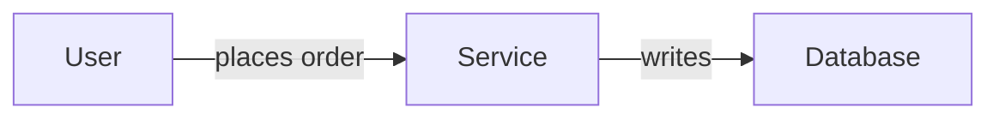

# BrotherSBE v2 Implementation Plan

> **For agentic workers:** REQUIRED SUB-SKILL: Use superpowers:subagent-driven-development (recommended) or superpowers:executing-plans to implement this plan task-by-task. Steps use checkbox (`- [ ]`) syntax for tracking.

**Goal:** Turn BrotherSBE from a verification-gate system into a systems-design colleague: purpose, process, architecture, data, expression, then verification, with every law deterministic and every design artifact mechanically checkable.

**Architecture:** A new `sbe_design.py` checker mirrors the proven `sbe_gate.py` shape (per-class functions returning a `(verdict, evidence)` tuple, advisory by default, `--strict` exits nonzero) and validates design dossier artifacts. Decision tables ship as data (JSON) so thresholds are editable in a reviewed pull request. Dossier templates ship as files an engagement copies. The eval bed gains a fixture per new check. SKILL.md is rewritten in the fixed law form with advice split into PRACTICES.md.

**Tech Stack:** Python 3 standard library only (no third-party packages, no network), Mermaid for diagrams, Markdown for templates and laws, git for the approval and evidence trail.

## Global Constraints

- Python: standard library only, no network calls, no third-party dependencies.
- Public repository: zero client, employer, or private project names anywhere. The only person named is Khalil Maaouni, Founder.
- Zero em dashes and en dashes in any file (use commas, colons, parentheses).
- Exit discipline: observability tools always exit 0; gate and checker tools run advisory (exit 0) by default and exit nonzero only under `--strict`.
- Honesty conventions: absent evidence is `NO-DATA`, never `PASS`. No invented numbers.
- Every new checker rule ships with an eval fixture proving it catches its defect.
- Existing green state must never regress: `python3 tools/test_sbe.py` and `python3 evals/run_evals.py` pass after every task.

---

## File Structure

| File | Responsibility | Status |
|---|---|---|
| `tools/sbe_design.py` | Dossier completeness checks (tier, ADR, data model, diagrams, artifacts) | Create |
| `tools/sbe_intake.py` | Five-question scored intake, computes the tier, writes `00-intake.json` | Create |
| `tables/architecture.json` | Decision table data: shape, integration, storage, consistency, failover | Create |
| `tools/sbe_decide.py` | Reads a table plus context answers, emits a recommendation with alternatives | Create |
| `templates/dossier/*.md` | The eight artifact templates with their required fields | Create |
| `evals/run_evals.py` | Existing harness, extended with design fixtures | Modify |
| `SKILL.md` | Rewritten in the fixed law form, verification last | Modify |
| `PRACTICES.md` | Advice split out of the law file | Create |
| `docs/DESIGN.md`, `docs/HOW-IT-WORKS.md` | Rewritten in the real order | Modify |

---

### Task 1: The scored intake and tier computation

**Files:**
- Create: `tools/sbe_intake.py`
- Test: `evals/run_evals.py` (extend the existing harness)

**Interfaces:**
- Consumes: nothing (first task)
- Produces: `compute_tier(answers: dict) -> str` returning one of `"T0"`, `"T1"`, `"T2"`, `"T3"`; writes `00-intake.json` with keys `answers`, `tier`, `override`, `override_reason`

- [ ] **Step 1: Write the failing test**

Add to `evals/run_evals.py` above the `def main():` line:

```python
# Design-side evals: the tier is computed, not judged.
from importlib.machinery import SourceFileLoader
_intake = SourceFileLoader("sbe_intake", os.path.join(HERE, "..", "tools", "sbe_intake.py")).load_module()


@case("tier-trivial-when-reversible-and-isolated", "tier", "T0")
def t1(root):
    return _intake.compute_tier({"changes_contract": False, "crosses_boundary": False,
                                 "reversible_under_hour": True, "touches_sensitive": False,
                                 "consumers": "none"})


@case("tier-system-when-sensitive", "tier", "T3")
def t2(root):
    return _intake.compute_tier({"changes_contract": False, "crosses_boundary": False,
                                 "reversible_under_hour": True, "touches_sensitive": True,
                                 "consumers": "none"})


@case("tier-feature-when-contract-changes", "tier", "T2")
def t3(root):
    return _intake.compute_tier({"changes_contract": True, "crosses_boundary": False,
                                 "reversible_under_hour": True, "touches_sensitive": False,
                                 "consumers": "some"})


@case("tier-change-when-one-boundary", "tier", "T1")
def t4(root):
    return _intake.compute_tier({"changes_contract": False, "crosses_boundary": True,
                                 "reversible_under_hour": True, "touches_sensitive": False,
                                 "consumers": "none"})
```

Then modify the `case` decorator's runner so a `tier` class returns the function's value instead of running a gate. Replace the body of `main()`'s loop with:

```python
    for name, klass, expect, fn in CASES:
        with tempfile.TemporaryDirectory() as d:
            try:
                if klass == "tier":
                    verdict = fn(d)
                else:
                    fn(d)
                    verdict = run_gate(d, klass)
            except Exception as e:
                verdict = "ERROR:%r" % e
        ok = verdict == expect
        passed += ok
        failed += not ok
        print("  %-38s want=%-8s got=%-8s %s" % (name, expect, verdict, "ok" if ok else "REGRESSION"))
```

- [ ] **Step 2: Run test to verify it fails**

Run: `python3 evals/run_evals.py`
Expected: FAIL with `ModuleNotFoundError` or `No such file` for `tools/sbe_intake.py`

- [ ] **Step 3: Write minimal implementation**

Create `tools/sbe_intake.py`:

```python
#!/usr/bin/env python3
"""BrotherSBE intake: five objective questions in, one tier out.

The tier decides how much dossier a task gets, which is the mechanism behind
"brief always": a one line fix produces nothing, a new system produces the full
set. The rule is a decision table, not a judgment, so two engineers classifying
the same task land on the same tier.
"""
import json, os, sys

QUESTIONS = [
    ("changes_contract", "Does this change a data model, an API contract, or a file interface others depend on? (y/n) "),
    ("crosses_boundary", "Does it cross a service, system, or team boundary? (y/n) "),
    ("reversible_under_hour", "Is it reversible in under an hour? (y/n) "),
    ("touches_sensitive", "Does it touch money, partner data, personal data, or production state? (y/n) "),
    ("consumers", "How many downstream consumers break if it is wrong? (none/some/many) "),
]

TIERS = ("T0", "T1", "T2", "T3")


def compute_tier(a):
    """Named inputs, one output. Highest matching rule wins."""
    if a.get("touches_sensitive") or not a.get("reversible_under_hour"):
        return "T3"
    if a.get("changes_contract") or a.get("consumers") == "many":
        return "T2"
    if a.get("crosses_boundary") or a.get("consumers") == "some":
        return "T1"
    return "T0"


REQUIRED = {"T0": [], "T1": ["01"], "T2": ["01", "02", "03", "05", "06", "07"],
            "T3": ["01", "02", "03", "04", "05", "06", "07"]}


def required_artifacts(tier):
    return REQUIRED.get(tier, [])


def main():
    answers = {}
    for key, prompt in QUESTIONS:
        raw = input(prompt).strip().lower()
        answers[key] = raw if key == "consumers" else raw.startswith("y")
    tier = compute_tier(answers)
    out = {"answers": answers, "tier": tier, "override": None, "override_reason": None}
    path = os.path.join(".", "00-intake.json")
    with open(path, "w") as f:
        json.dump(out, f, indent=2)
    print("tier %s (artifacts required: %s) written to %s"
          % (tier, ", ".join(required_artifacts(tier)) or "none", path))
    sys.exit(0)


if __name__ == "__main__":
    main()
```

- [ ] **Step 4: Run test to verify it passes**

Run: `python3 evals/run_evals.py`
Expected: PASS, output ends `17 evals: 17 passed, 0 regressions.`

- [ ] **Step 5: Commit**

```bash
git add tools/sbe_intake.py evals/run_evals.py
git commit -m "feat: scored intake computes the dossier tier from five objective inputs"
```

---

### Task 2: The design checker, artifact and tier completeness

**Files:**
- Create: `tools/sbe_design.py`
- Modify: `evals/run_evals.py`

**Interfaces:**
- Consumes: `sbe_intake.required_artifacts(tier) -> list[str]`
- Produces: `check_artifacts(root) -> tuple[str, str]`, `check_adr(root) -> tuple[str, str]`, `check_data_model(root) -> tuple[str, str]`, `check_diagrams(root) -> tuple[str, str]`, and `CHECKS: dict[str, callable]` keyed `artifacts`, `adr`, `datamodel`, `diagrams`

- [ ] **Step 1: Write the failing test**

Add to `evals/run_evals.py` before `def main():`:

```python
@case("missing-required-artifact-caught", "artifacts", "FAIL")
def d1(root):
    write(root, "00-intake.json", {"tier": "T2", "answers": {}, "override": None})
    write(root, "01-purpose.md", "# Purpose\nProblem: x\nUsers: y\nSuccess: z\nNon-goals: w\nIf wrong: v\n")


@case("complete-t1-dossier-passes", "artifacts", "PASS")
def d2(root):
    write(root, "00-intake.json", {"tier": "T1", "answers": {}, "override": None})
    write(root, "01-purpose.md", "# Purpose\nProblem: x\nUsers: y\nSuccess: z\nNon-goals: w\nIf wrong: v\n")


@case("adr-without-rejected-alternatives-caught", "adr", "FAIL")
def d3(root):
    write(root, "03-adr.md", "# ADR\n## Decision\nUse a modular monolith.\n## Consequences\nOne deploy.\n")


@case("adr-with-alternatives-and-flip-passes", "adr", "PASS")
def d4(root):
    write(root, "03-adr.md", "# ADR\n## Criteria\nteam size, consistency\n"
                             "## Options considered\n### Rejected: microservices\nToo much ops load.\n"
                             "### Rejected: single script\nNo isolation.\n"
                             "## Decision\nModular monolith.\n## Consequences\nOne deploy.\n"
                             "## What would flip this\nMore than three deploying teams.\n")


@case("unspecified-cardinality-caught", "datamodel", "FAIL")
def d5(root):
    write(root, "05-data-model.md", "# Data model\n## Entities\n- Customer: system of record CRM\n"
                                    "## Relationships\n- Customer to Order: ?\n")


@case("entity-without-system-of-record-caught", "datamodel", "FAIL")
def d6(root):
    write(root, "05-data-model.md", "# Data model\n## Entities\n- Customer\n"
                                    "## Relationships\n- Customer to Order: one-to-many\n")


@case("sound-data-model-passes", "datamodel", "PASS")
def d7(root):
    write(root, "05-data-model.md", "# Data model\n## Entities\n- Customer: system of record CRM\n"
                                    "- Order: system of record OMS\n"
                                    "## Relationships\n- Customer to Order: one-to-many, optional\n")


@case("orphan-diagram-node-caught", "diagrams", "FAIL")
def d8(root):
    write(root, "05-data-model.md", "# Data model\n## Entities\n- Customer: system of record CRM\n")
    write(root, "06-diagrams.md", "```mermaid\nflowchart LR\n  Customer --> Invoice\n```\n")


@case("consistent-diagram-passes", "diagrams", "PASS")
def d9(root):
    write(root, "05-data-model.md", "# Data model\n## Entities\n- Customer: system of record CRM\n"
                                    "- Order: system of record OMS\n")
    write(root, "06-diagrams.md", "```mermaid\nflowchart LR\n  Customer -->|places| Order\n```\n")
```

Then extend `run_gate` so design classes route to the new checker. Replace `run_gate` with:

```python
DESIGN_CLASSES = ("artifacts", "adr", "datamodel", "diagrams")
DESIGN = os.path.join(HERE, "..", "tools", "sbe_design.py")


def run_gate(root, klass):
    script = DESIGN if klass in DESIGN_CLASSES else GATE
    out = subprocess.run([sys.executable, script, klass, root],
                         capture_output=True, text=True)
    for line in out.stdout.splitlines():
        parts = line.split()
        if len(parts) >= 2 and parts[0] == klass:
            return parts[1]
    return "?"
```

- [ ] **Step 2: Run test to verify it fails**

Run: `python3 evals/run_evals.py`
Expected: FAIL, the nine design cases return `?` because `tools/sbe_design.py` does not exist

- [ ] **Step 3: Write minimal implementation**

Create `tools/sbe_design.py`:

```python
#!/usr/bin/env python3
"""BrotherSBE design checks: the dossier's completeness rules, made mechanical.

Same contract as sbe_gate.py: one function per class returning (verdict, evidence),
advisory by default, --strict exits nonzero so CI can block. A design artifact that
fails its rule is not approved, and the failure names the missing field.
"""
import json, os, re, sys

sys.path.insert(0, os.path.dirname(os.path.abspath(__file__)))
from sbe_intake import required_artifacts

ARTIFACT_FILES = {
    "01": "01-purpose.md", "02": "02-process.md", "03": "03-adr.md",
    "04": "04-technology-map.md", "05": "05-data-model.md",
    "06": "06-diagrams.md", "07": "07-verification.md",
}
CARDINALITIES = ("one-to-one", "one-to-many", "many-to-one", "many-to-many")


def read(root, name):
    path = os.path.join(root, name)
    try:
        return open(path, errors="replace").read()
    except OSError:
        return None


def check_artifacts(root):
    intake = read(root, "00-intake.json")
    if intake is None:
        return "NO-DATA", "no 00-intake.json; run sbe_intake.py to compute the tier"
    try:
        tier = json.loads(intake).get("tier")
    except ValueError:
        return "FAIL", "00-intake.json is not valid JSON"
    need = required_artifacts(tier)
    missing = [ARTIFACT_FILES[n] for n in need if read(root, ARTIFACT_FILES[n]) is None]
    if missing:
        return "FAIL", "tier %s requires %s; missing: %s" % (tier, ", ".join(need), ", ".join(missing))
    return "PASS", "tier %s: every required artifact present" % tier


def check_adr(root):
    t = read(root, ARTIFACT_FILES["03"])
    if t is None:
        return "NO-DATA", "no 03-adr.md in this dossier"
    problems = []
    rejected = len(re.findall(r"(?im)^#+\s*rejected\b", t))
    if rejected < 2:
        problems.append("only %d rejected alternative(s); an ADR needs at least 2" % rejected)
    if not re.search(r"(?im)^#+\s*criteria", t):
        problems.append("no Criteria section naming what decided it")
    if not re.search(r"(?im)^#+\s*decision", t):
        problems.append("no Decision section")
    if not re.search(r"(?im)^#+\s*consequences", t):
        problems.append("no Consequences section")
    if not re.search(r"(?im)what would flip", t):
        problems.append("no 'What would flip this' section; an ADR without it is a tombstone")
    if problems:
        return "FAIL", "; ".join(problems)
    return "PASS", "%d alternatives rejected, criteria, decision, consequences, and flip condition present" % rejected


def _entities(t):
    out = {}
    body = re.split(r"(?im)^#+\s*relationships", t)[0]
    for line in body.splitlines():
        m = re.match(r"\s*[-*]\s*([A-Za-z_][\w ]*?)\s*(?::(.*))?$", line)
        if m:
            out[m.group(1).strip()] = (m.group(2) or "").strip()
    return out


def check_data_model(root):
    t = read(root, ARTIFACT_FILES["05"])
    if t is None:
        return "NO-DATA", "no 05-data-model.md in this dossier"
    problems = []
    ents = _entities(t)
    if not ents:
        problems.append("no entities found under an Entities heading")
    for name, meta in ents.items():
        if "system of record" not in meta.lower():
            problems.append("entity '%s' has no system of record" % name)
    rel_block = re.split(r"(?im)^#+\s*relationships", t)
    if len(rel_block) > 1:
        for line in rel_block[1].splitlines():
            if re.match(r"\s*[-*]\s+", line) and not any(c in line.lower() for c in CARDINALITIES):
                problems.append("relationship '%s' has no cardinality" % line.strip()[:48])
    if problems:
        return "FAIL", "; ".join(problems[:6])
    return "PASS", "%d entities, each with a system of record; every relationship carries cardinality" % len(ents)


def check_diagrams(root):
    t = read(root, ARTIFACT_FILES["06"])
    if t is None:
        return "NO-DATA", "no 06-diagrams.md in this dossier"
    model = read(root, ARTIFACT_FILES["05"]) or ""
    known = set(_entities(model))
    nodes = set()
    for m in re.finditer(r"([A-Za-z_]\w*)\s*--", t):
        nodes.add(m.group(1))
    for m in re.finditer(r"-->\s*(?:\|[^|]*\|\s*)?([A-Za-z_]\w*)", t):
        nodes.add(m.group(1))
    nodes -= {"flowchart", "graph", "sequenceDiagram", "erDiagram", "LR", "TD", "RL", "BT"}
    if not nodes:
        return "FAIL", "no diagram nodes found; a diagram artifact with no diagram is a defect"
    orphans = sorted(n for n in nodes if known and n not in known)
    if orphans:
        return "FAIL", "diagram element(s) appear nowhere else in the dossier: %s" % ", ".join(orphans[:6])
    return "PASS", "%d diagram node(s), all traceable to dossier artifacts" % len(nodes)


CHECKS = {"artifacts": check_artifacts, "adr": check_adr,
          "datamodel": check_data_model, "diagrams": check_diagrams}


def main():
    argv = [a for a in sys.argv[1:] if a != "--strict"]
    strict = "--strict" in sys.argv
    root = "."
    which = list(CHECKS)
    for a in argv:
        if a in CHECKS:
            which = [a]
        elif os.path.isdir(a):
            root = a
    fails = 0
    print("BROTHERSBE DESIGN CHECKS  (advisory unless --strict; NO-DATA is never a pass)")
    for name in which:
        verdict, ev = CHECKS[name](root)
        if verdict == "FAIL":
            fails += 1
        print("  %-10s %-8s %s" % (name, verdict, ev))
    if strict and fails:
        print("STRICT: %d design check(s) failed; exiting nonzero to block the merge." % fails)
        sys.exit(1)
    sys.exit(0)


if __name__ == "__main__":
    try:
        main()
    except Exception as e:
        print("sbe_design: error %r" % (e,))
        sys.exit(1 if "--strict" in sys.argv else 0)
```

- [ ] **Step 4: Run test to verify it passes**

Run: `python3 evals/run_evals.py`
Expected: PASS, output ends `26 evals: 26 passed, 0 regressions.`

- [ ] **Step 5: Verify the existing suite did not regress**

Run: `python3 tools/test_sbe.py`
Expected: `OK`

- [ ] **Step 6: Commit**

```bash
git add tools/sbe_design.py evals/run_evals.py
git commit -m "feat: design checker enforces dossier completeness (artifacts, ADR, data model, diagrams)"
```

---

### Task 3: Architecture decision tables as editable data

**Files:**
- Create: `tables/architecture.json`
- Create: `tools/sbe_decide.py`
- Modify: `evals/run_evals.py`

**Interfaces:**
- Consumes: nothing from earlier tasks
- Produces: `recommend(table: dict, context: dict) -> dict` with keys `recommendation`, `alternatives` (list of two), `deciding_criteria` (list), `flip_condition` (string)

- [ ] **Step 1: Write the failing test**

Add to `evals/run_evals.py` before `def main():`:

```python
_decide = SourceFileLoader("sbe_decide", os.path.join(HERE, "..", "tools", "sbe_decide.py")).load_module()
_TABLES = json.load(open(os.path.join(HERE, "..", "tables", "architecture.json")))


@case("small-team-strong-consistency-is-not-microservices", "decide", "modular monolith")
def a1(root):
    r = _decide.recommend(_TABLES["shape"], {"deploying_teams": 1, "consistency": "strong",
                                             "ops_maturity": "low", "failure_isolation": "low"})
    return r["recommendation"]


@case("many-teams-high-isolation-is-services", "decide", "services")
def a2(root):
    r = _decide.recommend(_TABLES["shape"], {"deploying_teams": 6, "consistency": "eventual",
                                             "ops_maturity": "high", "failure_isolation": "high"})
    return r["recommendation"]


@case("recommendation-always-names-a-flip-condition", "decide", "yes")
def a3(root):
    r = _decide.recommend(_TABLES["shape"], {"deploying_teams": 1, "consistency": "strong",
                                             "ops_maturity": "low", "failure_isolation": "low"})
    return "yes" if r["flip_condition"] and len(r["alternatives"]) == 2 else "no"
```

Route the `decide` class like the tier class by extending the main loop condition:

```python
                if klass in ("tier", "decide"):
                    verdict = fn(d)
```

- [ ] **Step 2: Run test to verify it fails**

Run: `python3 evals/run_evals.py`
Expected: FAIL with `FileNotFoundError` for `tables/architecture.json`

- [ ] **Step 3: Write the table data**

Create `tables/architecture.json`:

```json
{
  "shape": {
    "question": "What architecture shape fits this system?",
    "options": ["modular monolith", "services", "event-driven", "monolith"],
    "criteria": [
      {"name": "deploying_teams", "kind": "number",
       "scores": {"modular monolith": [1, 3], "services": [4, 999], "event-driven": [3, 999], "monolith": [1, 2]},
       "note": "Independently deploying teams. Services below four teams usually cost more than they return."},
      {"name": "consistency", "kind": "choice",
       "scores": {"strong": ["monolith", "modular monolith"], "eventual": ["services", "event-driven"]},
       "note": "Strong consistency across a service boundary is expensive and often accidental."},
      {"name": "ops_maturity", "kind": "choice",
       "scores": {"low": ["monolith", "modular monolith"], "medium": ["modular monolith", "services"], "high": ["services", "event-driven"]},
       "note": "On-call, tracing, and CI maturity. Without them a distributed estate is undebuggable."},
      {"name": "failure_isolation", "kind": "choice",
       "scores": {"low": ["monolith", "modular monolith"], "high": ["services", "event-driven"]},
       "note": "Does one component failing have to leave the others running?"}
    ],
    "flip": "Cross four independently deploying teams, or need one component to fail without the others, and revisit this decision."
  }
}
```

- [ ] **Step 4: Write the resolver**

Create `tools/sbe_decide.py`:

```python
#!/usr/bin/env python3
"""BrotherSBE decision tables: named criteria in, a recommendation with alternatives out.

The consultation gathers context; this turns it into a reproducible recommendation.
Thresholds are data in tables/, editable in a reviewed pull request, because a
threshold measured on someone else's estate is a default, not a law.
"""
import json, os, sys


def recommend(table, context):
    tally = {opt: 0 for opt in table["options"]}
    deciding = []
    for crit in table["criteria"]:
        val = context.get(crit["name"])
        if val is None:
            continue
        winners = []
        if crit["kind"] == "number":
            for opt, (lo, hi) in crit["scores"].items():
                if lo <= val <= hi:
                    winners.append(opt)
        else:
            winners = crit["scores"].get(str(val), [])
        for opt in winners:
            if opt in tally:
                tally[opt] += 1
        if winners:
            deciding.append("%s=%s favours %s" % (crit["name"], val, ", ".join(winners)))
    ranked = sorted(tally, key=lambda o: (-tally[o], table["options"].index(o)))
    return {"recommendation": ranked[0], "alternatives": ranked[1:3],
            "deciding_criteria": deciding, "flip_condition": table["flip"],
            "scores": tally}


def main():
    path = sys.argv[1] if len(sys.argv) > 1 else os.path.join(
        os.path.dirname(os.path.abspath(__file__)), "..", "tables", "architecture.json")
    tables = json.load(open(path))
    key = sys.argv[2] if len(sys.argv) > 2 else "shape"
    table = tables[key]
    context = {}
    for crit in table["criteria"]:
        raw = input("%s (%s): " % (crit["name"], crit["note"])).strip()
        context[crit["name"]] = int(raw) if crit["kind"] == "number" and raw.isdigit() else raw
    r = recommend(table, context)
    print("\nRecommendation: %s" % r["recommendation"])
    print("Alternatives: %s" % ", ".join(r["alternatives"]))
    print("Decided by:")
    for d in r["deciding_criteria"]:
        print("  - %s" % d)
    print("What would flip this: %s" % r["flip_condition"])
    sys.exit(0)


if __name__ == "__main__":
    main()
```

- [ ] **Step 5: Run test to verify it passes**

Run: `python3 evals/run_evals.py`
Expected: PASS, output ends `29 evals: 29 passed, 0 regressions.`

- [ ] **Step 6: Commit**

```bash
git add tables/architecture.json tools/sbe_decide.py evals/run_evals.py
git commit -m "feat: architecture decision tables with editable thresholds and flip conditions"
```

---

### Task 4: Dossier templates

**Files:**
- Create: `templates/dossier/01-purpose.md`, `02-process.md`, `03-adr.md`, `04-technology-map.md`, `05-data-model.md`, `06-diagrams.md`, `07-verification.md`
- Create: `templates/dossier/README.md`

**Interfaces:**
- Consumes: the field names the Task 2 checker greps for (`system of record`, cardinality words, `Rejected`, `Criteria`, `Decision`, `Consequences`, `What would flip this`)
- Produces: files an engagement copies into `design/<project>/`

- [ ] **Step 1: Write the ADR template (the checker's strictest consumer)**

Create `templates/dossier/03-adr.md`:

```markdown
# 03. Architecture decision record

## Context
What forced this decision, in three sentences or fewer.

## Criteria
The named criteria that decide it, with the value observed on this estate.
Example: deploying teams = 2, consistency = strong, ops maturity = low, failure isolation = low.

## Options considered

### Rejected: <option one>
Why it loses against the criteria above.

### Rejected: <option two>
Why it loses against the criteria above.

## Decision
The chosen option, in one sentence.

## Consequences
What this costs, what it makes easy, what it makes hard.

## What would flip this
The observable condition that means revisit. A decision record without this is a tombstone.
```

- [ ] **Step 2: Write the data model template**

Create `templates/dossier/05-data-model.md`:

```markdown
# 05. Data model

## Conceptual: entities and meanings
- <Entity>: <what it means in the business>: system of record <system>
- <Entity>: <what it means in the business>: system of record <system>

Every entity names its system of record. An entity with no system of record is a defect.

## Relationships
- <Entity A> to <Entity B>: one-to-many, optional
- <Entity B> to <Entity C>: many-to-many, mandatory

Every relationship carries cardinality (one-to-one, one-to-many, many-to-one, many-to-many)
and optionality. An unspecified cardinality is a defect.

## Attribute roles
| Attribute | Entity | Role (identifier, descriptor, measure, foreign key, temporal, status) |
|---|---|---|

## Historization
How change over time is preserved, per entity, and why.

## Source systems and failover
| Entity | Source | Refresh contract | If the source is unavailable |
|---|---|---|---|

## The three lenses
- Engineer: can this load reliably, idempotently, at volume, and recover after failure?
- Analyst: can the real questions be answered without heroic joins, is every grain unambiguous?
- Scientist: is history preserved, is leakage prevented, are features derivable?

## Physical (after the logical model is approved)
Types, indexes, partitioning, clustering, constraints, and the migration path with its reverse.
```

- [ ] **Step 3: Write the remaining five templates**

Create `templates/dossier/01-purpose.md`:

```markdown
# 01. Purpose brief

## Problem
What is broken or missing, stated without a solution in it.

## Users
Who is affected, and what they do today instead.

## Success criteria
Observable conditions that mean this worked.

## Non-goals
What this explicitly does not do.

## What breaks if this is wrong
The blast radius, named.
```

Create `templates/dossier/02-process.md`:

```markdown
# 02. Process map

## Actors
Who and what participates.

## Steps
| # | Step | Actor | Trigger | Exception path |
|---|---|---|---|---|

Every step names an actor, a trigger, and what happens when it fails.

## Handoffs
| From | To | What is handed over | Contract |
|---|---|---|---|
```

Create `templates/dossier/04-technology-map.md`:

```markdown
# 04. Technology map

| Component | Technology | Owner | Failure mode | Recovery path |
|---|---|---|---|---|

## Source systems
| System | What it masters | Interface | Availability expectation | Failover |
|---|---|---|---|---|

## Recovery posture
Recovery time objective, recovery point objective, and the drill that proves them.
```

Create `templates/dossier/06-diagrams.md`:

````markdown
# 06. Diagrams

Diagrams are code so they diff in review and cannot drift silently.
Required by tier: T1 one context diagram; T2 adds workflow and entity-relationship;
T3 adds system context, container view, technology map, and failover topology.

## Context



Every node is named. Every edge says what flows and how.
Every element here must appear elsewhere in the dossier.
````

Create `templates/dossier/07-verification.md`:

```markdown
# 07. Verification plan

| Claim this design makes | The check that proves it | When it runs |
|---|---|---|

Every claim names its check. A claim with no check is a hope.
```

Create `templates/dossier/README.md`:

```markdown
# Dossier templates

Copy these into `design/<project>/` at the start of an engagement. The tier from
`sbe_intake.py` decides which are required. `sbe_design.py` checks completeness:
run it advisory while you work, and in CI with `--strict` to block a merge.

Order: purpose, process, architecture decision, technology map, data model,
diagrams, verification plan. Each is approved before the next begins.
```

- [ ] **Step 4: Verify the templates satisfy their own checker**

Run: `mkdir -p /tmp/sbe_t && cp templates/dossier/*.md /tmp/sbe_t/ && python3 -c "import json;json.dump({'tier':'T2','answers':{},'override':None},open('/tmp/sbe_t/00-intake.json','w'))" && python3 tools/sbe_design.py /tmp/sbe_t`
Expected: `artifacts PASS`, `adr PASS`, and `datamodel` reporting its placeholder entities honestly. If `datamodel` fails on the angle-bracket placeholders, that is correct behavior: replace them with a worked example in the template so the shipped template passes its own checker.

- [ ] **Step 5: Commit**

```bash
git add templates/
git commit -m "feat: dossier templates with fields the design checker enforces"
```

---

### Task 5: The law rewrite and the practices split

**Files:**
- Modify: `SKILL.md`
- Create: `PRACTICES.md`

**Interfaces:**
- Consumes: every tool built in Tasks 1 to 4 (each law's ENFORCED BY line must name a real file)
- Produces: the law file the skill loads

- [ ] **Step 1: Write PRACTICES.md, taking the advice out of the law file**

Create `PRACTICES.md`:

```markdown
# Practices

This file is advice, and says so. Nothing here is enforced by a check. It is here
because it is true and useful, not because it can be verified. The laws, which do
carry enforcement points, are in SKILL.md.

## Judgment that resists tabulation
- Naming: a name that needs a comment to explain it is the wrong name.
- Cohesion: code that changes together belongs together, whatever the layer diagram says.
- When to split a service: split along the axis where two teams disagree about deploy cadence, not along nouns.
- Estimation: give a range and the assumption that would break it, never a single number.
- Reading before writing: the fastest way through unfamiliar code is to read its tests first.

## Working with people
- A stakeholder who cannot describe the failure mode has not finished describing the requirement.
- Write the summary for the person who was not in the room.
- When a decision is reversed, record why, not just what.
```

- [ ] **Step 2: Rewrite SKILL.md in the fixed law form**

Rewrite `SKILL.md` so its order is: identity, the spine, then the phases (purpose, process, architecture, data, expression, verification), then the laws. Every law uses this exact shape:

```markdown
### L<N>. <Short name>
WHEN: <observable trigger>
INPUTS: <named things it reads>
RULE: <decision table or explicit condition>
OUTPUT: <proceed | proceed with a label | stop and ask | refuse>
ENFORCED BY: <tools/sbe_*.py, a template field, a CI step, or "human review">
```

Include at minimum these laws, each naming a real enforcement point built above:
- L1 Tier before work (ENFORCED BY `tools/sbe_intake.py`)
- L2 Purpose before design (ENFORCED BY `tools/sbe_design.py artifacts`)
- L3 Alternatives before decision (ENFORCED BY `tools/sbe_design.py adr`)
- L4 Cardinality and system of record before physical model (ENFORCED BY `tools/sbe_design.py datamodel`)
- L5 Diagrams trace to the dossier (ENFORCED BY `tools/sbe_design.py diagrams`)
- L6 The four forcing conditions (ENFORCED BY human review, stated honestly)
- L7 to L10: the four existing hard gates (ENFORCED BY `tools/sbe_gate.py <class>`)
- L11 Silent-failure lints (ENFORCED BY `tools/sbe_score.py`)

- [ ] **Step 3: Verify every law names a real file**

Run: `python3 -c "
import re
laws = re.findall(r'ENFORCED BY: (.+)', open('SKILL.md').read())
import os
bad = [l for l in laws if 'tools/' in l and not os.path.exists(l.split()[0].strip('\`'))]
print('laws:', len(laws), 'broken enforcement pointers:', bad)
"`
Expected: `broken enforcement pointers: []`

- [ ] **Step 4: Verify the law file got shorter**

Run: `wc -l SKILL.md PRACTICES.md`
Expected: SKILL.md line count is not larger than the previous version plus the new laws, and advice has moved out. Record both numbers in the commit message.

- [ ] **Step 5: Commit**

```bash
git add SKILL.md PRACTICES.md
git commit -m "refactor: laws in fixed form with named enforcement points, advice split into PRACTICES"
```

---

### Task 6: Wire the design checks into CI and the docs rewrite

**Files:**
- Modify: `.github/workflows/brothersbe-gates.yml`
- Modify: `docs/DESIGN.md`, `docs/HOW-IT-WORKS.md`, `README.md`
- Create: `docs/guides/05-a-worked-engagement.md`

**Interfaces:**
- Consumes: `tools/sbe_design.py` from Task 2
- Produces: the published documentation set

- [ ] **Step 1: Add the design gate to CI**

In `.github/workflows/brothersbe-gates.yml`, after the existing `sbe_gate.py --strict` step, add:

```yaml
      - name: Design checks (dossier completeness) block on failure
        run: python3 tools/sbe_design.py --strict .
```

- [ ] **Step 2: Verify CI commands still pass on the clean repo**

Run: `python3 tools/sbe_design.py --strict . ; echo "exit: $?"`
Expected: all four checks report `NO-DATA` (this repo is not itself a design dossier) and `exit: 0`

- [ ] **Step 3: Write the worked engagement guide**

Create `docs/guides/05-a-worked-engagement.md` showing one realistic system end to end: intake answers producing a tier, the purpose brief, the process map, the decision table run with its recommendation and alternatives, the data model with cardinalities and systems of record, the Mermaid diagrams, the verification plan, and the checker output at each gate. Use a generic domain (an order intake system with a partner file feed and a reporting warehouse). Show real commands and real file contents.

- [ ] **Step 4: Rewrite the two doc halves in the real order**

`docs/DESIGN.md`: the job as a promise system, the order of operations (purpose, process, architecture, data, expression, verification), the tier model, the decision tables, the data method with the three lenses, the diagram discipline, and the benchmarks. Verification appears last, as one section.

`docs/HOW-IT-WORKS.md`: the dossier and its completeness rules, `sbe_intake.py`, `sbe_design.py`, `sbe_decide.py` and the tables, then the existing chassis, gates, and evolution loop.

Update `README.md` so the pitch leads with systems design and names the dossier, with verification described as the last mile.

- [ ] **Step 5: Full green run and sanitation**

Run:
```bash
python3 tools/test_sbe.py && python3 evals/run_evals.py && python3 tools/sbe_score.py "$(pwd)" | grep silent-failure
python3 -c "
import re,glob,os
n=sum(len(re.findall('[\\u2013\\u2014]',open(f,errors='replace').read())) for f in glob.glob('**/*',recursive=True) if os.path.isfile(f) and not f.startswith('.git') and f.rsplit('.',1)[-1] in ('md','py','sh','yml','json'))
print('dashes:',n)"
```
Expected: `OK`, `29 evals: 29 passed`, `silent-failure-lints PASS clean`, `dashes: 0`

- [ ] **Step 6: Commit**

```bash
git add .github/ docs/ README.md
git commit -m "docs: rewrite in the real order (purpose, process, architecture, data, expression, verification) with a worked engagement"
```

---

## Self-review

**Spec coverage:** Section 3 dossier is Tasks 2 and 4. Section 4 tier is Task 1. Section 5 architecture tables is Task 3. Section 6 data method is Tasks 2 and 4 (checker plus template). Section 7 diagrams is Tasks 2 and 4. Section 8 checkpoints is Task 5 (law L6, honestly marked human review). Section 9 law form is Task 5. Section 10 keeping v1 is preserved throughout, with Task 6 wiring the new checks beside the old. Section 11 build order is followed. No spec section is unimplemented.

**Placeholder scan:** No TBD, TODO, or "similar to Task N". Every code step carries complete code. Task 5 steps 2 and Task 6 steps 3 and 4 describe documents rather than code, and specify the exact structure, law list, and section order required.

**Type consistency:** `compute_tier` and `required_artifacts` are defined in Task 1 and consumed by Task 2's `check_artifacts`. `recommend(table, context)` is defined in Task 3 and used only there. The four design check functions and the `CHECKS` dict defined in Task 2 are the names Task 6 wires into CI. The eval harness change in Task 1 (routing `tier`) is extended once in Task 3 (adding `decide`), consistently.
