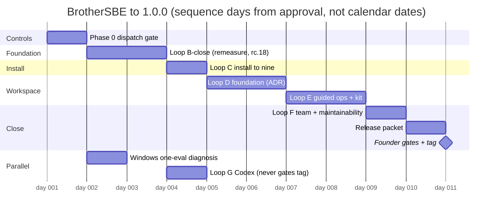

# BrotherSBE unified master plan: vision, architecture, sequence, deployment

**Status:** RATIFIED. Phase 0 was built and sealed under this plan (rc.18), and the founder ratified the plan's operation, plus the acceleration amendment below, through twenty decision windows on 2026-08-06 (five rounds, session 6e125dab). The amendment is the current sequence where it differs from sections 6 and 7.

## 0. Acceleration amendment (founder ratified 2026-08-06 evening)

The founder's order: deliver a repository complete enough to share with testers as fast as safety allows, and merge every branch carrying real work into main. This amendment records what that changes. Where it conflicts with the sequence in sections 6 and 7, this section wins; nothing below touches the verification laws, the founder-only list, or the budget caps.

**M0, a new milestone ahead of M1: the tester-shareable repo.** Contents: the Windows lane folded into main (sealed rc.19), Loop B-close plus Loop C sealed together (rc.20), TESTERS.md with an issue template, and the invite draft in the founder's hands. The repository stays public; supported platforms for testers are macOS and Linux, Windows explicitly experimental. M1 (the tag), M2 (human-validated), M3 (reach) keep their meanings.

**The evening reorder, a founder decision with its alternatives recorded.** The ratified order had BR-1009 (watchdog build) and BR-1010 (unit testing protocol) in front of Loop B-close. The founder moved both BEHIND M0 on 2026-08-06 evening. Alternatives considered and declined: keeping the order (the tester share would slip past tonight), and running BR-1009 as a parallel lane tonight (declined for one-night coordination risk). What would flip it back: a control failure tonight that the watchdog would have caught.

**Version relabel, labels only, no scope moved.** The Windows fold consumed rc.19, so the Loop B-close seal becomes rc.20. Work item BR-1001 carried the stale label from an earlier renumbering and is corrected in the same change as this amendment.

**The Windows CI leg arrives red, and stays visible.** One Windows eval failure is open as OWED-4. The merge law is measured on the five legs that have always gated (the four POSIX gates legs and the consumer checks); the red sixth leg is reported in the changelog and in TESTERS.md, never silenced. Softening it (continue-on-error) is a CI workflow change, which by the constitution is a human edit: proposed to the founder as a card, not made by a session.

**Acceleration mechanics folded in from the 2026-08-06 morning order** (the handover's accelerated plan, now landed here as the single copy): standing exception for parallel lanes whose fences are provably disjoint, one-round appetites with circuit breakers for loops D and E (an overrun stops and raises a founder card, never silently extends), human validation wholly at the founder as M2 with the benchmark kit shipping as a Loop E feature, and BR-1009 plus BR-1010 as one train where possible once they run.

**Parking lot, by the backlog admission rule (an item that cannot name its north-star objective does not ride the schedule):** BR-0520 (Jira and Confluence exporters), BR-0521 (Asana exporter), BR-0522 (Teams notify), the BR-0201 guided navigator remainder, and the BR-0301 marketplace-path remainder are parked to the M2 close review. M3 reach items stay parked as section 10 already states.

**After M0:** the program continues immediately to BR-1009, BR-1010, then loops D, E, F and the packet, per the founder's same-evening answer; tester feedback folds in as it arrives.

**Status:** superseded header preserved for the record: this document was drafted for founder approval on 2026-08-06 and no development started before Phase 0's approval.
**Date:** 2026-08-06. **Designed by:** Fable (session 1341aa6f), from the founder's four correction points, the 2026-08-06 handover, the 2026-07-31 wave plan, 19 decisions the founder ratified today through decision windows, and a refuted research sweep (appendix, section 11).
**Relationship to earlier plans:** this document is the single north star. It reconciles the strategic framing of program/MASTER-PLAN.md (2026-07-31) and the loop plan in the 2026-08-06 handover, both of which stay on disk as source records. Where they conflicted, this document names the conflict and the resolution instead of pretending there was none.

---

## 1. The vision (why this product exists)

AI now writes most of the code in projects like ours. What it does not do reliably is design before building, prove what it claims, or leave a trail a human can trust. BrotherSBE exists to close that gap.

**The promise:** BrotherSBE makes AI-built software provable. It forces design before code, evidence before "done", and shows everyone involved, from a non-engineer founder to a fleet of AI agents, exactly what is true right now and what to do next.

**The north star check** (one sentence, measurable): a person who has never seen the tool can complete one governed change, from idea to reviewed and proven, without reading internal documentation and without typing a terminal command they do not understand. The human benchmark kit (Loop E) measures exactly this, and the founder's real-user numbers after the tag are the ground truth.

Everything in this plan must serve that promise for a named persona below, or it does not get built. That rule is now mechanical, not aspirational: see section 5, backlog admission.

## 2. Personas, ranked (founder ratified 2026-08-06)

Priority order. When two needs conflict, the higher persona wins the tie. Each persona's job is stated separately from any command, so the job stays stable while the product evolves (research finding V5).

**P1: The non-engineer founder.** Builds real products with Claude Code daily. Cannot read build logs and should never have to. Job: ship real software with AI help and stay honestly informed without becoming an engineer. Needs: plain language, one recommended next action at every step, a workspace view that shows project truth without a terminal, guided operations for every decision, honest claims (a "done" that was never faked), visible spend. Served by: loops D and E, the beginner dimension, the reporting cadence.
**P2: The small engineering team.** 2 to 10 engineers adopting the tool for design gates, reviews, ownership, and evidence. Job: keep several people's work provable and coordinated without a process bureaucracy. Needs: clear ownership, work-in-progress limits, review derived from findings, stale-claim visibility. Served by: Loop B contracts, Loop F, the team dimension.
**P3: The agent orchestrator.** Runs AI agent fleets. Job: keep subagent swarms inside model, token, and safety budgets while still going fast. Needs: fences, hostile refuters, evidence gates, spend telemetry, dispatch controls. Served by: Loop B (contracts, ladder), Phase 0 (this program dogfoods every control it ships), Loop G (foreign runtimes).
**P4: The solo professional engineer.** Job: get design and verification rigor without losing velocity. Needs: one-command install, self check, rollback, low-tier work staying light. Served by: Loop C, the install dimension.

The six score dimensions map onto these personas: beginner and gui serve P1, team serves P2, lifecycle and maintainability serve P2 and P3, install serves P4 and every new user of any persona.

## 3. The contradiction this plan resolves (named, not hidden)

The repository contained two plans that never referenced each other:

1. **The 2026-07-31 wave plan** (program/MASTER-PLAN.md): persona-grounded, strategic, large scope. Its "stable public release" requires cross-host adapters (Codex, Gemini, Qwen, Kimi, OpenCode), signed installers, marketplace submission, and five beginner plus five engineer validations BEFORE release. Its estimate: 14 to 16 weeks with a team.
2. **The 2026-08-05 loop program** (design/final-release-program, the handover): tactical, near-term. Its finish line: six score dimensions at mechanical nine, refuter-checked, a full 1.0.0 release packet on the public repository, human numbers AFTER the tag (the founder's ratified score bar, answer 5 of 2026-08-05).

These state two different meanings of "1.0.0". The resolution, consistent with every decision the founder has actually ratified:

- **Milestone M1, "the 1.0.0 tag":** the loop program's finish line. Engineering complete, mechanical nines, packet ready, tag cut by the founder alone. Distribution: the public repository github.com/khalilmaaouni/BrotherSBE with install.sh and the plugin manifest (founder decision, 2026-08-06). The tag is not publicly described as "stable for everyone" yet.
- **Milestone M2, "human-validated stable":** the benchmark kit runs with real unfamiliar users (the founder schedules this, post-tag, per his own score bar), findings are repaired, and only then does the 2026-07-31 covenant language ("stable", announcement, wider promotion) apply.
- **Milestone M3, "reach":** cross-host adapters, marketplace submission, IDE surfaces. Explicitly out of scope until M2 is done, then re-scoped against the persona map. Loop G (Codex) is the only M3 slice funded now, and it never gates the tag (founder answer 4, 2026-08-05).

## 4. Architecture: where it stands, where it evolves

**Today (main at 1496accc, rc.16, proven by 527/527 evals):** a design-first governance engine. Dossier spine (intake tier, purpose, process, ADR, data model, diagrams, verification), four hard evidence gates (numbers, migration, approval, ran), silent-failure lints, doc-truth suites that pin shipped docs to live tool output, a team layer (task registry, work briefs, evidence receipts, reviews, handovers), one canonical next-action reducer. Python 3.9 stdlib only, zero egress, five CI legs.

**The evolution path, in order, each step gated by the one before:**

1. **Loop B lands the contracts:** versioned brief and state schemas, the applicability engine, change-scoped task identity, review derived from findings, the fourth ladder folded. These schemas are the foundation everything after consumes.
2. **Loop C lands the install story:** packaging with a console entry point, self check, update with dry run, rollback on the recommended path. No architecture change, one new packaging surface.
3. **Loop D adds the ONE network-capable module** (src/brothersbe/gui/server.py), loopback only, per the shipped and binding ADR (docs/adr/2026-08-05-gui-server-amendment.md): random session capability in the URL fragment, strict CSP, GET-only views consuming Loop B's contracts. The views use the SAME candidate builder as status: never a sixth derivation of project truth.
4. **Loop E builds guided operations on D's views:** wizard, decision studio, plan board, work cockpit, proof and review centers. No new state stores, no write surface beyond the previewed apply.
5. **Loop F pays the maintainability debt:** boilerplate consolidation past 2 of 31 files, generated docs where hand-written ones drift, the CHECKSUMS eval truncation fix, and a small ADR on keeping version stamps out of committed sandbox content (ends the re-capture ritual at every bump).
6. **Post-1.0 (M3): one canonical core, thin adapters.** The 2026-07-31 plan's adapter architecture (hosts, capability negotiation, contract suite) remains the agreed target shape for reach, entered only after M2, starting from Loop G's AGENTS.md and dispatch adapter.

**Standing architecture invariants (unchanged, reconfirmed):** verification is layered (deterministic check first, mutation calibration second, fresh-context hostile refute third); NO-DATA is never a pass and never a block; every number in a shipped doc is generated from live output or guarded by an eval that fails on drift; zero egress; the tag and the five human gates are founder-only.

## 5. The four fixes, as controls that run (not prompts)

These answer the founder's four correction points directly. Phase 0 builds them BEFORE any loop opens (founder decision 6, 2026-08-06). Each control cites the research finding that grounds it (appendix, section 11).

**Encoded permanently in [docs/PRINCIPLES.md](../docs/PRINCIPLES.md)**, at the founder's directive of 2026-08-06 to encode these once and for all. That file is the constitution: it states each principle with what enforces it, separating checks that run from disciplines that do not, and it is read at the start of any session that will dispatch agents or open a loop. Where it conflicts with a session instruction, it wins, and the conflict is surfaced rather than resolved silently. The summaries below stay here because this plan must be readable on its own; the file is the authority.

**Fix 1: vision drift.** This document is the north star, written in the working-backwards spirit: customer first, then plan (V1). Every loop brief opens by citing the persona need it serves. Backlog admission is mechanical: an item enters only with (a) the persona need it serves, (b) a runnable done-check, (c) a token budget estimate set BEFORE scoping, appetite-style: the number comes first and constrains the design, never the reverse (S4). The gate refuses items missing any of the three, whatever their appeal. When several admitted items are eligible, the next one is picked by cost of delay against effort, not by recency of request (S7). Reordering proposals must show the diff against this plan and get a founder yes.

**Fix 2: swarm management.** The ratified model contract: Fable designs, judges, and integrates; opus runs hostile refuters and hard debugging; sonnet runs well-scoped writer lanes; haiku runs mechanical bulk. This mirrors the measured pattern from Anthropic's own multi-agent system, where an Opus lead with Sonnet workers beat a single Opus agent by 90.2 percent on their internal eval (O3, spot-checked at the source by Fable this session). The controls:

- **The dispatch gate (Phase 0)** refuses any agent launch whose fence line does not declare model tier, token budget, file list, and done-check, and refuses loop-open when the loop budget is exhausted or owed items exist.
- **Scaling rules are a table, not judgment** (O4, the fix Anthropic shipped after their own agents spawned 50 subagents for simple queries: simple fact-finding gets 1 agent with 3 to 10 tool calls, comparisons get 2 to 4 subagents): BrotherSBE tiers map T0/T1 to inline or one agent, T2 to 2 to 4 lanes, T3 to a full loop round, checked at dispatch.
- **Inline is the default; a swarm needs a stated reason** (O1, O2: multi-agent adds 3 to 10 times token overhead and pays off only for parallel independent work, context isolation, or true specialization). The reason lands in the fence line.
- **Budgets are caps, not alerts** (T5: an alert notifies, a cap stops; the vocabulary is used precisely). Every loop round carries a hard budget of 2,000k output tokens; hitting it stops work and raises a founder card, circuit-breaker style: the default on overrun is cancel and report, never silent extension (S5). Overruns need an explicit founder yes.
- **Every work brief carries the four required fields** (O3): objective, output format, tool and source guidance, task boundaries; briefs are complete because nothing else crosses the subagent boundary (O5).
- **Returns are structured and condensed** near 1,500 tokens (O7), lanes launch as one wave, and a dead or partial agent return is a distinguishable failure signal, logged as incomplete, never integrated as product (O6, and mistake 10 of the run).
- **Refuters get a bounded charter** (O8): correctness and requirement gaps only, so hostile review cannot manufacture busywork; refuter judgments are made per evidence gate in isolation, with "insufficient evidence, do not approve" as a first-class verdict (O10); a refuter that finds a real defect stops the line, integration halts, no override (S6).
- **Verification checks state, not transcripts** (O9): a receipt claiming success is not evidence until the check re-executes against live state. Unchanged law, now externally grounded.
- **Quality measurement precedes any routing change** (T10): no model downgrade for a stage without the remeasure showing quality held; a stage that stalls twice on a lower tier reruns on the session model (learned rule 7bb759b1).
- **Spend telemetry is read at session start and quoted at every seal**, with per-lane attribution keyed to the work brief identity (T7); the SessionEnd ledger keeps writing mechanically. SDK cost figures stay dev-time signals; billing truth is the usage report (T2, T3).

**Fix 3: sequencing.** Owed-items-first, hard: no new loop fence opens while an owed item exists, unless the founder defers that item by name. This is "stop starting, start finishing" made mechanical (S2, S3): the constraint in this program is serial integration and refute capacity, so lanes are sized to that constraint, and finishing beats starting. One loop in flight, hard (S1: limiting admitted work is the lever that cuts delay; full utilization is the failure mode, not the goal); an independent parallel lane needs an explicit founder yes per instance (the Windows diagnosis has one, granted 2026-08-06). Remeasure after every merged loop BEFORE the next loop's fences open. Every iteration arena (engine cycles, real CI rounds) declares its final round in STATE.md before entering it.

**Fix 4: finishing the backlog.** The owed-items register below is the queue, in order. Nothing new enters ahead of it without a founder deferral. Definition of done is unchanged and absolute: a verifying command run after the last edit, quoted.

**The owed-items register (2026-08-06, in closing order):**

| # | Item | State | Closes in |
|---|---|---|---|
| 1 | Phase 0 dispatch gate and budget controls | not started | Phase 0 |
| 2 | Post-rc.16 remeasure (owed since rc.16 merged) | owed | first act of Loop B-close |
| 3 | Loop B integration and rc.18 seal (6 lanes preserved) | in flight, paused | Loop B-close |
| 4 | Windows one-eval diagnosis (funded 2026-08-06) | funded, parallel | its own short session |
| 5 | Telemetry double-writer (one founder line in the BrotherModeUp channel; line drafted) | waiting on founder paste | outside this repo |
| 6 | KNOWN-LIMITS tag contradiction | open | Loop C |
| 7 | CHECKSUMS drift eval truncation (run_evals.py near line 2120) | open | Loop F |
| 8 | Instruction-surface workflow YAML parser (honest NO-DATA today) | accepted gap | Loop F or stays declared |
| 9 | Worktree and registry hygiene | closed 2026-08-06, verified by command this session (bm_store verify: healthy, 0 problems; archive at Documents/BrotherSBE-worktree-archive-2026-08-06) | done |

## 6. The sequence: Fable's persona analysis, awaiting your ratification

Founder rule: the persona map wins over the ratified order, and any diff is shown explicitly. My analysis concludes the ratified order should STAND, with exactly one addition in front: **Phase 0 inserted before Loop B-close.** Nothing else moves. This is a proposal; it becomes the plan when you approve this document.

Why the order serves the personas: B-close unblocks every persona (contracts are the foundation) and closes P2's last two lifecycle FAILs. C comes before D and E not for install's own sake but because Loop E's human benchmark kit sends real unfamiliar users through install: the kit is invalid if install is not at nine first. D before E because E's guided operations render on D's views. F closes P2 and the maintainability debt once the surfaces stop moving. G is funded but never gates (P3, M3 slice). Windows runs parallel under its granted exception.

| Phase | Objective | Serves | Entry condition | Exit condition (quality gate) | Effort forecast (sessions) | Budget (hard cap) |
|---|---|---|---|---|---|---|
| Phase 0 | Dispatch gate, budget stop, owed-items check, backlog admission check | P3, every later phase | plan approved | gate refuses a wrong-model, unbudgeted, or unfenced dispatch in a live test; spend line quoted | 1 (confidence high) | 600k |
| Loop B-close | Owed remeasure, re-verify 3 interrupted lanes, integrate 6 lanes, seal rc.18, remeasure | P2, P3, foundation | Phase 0 green | five CI legs green, post-merge battery, both remeasures recorded | 1 to 2 (confidence medium) | 2,000k |
| Loop C | Install to nine: packaging, self check, update dry run, rollback, clean-home matrix, doc contradiction fix | P4, every new user | rc.18 merged, remeasure done | install at mechanical 9, refuter-checked | 1 (confidence medium) | 2,000k |
| Loop D | Workspace foundation per the binding ADR: loopback server, capability URL, strict CSP, GET-only views over B's contracts, adversarial suite, security refute | P1 | C remeasured | raw-HTTP adversarial suite green, fable-grade security refute passed, same-candidate-builder proven by test | 1 to 2 (confidence low, widest uncertainty) | 2,000k per round, expect 2 rounds |
| Loop E | Guided operations and the human benchmark kit | P1 | D merged and remeasured | journey refuter completes a full change without one terminal command; kit ships | 1 to 2 (confidence low) | 2,000k per round, expect 2 rounds |
| Loop F | Team and maintainability close: scored ownership rows, WIP enforcement, stale claims, boilerplate, CHECKSUMS eval fix, version-stamp ADR | P2, P3 | E merged and remeasured | team past 9.1, maintainability at 9, refuter-checked | 1 (confidence medium) | 2,000k |
| Packet | Release notes, five human gates listed unchecked, PUBLISH-CHECKLIST walked, exact tag command printed | founder | all six dimensions at 9.0 plus, refuter-checked | packet complete; tag is the founder's alone | 0.5 (confidence high) | 600k |
| Windows (parallel) | One-eval diagnosis of the manifest first-pass reader | P4 | funded (done) | six of six legs green on the branch, or an honest finding | 0.5 to 1 (confidence medium) | 400k |
| Loop G (post-tag allowed) | Codex track: AGENTS.md sync, capability matrix, opt-in dispatch adapter | P3 | B contracts sealed | doc-truth sync test green; never gates the tag | 1 (confidence medium) | 1,500k |

**Total forecast to the tag:** 6 to 9 working sessions, roughly 9,000k to 13,600k output tokens at the hard caps, likely less (confidence: medium; assumptions: lane rework rate near one third as measured in Loop B, no new founder scope, D and E each needing two rounds). For contrast: the uncontrolled regime burned 11,017k in ONE day. Under the caps, the same total spend buys the whole program instead of one night.

## 7. Gantt (effort sequence, quality gated)

Sequence days from plan approval, not calendar promises (founder decision: quality-gated, no hard date). Windows runs parallel. Every bar ends at its quality gate, not at a date.

## 8. Deployment plan (M1 release mechanics)

1. Every loop seals per the proven recipe: explicit-path staging, counts law (run the evals, copy the printed numbers), checksums LAST, full battery, release invariant against origin/main, secret and dash scans over the push range, push, PR with the full template, merge only on five green CI legs, post-merge battery on main, prune merged worktrees, vault checkpoint.
2. Version line: rc.18 (B-close), then one rc per merged loop, no version bump outside a seal. Every bump re-captures the sandbox bound-head hashes (permanent CHANGELOG law).
3. After Loop F's remeasure shows all six dimensions at 9.0 or above, refuter-checked: assemble the packet (release notes from CHANGELOG, score table with measurement provenance, the five human gates with UNCHECKED boxes, PUBLISH-CHECKLIST walked, the exact tag command printed for the founder).
4. **Founder-only, in his hands:** the five human gates, the 1.0.0 tag, the GitHub release publish on github.com/khalilmaaouni/BrotherSBE.
5. Post-tag: the founder schedules real-user benchmark runs with the kit (M2). Repairs from those runs are the first 1.0.x work. Announcement language stays at "released, validating with real users" until M2 closes.
6. Rollback: the tag is annotated and immutable; a bad release is followed by a fixed 1.0.x, never a deleted tag. Install rollback ships in Loop C and is part of the packet's tested claims.

## 9. Governance and reporting (standing)

- Morning report every active day: scores, spend versus budget, owed items, decisions waiting on the founder. Per-seal delta at every merge. Decision cards the moment a forcing condition appears, never buffered.
- All founder decisions travel through decision windows, recommended option first. Chat carries evidence, never question lists.
- Weekly review runs the rubric against outcomes.jsonl; learned rules promote only through the founder-gated approval path.
- Bad news first, always. Every claim carries its calibration (verified by command, verified by inspection, reported by subagent, assumed). Self-scores cap at 8 without external evidence.

## 10. What will not be built before the tag (unchanged from 2026-07-31, reconfirmed)

Autonomous merge to production, a hosted control plane, a separate web dashboard beyond the loopback workspace, direct model-API integrations, additional reviewer agents without an evidenced missing role, additional hard gates without a real escaped-defect class, additional dossier files, a second state store, per-host lifecycle forks, hidden behavior changes from telemetry. Marketplace submission and non-Codex host adapters wait for M3.

## 11. Research appendix: the external practices this plan stands on

Method: four sonnet research agents on four angles, each output attacked by an opus hostile verifier that re-opened every cited URL (kill on any unsupported claim); 32 findings survived, 11 were killed. Fable then personally spot-checked two findings at their sources (O4 and S4 below, both confirmed verbatim). Every URL below was opened by an agent in this session. Provenance label for the set: reported by refuted subagents, sample-verified by Fable.

**Orchestration (O):**
- O1: Orchestrator-workers is the right pattern for unpredictable multi-file work, but its complexity must be justified against a simpler shape each time. https://www.anthropic.com/engineering/building-effective-agents
- O2: A single well-equipped agent outperforms expectations; multi-agent adds 3 to 10 times token overhead and pays off only for parallel independent work, context isolation, or specialization. https://claude.com/blog/building-multi-agent-systems-when-and-how-to-use-them
- O3: Anthropic's research system ran an Opus lead with Sonnet subagents (90.2 percent uplift over single-agent Opus); every subagent task spec needs objective, output format, tool guidance, and boundaries. https://www.anthropic.com/engineering/built-multi-agent-research-system
- O4 (Fable spot-checked): early failures included spawning 50 subagents for simple queries; the fix was embedded scaling rules (1 agent and 3 to 10 calls for simple tasks, 2 to 4 subagents for comparisons). Same URL as O3.
- O5: nothing crosses the subagent boundary except the prompt string; briefs must be complete or the fact does not exist for the worker. https://code.claude.com/docs/en/agent-sdk/subagents
- O6: a dead or partial agent return is a distinguishable signal, never a silent success. Same URL as O5.
- O7: subagents should return condensed structured summaries (1,000 to 2,000 tokens) while a persistent file carries long-lived state. https://www.anthropic.com/engineering/effective-context-engineering-for-ai-agents
- O8: fresh-context reviewers judge the diff on its own terms, and must be scoped to correctness, or they manufacture findings. https://code.claude.com/docs/en/best-practices
- O9: verification checks live state, not the agent's claim of success; premature approval is a named failure mode. https://claude.com/blog/building-multi-agent-systems-when-and-how-to-use-them
- O10: judge each dimension with an isolated judge, and require an explicit "insufficient information" verdict instead of a forced pass or fail. https://www.anthropic.com/engineering/demystifying-evals-for-ai-agents

**Token economy (T):**
- T1: the Agent SDK ships hard-stop primitives (max_turns, max_budget_usd); caps belong in configuration, not judgment. https://code.claude.com/docs/en/agent-sdk/agent-loop
- T2: SDK cost fields are client-side estimates, not billing truth. https://code.claude.com/docs/en/agent-sdk/cost-tracking
- T3: the usage and cost admin API attributes real spend by key and workspace; per-lane keys give true per-lane cost. https://platform.claude.com/docs/en/build-with-claude/usage-cost-api
- T4: LangGraph enforces a small hard recursion limit as an exception, not an alert; runaway prevention is mechanical. https://reference.langchain.com/python/langgraph-sdk/schema/Config/recursion_limit
- T5: alerts notify, caps stop; the two words are different controls and must be used precisely. https://developers.openai.com/api/docs/guides/spend-limits
- T6: production observability records tokens by type, cost, duration, and errors per span at full sampling. https://docs.datadoghq.com/llm_observability/monitoring/metrics/
- T7: cost attribution collapses without a stable per-task identity carried on every run. https://docs.langchain.com/langsmith/cost-tracking
- T8: cost is a first-class design constraint of agentic systems, weighed at design time. https://www.anthropic.com/engineering/building-effective-agents
- T9: OpenTelemetry's GenAI conventions offer vendor-neutral names for token and model fields. https://opentelemetry.io/blog/2026/genai-observability/
- T10: never route work to a cheaper model without quality measurement in place first. https://tianpan.co/blog/2025-10-19-llm-routing-production

**Sequencing (S):**
- S1: limiting the work allowed to enter the system is the key lever against delay; optimize flow, not utilization. https://kanban.university/kanban-guide/
- S2: "stop starting, start finishing" is the cultural core of a WIP-limited pull system. Same URL as S1.
- S3: delivery moves at the speed of its bottleneck; size intake to the constraint (here: serial integration and refute capacity). https://waux.io/stop-starting-start-finishing/
- S4 (Fable spot-checked): "Estimates start with a design and end with a number. Appetites start with a number and end with a design." The budget comes first and constrains scope. https://basecamp.com/shapeup/1.2-chapter-03
- S5: the circuit breaker cancels overrunning work by default instead of extending it. https://basecamp.com/shapeup/3.5-chapter-14
- S6: the andon cord actually stops the line, without asking permission; a real defect halts integration. https://itrevolution.com/articles/kata/
- S7: when several items are eligible, sequence by cost of delay against effort (weighted shortest job first). http://leanmagazine.net/lean/cost-of-delay-don-reinertsen/

**Vision framing (V):**
- V1: working backwards forces the customer and the press release before any code; ideas that serve no named customer get killed on paper. https://workingbackwards.com/resources/working-backwards-pr-faq/
- V2: pre-commit states its scope in one narrow sentence; precision of audience beats breadth of pitch. https://pre-commit.com/
- V3: conftest scopes its value to one line; BrotherSBE's doc-truth suites deserve the same crisp self-description. https://www.conftest.dev/
- V4: Danger frames its value as codifying team norms so humans think about harder problems; the exact framing for our lints and gates. https://github.com/danger/danger/blob/master/README.md
- V5: jobs-to-be-done separates the stable job from the changing product; personas are defined by their jobs above. https://strategyn.com/jobs-to-be-done/

## 12. Remaining, unverified, and honestly disclosed

- rc.16's score movement is EXPECTED, not measured; the owed remeasure is the first act of Loop B-close. Until then, every score above 8 is an rc.15 number.
- The three interrupted Loop B lanes are UNVERIFIED until their re-verify pass runs; their patches may contain partial round-3 state.
- The effort and budget forecasts in section 6 are ranges with stated confidence, derived from one measured run (Loops A and B). They are planning numbers, not promises.
- The telemetry double-writer race stays live until the founder pastes the confirmation line in the BrotherModeUp channel; until then, cross-session spend numbers carry a small known risk of duplicate rows.
- The human benchmark numbers do not exist yet and cannot exist before Loop E ships the kit and real users run it. Nothing in this plan claims otherwise.
- The research sweep spent 675k output tokens against a declared target of roughly 600k (12 percent over, disclosed). The sweep itself ran under the new regime: declared budget, one wave, structured returns, hostile refute, and it caught 11 bad findings before they reached this document.
