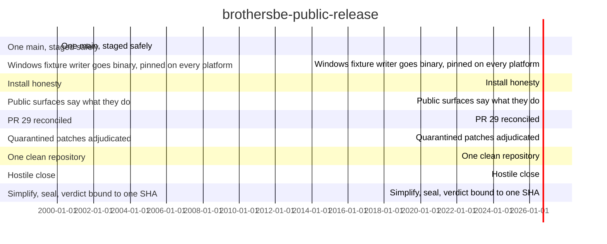

<!-- BEGIN GENERATED PROGRAM STATUS -->
## Program status

Program: brothersbe-public-release
Version target: 1.0.0
Overall position: 69% across measured items.
4 of 9 items measured.

### Finished
- LOOP-0: One main, staged safely (completion date not recorded)

### In flight
- LOOP-1: Windows fixture writer goes binary, pinned on every platform (owner: fable-orchestrator, progress: 67% (derived from acceptance))
- LOOP-2: Install honesty (owner: fable-orchestrator, progress: not measured)
- LOOP-3: Public surfaces say what they do (owner: fable-orchestrator, progress: not measured)
- LOOP-4: PR 29 reconciled (owner: fable-orchestrator, progress: not measured)
- LOOP-5: Quarantined patches adjudicated (owner: fable-orchestrator, progress: 75% (derived from acceptance))
- LOOP-6: One clean repository (owner: fable-orchestrator, progress: 33% (derived from acceptance))

### Still to do
- LOOP-7: Hostile close (waits on: LOOP-6)
- LOOP-8: Simplify, seal, verdict bound to one SHA (waits on: LOOP-7)

### Blocked
- LOOP-2 is blocked on LOOP-1 (depends_on: not recorded as done)
- LOOP-3 is blocked on LOOP-2 (depends_on: not recorded as done)
- LOOP-4 is blocked on LOOP-1 (depends_on: not recorded as done)
- LOOP-7 is blocked on LOOP-6 (depends_on: not recorded as done)
- LOOP-8 is blocked on LOOP-7 (depends_on: not recorded as done)

### Risks and mitigations
| item | risk | severity | mitigation |
| --- | --- | --- | --- |
| LOOP-1 | A Windows-specific failure only surfaces on the real windows-latest runner, not locally. | medium | The loop does not close until that real run is observed green, not merely inferred from local behavior. |

### Documentation
- program/MASTER-PLAN.md: exists
- program/MASTER-PLAN-2026-08-06.md: exists

### Budget
Declared total: 6200000
Recorded usage: 0
Items with no recorded usage: 9
<!-- END GENERATED PROGRAM STATUS -->
