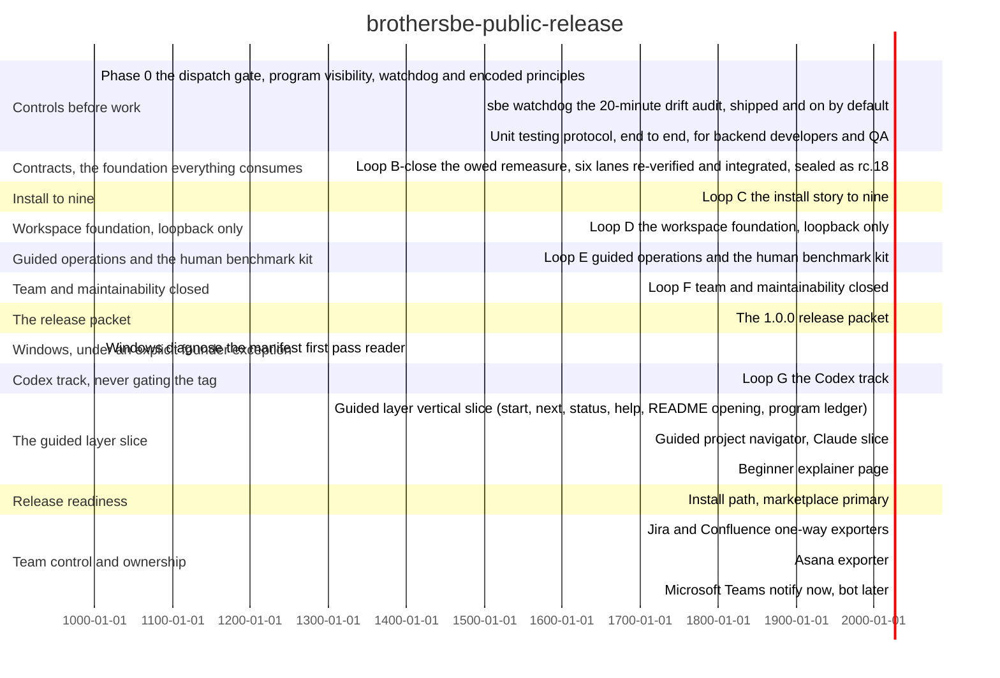

<!-- BEGIN GENERATED PROGRAM STATUS -->
## Program status

Program: brothersbe-public-release
Version target: 1.0.0
Overall position: 100% across measured items.
1 of 18 items measured.

### Finished
- BR-0000: Guided layer vertical slice (start, next, status, help, README opening, program ledger) (2026-07-31)
- BR-0310: Beginner explainer page (2026-08-01)

### In flight
- BR-0201: Guided project navigator, Claude slice (owner: product-engineer, progress: not measured)
- BR-0301: Install path, marketplace primary (owner: product-engineer, progress: not measured)
- BR-1000: Phase 0: the dispatch gate, program visibility, watchdog and encoded principles (owner: fable-orchestrator, progress: 100% (derived from acceptance))
- BR-1007: Windows: diagnose the manifest first pass reader (owner: fable-orchestrator, progress: not measured)

### Still to do
- BR-0520: Jira and Confluence one-way exporters (waits on: BR-0000)
- BR-0521: Asana exporter (waits on: BR-0000, BR-0520)
- BR-0522: Microsoft Teams notify now, bot later (waits on: BR-0000, BR-0520)
- BR-1001: Loop B-close: the owed remeasure, six lanes re-verified and integrated, sealed as rc.18 (waits on: BR-1000)
- BR-1002: Loop C: the install story to nine (waits on: BR-1001)
- BR-1003: Loop D: the workspace foundation, loopback only (waits on: BR-1002)
- BR-1004: Loop E: guided operations and the human benchmark kit (waits on: BR-1003)
- BR-1005: Loop F: team and maintainability closed (waits on: BR-1004)
- BR-1006: The 1.0.0 release packet (waits on: BR-1005)
- BR-1008: Loop G: the Codex track (waits on: BR-1001)
- BR-1009: sbe watchdog: the 20-minute drift audit, shipped and on by default (waits on: BR-1000)
- BR-1010: Unit testing protocol, end to end, for backend developers and QA (waits on: BR-1009)

### Blocked
- BR-0521 is blocked on BR-0520 (depends_on: not recorded as done)
- BR-0522 is blocked on BR-0520 (depends_on: not recorded as done)
- BR-1001 is blocked on BR-1000 (depends_on: not recorded as done)
- BR-1002 is blocked on BR-1001 (depends_on: not recorded as done)
- BR-1003 is blocked on BR-1002 (depends_on: not recorded as done)
- BR-1004 is blocked on BR-1003 (depends_on: not recorded as done)
- BR-1005 is blocked on BR-1004 (depends_on: not recorded as done)
- BR-1006 is blocked on BR-1005 (depends_on: not recorded as done)
- BR-1008 is blocked on BR-1001 (depends_on: not recorded as done)
- BR-1009 is blocked on BR-1000 (depends_on: not recorded as done)
- BR-1009 is blocked on Phase 0 must land first: this reads the fence registry that Phase 0's dispatch gate defines. (blocked_by: free-text blocker)
- BR-1010 is blocked on BR-1009 (depends_on: not recorded as done)

### Risks and mitigations
| item | risk | severity | mitigation |
| --- | --- | --- | --- |
| BR-0000 | This slice predates the wave schedule, so it carries no plan token cap. | not recorded | no mitigation recorded |
| BR-0201 | The shipped slice is prompt-guided (skills instructing the model), not engine-backed. It depends on the model following the skill's wording each run, not on a deterministic program. | not recorded | no mitigation recorded |
| BR-0301 | Verification ran against main at 71f4d3f in an isolated config directory, not against a tagged release artifact. | not recorded | no mitigation recorded |
| BR-0520 | Atlassian is mid-migration on rate limiting. A points-based per-tenant quota rolls out from 2026-03-02, and plain API-token traffic is currently carved out of it and left on the older burst limits. An exporter that authenticates with a service API token today may land inside the points system later without any change on our side. | not recorded | no mitigation recorded |
| BR-0520 | Confluence Page Properties metadata is not exposed as structured data through the REST API, so a published mirror cannot be read back for reconciliation. Mirrors are verified by re-export instead, which is a weaker check and is recorded as such in 07-verification.md. | not recorded | no mitigation recorded |
| BR-0520 | The bulk issue create limits quoted in research (1000 issues and 200 fields per request, 5 concurrent bulk requests site-wide) were not confirmed on a vendor page opened directly. Treat them as unverified until the batching strategy is fixed against a real tenant. | not recorded | no mitigation recorded |
| BR-0521 | Creating a task as an approval in a single call is unverified. What research confirmed is the two-step path: create an ordinary task, then update it with resource_subtype set to approval, because setting approval_status alone does not convert a task. The exporter is designed around the verified path, and the two-step sequence has to be idempotent as a result. | not recorded | no mitigation recorded |
| BR-0521 | Asana REST rate limits and webhook retry backoff thresholds were not researched. Only the field names for tracking webhook health were confirmed, not the numeric limits. Batch sizing must be calibrated against the real workspace before any bulk backfill. | not recorded | no mitigation recorded |
| BR-0521 | If this exporter ever grows an inbound half, it would contradict the stance recorded in design/team-operating-model/03-adr.md. Any such proposal is a superseding decision record, not a change to this work item. | not recorded | no mitigation recorded |
| BR-0522 | Buttons and notifications cannot be the same integration. A plain incoming webhook supports every Adaptive Card element except Action.Submit, and the Workflows-based replacement states outright that button rendering is not supported. This is a capability boundary, not a preference, and it is what splits this item into two stages. | not recorded | no mitigation recorded |
| BR-0522 | Legacy actionable message cards with potentialAction buttons do exist and do work, but only for users with an Exchange Online license and only on the connector infrastructure being retired. Building on them would be building on a deadline. | not recorded | no mitigation recorded |
| BR-0522 | A fully working bot can be silently inert for a subset of users because tenant app permission policy, or the newer app-centric management, blocks it per user or per group. Policy changes can take hours to propagate, so a green test in one tenant proves nothing about another. | not recorded | no mitigation recorded |
| BR-0522 | Webhooks and connectors are unavailable in GCC High, DoD and 21Vianet- operated Teams, and the vendor documentation does not clearly state the Workflows replacement's status in those clouds. Any sovereign-cloud deployment needs its own check before this item is scheduled there. | not recorded | no mitigation recorded |
| BR-1000 | Scope grew from the dispatch gate alone to four deliverables, so the declared 600k budget was raised to 1,800k before start. | medium | Re-scope declared in STATE.md and to the founder before any dispatch; the cap stops work rather than sliding. |
| BR-1000 | Lane A tests point at the live program ledger as a fixture while this migration changes that ledger, so a count assertion could break at integration. | medium | The orchestrator re-runs both suites on the MERGED tree, which is where a count assertion surfaces, and rejects the lane back rather than patching its test. |
| BR-1000 | Every new .py file moves the repository's baked lint counts. | low | The counts law: run the evals and copy the printed numbers, never predict them. |
| BR-1001 | Three lane patches may contain partial round three state and are labelled UNVERIFIED. | high | One hostile verifier per interrupted lane against its round two verdict file before any integration; a dead writer's tree is evidence, never product. |
| BR-1001 | Many new Python files move the baked lint counts, and the applicability column moves gate lines in shipped docs. | medium | Enumerate and repaste every affected block from live runs, then let the doc truth evals arbitrate. |
| BR-1002 | Packaging touches the plugin manifest and the install path, which are release surfaces. | medium | No version bump outside a seal, and the release invariant runs against origin/main exactly as CI computes it. |
| BR-1003 | This is the first network capable module in a zero egress product, and it is the widest uncertainty in the plan. | high | Loopback binding only, capability in the URL fragment so it never reaches a server log, strict CSP, GET only, and a security refuter that attacks every named shape before merge. |
| BR-1003 | A fifth status surface could reimplement the next action derivation and disagree with the other four. | high | The ADR binds the views to the shared candidate builder, and a test asserts identical actionId across surfaces. |
| BR-1004 | Human numbers cannot exist until real people run the kit, which happens after the tag by the founder's own ratified score bar. | medium | The kit gates the packet; the numbers do not. Nothing claims a human result before one exists. |
| BR-1005 | Boilerplate consolidation touches many files at once, which is the shape that breaks baked counts and doc truth suites together. | medium | Generated docs where hand written ones drift, and the evals arbitrate every count rather than any prediction. |
| BR-1006 | A packet assembled before a remeasure would present rc.15 numbers as current. | high | Every score in the packet names the measurement that produced it and the commit it was measured at. |
| BR-1007 | This is the one lane running parallel to the main sequence, under an explicit founder exception. | low | Separate branch, zero shared files with any loop lane, its own budget, and it gates nothing. |
| BR-1008 | A foreign runtime cannot enforce this repository's hooks, so parity claims could overstate what is actually controlled there. | medium | The capability matrix separates enforced from discipline and is refuted claim by claim; docs/RUNTIMES.md records what is verified where. |
| BR-1009 | A watchdog that can write is a watchdog that can hide its own findings. | high | Read only by construction, with a test asserting the tree is byte identical after a run. |
| BR-1009 | Admitted while Phase 0 was in flight, which is the scope creep the plan's own one-loop rule exists to prevent. | medium | Recorded as a work item with its persona need, done-check and budget rather than built inside Phase 0, and it opens only when the owed register allows it. |
| BR-1010 | A testing protocol that duplicates what the gates already enforce would create two sources of truth about what a passing test means. | medium | The design phase maps every protocol rule to an existing gate or lint first; only genuinely new rules get new enforcement, per the reuse before build law. |
| BR-1010 | Admitted mid program by founder priority, ahead of the owed remeasure and Loop B close. | medium | Recorded as a named founder deferral: the remeasure moves behind BR-1009 and BR-1010 by his explicit call of 2026-08-06, visible in the owed register rather than silently. |

### Documentation
- program/MASTER-PLAN.md: exists
- docs/specs/2026-07-31-guided-layer.md: exists
- design/team-operating-model/03-adr.md: exists
- design/phase-0/SPEC.md: exists
- program/MASTER-PLAN-2026-08-06.md: exists
- docs/adr/2026-08-05-gui-server-amendment.md: exists
- docs/PRINCIPLES.md: exists
- to be written first, design before build, per docs/PRINCIPLES.md section 1: MISSING

### Budget
Declared total: 6200000
Recorded usage: 1339000
Items with no recorded usage: 17
<!-- END GENERATED PROGRAM STATUS -->
