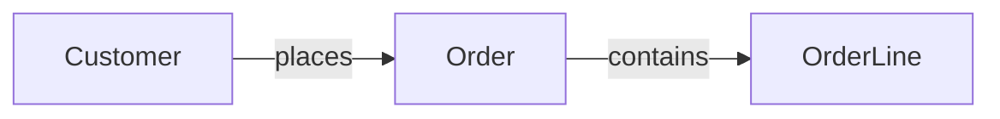
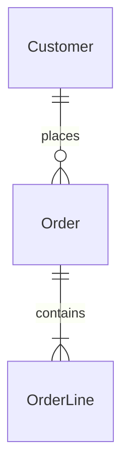

# 06. Diagrams

Diagrams are code so they diff in review and cannot drift silently.
Required by tier: T1 one context diagram; T2 adds workflow and entity-relationship;
T3 adds system context, container view, technology map, and failover topology.

## Context

Every node is named. Every edge says what flows and how.
Every element here must appear elsewhere in the dossier: Customer, Order,
and OrderLine are all defined as entities in 05-data-model.md.

## Entity relationship

The entity relationship diagram uses the same names as the data model on
purpose. A diagram node that names something the data model never defined
is a sign the two artifacts have drifted apart.
