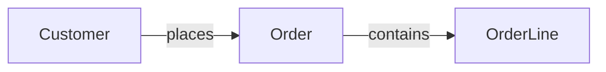
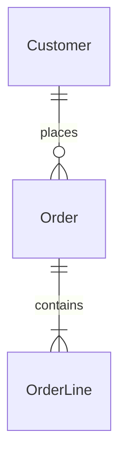
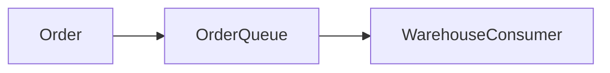

# 06. Diagrams

<!-- SBE-TEMPLATE-UNFILLED 06-diagrams: this section is still the shipped example.
     Replace it with your own design, then delete this comment. While it is
     here, `sbe_design.py placeholder` FAILs and names this file. -->

Diagrams are code so they diff in review and cannot drift silently. Every diagram
lives inside a fenced code block: source outside a fence is prose, and the check
does not read it.

No check enforces a required diagram set per tier. What is checked: at least one
diagram exists in a fenced mermaid block, and every node traces to something
declared elsewhere in the dossier (an entity in `05-data-model.md`, a declared
runtime component, or a declared lifecycle state). Beyond that, the set below is
guidance an author is free to follow, not a gate: at T2 and above, a reviewer
should expect a context diagram plus a workflow or sequence diagram and an entity
relationship diagram; at T3, system context, container view, technology map, and
failover topology. T1 requires only 01-purpose.md, so a sketch here is welcome
and is not a gate.

## Context

Every node is named. Every edge says what flows and how.
Every element here must appear elsewhere in the dossier: Customer, Order,
and OrderLine are all defined as entities in 05-data-model.md.

## Entity relationship

The entity relationship diagram uses the same names as the data model on
purpose. A diagram node that names something the data model never defined
is a sign the two artifacts have drifted apart.

## Components

A container view, a technology map or a failover topology is made of services,
queues and external systems, and those are NOT entities. Declare them here, or as
rows in `04-technology-map.md`, and the traceability check reads them as declared
components. Do not add them to `05-data-model.md` as entities to satisfy the
check: that corrupts the conceptual data model to please a tool, and the check
exists to keep the two artifacts honest, not to reshape one of them.

- OrderQueue: the durable queue between checkout and the warehouse system.
- WarehouseConsumer: the process that reads the queue and applies orders.

